# Installation

## Before you start

Before installing CompuTec AppEngine, make sure the following prerequisites are completed:

- **System requirements**: All hardware and software requirements are met. [Read more](https://learn.computec.one/docs/appengine/administrators-guide/requirements/)
- **SAP server readiness**: Your SAP server is properly configured and running. For detailed configuration steps, refer to the SAP Server Configuration Guides for either [SAP HANA](https://help.sap.com/docs/SAP_BUSINESS_ONE_ADMIN_GUIDE_HANA/1a2fc202f7f64336abf9fbc957d9b9ba/6c8b59c7f2a44aa2b474e58b9732e0d4.html) or [Microsoft SQL Server](https://help.sap.com/docs/SAP_BUSINESS_ONE_ADMIN_GUIDE_SQL/f6fb230cc90949d8b66586a39189992b/c0038069e54b46368b9e73c7218834da.html).
- **Operator credentials in SLD**: You've created and configured operator credentials in System Landscape Directory (SLD).  
Keep the operator password handy – you’ll need it when adding your company during the AppEngine configuration. If you are using Cloud Control Center (CCC) for SAP Business One, see the related [instructions for creating operator credentials in CCC](https://learn.computec.one/docs/appengine/administrators-guide/configuration-and-administration/operator-setup-and-iam-server-assignment-in-cloud-control-center).
- **Installation file**: You have downloaded the CompuTec AppEngine installation from the [Download section](https://learn.computec.one/docs/appengine/releases/appengine/download) of our documentation.

:::warning[important]
    After upgrading from **CompuTec AppEngine** version **2.00** to version **3.00**, please use the **Empty Cache and Hard Reload** option in your browser.

    

    
Click here to find out more

    

    **Here is an example for Google Chrome or Microsoft Edge**:

        1. Open **Google Chrome** or **Microsoft Edge** browser.
        2. Click **F12** to open **Developers Tools**.
        3. Right-click on the **Refresh** button.
        4. Choose the **Empty Cach and Hard Reload** option.

        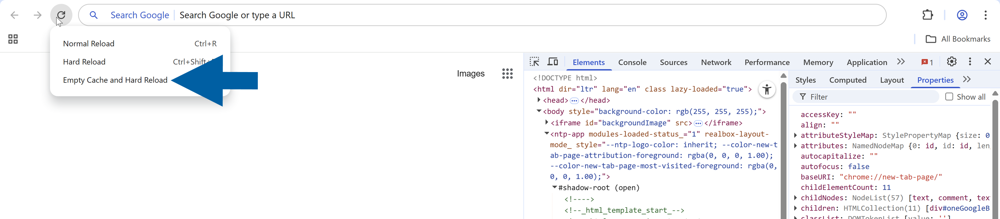
    

    

:::

## Step 1: Install CompuTec AppEngine

To install CompuTec AppEngine, follow these steps:

1. Run the CompuTec AppEngine installation file downloaded from the [Download](docs/appengine/releases/appengine/download.md) section of our guide.
2. Click **Install**.

    

3. (optional) If it’s your first installation, you may need to install Microsoft .NET Runtime and Microsoft ASP.NET Core Shared Framework. Click **Install** and follow the on-screen installation steps.

    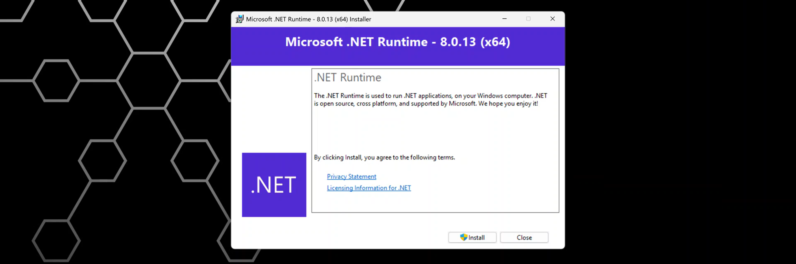

4. When the installation is completed, click **Finish**.

    

5. Open **Services** on your computer and confirm that the CompuTec **AppEngine** service is listed and running.

    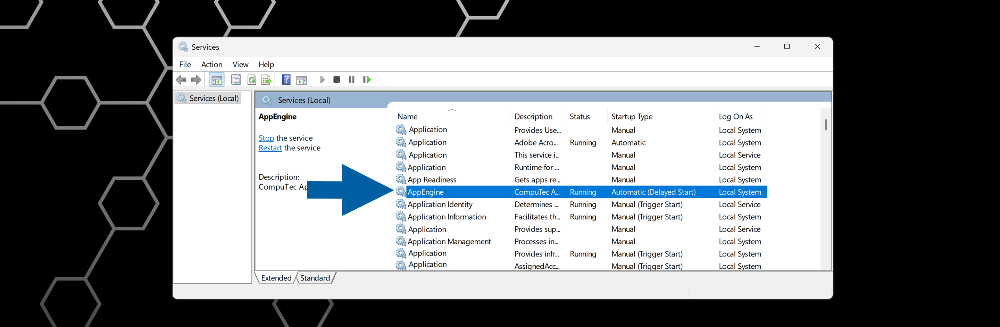

6. After installation, the **CompuTec AppEngine** page should open automatically in your default browser in the installation mode at: [https://localhost:54001](https://localhost:54001).

    

    :::note[info]
    CompuTec AppEngine starts in either **production mode** or **installation mode**, depending on the system state.  
    CompuTec AppEngine enters **installation mode** when:
    - It can’t connect to the database server storing the CompuTec AppEngine configuration.
    - The configuration database doesn’t exist.
    - The configuration database requires an upgrade.

    If the CompuTec AppEngine page does not open automatically, you can open it **manually** at [https://localhost:54001](https://localhost:54001).
    :::

## Step 2: Set up CompuTec AppEngine database

To set up a database, follow these steps:

1. On the **CompuTec AppEngine** page in your browser, enter the database connection details. It’s where the CompuTec AppEngine configuration schema will be created.
    - **Database Server name**
    - **User name**
    - **User password**
    - **Database provider**

    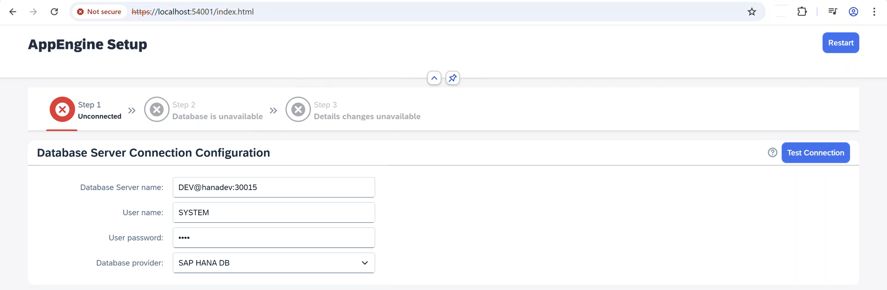

2. Click **Test Connection**.

3. If the CompuTec AppEngine database does not exist, click **Create Database**. If it exists but requires an upgrade, click **Migrate Database**.

    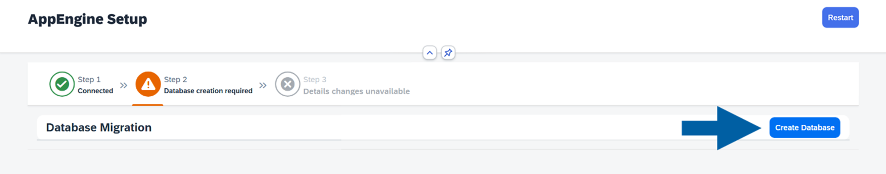

4. After you create or migrate the database, click **Save Changes**.

    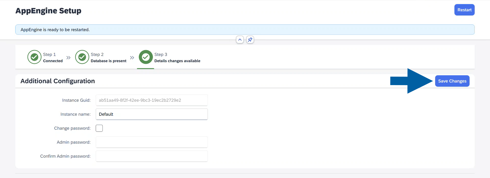

5. Click **Restart**.

    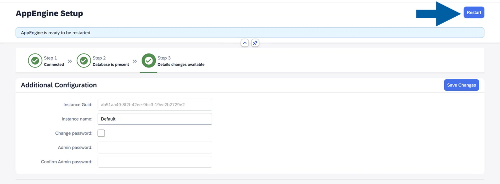

6. After restarting, CompuTec AppEngine will open in your browser in Production Mode at [https://localhost:54001](https://localhost:54001).

    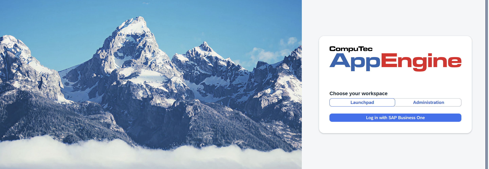

    :::note[info]
    Port 54001 is the default one and can be changed in the **Administration Panel** > **Configuration** > **Advanced Configuration**.
    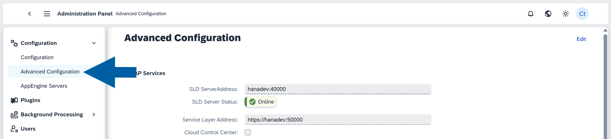
    :::

## Step 3: Configure CompuTec AppEngine

Follow these steps to configure CompuTec AppEngine after the installation:

1. On the CompuTec AppEngine page in your browser, click **Administration**.

    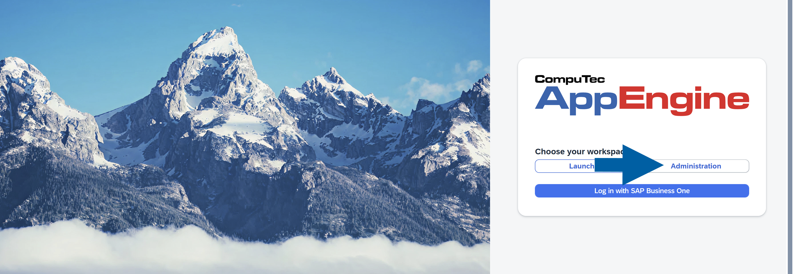

2. If this is your first installation, log in using the default credentials:

    - **Administrator ID**: CTSiteUser
    - **Password**: 1234  

    :::info[note]
    You can change your password in **Administration Panel** > **System** > **Password**.

    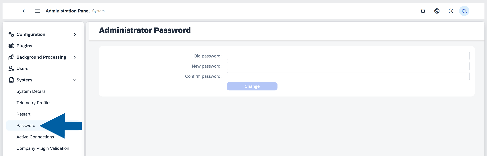
    :::

## Step 4: Connect CompuTec AppEngine to the System Landscape Directory (SLD)

**System Landscape Directory (SLD)** maintains information about the SAP Business One landscape. Connecting CompuTec AppEngine to the SLD enables it to detect and manage SAP companies.

To configure a connection to the SLD server, follow these steps:

1. In the CompuTec AppEngine **Administration Panel**, navigate to **Configuration**.

2. Click **Discover**.

    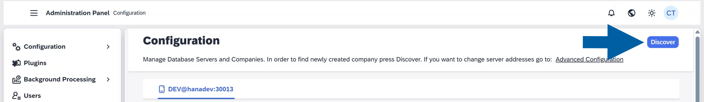

3. Enter the **SLD Server Address** and **CompuTec License Server address**.

    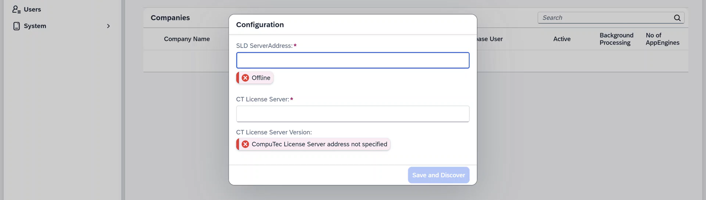

    :::info[note]
    You can find the **SLD Server Address** in **SAP Business One** > **Administration** > **License** > **License Administration**.

    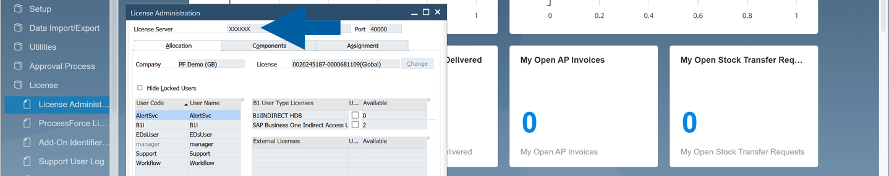

    You can check your **CompuTec License Server Address** in two ways:

        

    
Using **CompuTec Service Manager**

    

    <u></u>
        If you have [**CompuTec Service Manager**](https://learn.computec.one/docs/processforce/administrator-guide/licensing/license-server/configure-computec-service-manager/#starting-computec-service-manager) installed:
        - Run **Command Prompt** on your computer, type: `hostname`, and press **Enter**.
        - Here you’ll find the first part of your server address. In our example, it’s `CTL000`.

            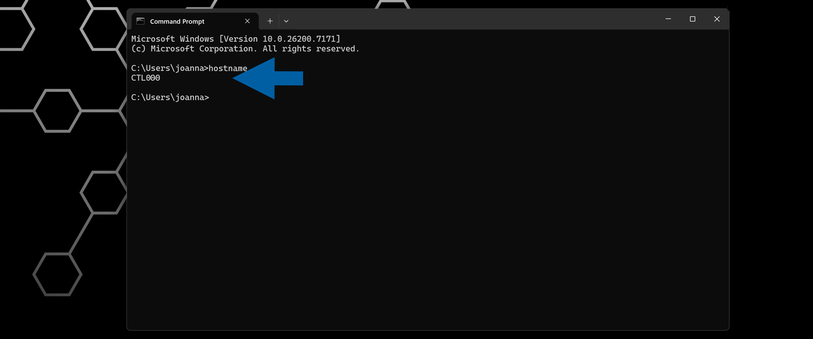

        - Now, run **CompuTec Service Manager** on your computer and click **Settings.

            

        - Here you’ll find the port number. In our example, it’s `30002`.

            

        - In our example, the **CT License Server** is `CTL000:30002`.

    

    

    

    
If you have **CompuTec ProcessForce** installed

    

    <u></u>
        - Open **SAP Business One**.
        - Go to **Administration** > **License** > **ProcessForce License Administration**.
        - Here you’ll find the **CompuTec License Server Address**.  

            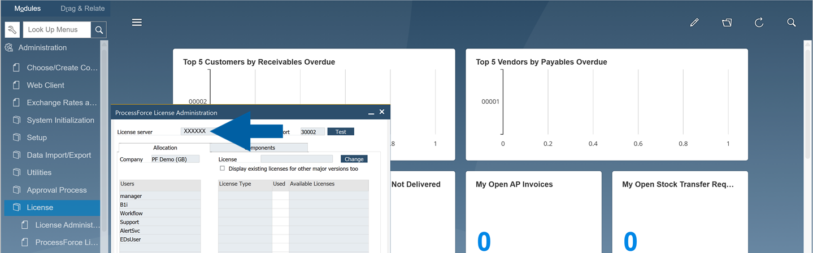
    

    

4. Click **Save and Discover**.

    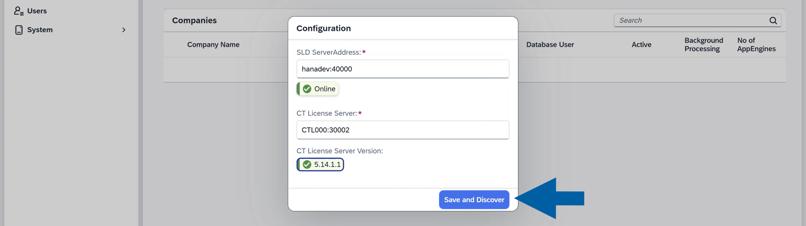

5. When prompted, enter the **B1SiteUser** password. This is the password you created for the operator in the **System Landscape Directory (SLD)**.

    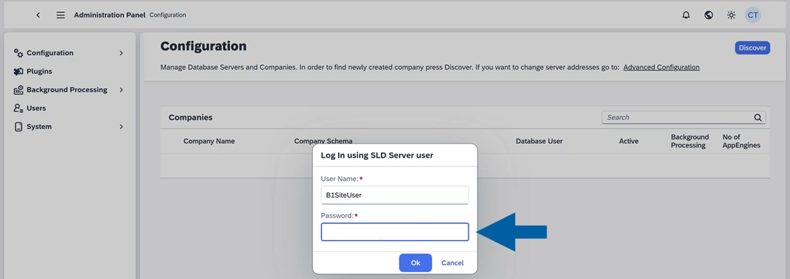

6. Click **Yes** to restart CompuTec AppEngine.

    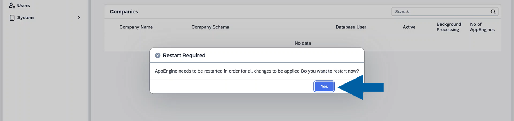

7. Done! CompuTec AppEngine will now retrieve the list of all available companies.

    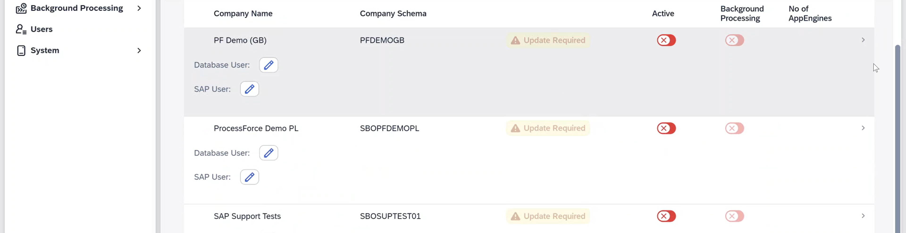

## Step 5: Activate a company in CompuTec AppEngine

To activate a company in CompuTec AppEngine, follow these steps:

1. In CompuTec AppEngine **Administration Panel** > **Configuration** > **Companies**, find the company you want to activate.

    :::info[note]
    If you can’t see your company, click **Discover** to refresh the list.

    
    :::

2. Click the edit icon to set **Database User** credentials in the **Server Details** section.

    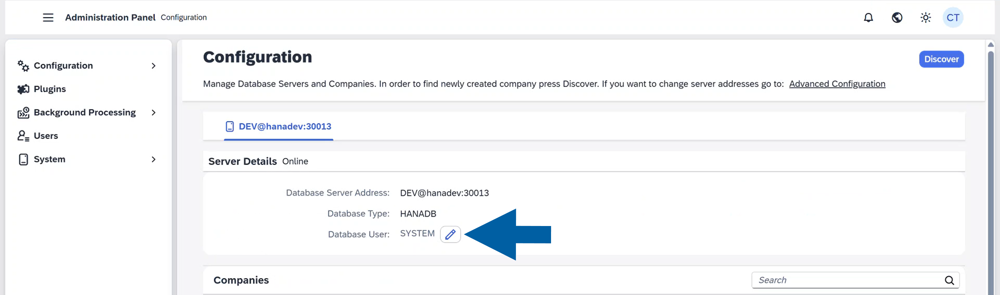

3. Click the edit icon next to **Database User** in the **Companies** section and enter the credentials for the company you want to activate.

    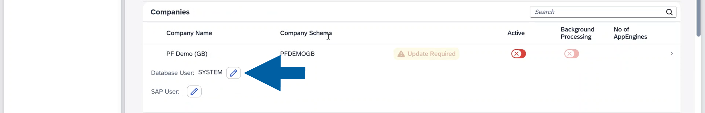

4. Click the edit icon next to **SAP User**.

    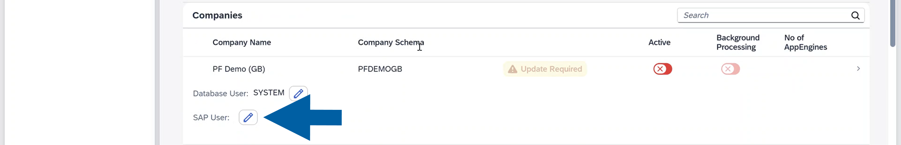

    :::warning[important]
    This process creates a **CompuTec AppEngine user**, not an SAP user.  
    The selected user must have the right SAP Business One **permissions for installation and configuration tasks**.
    :::

5. Assign default user for the company you want to activate. You can select an existing **SAP Business One** user or create a new one by clicking **Add User**.

    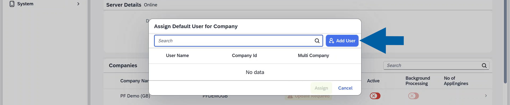

6. Enter **User Name** and **Password** and assign the new user to the company.

    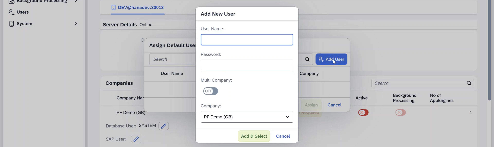

7. Click **Add & Select**.
8. Switch the **Active** toggle to activate the company.

    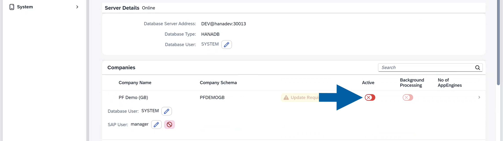

9. Log in using your **SLD Server user credentials** to activate the company within the SAP system.

    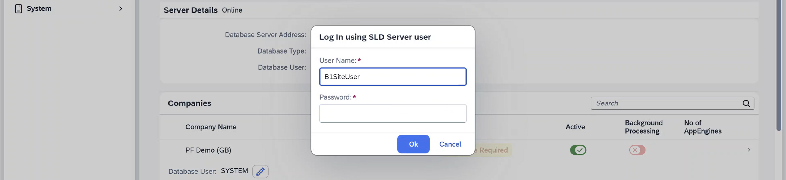

10. You can view the company's activation progress.

    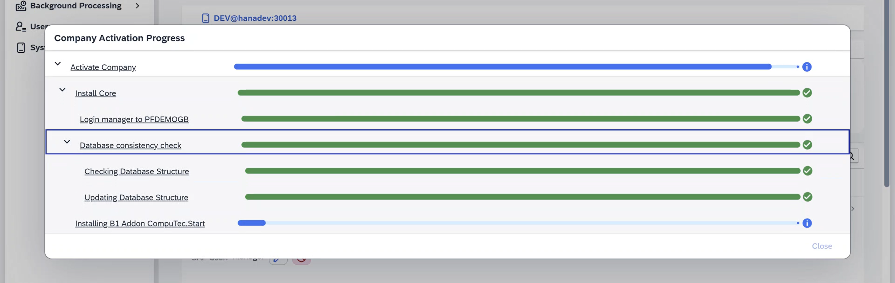

    :::note[info]
    This process may install necessary SAP extensions such as **CompuTec Start**.  
    In **Cloud Control Center** for SAP Business One environments, **CompuTec Start** must be installed manually.
    :::

11. Click **Close**.

## Step 6: Configure background processing within the SAP environment

CompuTec AppEngine can run plugins and background jobs that react to events occurring in SAP Business One, for example, when a document is added or updated.
To enable this event-driven functionality, SAP Business One must forward these events to CompuTec AppEngine. This is done by adding a small block of code to the SAP system procedure **SBO_SP_POSTTRANSACTIONNOTICE**, which is responsible for handling post-transaction events.  

Once updated, this procedure records and passes the required events to CompuTec AppEngine, where they can trigger jobs and background tasks.

To configure background processing within the SAP environment, follow these steps:

1. First, you’ll see a message with the **CompuTec AppEngine code snippet**. Keep this window open - you'll need to copy the code snippet into the database procedure in the next steps.

    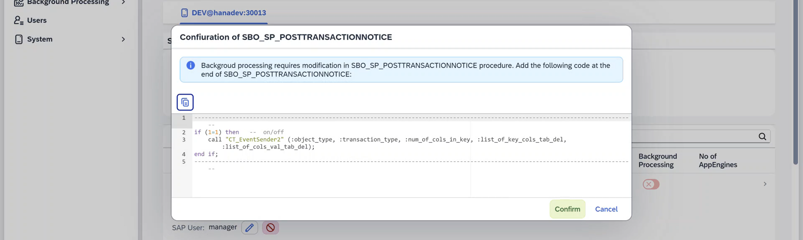

2. Follow the configuration steps according to the database you’re using:

    

        
For **SAP HANA** users

        

        <u></u>
        - Open **SAP HANA Studio** on your computer and log in.
        - Look for the **Procedures** folder, right-click on it and use filtering to find **SBO_SP_POSTTRANSACTIONNOTICE** procedure in your database.

            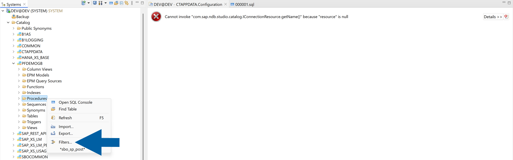
        
        - Right-click on the **SBO_SP_POSTTRANSACTIONNOTICE** procedure and choose **Open Definition**.

            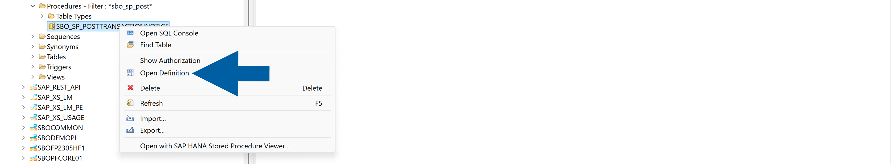

        - Navigate to the **Create Statement** tab.

            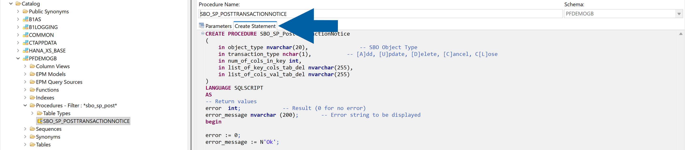

        - Copy the whole content of the tab. 
        - Navigate to your **database name** and right-click on it. 
        - Click **Open SQL Console**. 

            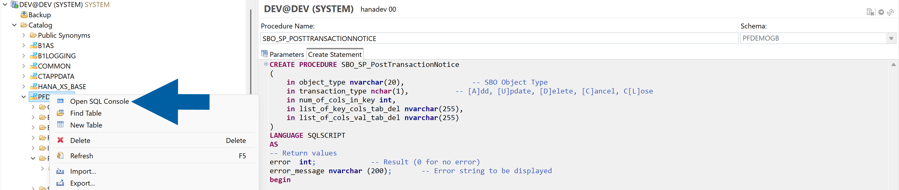

        - Paste the copied content in the **SQL** console.

            

        - Copy the **code snippet** from the CompuTec AppEngine **Administration Panel**.

            

        - In **Sap Hana Studio**, paste the code under the **-- ADD YOUR CODE HERE** line. If there are other pieces of code there, add the code at the end of the section.

            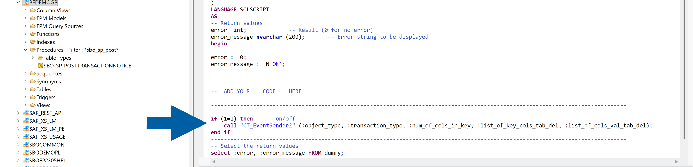

        - Change `CREATE` to `ALTER`.

            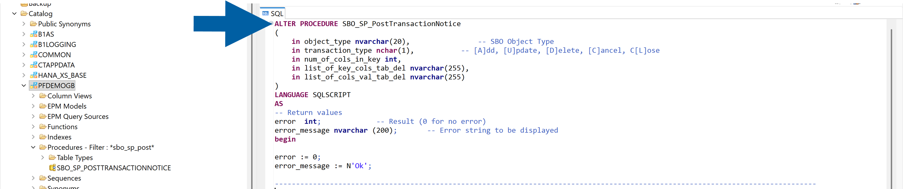

        - Click the **Execute** icon.

            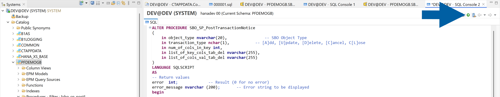

        

    

    

        
For **Microsoft SQL** users

        

        <u></u>

        - Open **Microsoft SQL Server Mangement Studio** on your computer and log in.
        - Look for the **Programmability** folder, right-click on it and use filtering to find the **SBO_SP_PostTransactionNotice** procedure in your database.

            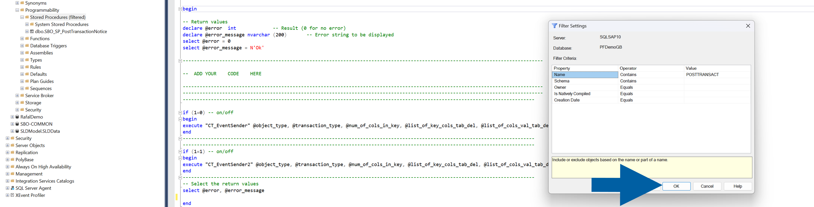

        - Right-click on the **SBO_SP_PostTransactionNotice** procedure and choose **Modify**.

            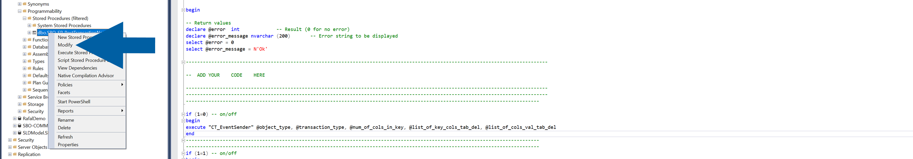

        - Copy the **code snippet** from the CompuTec AppEngine **Administration Panel**.

            

        - In **Microsoft SQL Server Management Studio**, paste the code under the **-- ADD YOUR CODE HERE** line. If there are other pieces of code there, add the code at the end of the section.

            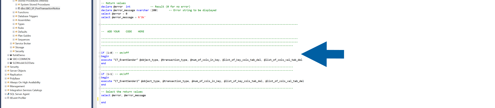

        - Click the **Execute** icon and click **OK**.

            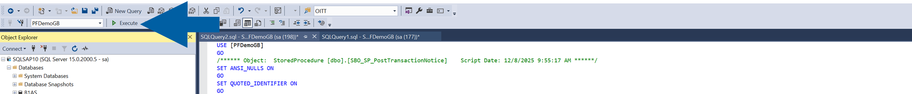
        

    

3. In **CompuTec AppEngine**, click **Confirm**.

    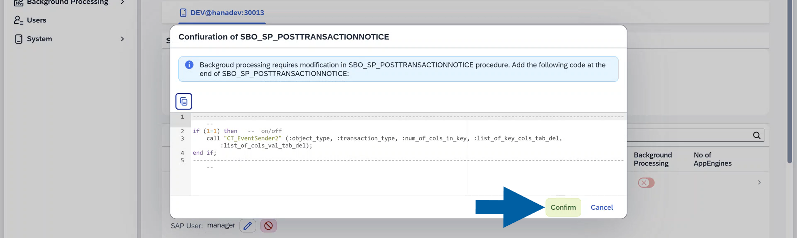

4. Choose a CompuTec AppEngine instance to assign to the activated company, and click **Accept**.

    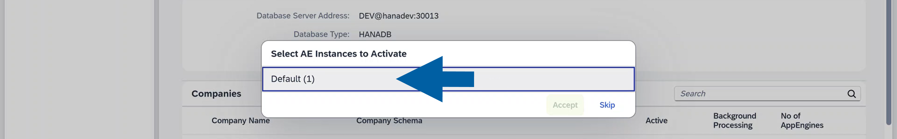

5. After it’s finished, click **Close**.

## Step 7: (optional) Advanced configuration

Once the basic setup is complete, you can refine your configuration in the **Advanced Configuration** and **AppEngine Servers** sections.

In the **Advanced Configuration** section of CompuTec AppEngine **Administration Panel**, you can edit the following settings:

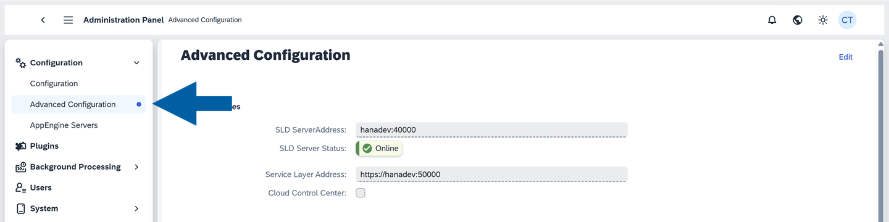

- **SAP Services**: Edit the SLD Server Address
- **CompuTec Services**: Update the CompuTec License Server information
- **OpenId Settings**: Configure the CompuTec AppEngine External Address
- **OIDC (OpenID Connect)**: Manage secure authentication settings
- **EventBus**: Configure real-time communication between services
- **Jobs**: Manage scheduled tasks
- **Plugin Repository**: Install and manage custom plugin repository

In the **AppEngine Servers** section of CompuTec AppEngine **Administration Panel**, you can edit the following settings:

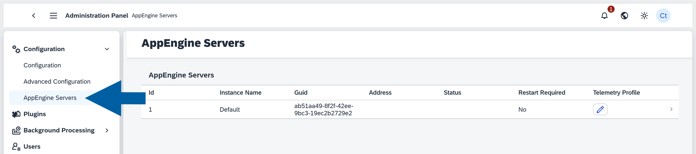

- **Id**: Numeric identifier of the server instance
- **Instance Name**: The name assigned to the server instance (e.g., default)
- **GUID**: A globally unique identifier for each server instance
- **Address**: Indicates the network address or hostname of the server
- **Status**: Displays the operational status of the server (e.g., active/inactive)
- **Restart Required**: Shows if a restart is needed
- **Telemetry Profile**: Access server-specific settings
