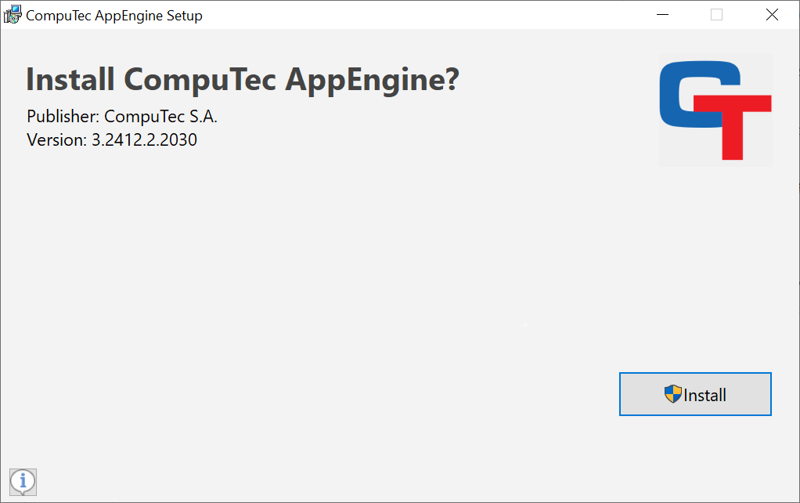
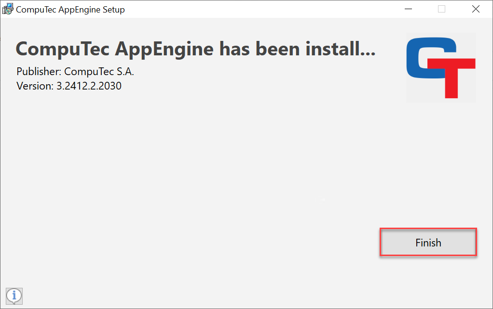
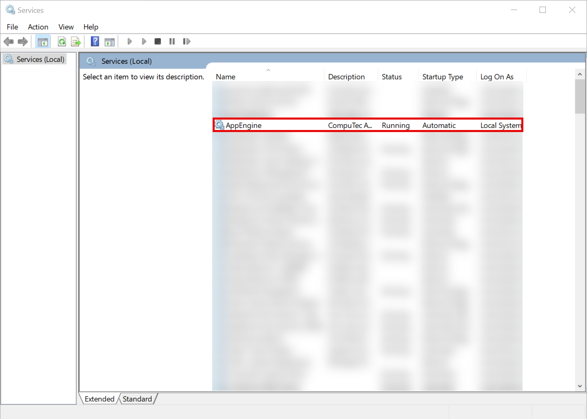
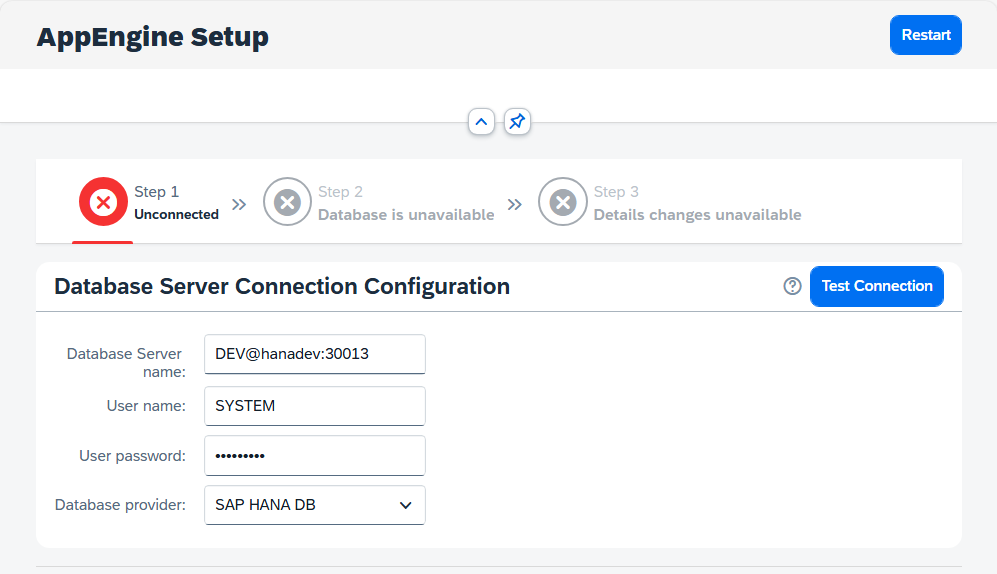
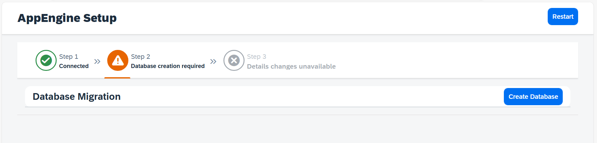
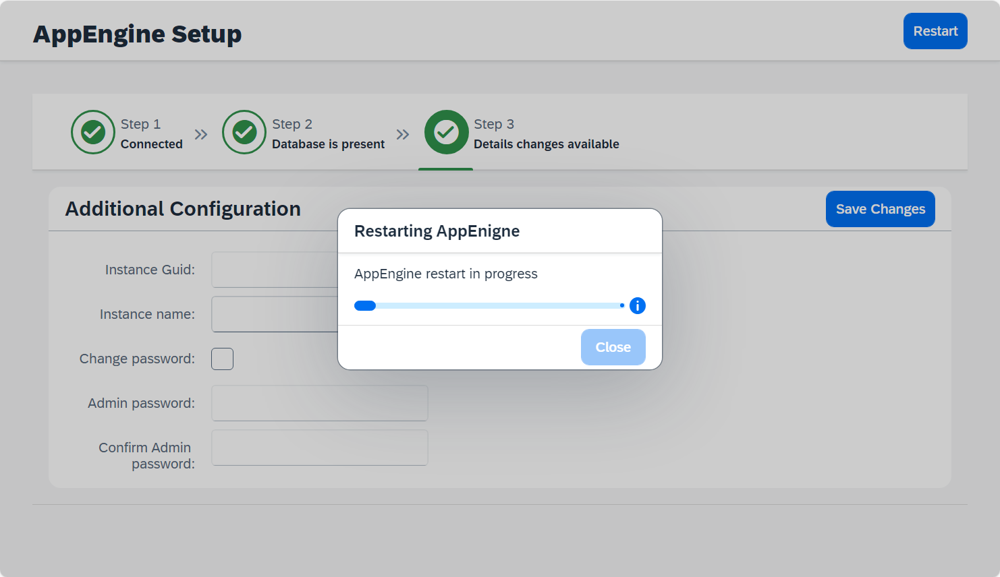
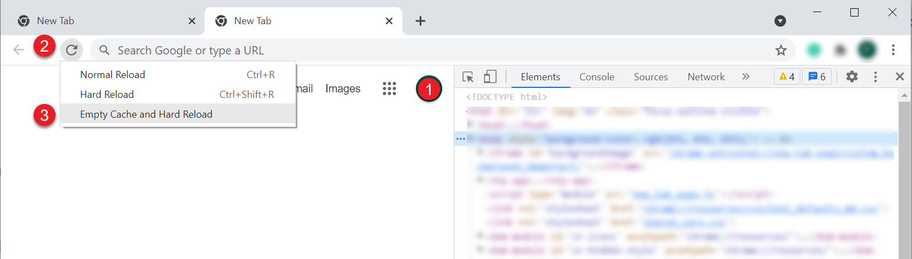

# Installation

1. Run the CompuTec AppEngine installation file from the [Download](docs/appengine/releases/appengine/download.md) section and click "Install" in the installation wizard that appears.

    

2. Click "Finish" after the CompuTec AppEngine Installation is successfully completed.

    

3. Now, the new service should be running:

    

4. After installation, the CompuTec AppEngine page will automatically open in browser. CompuTec AppEngine will launch in either Production Mode or Installation Mode, depending on the current status of your system. CompuTec AppEngine will start in Installation Mode in the following scenarios:
    - Unable to establish a connection to the Database Server where the CompuTec AppEngine configuration is stored.
    - CompuTec AppEngine configuration database does not exist.
    - CompuTec AppEngine configuration database requires an upgrade.

    If CompuTec AppEngine Page won't open automatically you can manually do so by opening web browser and entering default address: [https://localhost:54001](https://localhost:54001).

5. Setup CompuTec AppEngine store by configuring the database server connection:

    1. **Step 1** - Enter the following connection details to database server where CompuTec AppEngine configuration schema will be created: Database Server Name, User Name & Password, and Database Provider.

        

    2. **Step 2** - If CompuTec AppEngine database doesn't exists there, click on "Create Database" button to create it. If it exists but requires an upgrade, click on "Migrate Database" button.

        

    3. **Step 3** - After creating the database, you must restart the CompuTec AppEngine. After restarting, CompuTec AppEngine will start in Production Mode.

        

:::warning
    After upgrading from version 2.00 to version 3.00, please use the "Empty Cache and Hard Reload" option in the browser where you use CompuTec AppEngine.

    

    
Click here to find out more

    

    **Here is an example for Google Chrome or Microsoft Edge (Chromium)**:

        1. Open Google Chrome or Microsoft Edge (Chromium) browser,
        2. Click F12 to open Developers Tools (1),
        3. Right-click on the refresh button (2) and,
        4. Choose the Empty Cach and Hard Reload option (3):

        
    

    

:::

---
