# MCP Server for SAP Business One

## Requirements

Before you begin, make sure the following prerequisites are met:

* **CompuTec AppEngine** is installed. Minimum version `3.2509.1-rc-02`.
* **OIDC authentication** is enabled in **SAP Business One**.  
Here's how to check it:
  * In the **SAP SLD server**, open the **Identity Providers** tab.
  * Make sure that **SAP Business One Authentication Server** is enabled.

## Enable MCP for a company in CompuTec AppEngine

To allow **MCP Server** access for a specific **CompuTec AppEngine company**, follow these steps:

1. Log in to the **CompuTec AppEngine Administration Panel**.
2. Go to **Configuration**.

    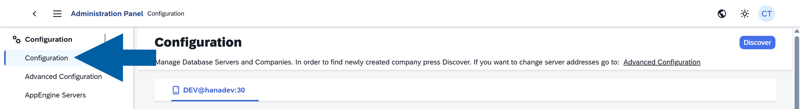

3. Locate the company and make sure that it's **active**.

    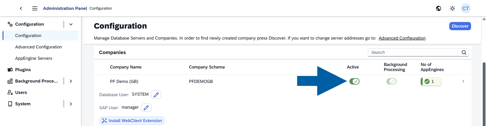

4. Click the **company name** to open its details.
5. Click **Settings**.

    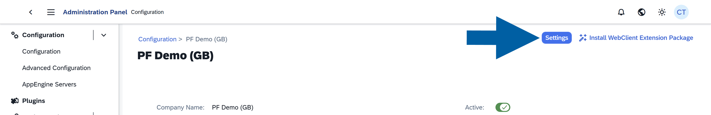

6. Choose ``Yes`` in the **EnableMcpServer** field.

    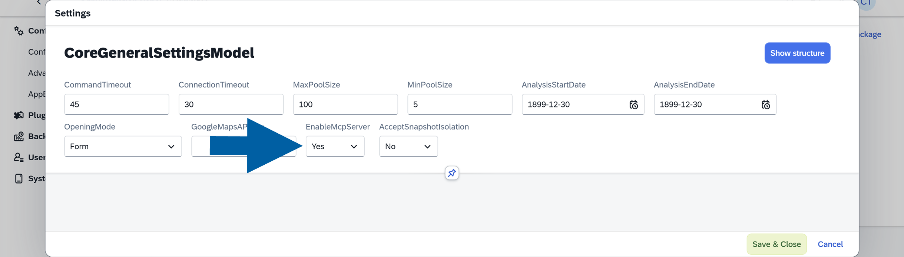

7. Click **Save & Close** to save your changes.

## Set user authorizations

To allow users to perform actions through **MCP**, follow these steps:

1. Open **SAP Business One**.
2. Go to **Menu** > **Administration** > **System Initialization** > **Authorizations**.

    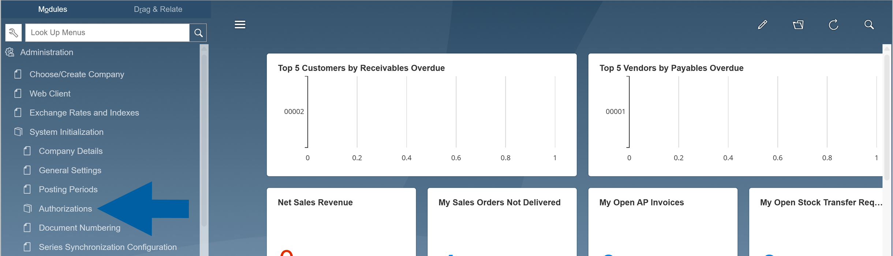

3. Navigate to **General Authorizations**.

    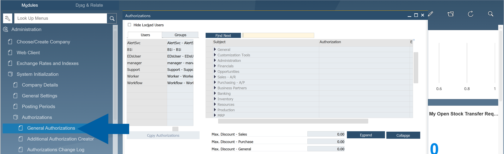

4. Use **Find Next** field to locate the ``Allow MCP Server to execute modification commands`` authorization.

    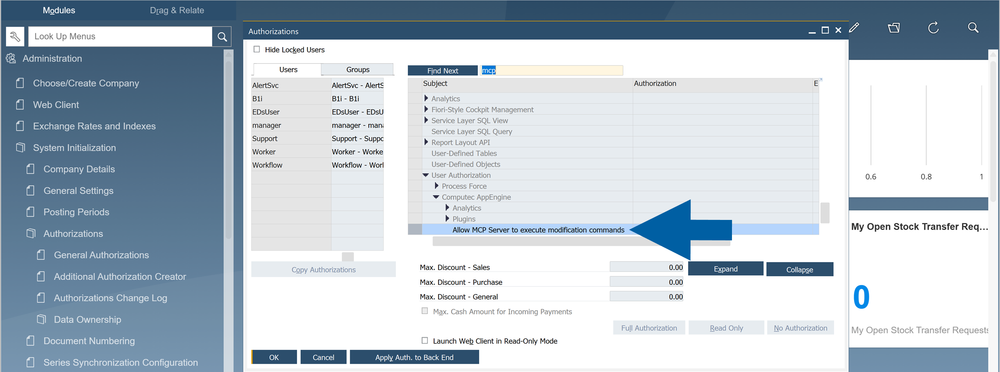

5. Assign it to the required users or groups.

    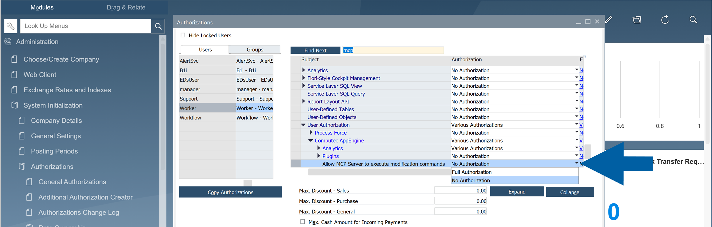

6. Save the changes.

    :::info[Important]
        Only users with the authorization assigned in **SAP Business One** can execute modification commands using the **MCP Server**.
    :::

## Supported AI Clients

Currently, the **MCP Server** can be used with several AI tools:

* **Claude** (recommended):  
  The desktop version requires one of the following:
  * **Pro Plan Subscription** (for **Development Mode**)
  * **Team Plan Subscription** or **Claude for Work** (connectors)
* **GitHub Copilot**:  
  Requires manual configuration using the ``mcp.json`` file.  
  You can find the required configuration in **CompuTec AppEngine** under: **CompuTec AppEngine Administration Panel** > **Advanced Settings** > **MCP** > **GitHub Copilot**.
* **Claude Code**

:::caution
This information may change over time. For the most up-to-date details, refer to the official AI tool documentation.
:::

### Recommended AI Client

We recommend using **Claude** for most scenarios.

**Why choose Claude:**

* Native support for local MCP servers
* Easier setup, especially in **Claude Desktop**
* Suitable for business users and non-developers
* Built-in configuration experience

**When to use GitHub Copilot:**

Use **GitHub Copilot** if:

* You are comfortable working in **Visual Studio Code**
* You prefer a developer-oriented workflow
* You can manage configuration files like ``mcp.json``

## Built-in MCP Tools

The **MCP Server** provides several ready-to-use tools:

* **Session Tools**:
  * List companies and connect to one
  * Retrieve information about the logged-in SAP Business One user

* **Service Layer Objects and Metadata**:
  * Create and retrieve SAP Business One business objects

* **CompuTec AppEngine Plugin Information and Objects**:
  * Allows AI to get information about the plugins installed for this company
  * Work with plugin business objects

* **Document Access**:
  * Open documents and master data in SAP Business One or Web Client

* **Inventory Levels**

* **Approval Procedures**

:::note[info]
If you have an idea for a useful **MCP** tool, feel free to share it with us - we'll consider adding it as a standard feature in **CompuTec AppEngine**.

You can also create **your own tools** by developing a [custom CompuTec AppEngine plugin](../../developers-guide/basic-and-business-logic/appengine-plugin/ae-mcp-tool.md).
:::

### Troubleshooting MCP Activation

If the **MCP Server** is not working, follow these steps:

1. In the **CompuTec AppEngine Administration Panel**, go to **Advanced Settings**.
2. In the **MCP** section, you should see that:
    * **MCP Server Enabled** toggle is turned on and green.
    * **Client Information** is filled with the ``Client ID`` and ``Client Secret``.

    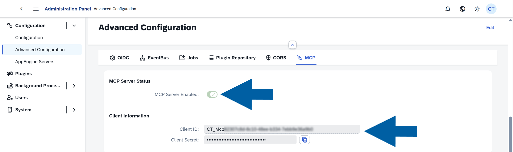

3. If the **MCP** indicator is disabled, please make sure that all requirements are met.
4. If the indicator is still off, please go to **CompuTec AppEngine Administration Panel** > **Configuration** and press the **Discover** button.

   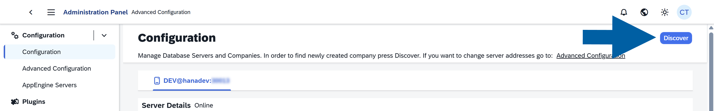

## Connect Claude Desktop to SAP Business One by CompuTec AppEngine

### Pro Plan setup

1. Install [**Node.js**](https://nodejs.org/en/download/).
2. Launch **Claude Desktop** on your computer.
3. Click the **Claude menu** in your system's menu bar, and select **Settings**.
4. Navigate to **Developer**.
5. Click **Edit Config** to open the `claude_desktop_config.json` file.
6. Go to the **CompuTec AppEngine Administration Panel** > **Advanced Settings**.

    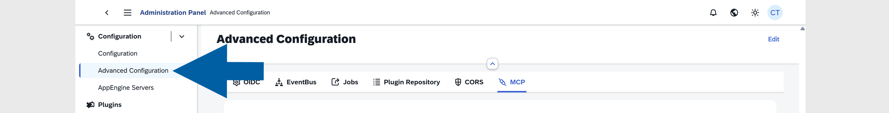

7. Navigate to the **MCP** tab.

    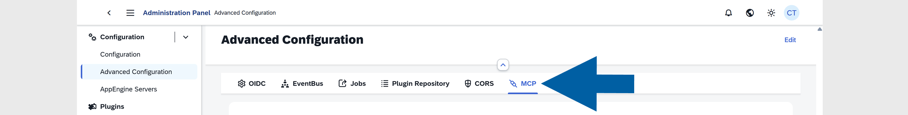

8. Find the **Claude for Code configuration** and copy it.

    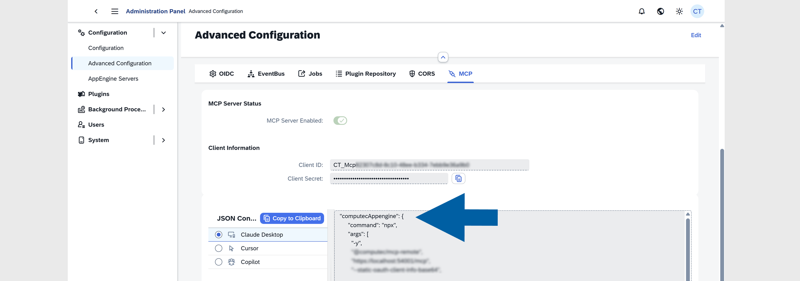

9. In the `claude_desktop_config.json`, in the **mcpServers** section, paste the previously copied content.  
    Example:

      ```http
      {
        "mcpServers": {
          "computecAppengine": {
            "command": "npx",
            "args": [
              "-y",
              "@computec/mcp-remote",
              "https://localhost:54001/mcp",
              "--static-oauth-client-info-base64",
              "[some generated token]",
              "--host",
              "localhost",
              "--force-refresh"
            ],
            "env": {
              "NODE_TLS_REJECT_UNAUTHORIZED": "0"
            }
          }
        },
        "isUsingBuiltInNodeForMcp": true
      }
      ```

### Team Plan setup

1. In the **Connectors** settings, click **Add Custom Connector**.
2. Enter a name and the address of **CompuTec AppEngine**, e.g., `https://localhost:54001/mcp`.
3. In the advanced section, copy the ``OAuth Client ID`` and ``Client Secret`` from **CompuTec AppEngine Administration Panel** > **Advanced Settings** > **MCP**.

### Troubleshooting

If authentication or session issues occur:

1. Restart the application.

    :::info[note]
    Closing the application window does not fully restart it, as it may still be running in the system tray.  
    To properly close it, click the **application icon**, for example, the Claude icon, in the system tray and select **Close**.
    :::

2. Navigate to the following folder: `c:\Users\[windowsUserAccountName]\.mcp-auth`.
3. Delete all files in this folder.
4. Reopen the application, for example, **Claude Desktop**.
5. When the browser opens automatically, sign in again using your **SAP Business One** user credentials.

## Use GitHub Copilot with CompuTec AppEngine MCP Server in VS Code

If you prefer using **GitHub Copilot**, follow these steps:

1. Open the following file on your computer: ``C:\Users\<USERNAME>\AppData\Roaming\Code\User\mcp.json``.
2. In **Computec AppEngine**, to **CompuTec AppEngine Administration Panel** > **Configuration** > **Advanced Configuration**.

    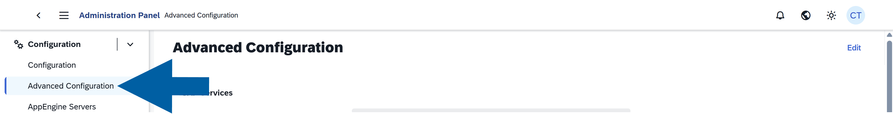

3. Navigate to the **MCP** tab.

    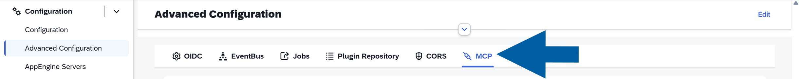

4. Copy the **GitHub Copilot configuration**.

    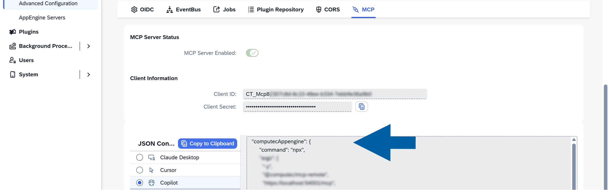

5. Paste it into the **mcp.json** file.  
    Example:

    ```http
      {
      "servers": {
        "computecAppengine": {
          "command": "npx",
          "args": [
            "-y",
            "@computec/mcp-remote",
            "https://XXXXX:54001/mcp",
            "--static-oauth-client-info",
            "{\\\"client_id\\\":\\\"XXXXXXXXXXXXXXXXXXXXXXXXXXX\\\",\\\"client_secret\\\":\\\"XXXXXXXXXXXXXXXXXXXXXXXXXXXX\\\"}",
            "--host",
            "localhost",
            "--force-refresh"
          ],
          "env": {
            "NODE_TLS_REJECT_UNAUTHORIZED": "0"
          },
          "description": "CompuTec AppEngine MCP Server with browser authentication"
        }
      }
      }
    ```

6. Restart **Visual Studio Code**.
7. Open **Copilot Chat**.
8. Switch to **Agent** mode.

    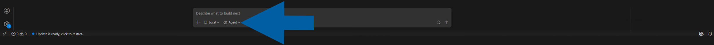

9. Done! Now you can start interacting with the **MCP Server**.

    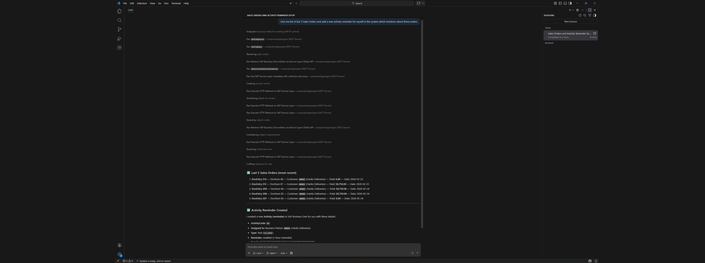

:::info[note]

If **CompuTec AppEngine MCP** is not working as expected, check:

* The correct AI client is configured (**Claude** vs **Copilot**).
* **MCP** configuration is properly copied from **CompuTec AppEngine**.
* The application (**Claude**, **VS Code**, **ChatGPT**) has been fully restarted (including background processes).

:::
