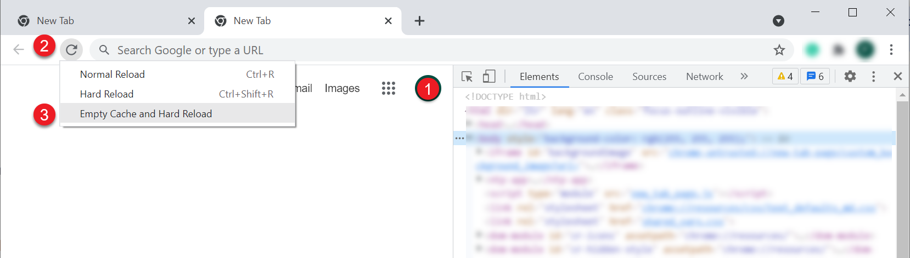
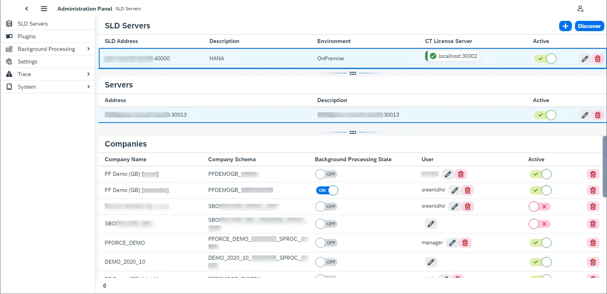
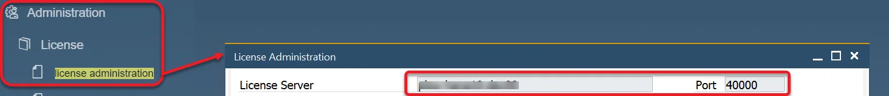

# Overview

:::caution
    After upgrade from any 1.00 version to any 2.00, please use the Empty Cache and Hard Reload option in the browser on which you use AppEngine.
:::

    
Click here to find out more

        

        **Here is an example for Google Chrome or Microsoft Edge (Chromium)**  Open Google Chrome or Microsoft Edge (Chromium) browser and click F12 to open Developers Tools (1.). Right-click on the refresh button (2.) and choose the Empty Cach and Hard Reload option (3.):
        
    

Here you can find the description of the Administration section of AppEngine along with instruction on how to configure the application to start to work with it.

---

Download the installer from [here](/docs/appengine/releases/appengine/download) and run it.

Go to any internet browser and go to `localhost:54000` - 54000 is a default port set for connection; it can be changed in the [Settings section](#settings).

After logging in, click the Administration Panel button and log in using the default log in details:

Administrator ID: CTSiteUser

Password: 12qw!@QW

The default password can be changed in the [System section](#system)

## SLD Servers

Choose this option in the menu on the left to configure a connection to specific companies.

<u>SLD Servers</u> - SAP Business One license server (the ones that have 40000 port).

<u>Servers</u> - Database servers.

<u>Companies</u> - specific databases.

---

Click the plus icon in the upper-right corner to add a new connection.

SLD Address – SLD server address. You can find it in SAP Business One, License Administration.

    
Click here to find more

    

        
    

Description – any description of the current configuration

Environment – On-Premise or Cloud

Database Type – choose your database type (HANA or a specific MS SQL version)

CT License Server – CompuTec License Server address. You can check it in SAP Business One with ProcessForce installed, ProcesForce License administration form.

    
Click here to find more

    

CT License Server Status – status of the connection to CompuTec License Server

Active – a switch to mark if the current settings are active and ready to use or not

Discover – checking this checkbox adds two fields: SAP Business One username and password. After filling in the fields, the companies (on the given servers) to which the user has access will be displayed (the same option is available in the main form, upper-right corner, and can be used later to refresh the list).

Click the save button to save the settings. Click the added line in the SLD Servers section to display related servers. Click any server line in the Servers section to display related companies:

Once the configuration is finished, you can log in to the Launchpad <!-- TODO: Link -->.

## Background processing

AppEngine plugins are designed to be used on users' actions: e.g. a user opens it, changes settings, adds or updates data. But it is also possible to configure actions (jobs) to be performed in the background (independently from any user, even when no one is logged in): upon a specific event or at a specific time (e.g. every 5 minutes).

### Activation

Switch the switch in the Background Processing State column in the [SLD Servers tab](/docs/appengine/administrators-guide/configuration-and-administration/overview#sld-servers) (please check the previous screenshot on this page) and log in using SAP Business One credentials. The following message will be displayed upon the first activation:

Perform the procedure described in the message.

    
Click here to find out more

    

<u>For HANA</u>
- Go to HANA Studio.
- Choose the required database.
- Find the SBO_SP_POSTTRANSACTIONNOTICE procedure (right-click on the Procedures under the database, choose- Filters... and put SBO_SP_POSTTRANSACTIONNOTICE there).
- Right-click on the found procedure and choose Open Definition.
- In the right window go to the Create Statement tab.
- Copy to clipboard the whole content of the tab.
- Click the 'Open SQL console for selected system' icon in the left window.
- Paste the content from the clipboard.
- Change CREATE to ALTER and add the code under the – ADD YOUR CODE HERE line (if there are other pieces of- code there, please put this piece at the end of the section).
- Click the Execute icon in the right window (or click F8).
- Click OK in the message window.

Click the Close button and Switch the Background Processing State switch to ON on the required database again.

In the User column, add a user on which the Background Processing will be operating.

### Configuration

Send Events Job – this job is always present, it is installed with AppEngine (the other jobs from the example screenshot above comes from the installed plugins). It checks the designated table in a database every 10 seconds for new events and sends them to the right plugin-related jobs.

Clicking a job tile leads to its details. Here you can check:

- information on the recent calls: start/end date and time, company and user, exceptions (if there are any). Jobs other than SEventJob have an additional column: EventBus message. It holds information on what was sent to the specific job (what event).
- companies: databases for which the job is active with a user (by default it is the user set in the [SLD Servers tab](/docs/appengine/administrators-guide/configuration-and-administration/overview#sld-servers), it can be changed here just for the specific job)
- logs: log files, also available in the [Trace tab](/docs/appengine/administrators-guide/configuration-and-administration/overview#trace-1).

### Jobs description

|                                                               Plugin                                                               |                                                                                                                                                                                                                    Content                                                                                                                                                                                                                    |                                                                                                                                                                                                                                                                                                                                                                                                                  Description                                                                                                                                                                                                                                                                                                                                                                                                                   |                                                                                                                                                                                                                                                                                                                                                                                                                                               |
| :--------------------------------------------------------------------------------------------------------------------------------: | :-------------------------------------------------------------------------------------------------------------------------------------------------------------------------------------------------------------------------------------------------------------------------------------------------------------------------------------------------------------------------------------------------------------------------------------------: | :--------------------------------------------------------------------------------------------------------------------------------------------------------------------------------------------------------------------------------------------------------------------------------------------------------------------------------------------------------------------------------------------------------------------------------------------------------------------------------------------------------------------------------------------------------------------------------------------------------------------------------------------------------------------------------------------------------------------------------------------------------------------------------------------------------------------------------------------: | --------------------------------------------------------------------------------------------------------------------------------------------------------------------------------------------------------------------------------------------------------------------------------------------------------------------------------------------------------------------------------------------------------------------------------------------- |
|                                                         **ProcesForcePlugin**                                                          |                                                                                    [RecurringJob( JobId = "**CostRollUpScheduledRecurringJob_01**", CronExpression = "0 0 1 * * *", Description = "Scheduled Based Job. Default setup as each day at 1 am. Job runs Cost Roll-Up according to CostRollUpScheduledRecurringJob_01 configuration parameters." )]                                                                                    | Automatically runs Cost Roll-Up upon selected Item/s based on parameters defined in the Settings → Components → ProcessForce (that reflects options available in the Cost Roll-Up form) i the given time. You can configure three different automation of this kind by using CostRollUpScheduledRecurringJob_01, CostRollUpScheduledRecurringJob_02, and CostRollUpScheduledRecurringJob_03 job. Please note that four checkboxes on the Cost Roll-Up form (from “Use final-goods’s batch[…]” to “Calculate and Save Costed BOM data”) are available to use after checking the Perform the roll-up over structure checkbox. They should be used in the same matter in AppEngine, even though they are available even when the Perform the roll-up over structure checkbox is not checked in AppEngine Settings (due to AppEngine limitations). | Please note that four checkboxes on the Cost Roll-Up form (from “Use final-goods’s batch[…]” to “Calculate and Save Costed BOM data”) are available to use after checking the Perform the roll-up over structure checkbox. They should be used in the same matter in AppEngine, even though they are available even when the Perform the roll-up over structure checkbox is not checked in AppEngine Settings (due to AppEngine limitations). |
|                                                                                                                                    | Please note that four checkboxes on the Cost Roll-Up form (from “Use final-goods’s batch[…]” to “Calculate and Save Costed BOM data”) are available to use after checking the Perform the roll-up over structure checkbox. They should be used in the same matter in AppEngine, even though they are available even when the Perform the roll-up over structure checkbox is not checked in AppEngine Settings (due to AppEngine limitations). |                                                                                                                                                                                                                                                                                                                                                                                                                                                                                                                                                                                                                                                                                                                                                                                                                                                |                                                                                                                                                                                                                                                                                                                                                                                                                                               |
|                                                                                                                                    |                                                                                    [RecurringJob( JobId = "**CostRollUpScheduledRecurringJob_02**", CronExpression = "0 0 1 * * *", Description = "Scheduled Based Job. Default setup as each day at 1 am. Job runs Cost Roll-Up according to CostRollUpScheduledRecurringJob_01 configuration parameters." )]                                                                                    |                                                                                                                                                                                                                                                                                                                                                                                                                                                                                                                                                                                                                                                                                                                                                                                                                                                |                                                                                                                                                                                                                                                                                                                                                                                                                                               |
|                                                                                                                                    |                                                                                    [RecurringJob( JobId = "**CostRollUpScheduledRecurringJob_03**", CronExpression = "0 0 1 * * *", Description = "Scheduled Based Job. Default setup as each day at 1 am. Job runs Cost Roll-Up according to CostRollUpScheduledRecurringJob_01 configuration parameters." )]                                                                                    |                                                                                                                                                                                                                                                                                                                                                                                                                                                                                                                                                                                                                                                                                                                                                                                                                                                |                                                                                                                                                                                                                                                                                                                                                                                                                                               |
|                                                                                                                                    |                                                                                                                                [EventBusJob( JobId = "**QCRefillBatchesAndSerialNumbersJob**", Description = "Job refills batches and serial numbers in QC Test documents", ContentType = "59", ActionType = "A")]                                                                                                                                |                                                                                                                                                                                                                                            Fills in Batches and Serial Numbers in appropriate Quality Control Tests. After adding a Goods Receipt, Batches and Serial Numbers are created in a database and can be added to Quality Control Tests, which were created when the related Batches and Serial Numbers were still not present in a database. This job improves ProcessForce performance.                                                                                                                                                                                                                                            |                                                                                                                                                                                                                                                                                                                                                                                                                                               |
|                                                                                                                                    |                                                                                                           [EventBusJob( JobId = "**QCTestDocumentsGeneratorJob**", Description = "Job generating QC Test documents", ContentType = "*", ActionType = "A", Publisher = "AppEngine", PublisherApp = "SAPB1", EventType = "SAPB1Object")]                                                                                                            |                                                                                                                                                                                                                                                                                                                                                  Based on specific settings, automatically generates Quality Control Test when adding documents. This job improves ProcessForce performance.                                                                                                                                                                                                                                                                                                                                                   |                                                                                                                                                                                                                                                                                                                                                                                                                                               |
|                                                                                                                                    |                                                                                                                                                  [RecurringJob(JobId = "**RestoreAditionalBatchDetails**",Description = "Restore Batch Details",Editable = true,CronExpression = "0 */2 * * *")]                                                                                                                                                  |                                                                                                                                                                                                                                                                                                                                                                      Every second hour it calls a method that Creates Batch Master Data for all missing Batches in system                                                                                                                                                                                                                                                                                                                                                                      |                                                                                                                                                                                                                                                                                                                                                                                                                                               |
|                                                                                                                                    |                                                                                                                                             [EventBusJob( JobId = "**RestoreItemDetailsJob**", Description = "Restore Item Details", Editable = true, ContentType = "4", // OITM ActionType = "U" )]                                                                                                                                              |                                                                                                                                                                                                                                                                                                                                                       This job synchronizes data in ItemDetails object upon updating data in the OITM table. This job improves ProcessForce performance.                                                                                                                                                                                                                                                                                                                                                       |                                                                                                                                                                                                                                                                                                                                                                                                                                               |
|                                                                                                                                    |                                                                                                                                  [EventBusJob( JobId = "**SynchronizeBillOfMaterialsJob**", Description = "Synchronize Bill Of Materials", Editable = true, ContentType = "CT_PF_OBOMCode", ActionType = "*" )]                                                                                                                                   |                                                                                                                                                                                                                                                                                                                                          This job synchronizes data with SAP Business One Bill of Materials upon updating ProcessForce Bill of Materials This job improves ProcessForce performance.                                                                                                                                                                                                                                                                                                                                           |                                                                                                                                                                                                                                                                                                                                                                                                                                               |
|                                                                                                                                    |                                                                                                                 [EventBusJob( JobId = "**SynchronizeManufacturingOrderJob**", Description = "Job synchronizes Manufacturing Order with Production Order.", Editable = true, ContentType = "CT_PF_ManufacOrd", ActionType = "*" )]                                                                                                                 |                                                                                                                                                                                                                                                                                                                                                         This job synchronizes data with Production Order upon updating Manufacturing Order This job improves ProcessForce performance.                                                                                                                                                                                                                                                                                                                                                         |                                                                                                                                                                                                                                                                                                                                                                                                                                               |
|                                                                                                                                    |                                                                                                               [RecurringJob(JobId = "**SynchronizeManufacturingOrdersRecursiveJob**", CronExpression = "0 */12 * * *", Description = "This job finds all Manufacturing Orders that are unsynchronized and synchronize them back.")]                                                                                                               |                                                                                                                                                                                                                                                                                                                                                                        This job synchronizes data between Manufacturing Order and Production Order every twelve hours.                                                                                                                                                                                                                                                                                                                                                                         |                                                                                                                                                                                                                                                                                                                                                                                                                                               |
|                                                                                                                                    |                                                                           [EventBusJob(JobId = "**AdditionalBatchDetailsSynchronizerEB**", Description = "Batch Details update when attributes are changed on Additional Batch ", ContentType = "CT_PF_AdditonalBatch", ActionType = "U", Publisher = "AppEngine", PublisherApp = "SAPB1", EventType = "SAPB1Object")]                                                                            |                                                                                                                                                                                                                                                                                                                                              This job synchronizes data to SAP Business One Additional Batch details upon updating Batch Master Data This job improves ProcessForce performance.                                                                                                                                                                                                                                                                                                                                               |                                                                                                                                                                                                                                                                                                                                                                                                                                               |
|                                                                                                                                    |                                                                                      [EventBusJob(JobId = "**AdditionalBatchDetailsCreatorEB**", Description = "Creates Additional Batch Details when Batch is created in system", ContentType = "10000044", ActionType = "*", Publisher = "AppEngine", PublisherApp = "SAPB1", EventType = "SAPB1Object")]                                                                                       |                                                                                                                                                                                                                                                 This job creates a related Batch Master Data upon creation of a Batch in SAP Business One. If this job is turned on, the Batch Synchronization is performed by AppEngine (otherwise, the synchronization is performed by CompuTec WMS service, in contect of using CompuTec WMS). This job improves ProcessForce and CompuTec WMS performance.                                                                                                                                                                                                                                                 |                                                                                                                                                                                                                                                                                                                                                                                                                                               |
| [BackgroundJob(JobId = "**ManufacturingOrderWizardRecoverJob**", Description = "Manufacturing Order Wizard Recover interuppted jobs")] |                                                                                                                                                       This job is started upon a start of AppEngine and checks if there are any unfinished Manufacturing Order Wizard tasks to process.                                                                                                                                                       |                                                                                                                                                                                                                                                                                                                                                                                                                                                                                                                                                                                                                                                                                                                                                                                                                                                |                                                                                                                                                                                                                                                                                                                                                                                                                                               |
|                                                                                                                                    |                                                                                                                                                                                                                                                                                                                                                                                                                                               |                                                                                                                                                                                                                                                                                                                                                                                                                                                                                                                                                                                                                                                                                                                                                                                                                                                |                                                                                                                                                                                                                                                                                                                                                                                                                                               |
|                                                               MI360                                                                |                                                                                                                                        [EventBusJob(JobId = "**PMScheduleMeterBasedJob**", Description = "Generator of Maintenance Order documents from PMSchedule", ContentType = "*", ActionType = "U")]                                                                                                                                        |                                                                                                                                                                                                                                                                             After a meter reading (updating the CT_PF_MeterRead object) and updating Maintenantce Order (CT_PF_MainOrder), this job checks data in PMSchedule and (if it is needed) creates new Maintenance Orders. Without running this job, automatic Maintenance Orders creation does not work.                                                                                                                                                                                                                                                                             |                                                                                                                                                                                                                                                                                                                                                                                                                                               |
|                                                                                                                                    |                                                                                                                                         [RecurringJob(JobId = "**PMScheduleTimeBasedJob**", CronExpression = "*/10 * * * * *", Description = "Generator of Maintenance Order documents from PMSchedule")]                                                                                                                                         |                                                                                                                                                                                                                                                                                                                           This job checks every ten minutes data in PMSchedule and (if it is needed) creates new Maintenance Orders. Without running this job, automatic Maintenance Orders creation does not work.                                                                                                                                                                                                                                                                                                                            |                                                                                                                                                                                                                                                                                                                                                                                                                                               |

### Trace

Log files

### EventBus Live Preview

The preview of all current events from all checked databases.

## Plugins

To install a new plugin, click the Install plugin button in the upper-right corner of the form and load a plugin file. E.g. any from the [Plugins page](/docs/appengine/releases/appengine/download). Note that the plugin files are always delivered as zip files – load them in this form, do not unzip them before loading.

After loading a file you will get a system message about restarting AppEngine. You can decide whether to do it now or later (note that the loaded plugin will be available after the restart).

After the installation, click the required plugin's tile for further configuration.

For the Download SAP WebClient Extension function description, click [here](/docs/appengine/administrators-guide/configuration-and-administration/working-with-sap-business-one-web-client)

### Companies

Clicking one of the tiles in the Plugins section leads to the following view:

Here you can activate the plugin for a specific database by switching the switch in the Activate column. If the plugin requires the installation of some object on the database (e.g. user-defined objects, tables), the Update button will appear upon switching in on on a database. Click it to complete the installation (logging in with SAP Business One database credentials is required).

Now the plugin is available in the Launchpad:

### SAP Business One settings

:::note
    SAP Business One (with ProcessForce installed) main menu → Administration → System Initialization → General Settings → ProcessForce tab → AE tab
:::

After activating a plugin, go to SAP Business One for further configuration.

Check the checkbox, put in the address (by default: `http://localhost:54000`).

Choose From opening mode: in form (within SAP Business One forms), in browser (in the system's default internet browser), or both.

Click the Save button and Restart SAP Business One.

### Settings

On a plugin development level, it is possible to create a set of settings for it. If it was created during plugin development, they are available here

### Logs

Here you can check plugin performance related events, search the log and filter it by error, warning and info message type.

## Settings

This section holds information on the whole AppEngine installation configuration with a possibility to edit some of the values.

<u>Development</u> – plugin development-related settings. Click here to find out more

<u>SLD Servers</u> – here you can find settings from the SLD Servers section

<u>General</u> – here you can change i.a. a default attachment folder, default ports.

<u>Administration</u> – here you can check the AppEngine username and password

<u>Components</u> – here you can check settings related to the installed plugins.

## Trace

Here you can find a log of exceptions regarding AppEngine performance.

### Trace Configuration

Here you can set other then the default error logging level. The levels are as follows (from the one of the broadest range): Trace, Debug, Info, Warn, Error, Fatal, Off. By default, this setting is set to Error. Please note that any change made here is valid per an AppEngine session – after the application restart the setting will go back to the default value.

### Trace

Here you can find the exceptions log. You can filter it by a time range and by type:

- AppEngine – general events, also related to plugins
- Plugin – events related to plugins' initializations
- BackgroundProcessing – events related to jobs.

Click a required log file to check its content. Then you can filter it by message type – Errors, Warnings, or Info – (1) and download the log file (2):

## System

### System Details

Here you can restart the AppEngine installation and change the AppEngine password.

You can also generate and download a configuration file – a log file with a lot of information about this AppEngine installation, e.g. its version, installed plugins with their versions. The file can be then attached to a support ticket related to this installation for a faster solution.

### Active Connections

A list of currently active sessions. Click a connection in the Active sessions table to see the Details of it. You can log out any session by clicking the Log Out button.
