# Overview

In the Plugins page you can manage Plugins installation and activations on Companies and AppEngines. There are three tabs available. Downloaded, Releases and Store.

- **Downloaded**: View and manage the plugins that are already added to your AppEngine from Store. You can see the status of the plugins, if they are installed, activated, or need to be updated. When you expand an Pluing you can see versions added to you AppEngine.

    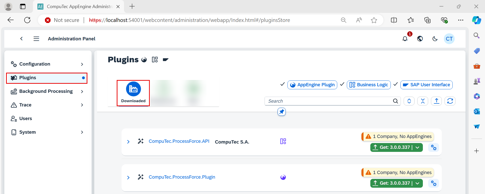

- **Releases**: Shows list of new Plugins versions but only for Plugins that are already added to your AppEngine.

    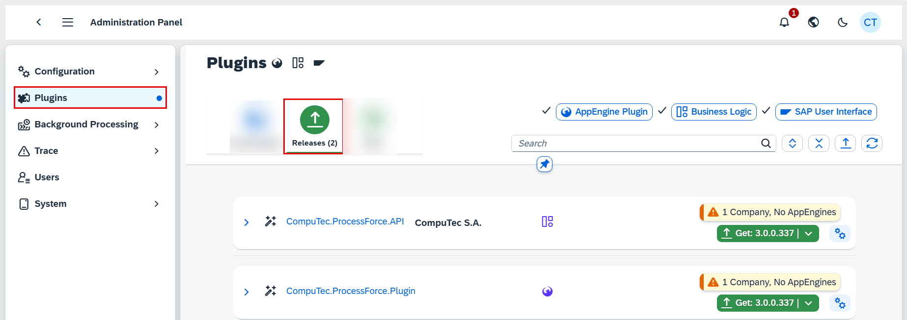

- **Store**: Enables you to browse through a catalog of all plugins and add any of them to your AppEngine.

    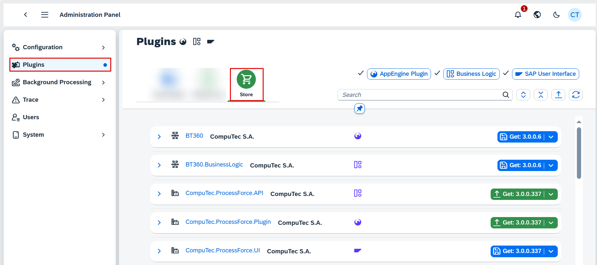

To see details of any particular Plugin you can simply click on is name or specific version. This will open Plugin Details page.

## Step-by-Step Process for Adding and Installing Plugins to AppEngine

1. If you wish to add new Plugin to your AppEngine, navigate to Store tab. Here you can use search field and or use Plugin Types button to search for Plugin. You can also just browse through the catalog. You can add Plugin to AppEngine by just clickin Get button. You can also do it from Plugins Details page as show below.

    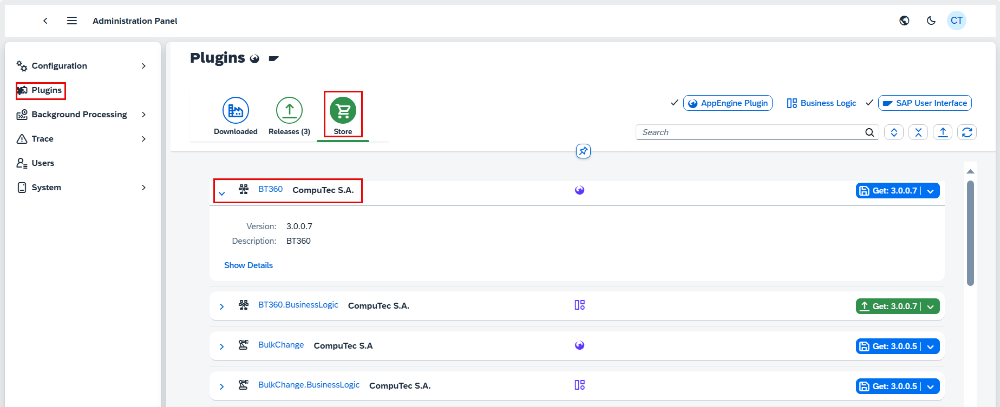

2. Click "Show Details" to view additional information about the plugin. Here, you can see the Dependencies and other available versions of the plugin.

        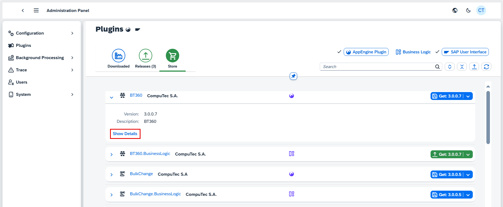

    When you add a plugin to AppEngine, it might rely on certain versions of other plugins to work properly. In Dependencies Tab you can view these dependencies along with current availability. If some of this plugins are not yet available or required version is higher ten available, AppEngine will automatically add required Plugin in correct versions.

        

    If you want to install another version of given Plugin you can navigate to its details from Other Versions tab. In this tab you are presented with all versions of given plugin. To open selected version just simply click on version number.

       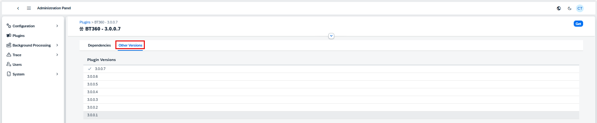
    <!-- //TODO: new screenshot for Other Versions -->

3. To add Plugin to AppEngine click the "Get" button. Alternatively, you can directly click "Get" from the store list.

    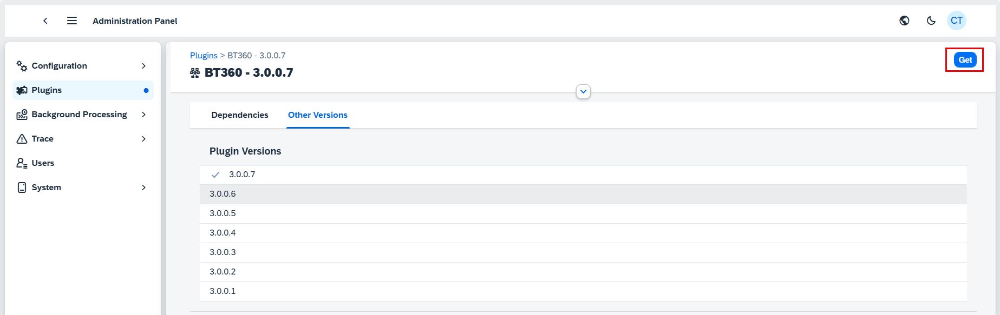

4. Dialog will appear with list of all plugins that will be added to the AppEngine repository. This list constains plugins that are required and are not yet added to AppEngine. Click "Get&Install" to procedd with adding Plugins to AppEngine and opening installation dialog. If you don't want to proceed with installation than chose "Get" option instead. In below example "Get" was clicked.

    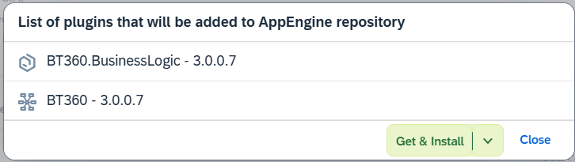

5. The Plugins are now added to AppEngine repository.

    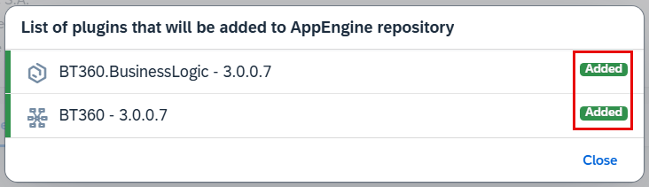

6. Once the plugins are added you can check the Dependencies tab. Now all plugins are available (green statuses), we can proceed with Installation.

    

7. When given Plugin is added to AppEngine there are three additional tabs displayed in Plugin Details. These are Companies, A Navigate to Installation Tabs. You should now see the following tabs: Companies, AE Instances and Installation History.

    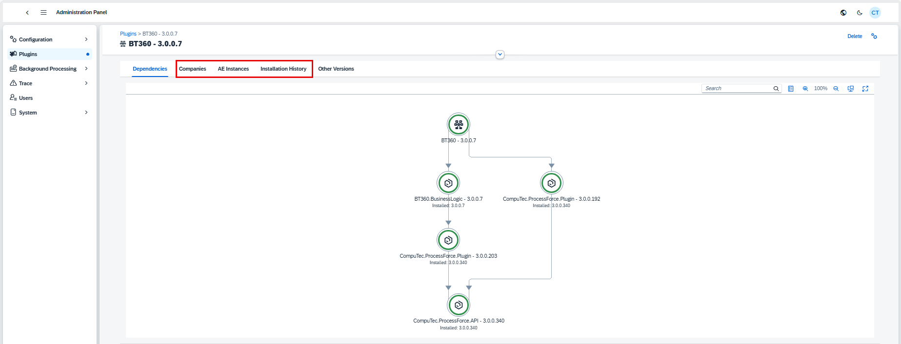

8. Click on the "Companies" tab. Select "Assigning to Company". Choose the company for which the installation will be performed and click "Accept".

    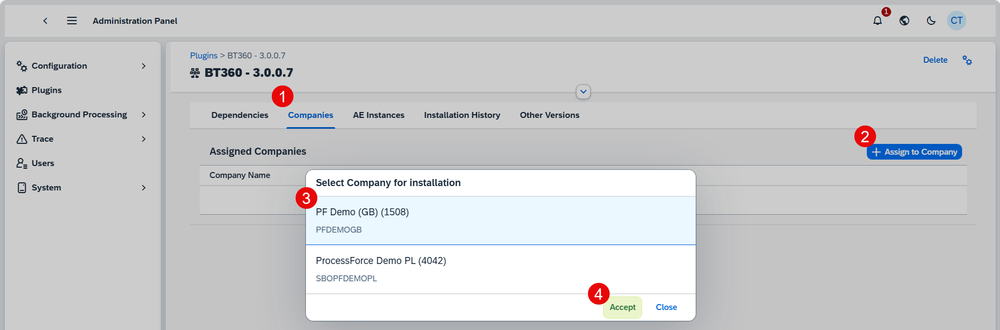

9. Select AppEngine Instance for Installation.

    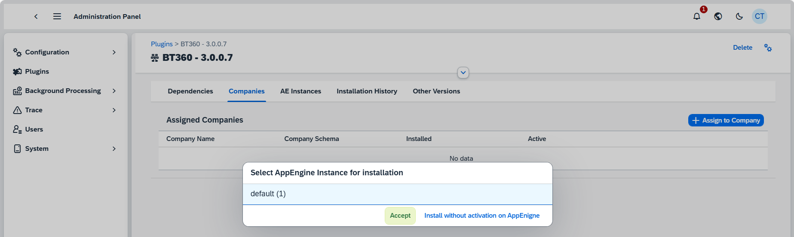

10. The installation item details will be displayed. Here you can see what all required plugins that will be performed during installation and activation. Up arrows under AppEngines means Activation and down arrows Deactivation. Up arrows in last column indicates installation of given version on selected company and down arrows indicates removal. If some additional companies will be affected by installation there you can see them in Installation Companies displayed with warning icon. You can see details by clicking on such company and tur on installation on this company by switching "Install on this company" to "Yes"

    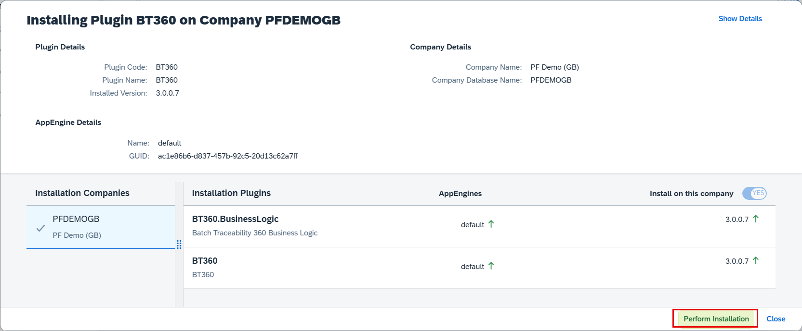

11. You can also see all the details and sequence of operation by clicking on Show Details button in right upper corner of dialog.

    <!-- TODO: add screenshot -->

12. To start installation click on Preform Installation. The installation process will begin, and you can monitor its progress.

    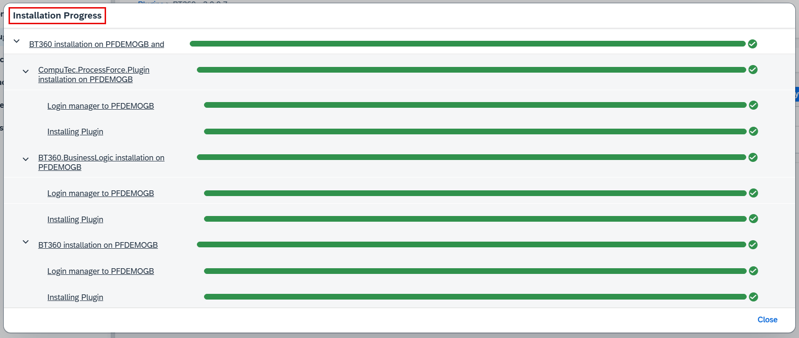

    Once the installation is completed click "Close" button.

13. After installation AppEngine needs to be restarted in order for all changes to be applied. Click "Yes" to restart.

    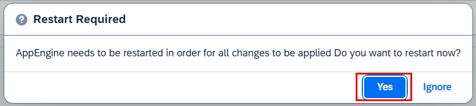

    You can now see the assigned company.

If you didn't perform installation with activation on AppEngine you can do so by navigating to AE Instances tab selecting company and clicking on Assign to AppEngine button
    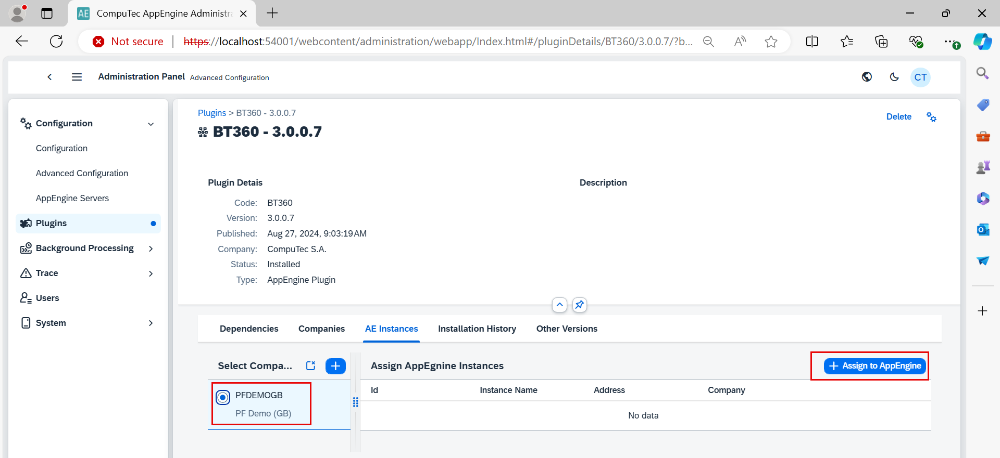

1. Select the AppEngine Instance for installation. The installation item details will show "Activation in Progress". Click on "Perform Installation."

    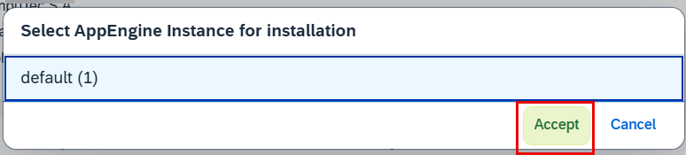

    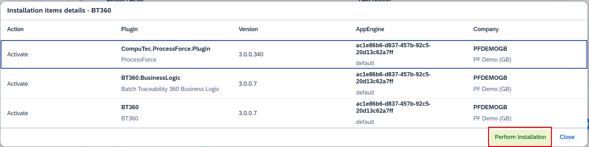

2. Click *"Yes"* to initiate the AppEngine restart.The AppEngine restart will be in progress, completing the installation.

    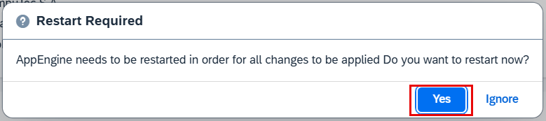

## SAP Business One Settings

<!-- TODO: Replace with company settings: Configuration -> Companies -> Company Details -> Settings Button -->

Choose From opening mode: in form (within SAP Business One forms), in browser (in the system's default internet browser)
