import plugins from "./plugins.json";
import DocCardList from '@theme/DocCardList';

# Overview

Plugins extend the functionality of **CompuTec AppEngine** by delivering additional features as independent CompuTec products, such as warehouse management, production, or quality control.

This article explains what plugins are, how they are structured, and where to find them in the CompuTec AppEngine.

## About plugins

A plugin is a packaged extension that enhances **CompuTec AppEngine** capabilities. Depending on its type, a plugin can:

- Add new business logic (for example, automation or calculations)  
- Extend the user interface in SAP  
- Integrate with external systems or services  
- Provide additional tools within the CompuTec AppEngine environment  
- Plugins are modular, meaning they can be installed, updated, or removed independently.

### Plugin types

In the **CompuTec AppEngine Administration Panel**, plugins are grouped into categories to help you find what you need:

- **Computec AppEngine Plugins**: Core extensions that enhance CompuTec AppEngine functionality, such as services, APIs, or system-level features.
- **Business Logic Plugins**: Plugins that implement specific business processes, validations, or automation rules.
- **SAP User Interface Plugins**: Extensions that add or modify elements in the SAP Business One interface.

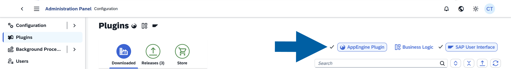

## Plugins page structure

The Plugins page in CompuTec AppEngine Administration Panel consists of three main tabs:

### Downloaded

Displays plugins already added to your CompuTec AppEngine.

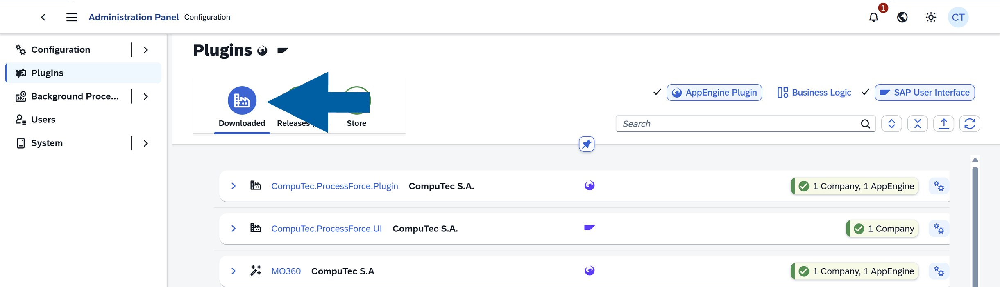

Here you can:

- verify installation status
- check activation on CompuTec AppEngine instances
- see assigned companies
- identify plugins that require updates

### Releases

Displays new versions for plugins already downloaded.

Use this tab to:

- review available updates
- upgrade plugins to newer versions

### Store

Contains all available plugins.

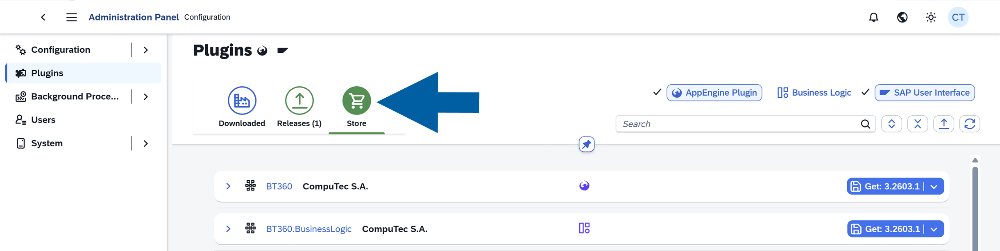

You can:

- Search for plugins you want to install.

    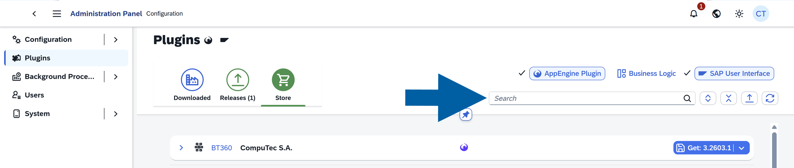

- Filter the plugin list by type:

  - **AppEngine Plugins**
  - **Business Logic Plugins**
  - **SAP User Interface Plugins**

    

- View plugin details after clicking the **plugin name** or **Show details** button.

    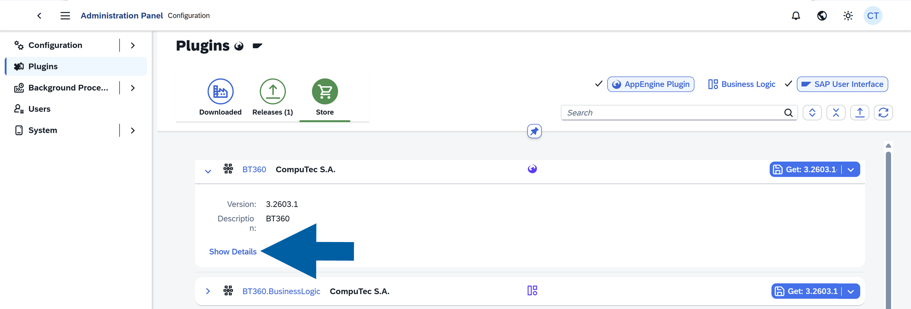

- Install new plugins. [Read more](plugin-installation-process.md)

    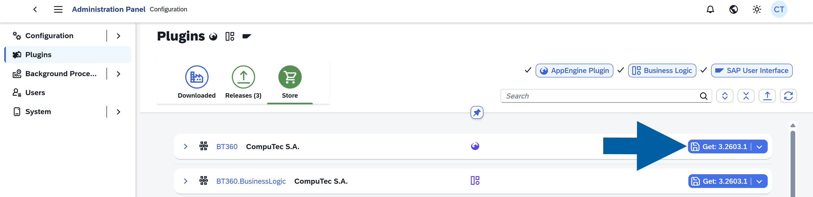

## Plugin details

Selecting a plugin opens its detaileds view. You can click on the plugin name or Show Details button to learn more about the plugin.

From here, you can:

- Read the plugin description

    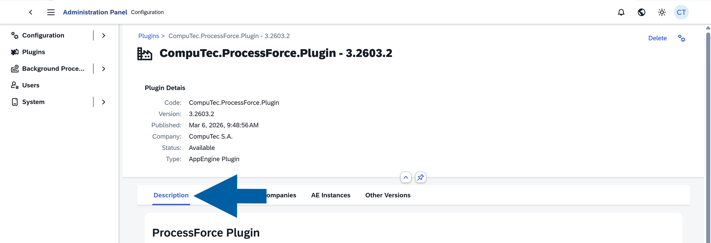

- Check the plugin dependencies

    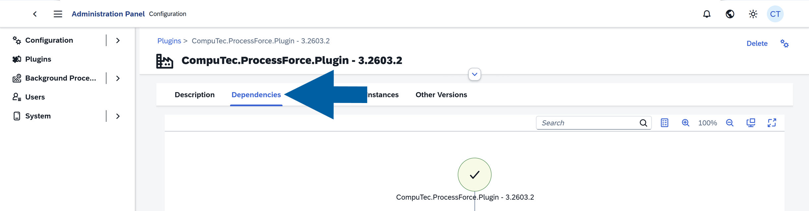

- Verify company assignments

    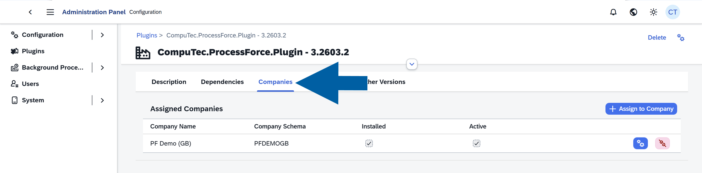

- Confirm activation on CompuTec AppEngine instances

    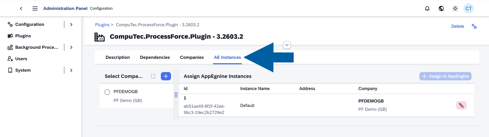

- View other available versions of the plugin and check which version is currently active on your CompuTec AppEngine instance

    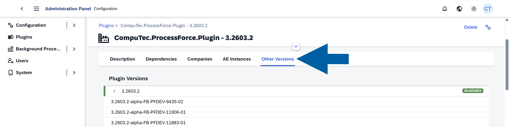

## Plugin versions

Plugins may be available in different release types:

- **Testing versions** (``alpha`` / ``internal``) : Early development versions intended for testing

    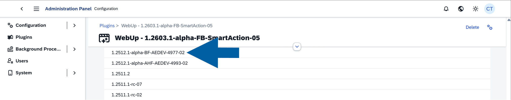

- **Release Candidate** (``rc``): Near-final versions undergoing validation

    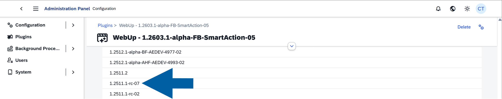

- **Official Release**: Stable, production-ready versions

    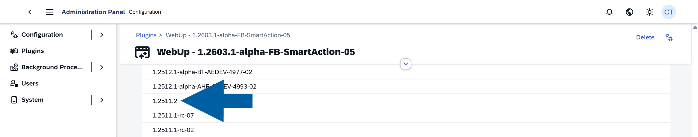

## Available plugins

Each plugin comes with its own product documentation, where you can learn about its features, configuration, and daily use.

Here you can find description of specific plugins' function and how-to manuals:

<DocCardList items={plugins}></DocCardList>
