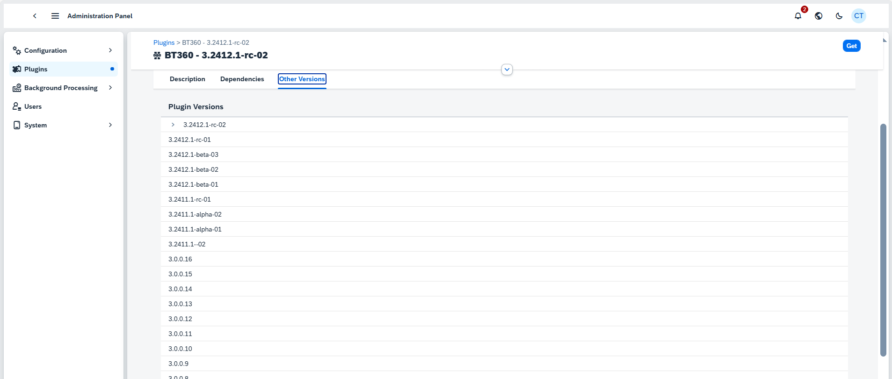

# Overview

Managing plugins is a crucial part of ensuring your CompuTec AppEngine and associated companies function smoothly. The Plugins page provides a centralized location to handle plugin installation, updates, and activation. This guide explains the process of managing plugins across three key tabs—Downloaded, Releases, and Store—and provides a step-by-step walkthrough for adding and installing plugins to your CompuTec AppEngine.

---

## Managing Plugins on the Plugins Page

The Plugins page includes three tabs:

- **Downloaded**: Displays plugins already added to your CompuTec AppEngine, their status (installed, activated, or requiring updates), and available versions.

    

- **Releases**: Lists new plugin versions available for plugins already in your CompuTec AppEngine.

    

- **Store**: Provides a catalog of all available plugins, enabling you to browse, search, and add plugins to your CompuTec AppEngine.

    

To view detailed information about any plugin, click its name or version to access the Plugin Details page.

## Step-by-Step Process for Adding and Installing Plugins to CompuTec AppEngine

1. Go to the "Store" tab. Use the search field or Plugin Types filter to locate the desired plugin.
Click the "Get" button to add the plugin to your CompuTec AppEngine. You can also do it from Plugins Details page as shown below.

    

2. Click "Show Details" for information about dependencies or other available versions. Dependencies will automatically be added to ensure compatibility.

        

    If some of these plugins are unavailable or the required version is higher than the available one, CompuTec AppEngine will automatically add the necessary plugins in the appropriate versions.

        

    To install a different version of a plugin, navigate to its details in the Other Versions tab. This tab displays all available versions of the plugin. Simply click on the desired version number to open it.

       

3. To add Plugin to CompuTec AppEngine click the "Get" button. Alternatively, you can directly click "Get" from the store list.

    

4. A dialog will appear listing all plugins to be added to the CompuTec AppEngine repository. This list includes any required plugins that are not yet part of the CompuTec AppEngine. To proceed with adding the plugins and opening the installation dialog, click "Get & Install". If you prefer not to proceed with installation at this stage, select the "Get" option instead. In the example below, "Get" was selected.

    

5. The Plugins are now added to CompuTec AppEngine repository.

6. Once plugins are added to the CompuTec AppEngine repository, ensure all dependencies are available (indicated by green statuses).

    

7. Once a plugin is added to CompuTec AppEngine, three additional tabs become available in the Plugin Details section: Companies, CompuTec AppEngine Instances, and Installation History. Navigate to the Installation tabs to access these options.

8. Go to the "Companies" tab and select "Assigning to Company". Choose the company where the installation will be performed, then click "Accept".

    

9. Select CompuTec AppEngine Instance for Installation.

10. The installation item details will be displayed, showing all the required plugins involved in the installation and activation process. Up arrows under CompuTec AppEngine indicate activation, while down arrows indicate deactivation. In the last column, up arrows represent the installation of the specified version for the selected company, and down arrows indicate its removal. If additional companies are impacted by the installation, they will be listed under Installation Companies with a warning icon. You can view details by clicking on the affected company and enable installation for that company by toggling Install on this company to Yes.

    

11. You can also see all the details and sequence of operation by clicking on Show Details button in right upper corner of dialog.

12. To initiate the installation, click on "Perform Installation". The installation process will start, and you can monitor its progress.

    

    Once the installation is completed, click "Close" button.

13. After the installation, CompuTec AppEngine must be restarted to apply all changes. Click "Yes" to proceed with the restart.

    

    You can now see the assigned company.

If the installation was not performed with activation on CompuTec AppEngine, you can activate it by navigating to CompuTec AppEngine Instances tab, selecting the company, and clicking the "Assign to AppEngine" button.

        

## SAP Business One Settings

Choose From opening mode: in form (within SAP Business One forms), in browser (in the system's default internet browser)
