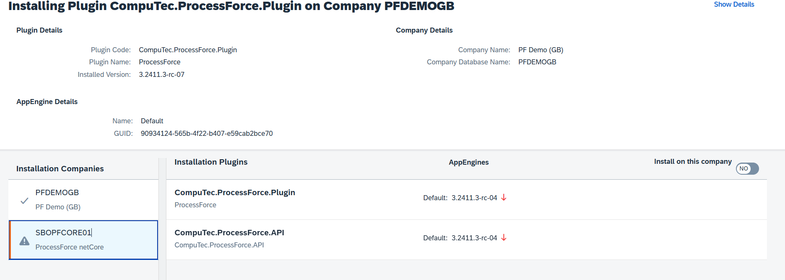
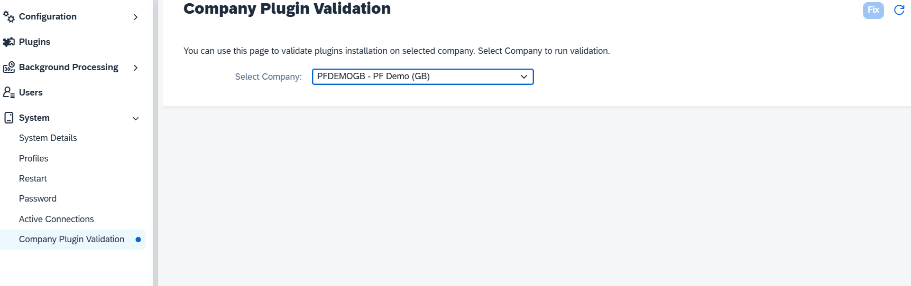

# Plugin Installation Process

During the installation of a plugin, the system checks all installed plugins and their versions, verifies the new plugin's version, and ensures its dependencies are met. Based on these checks, the system calculates the steps required to perform the installation or upgrade, ensuring a seamless integration.

---

## Plugin Installation

Plugin Installation is a process that associates a plugin with a specific company. If structural changes to the database are required, these are executed during this phase. Plugin Installation is executed by te CompuTec.Database.Setup process.

## Plugin Activation

Plugin Activation involves associating a plugin with a company and an AppEngine instance. This association loads the plugin on the AppEngine server instance, allowing controllers and jobs to be hosted on this instance.

:::note
Only one version of a plugin can be activated on a single AppEngine instance at any given time.
:::

The installation process, based on plugin dependencies, installed plugins, and activations, calculates the steps required to install the requested plugins. In the Installation screen, you can see a list of:

- **Affected Companies** - A list of companies that are affected by the upgrade.
- **Affected Plugins** - A list of plugins and versions that are installed or removed from a company, and/or activated or deactivated in the AppEngine.
- **Install on this company** - By checking this checkbox, system will also install new version on the selected company .

**When a plugin is shared across multiple companies**:

- Updating the plugin in one company (e.g., Company A) will deactivate it in others (e.g., Company B).
- To update it in other companies, navigate to the relevant company tab (e.g., 'Company B') and select the Install on this company checkbox.

## When Installation Fails

In cases where a plugin installation fails, the system deactivates all dependent plugins to prevent operational issues. Administrators must manually resolve the problem:
    1. Identify the cause of the failure.
    2. Navigate to Administration Panel → System → Company Plugin Validation.
    3. Select the affected company or companies (where the installation failed).
    4. Press the "Fix" button to resolve the issue.
    If there are any other problems, please navigate to the Administration Panel -> System -> Company Plugin Validation, select the company or companies where the installation failed, and press the 'Fix' button.

    

---
Proper management of plugins ensures that your system functions optimally. By following these guidelines, administrators can ensure successful plugin management, even in complex, multi-company environments.
