# Plugin Installation

**Plugins** in **CompuTec AppEngine** are installed using the **Plugins** page in the **CompuTec AppEngine Administration Panel**.

The installation and configuration process includes:

- **Download the plugin**: The plugin is added to the CompuTec AppEngine repository.

- **Install the plugin**: Installation prepares the plugin for use in a specific company. It:

  - assigns the plugin to the company
  - applies any required database changes

- **Activate it on the Computec AppEngine instance**: Activation makes the plugin available for use in the system. It:

  - assigns the plugin to an AppEngine instance
  - enables its functionality at runtime

The system automatically handles dependencies and version compatibility.

:::info[Note]
Only one version of a plugin can be active on a single CompuTec AppEngine instance at a time.
:::

## Before you start

Before you start, make sure that:

- **CompuTec AppEngine** is installed and activated. [Read more](https://learn.computec.one/docs/appengine/administrators-guide/configuration-and-administration/installation)
- You have access to the **CompuTec Administration Panel**
- At least one **CompuTec AppEngine** instance is configured and active. [Read more](https://learn.computec.one/docs/appengine/administrators-guide/configuration-and-administration/installation#step-5-activate-a-company-in-computec-appengine)

## Install and activate a plugin

To install and activate a CompuTec AppEngine 3.0 plugin, follow these steps:

1. Log in to **CompuTec AppEngine Administration Panel**.

    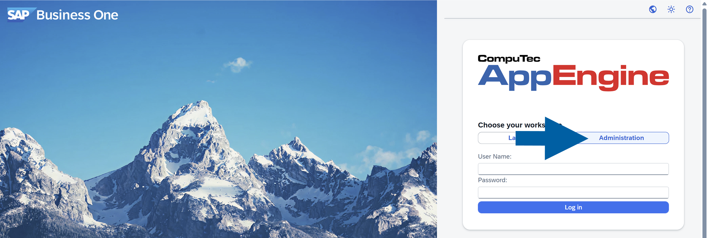

2. Go to **Plugins**.

    

3. Navigate to **Store**.

    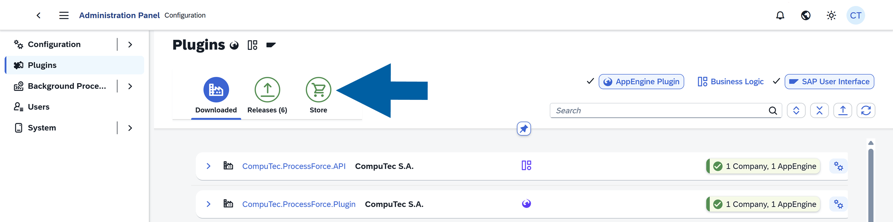

4. Find the plugin you want to install:

    - Use the **Search** field

        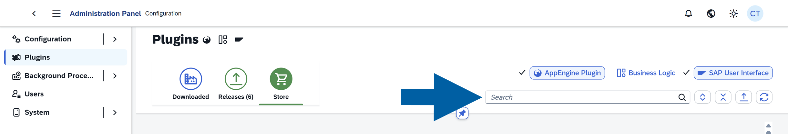

    - or filter by plugin type : **AppEngine Plugins**, **Business Logic**, or **SAP User Interface** plugins

        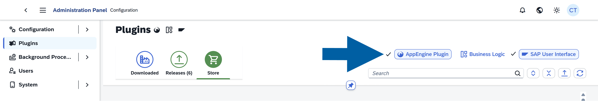

    :::info[note]
    Note: Business Logic plugins are typically installed automatically as dependencies when required by another plugin. You do not need to select or install them manually.
    :::

5. Click **Get...** next to the plugin name on the list to install the latest plugin version.

    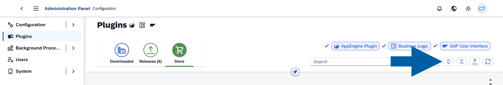

6. (optional) To install a different version of the plugin:

    - Click the plugin name or the arrow next to the version number and click **Find different version**.

        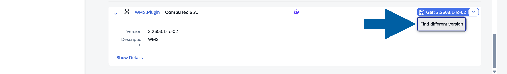

    - You will see the plugin details with all the available versions. [Read more](http://learn.computec.one/docs/appengine/plugins-user-guide/overview#plugin-versions)

        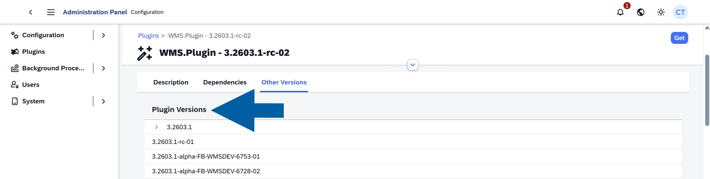

    - Find the version you want to install and click **Get**.

        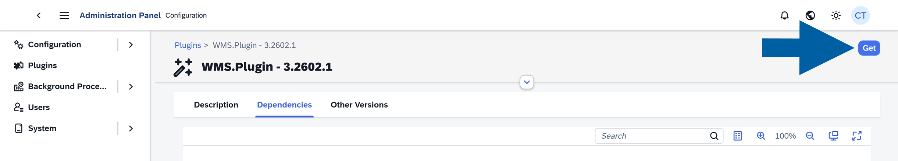

7. Click **Get & Install** next to the chosen plugin version.

    

8. Select **Company** for installation and click **Accept**.

    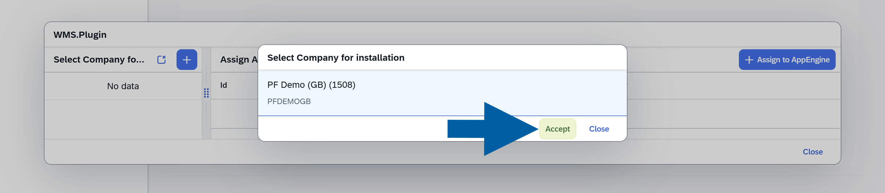

9. Select **CompuTec AppEngine Instance** for installation and click **Accept**.

    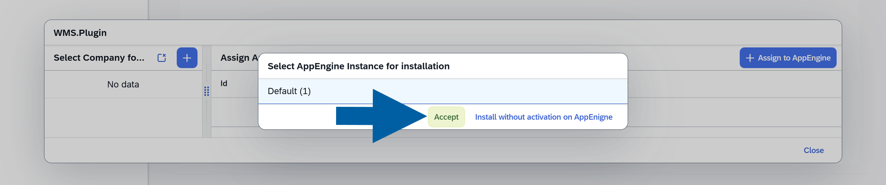

10. Review the installation details and click **Perform Installation**.

    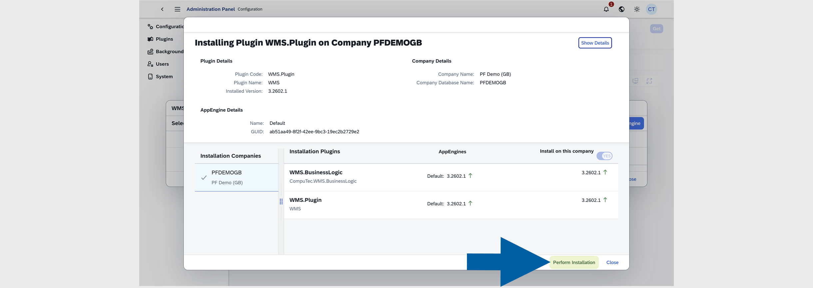

11. Click **OK** to confirm CompuTec AppEngine actions.

    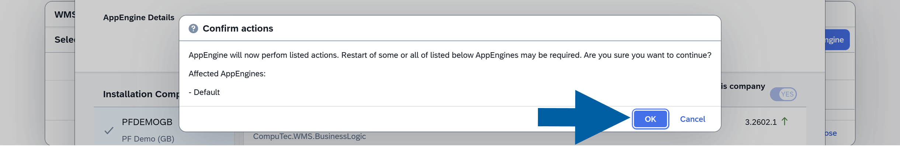

12. You can now track the installation progress. Once the installation is complete, click **Close**.

    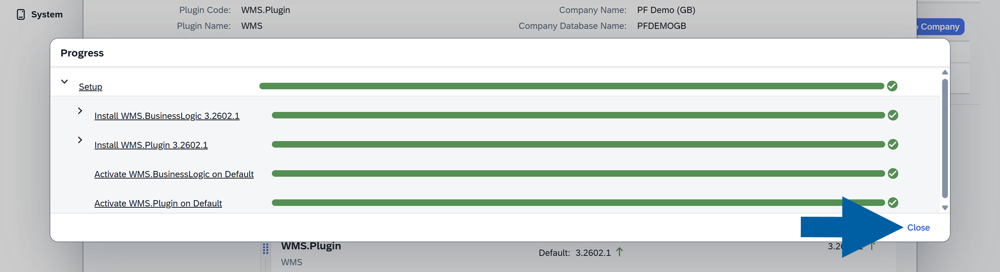

13. Click **Yes** to restart the **CompuTec AppEngine**.

    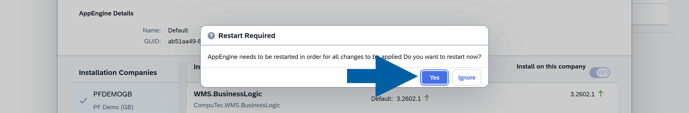

14. Once the restart is complete, click **OK**.

    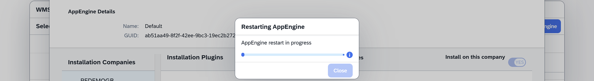

15. Done! The plugin is now installed and ready to use.

:::info[Note]

You don’t need to manage dependencies manually. During the installation, the system automatically:

- installs all required plugins
- ensures compatible versions are used
- includes any missing components

This allows you to continue with the setup without additional configuration steps.
:::

## After installation

After successful installation:

- the plugin appears in the **Downloaded** tab
- it is assigned to the selected **Company**
- it is active on the selected **CompuTec AppEngine Instance**
- in most cases, the plugin is available in the **CompuTec AppEngine Launchpad**

    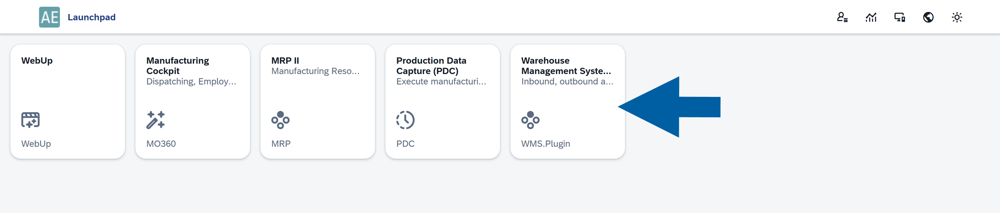

:::info[Note]

To learn about new features or changes, refer to the plugin’s [documentation](http://learn.computec.one/docs/appengine/plugins-user-guide/overview#available-plugins).

:::
