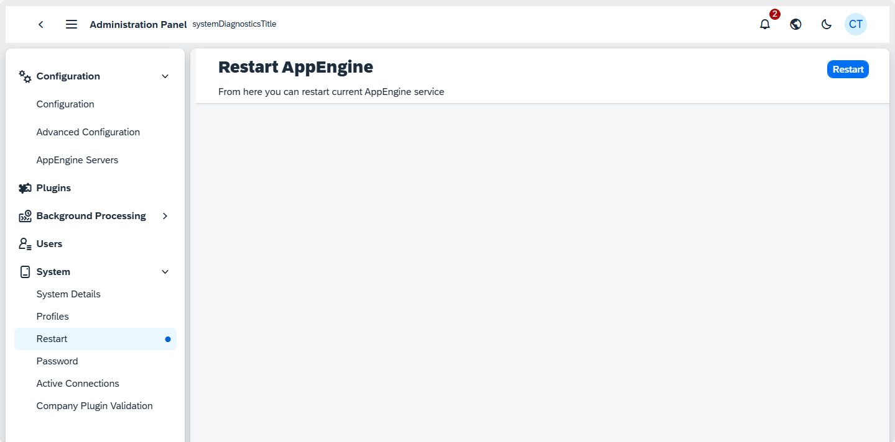

# System

## System Details

System Details provides information about AppEngine that we are curently logged in. It includes the AppEngine Version and AppEngine GUID. There is also SAP Computec Start Extension for manual download if required. SAP Computec Start Extension is SAP Business One extension that is started inside SAP Business One client. It provides access to plugins and other features of AppEngine.

## Profiles

Profiles are used to store different configtionions for the OpenTelemetry Exporter settings (OTLP Exporter). You can define many different configuration and than attach them when needed to AppEngine or Company.

 This functionality sends logs, metrics and traces to OLTP server based on this configuration. You can copy the standard templates provided with AppEngine (listed below) and set your Endpoint and Header Values. For more please check [Support for Open Telemetry](https://learn.computec.one/docs/Help/OpenTelemetrySupport)

| Profile Names | Descriptions |
| --- | --- |
| OpenTelemetry_All |This configuration handles the OpenTelemetry Exporter settings (OTLP Exporter). It sends logs, metrics, and traces to an OLTP server. Replace the endpoint and header for correct values. For more information, refer to OpenTelemetrySupport. |
| OpenTelemetry_logs | This profile manages the OpenTelemetry Exporter settings for logs. It sends logs to the OLTP server. Replace the endpoint and header for correct values. More details are available at OpenTelemetrySupport. |
| OpenTelemetry_traces | This profile is designed for OpenTelemetry Exporter settings, focusing on traces. Traces are sent to the OLTP server. As with other profiles, replace the endpoint and header for correct configuration values. Refer to OpenTelemetrySupport. |
| OpenTelemetry_metrics | Manages the OpenTelemetry Exporter settings for metrics. Metrics are sent to the OLTP server, and the endpoint and header need to be updated for accuracy. Additional information can be found on the same documentation page as the others. |
| File_Information | Configures the system to send all logs categorized as information-level to a file for storage. The content field appears to contain logging settings. |
| File_Debug | This configuration is set to store all logs with a debug type into a file, providing more detailed information for troubleshooting and debugging purposes. |

## Restart

From here, you can restart current AppEngine service

## Password

From here, you can change the administration password:

## Active Connections

In Active Connection you can check current connection to SAP.

## Company Plugin Validation

You can use this page to validate plugins installation on selected company. Select Company to run validation.

