# Working with SAP Business One Web Client

**CompuTec WebClient Start** is an essential tool for integrating CompuTec AppEngine plugins and extending the functionality of the SAP Business One Web Client. It connects the two systems so you can extend your ERP with more tools and features. CompuTec WebClient Start is installed during the company activation.

## Step 1: Install the CompuTec WebClient Extension Package

The **CompuTec WebClient Extension Package** contains all plugins enabled for a specific company. Each company has its own plugin pack, so you must install it separately for every company. Installing the CompuTec WebClient Extension is required to use CompuTec plugins in the SAP Business One Web Client.

To install the **CompuTec WebClient Extension Package**, follow these steps:

1. Log in to the **CompuTec AppEngine Administration Panel**.

    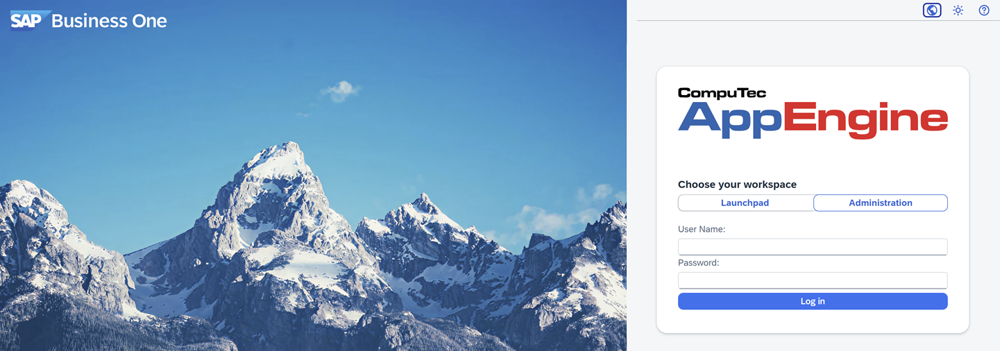

2. Navigate to **Configuration**.

    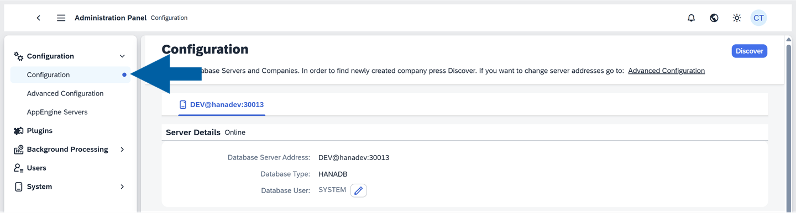

3. Find your company in the **Companies** list.

    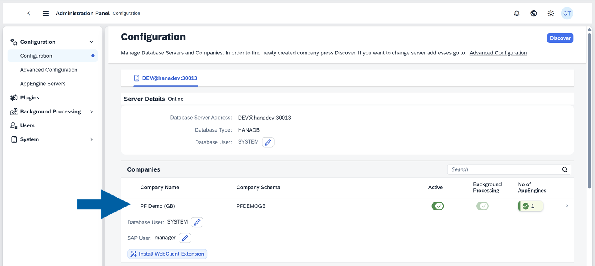

4. Click **Install CompuTec WebClient Extension**.

    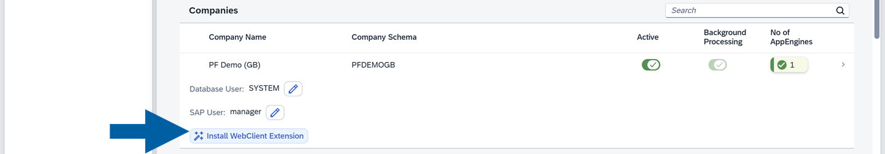

5. Log in using your SLD Server username and password.

    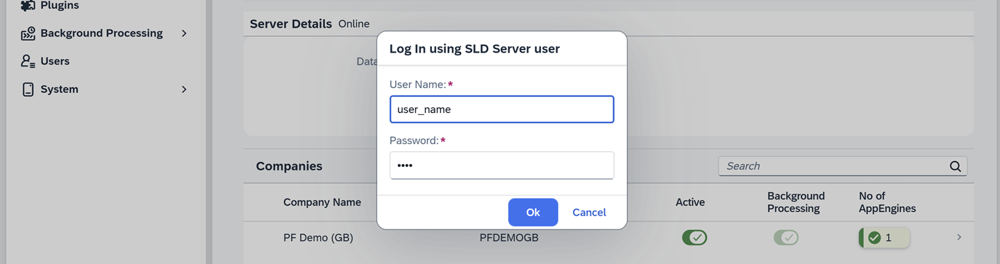

6. Done! The installation of the CompuTec WebClient Extension Package was completed successfully.

:::info[note]
Whenever you deactivate or activate a new company, repeat this process to install its updated CompuTec WebClient Extension Package.
:::

## Step 2: (Optional) Install and activate CompuTec WebClient Start manually using the Extension Manager

Sometimes, you need to install CompuTec WebClient Start extension manually. This kind of activation is mainly provided for SAP Business One Cloud Control Center (CCC).

To manually install and activate CompuTec WebClient Start, follow these steps:

1. Log in to **CompuTec AppEngine Administration Panel**.

2. Navigate to **Administration Panel** > **System**.

3. In the **System Details** section, click **Download CompuTec WebClient CTStart** installation pack.

    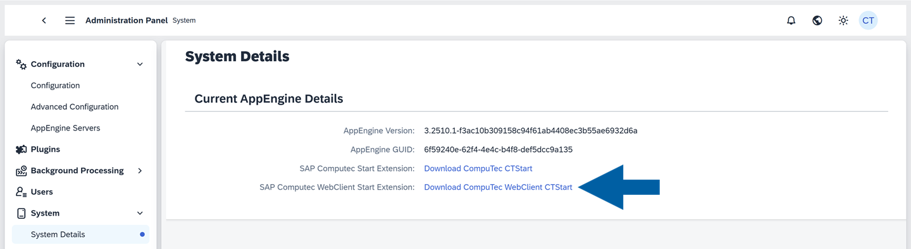

4. Open the **Extension Manager** in your browser using this address: `https://<SAPExtensionHost>:<SAPExtensionPort>/ExtensionManager/.` Replace the placeholders with your system values, for example: `https://hanadev:40000/ExtensionManager/.`

    :::info[note]
    Make sure you have the necessary permissions to access the Extension Manager.
    :::

5. Click **Import**.

    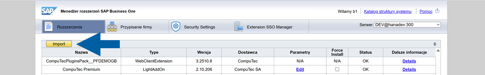

6. Choose the downloaded installation pack file, and click **Upload**.

    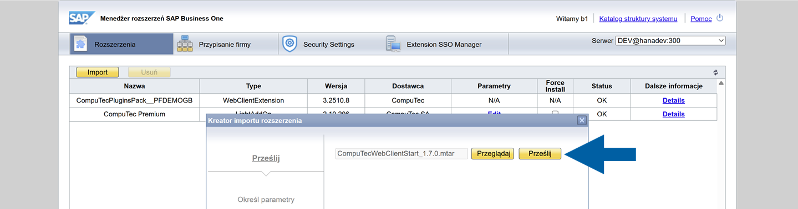

7. Click **Next**.

8. (Optional) You can **Specify Shared Parameters**, and click **Finish**.

9. Navigate to **Company Assignment**, and select the company on the list on the left.

    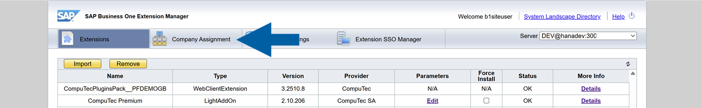

10. In **Extensions**, click **Assign**.

    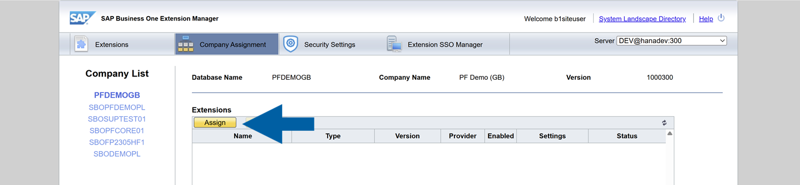

11. In **Extension Assignment Wizard**, choose the **CompuTec.Start** extension from the list and click **Next**.

    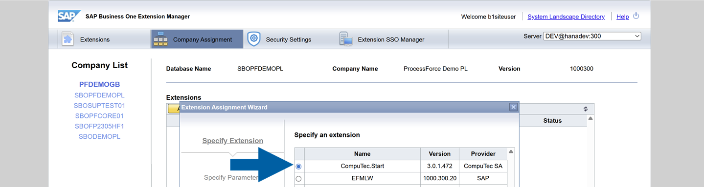

12. (Optional) In **User Preferences**, you can change the **Startup Mode** for each user, and click **Next**.

13. Click **Finish** to complete the setup.

14. Done! You've successfully installed and activated CompuTec WebClient Start extension.

## Step 3: Configure Content Security Policy (CSP) Settings

To enable proper functionality of the SAP Web Client, especially for embedded frames and cross-domain requests, you need to configure Content Security Policy (CSP) settings in SAP Web Client. Correct CSP configuration prevents security issues and ensures smooth integration.

1. In the **CompuTec AppEngine Administration Panel**, navigate to **System** > **System Details**.  

      

2. Click on the **Required CSP Entries for Web Client** link.  

    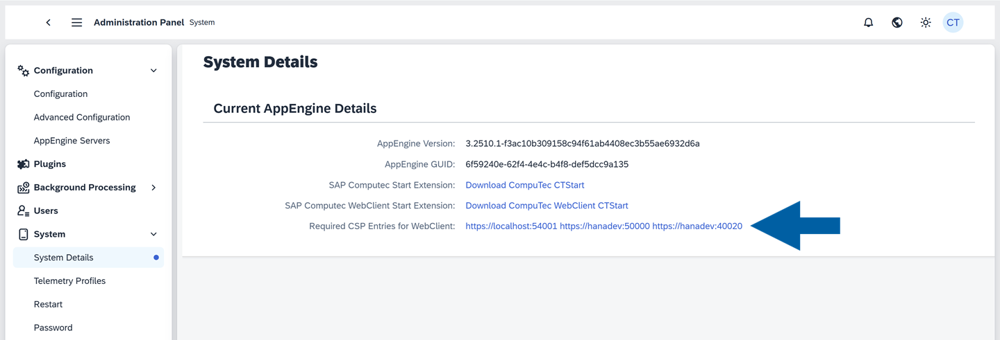  

3. Here, you can find all the required entries for SAP Web Client Content Security Policy.

      

4. Copy the entries and close the window.  

5. Open **SAP Business One Web Client** and click on your **profile** icon in the upper right corner of the interface.  

      

6. Navigate to **Settings** > **General Settings**.  

    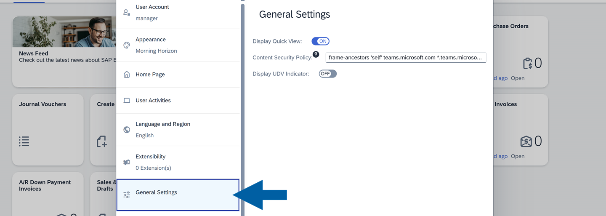  

7. Paste the copied entries into the **Content Security Policy** field.  

    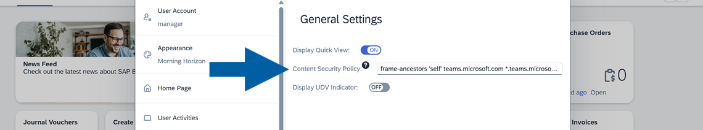

8. Refresh the **SAP Business One Web Client** page to apply the changes.

9. Done! You've successfully configured CSP in SAP Web Client.

:::info[note]
If you need help at any point, feel free to reach out through the [CompuTec Helpdesk Portal](https://support.computec.pl/servicedesk/customer/portals?q=webUp).
:::
