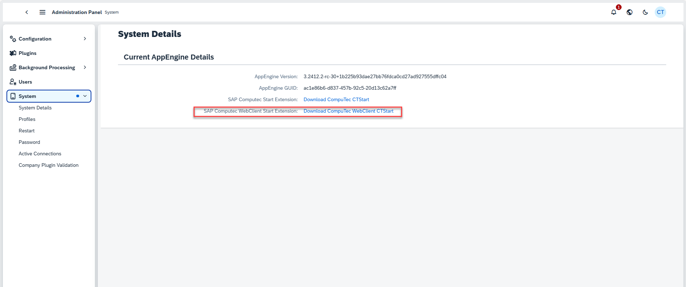
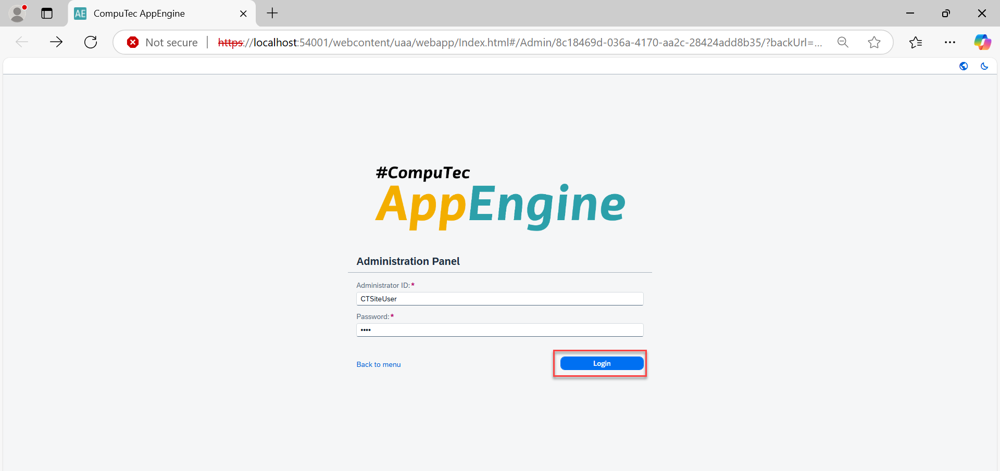
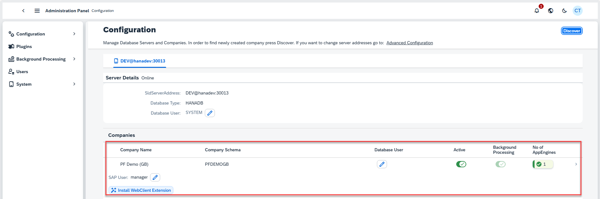
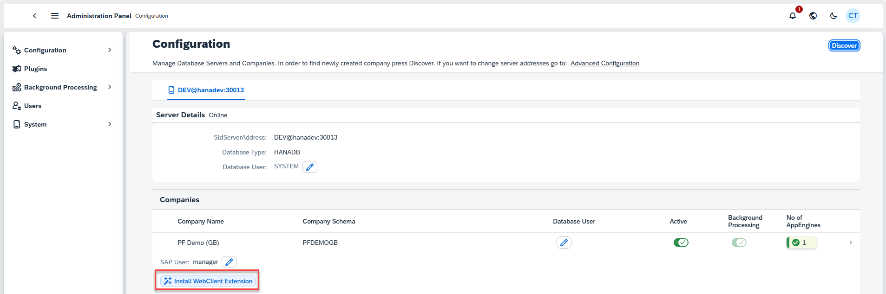

# Working with SAP Business One Web Client

The CompuTec Web Client Start is an essential tool for integrating plugins and extending the functionality of the SAP Business One Web Client. It enables seamless interaction between AppEngine plugins and SAP Business One solutions, offering users enhanced capabilities for managing their ERP system. This tool is installed during company activation.

---

## Manual Activation via Extension Manager

To manually install and activate CompuTec Web Client Start, follow these steps:

1. Download the CompuTec Web Client Start Installation Pack from Administration Panel -> System.

    
2. Access the Extension Manager by navigating to `https://sqlsap10:40000/ExtensionManager/.`
3. Install the downloaded Installation Pack into the Extension Manager
4. Activate CompuTec Web Client Start for the selected company.
5. Follow the on-screen instructions to complete the activation process.

>**Note**: Ensure you have the necessary permissions to securely access the Extension Manager.

## Plugins Pack Installation

The Plugins Pack is a collection of plugins that can be installed based on the activated plugins at the company level. This feature ensures centralized management and deployment across desired environments.

**Steps to install the Plugins Pack**:

1. Log into the AppEngine Administration Panel.

    
2. Navigate to configuration, then select Company Details by clicking on the respective company.

    
3. Click "Install WebClient Extension Package".

    
4. After activating a new plugin for a company, remember to repeat this process to install the new plugins pack for that company.

## Configuring CORS Settings

To enable proper functionality of the Web Client, especially for embedded frames and cross-domain requests, you need to configure CORS (Cross-Origin Resource Sharing) settings in SAP Web Client. Correct CORS configuration prevents security issues and ensures smooth integration.
For detailed guidance, refer to the official SAP Help Portal: [Configuring CORS Settings for SAP Business One Web Client](https://help.sap.com/docs/SAP_BUSINESS_ONE_WEB_CLIENT/e6ac71d18c7543828bd4463f77d67ff7/1acda7a66c434b4e9dbc3b1f8ae21d6e.html)

**Key steps for configuring CORS**:

1. Identify the domains that requires access to the Web Client.
2. Update the configuration file with the approved domains.
3. Test the integration to ensure everything functions correctly.

---
By following these guidelines, you can efficiently configure and manage the CompuTec Web Client Start and its associated plugins, ensuring seamless operation of your SAP Business One system. If you need further assistance, feel free to reach out!
