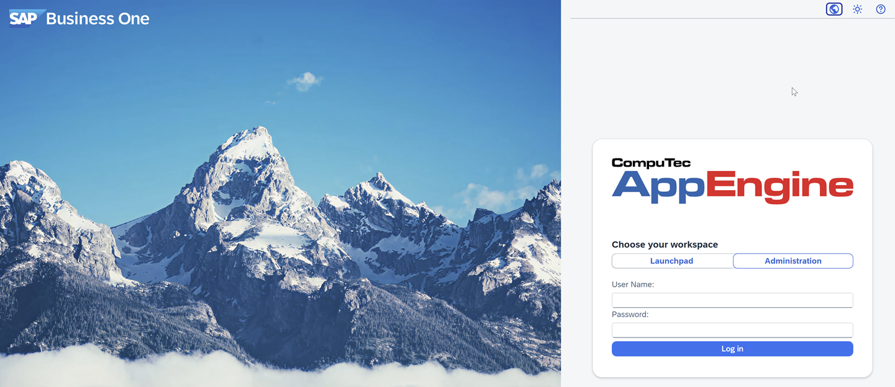
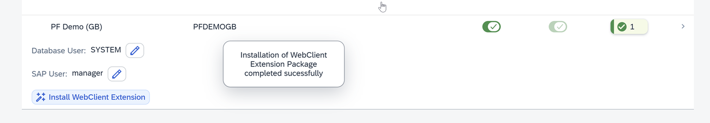

# Working with SAP Business One Web Client

The **CompuTec WebClient Start** is an essential tool for integrating CompuTec AppEngine plugins and extending the functionality of the SAP Business One Web Client. It connects the two systems so you can extend your ERP with more tools and features. The CompuTec WebClient Start is installed during the company activation.

## Step 1: Install the plugin pack

The **WebClient Extension Package** contains all plugins enabled for a specific company. Each company has its own plugin pack, so you must install it separately for every company. Installing the WebClient Extension is required to use CompuTec plugins in the SAP Business One Web Client.

To install the CompuTec WebClient Extension, follow these steps:

1. Log in to the **CompuTec AppEngine Administration Panel**.

    

2. Navigate to **Configuration**.

    

3. Find your company in the list.

    

4. Click **Install WebClient Extension**.

    

5. Log in using your SLD Server username and password.

    

6. The installation of WebClient Extension Package is completed and you'll see a success message.

    

:::info[note]
Whenever you deactivate or activate a new company, repeat this process to install its updated CompuTec WebClient Extension Package.
:::

## Step 2: Install and activate CompuTec WebClient Start manually using the Extension Manager

Manual activation is mainly provided for SAP Business One Cloud Control Center (CCC).

To manually install and activate CompuTec WebClient Start, follow these steps:

1. Log in to **AppEngine Administration Panel**.

2. Navigate to **Administration Panel** > **System**.

3. In **System Details** section, click **Download CompuTec WebClient CTStart** installation pack.

    

4. Open the **Extension Manager** in your browser usin this address: `https://<SAPExtensionHost>:<SAPExtensionPort>/ExtensionManager/` replacing the placeholders with your system values. For example: `https://hanadev:40000/ExtensionManager/.`

5. Import the downloaded installation pack into the **Extension Manager**.

6. Activate **CompuTec WebClient Start** for the selected company.

7. Follow the instructions on the screen to finish the setup.

:::info[note]
Make sure you have the necessary permissions to securely access the Extension Manager.
:::

## Step 3: Configure Content Security Policy (CSP) Settings

To enable proper functionality of the SAP Web Client, especially for embedded frames and cross-domain requests, you need to configure Content Security Policy (CSP) settings in SAP Web Client. Correct CSP configuration prevents security issues and ensures smooth integration.

1. In the **AppEngine Administration Panel**, navigate to **System** > **System Details**.  

      

2. Click on the **Required CSP Entries for Web Client** link.  

      

3. Here, you can find all the required entries for SAP Web Client Content Security Policy.

      

4. Copy the entries and close the window.  

5. Open **SAP Business One Web Client** and click on your **profile** icon in the upper right corner of the interface.  

      

6. Navigate to **Settings** > **General Settings**.  

      

7. Paste the copied entries to the **Content Security Policy** field.  

    

8. Refresh the **SAP Business One Web Client** page to apply the changes.

9. Done! You've successfully configured CSP in SAP Web Client.

:::info[note]
By following these steps, you can easily set up and manage CompuTec WebClient Start and its plugins, ensuring your SAP Business One Web Client runs smoothly.  

If you need help at any point, feel free to reach out: [CompuTec Helpdesk Portal](https://support.computec.pl/servicedesk/customer/portals?q=webUp).
:::
