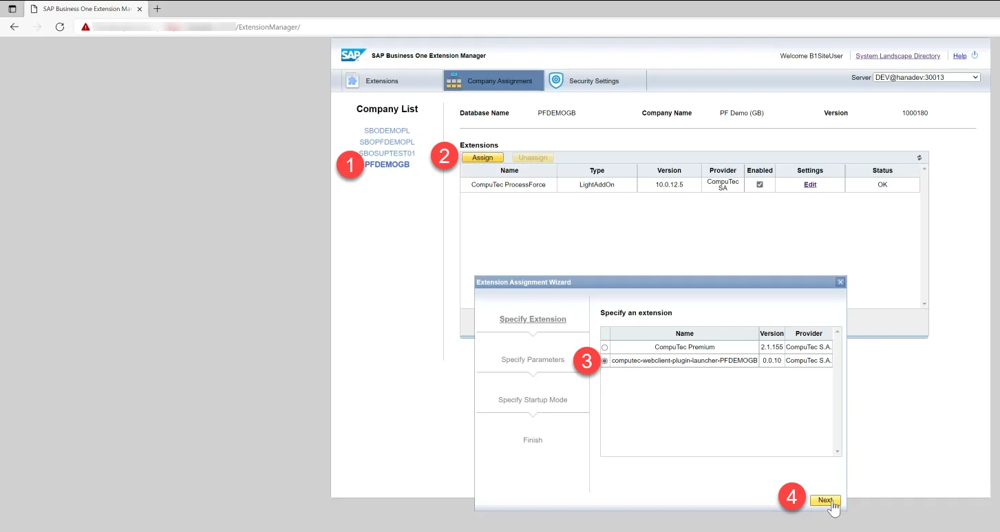
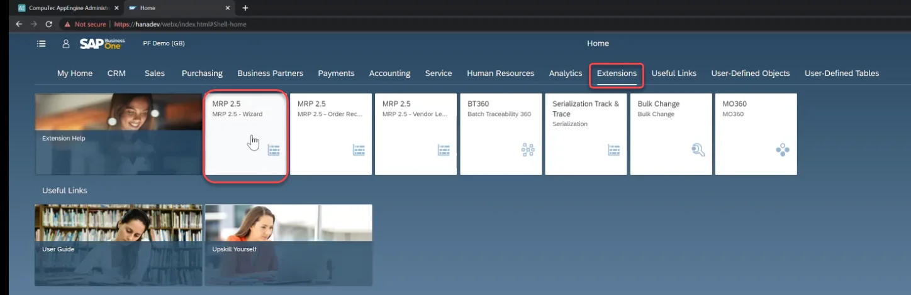
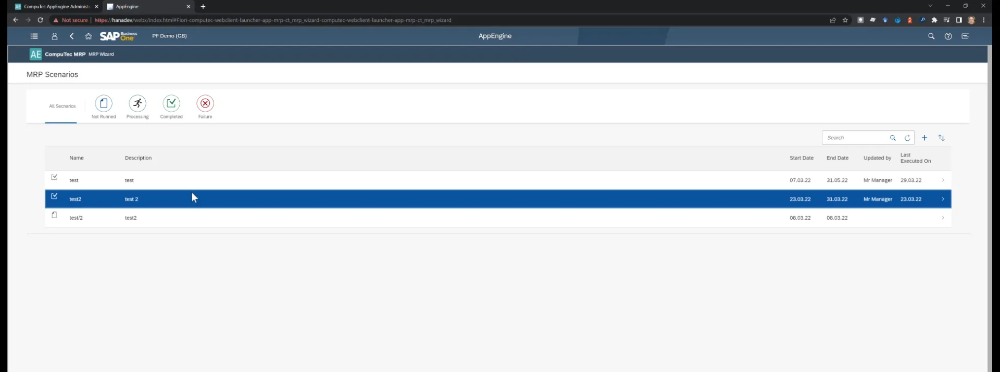

# Working with SAP Business One Web Client

Here, you can find information about configuration for using AppEngine plugins within SAP Business One Web Client.

---

## Configuration

### External Host Address

:::note
    Administration Panel → Settings → General → Hosting → HttpsPorts
:::

This address points from the Web Client to the AppEngine installation. It has to be an HTTPS address. By default, the address is set to localhost with the default port. If the address differs from the local host, it must be changed accordingly.

It is also required to point to the AppEngine installation from the Web client. This address is stored in an AppEngine configuration table in a database. For this address to be updated, it is required to activate a Company or deactivate and activate again if the AppEngine installation was upgraded to the 2.0.7.0 version (SLD Servers → Companies).

## Installation Package

### Download

First, you must download an installation package for all the plugins activated for a specific company. To do this, go to Administration Panel → Plugins and click the Download SAP WebClient Extension button in the window's upper-right corner. Now, choose a required company.

Clicking it causes an installer to download, in this example: computec_appengine_webclient_plugins_PFDEMOGB_PIOTRK_0_0_1.mtar.

### Upload

Use SAP Business One Extension Manager to load the installation package:

### SAP Business One Extension Manager

Choose one of the extensions:

Log in using SAP Business User ID. A plugin is now available in SAP Business One Web Client.

