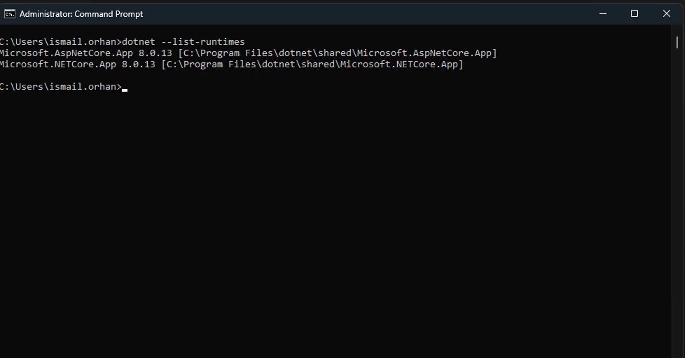
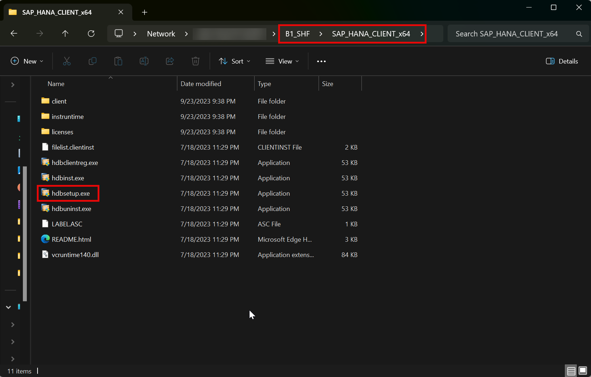

# Requirements

The CompuTec AppEngine is a robust solution designed to enhance your SAP Business One environment. To ensure a smooth installation and optimal performance, it is critical to meet specific system requirements and prerequisites. This guide provides an overview of the necessary components and preparatory steps before installing CompuTec AppEngine version 3.0.

:::note
    CompuTec AppEngine requires **.NET** to work correctly. The version of the .NET supported by CompuTec AppEngine is **8.0.4 or higher**.
:::

## Prerequisites

:::info Warning
If you are upgrading from **CompuTec AppEngine 2.0** to **CompuTec AppEngine 3.0**, ensure that you first uninstall AppEngine 2.0 and unassign the CompuTec ProcessForce extension from the Extension Manager for the company before continuing with the upgrade.
:::

### AppEngine Application Machine

| Resource/Application | Minimal Version | Note |
| --- | --- | --- |
| Memory (RAM) | 2 GB | You may need to adjust the RAM based on the number of plugins and background processes running. For production environments, we recommend a minimum of **8 GB**. |
| Disc Space | 1 GB | - |
| .NET Runtime | 8.0.13 | We recommend installing recent version of .NET 8. [Microsoft .NET 8 (Web Installer)](https://dotnet.microsoft.com/en-us/download/dotnet/8.0). |
| ASP.NET Runtime | 8.0.13 |We recommend installing recent version of .NET 8. [Microsoft .NET 8 (Web Installer)](https://dotnet.microsoft.com/en-us/download/dotnet/8.0) |
| HANA Server Version | SAP HANA Enterprise Edition 2.0 SPS 05, Revision 059.09 (minimum supported version: 2.17.22). | For SAP Business One version for HANA |
| SQL Server Version | SQL Server 2016 | For SAP Business One |
| Operating System | Windows 10 x64 | - |
| SAP Business One Version | SAP Business One 10.0 FP2408 |We recommend installing recent version.
| SAP Business One DI API | According to SAP Business One version x64 | - |
| CompuTec License Server |Recent version recommended | - |

### SAP Business One - Users Machines

CompuTec AppEngine requires .NET Runtime Applications as .NET platform is core of AppEngine. Install below runtime applications in client machine. Runtimes below might have been already installed in client machine by Windows Updates.

| Resource/Application | Minimal Version | Note |
| --- | --- | --- |
| .NET Runtime |8.0.13 | We recommend installing recent version of .NET 8. [Microsoft .NET 8 (Web Installer)](https://dotnet.microsoft.com/en-us/download/dotnet/8.0). |
| ASP.NET Runtime | 8.0.13 | We recommend installing recent version of .NET 8. [Microsoft .NET 8 (Web Installer)](https://dotnet.microsoft.com/en-us/download/dotnet/8.0). |
| Browser Application | - | Please see supported device and platform matrix maintained by SAP under UI5: [Visit Page](https://help.sap.com/docs/SAP_NETWEAVER_AS_ABAP_751_IP/468a97775123488ab3345a0c48cadd8f/74b59efa0eef48988d3b716bd0ecc933.html?utm_source=chatgpt.com#browser-and-platform-support-matrix) |

<details>
<summary>Click to see how to check .NET version</summary>
<div>
    1. Type in the following command in Command Prompt from Windows applications: ```dotnet --list-runtimes``` and click enter,

    2. The result will show the .NET Runtime version:

        

    We recommend that you install the latest version of .NET 8 – you can do it using the dedicated tool Windows Update or manually downloading the required files from the Microsoft site: [Microsoft .NET 8 (Web Installer)](https://dotnet.microsoft.com/en-us/download/dotnet/8.0).
</div>
</details>

:::note
    CompuTec AppEngine does not require a SAP Business One application client.
:::

:::caution
Before installing CompuTec AppEngine, ensure that the SAP Business One DI API 64-bit is installed on the client machine.
:::

## Working with SAP Business One on the HANA Database

- For proper database functionality, it is essential to run the hdbsetup.exe installation. This step ensures that databases are accessible within the application settings.

- Locate the required file in the b1_shf\SAP_HANA_CLIENT_x64 folder on the machine where SAP Business One is installed.

    

---
By following the outlined prerequisites and verifying system configurations, you can unlock the full potential of CompuTec AppEngine to enhance your operational workflows. For further assistance, consult our technical support.
