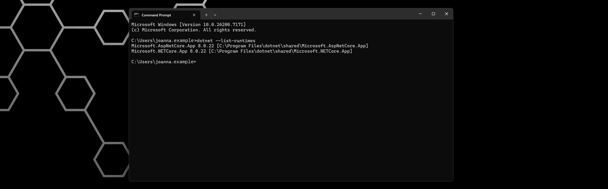
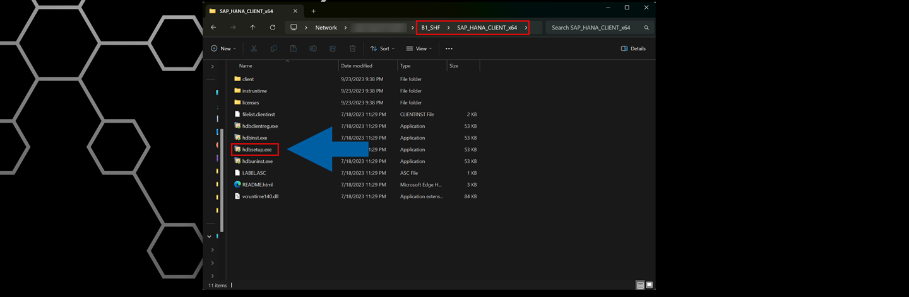

# System Requirements

**CompuTec AppEngine** is designed to extend and streamline your SAP Business One environment. To ensure the successful installation and reliable performance of your system, it must meet the requirements outlined below.
This section provides an overview of the components and preparatory steps needed before installing **CompuTec AppEngine 3.0**.

## Prerequisites

:::warning[important]
If you are upgrading from **CompuTec AppEngine 2.0** to **CompuTec AppEngine 3.0**, you must **uninstall CompuTec AppEngine 2.0** and **unassign the CompuTec ProcessForce extension** from the Extension Manager for the company **before** continuing with the upgrade.
:::

### CompuTec AppEngine - Application Machine

| Resource/Application | Minimal Version | Note |
| --- | --- | --- |
| Memory (RAM) | 2 GB | Adjust RAM as needed based on the number of plugins and background processes. For production use, we recommend **8 GB or more**. |
| Disk Space | 1 GB | - |
| .NET Runtime | 8.0.13 | We recommend installing the latest version of .NET 8. [Microsoft .NET 8 (Web Installer)](https://dotnet.microsoft.com/en-us/download/dotnet/8.0). |
| ASP.NET Runtime | 8.0.13 |We recommend installing the latest version of .NET 8. [Microsoft .NET 8 (Web Installer)](https://dotnet.microsoft.com/en-us/download/dotnet/8.0). |
| HANA Server Version | SAP HANA Enterprise Edition 2.0 SPS 05, Revision 059.09 (minimum supported version: 2.17.22). | SAP Business One, version for SAP HANA |
| SQL Server Version | SQL Server 2016 | SAP Business One |
| Operating System | Windows 10 x64 | - |
| SAP Business One Version | SAP Business One 10.0 FP2408 |We recommend installing the latest version. |
| SAP Business One DI API | Match the installed SAP Business One version (64-bit) | - |
| CompuTec License Server | Latest version recommended | - |

### SAP Business One - User Machine

CompuTec AppEngine needs **.NET Runtime Applications** as it relies on the **.NET platform**. These runtimes may already be present if they were installed through **Windows Update**, but verify that the required versions are available **before continuing**.

:::warning[important]
**Before** installing CompuTec AppEngine, ensure that the **SAP Business One DI API (64-bit)** is installed on the user's machine.  
:::

| Resource/Application | Minimal Version | Note |
| --- | --- | --- |
| .NET Runtime |8.0.13 | We recommend installing the latest version of .NET 8. [Microsoft .NET 8 (Web Installer)](https://dotnet.microsoft.com/en-us/download/dotnet/8.0). |
| ASP.NET Runtime | 8.0.13 | We recommend installing the latest version of .NET 8. [Microsoft .NET 8 (Web Installer)](https://dotnet.microsoft.com/en-us/download/dotnet/8.0). |
| Browser Application | - | Please see [supported device and platform matrix](https://help.sap.com/docs/SAP_NETWEAVER_AS_ABAP_751_IP/468a97775123488ab3345a0c48cadd8f/74b59efa0eef48988d3b716bd0ecc933.html?utm_source=chatgpt.com#browser-and-platform-support-matrix) maintained by SAP under UI5 |

See how to check **.NET Runtime version**.

    1. To check the installed .NET Runtime version, open **Command Prompt** on your computer.
    2. Enter: `dotnet --list-runtimes`, and press **Enter**.
    3. The result will show the **.NET Runtime version**.

        

    :::info[note]
    We recommend installing the **latest release of .NET 8**.  
    You can update .NET using Windows Update or by manually downloading the installer from the Microsoft website: Microsoft .NET 8 (Web Installer).  [Microsoft .NET 8 (Web Installer)](https://dotnet.microsoft.com/en-us/download/dotnet/8.0).
    :::

:::note[info]
CompuTec AppEngine **does not require** the SAP Business One desktop client to be installed on user machines.
:::

## Working with SAP Business One, version for SAP HANA

For correct database connectivity, you must run the **hdbsetup.exe** installer. This step ensures that SAP HANA database is accessible in the CompuTec AppEngine configuration.

You can find the installer in the **b1_shf\SAP_HANA_CLIENT_x64** folder on the machine where SAP Business One is installed.

    

:::note[info]
For technical issues or feature requests, contact the [**CompuTec Helpdesk Portal**](https://support.computec.pl/servicedesk/customer/portals?q=webUp).
:::
