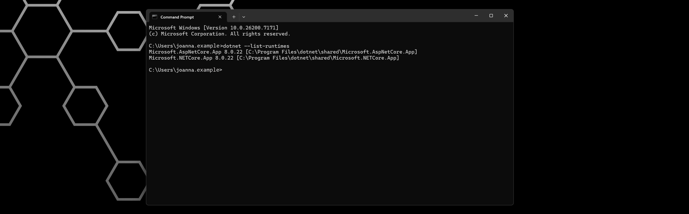
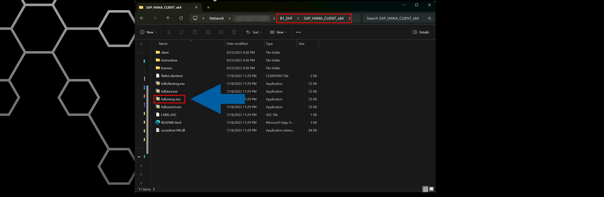

# System Requirements

This article describes the system, software, and database requirements for installing and running CompuTec AppEngine 3.0.

Review these requirements before installing or upgrading CompuTec AppEngine.

:::warning[important]
If you are upgrading from **CompuTec AppEngine 2.0** to **CompuTec AppEngine 3.0**:

1. Uninstall **CompuTec AppEngine 2.0**.
2. Unassign the **CompuTec ProcessForce** extension from the **Extension Manager** for the company.
3. Continue with the **CompuTec AppEngine 3.0** installation.

**CompuTec AppEngine 3.0** does not support **PowerShell** for data imports or other customizations. Replace or adapt any existing PowerShell-based solutions before upgrading to **CompuTec AppEngine 3.0**.
:::

## CompuTec AppEngine server requirements

The machine where **CompuTec AppEngine** is installed must meet the following requirements.

| Resource/Application | Minimum version | Note |
| --- | --- | --- |
| Memory (RAM) | 2 GB | Adjust RAM as needed based on the number of plugins and background processes. For production use, we recommend **8 GB or more**. |
| Disk Space | 1 GB | - |
| .NET Runtime | 8.0.13 | We recommend installing the latest version of .NET 8. [Microsoft .NET 8 (Web Installer)](https://dotnet.microsoft.com/en-us/download/dotnet/8.0). |
| ASP.NET Runtime | 8.0.13 | We recommend installing the latest version of .NET 8. [Microsoft .NET 8 (Web Installer)](https://dotnet.microsoft.com/en-us/download/dotnet/8.0). |
| HANA Server Version | SAP HANA Enterprise Edition 2.0 SPS 05, Revision 059.09 (minimum supported version: 2.17.22). | SAP Business One, version for SAP HANA |
| SQL Server Version | SQL Server 2016 | SAP Business One |
| Operating System | Windows 10 x64 | - |
| SAP Business One Version | SAP Business One 10.0 FP2408 | We recommend installing the latest version. |
| SAP Business One DI API | Match the installed SAP Business One version (64-bit) | - |
| CompuTec License Server | Latest version recommended | - |

## SAP Business One client requirements

CompuTec AppEngine relies on the **.NET platform**. Verify that the required **.NET runtimes** are installed before continuing.

The required runtimes may already be available if they were installed through **Windows Update**.

:::warning[important]

**Before installing CompuTec AppEngine**, ensure that **SAP Business One DI API (64-bit)** is installed and that its version matches the installed **SAP Business One** version.
:::

| Resource/Application | Minimum version | Note |
| --- | --- | --- |
| .NET Runtime | 8.0.13 | We recommend installing the latest version of .NET 8. [Microsoft .NET 8 (Web Installer)](https://dotnet.microsoft.com/en-us/download/dotnet/8.0). |
| ASP.NET Runtime | 8.0.13 | We recommend installing the latest version of .NET 8. [Microsoft .NET 8 (Web Installer)](https://dotnet.microsoft.com/en-us/download/dotnet/8.0). |
| Browser Application | - | Please see [supported device and platform matrix](https://help.sap.com/docs/SAP_NETWEAVER_AS_ABAP_751_IP/468a97775123488ab3345a0c48cadd8f/74b59efa0eef48988d3b716bd0ecc933.html#browser-and-platform-support-matrix) maintained by SAP under UI5 |

<details>
<summary>See how to check **.NET Runtime version**</summary>
<div>
    1. Open **Command Prompt** on your computer.
    2. Enter: `dotnet --list-runtimes`, and press **Enter**.
    3. The result will show the **.NET Runtime version**.

        

    :::info[note]
    We recommend installing the **latest release of .NET 8**.  
    You can update **.NET** using **Windows Update** or by manually downloading the installer from the Microsoft website: [**Microsoft .NET 8 (Web Installer)**](https://dotnet.microsoft.com/en-us/download/dotnet/8.0).
    :::
</div>
</details>

:::note[info]
CompuTec AppEngine **does not require** the **SAP Business One Desktop Client** to be installed on user machines.
:::

## Database requirements

CompuTec AppEngine requires database access for its application database, CTAPPDATA, and for each SAP Business One company database activated in CompuTec AppEngine.

Using the Microsoft SQL Server sa account or the SAP HANA SYSTEM user is not required. You can use dedicated database users instead, provided they have the permissions described in this section.

CompuTec AppEngine uses two separate types of database credentials:

- **CTAPPDATA database user** – configured during the CompuTec AppEngine configuration process and used only for the CTAPPDATA application database.
- **Company database user** – assigned during company activation or configured as the default database credentials for a database server. This account is used for direct SQL access to the SAP Business One company database.

These accounts have different permission requirements.

:::warning[important]

**CompuTec AppEngine** verifies that a connection can be established with the provided database credentials, but it does not verify all required database privileges when you enter them.

If a **database user does not have sufficient permissions**, an error can occur later during database creation, migration, company activation, an upgrade, or normal operation.

Some database definition language (DDL) permissions are required during upgrades and normal operation, not only during the initial installation. **Do not remove the permissions described in this section after installation**.
:::

### Database permission summary

The following table summarizes the permissions required when using dedicated database users.

| Account | Microsoft SQL Server | SAP HANA |
| --- | --- | --- |
| **CTAPPDATA user – CompuTec AppEngine creates the database/schema** | `dbcreator` server role | `CREATE SCHEMA` system privilege |
| **CTAPPDATA user – database/schema created in advance** | `db_owner` on `CTAPPDATA` | Schema owner, or `CREATE ANY`, `SELECT`, `INSERT`, `UPDATE`, `DELETE`, `ALTER`, `DROP`, and `INDEX` on the schema |
| **Company database user** | Recommended: `db_owner` on the company database. Minimum: `db_datareader` + `db_datawriter` + `db_ddladmin` + `EXECUTE` on `dbo` | Schema owner, or `SELECT`, `INSERT`, `UPDATE`, `DELETE`, `EXECUTE`, `CREATE ANY`, `DROP`, `ALTER`, and `INDEX` on the company schema, plus required system catalog read access |

### CTAPPDATA database user

The CTAPPDATA database user is entered during the CompuTec AppEngine configuration process.

CompuTec AppEngine uses this account only for the CTAPPDATA application database. It is not used to access SBO-COMMON or SAP Business One company databases.

The required permissions depend on whether CompuTec AppEngine creates CTAPPDATA or a database administrator creates it in advance.

#### Microsoft SQL Server

##### When CompuTec AppEngine creates CTAPPDATA

The database user requires:

- Membership in the ``dbcreator`` server role.
- Permission to connect to the user's default database. Access to ``master``, which is normally the default database, is sufficient.

During database creation, CompuTec AppEngine creates the CTAPPDATA database. The user that creates the database becomes its owner, providing the permissions required for subsequent database migrations and normal operation.

##### When CTAPPDATA is created in advance

If a database administrator creates `CTAPPDATA` before configuring CompuTec AppEngine, assign the following permission to the database user:

- ``db_owner`` on ``CTAPPDATA``.

The ``db_owner`` role is the supported configuration because CompuTec AppEngine migrations perform database schema changes in addition to reading and writing data.

#### SAP HANA

##### When CompuTec AppEngine creates the CTAPPDATA schema

The database user requires the following system privilege:

- `CREATE SCHEMA`

CompuTec AppEngine creates the `CTAPPDATA` schema using this account. The user becomes the schema owner, providing the permissions required for subsequent migrations and normal operation.

##### When the CTAPPDATA schema is created in advance

If a database administrator creates the `CTAPPDATA` schema before configuring CompuTec AppEngine, the database user must be the schema owner or have the following privileges on the schema:

- ``CREATE ANY``
- ``SELECT``
- ``INSERT``
- ``UPDATE``
- ``DELETE``
- ``ALTER``
- ``DROP``
- ``INDEX``

The user also requires read access to the system catalog information used by CompuTec AppEngine, including ``SYS.TABLES`` and ``M_TABLES``.

In a default SAP HANA installation, the required catalog access is available through the ``PUBLIC`` role. If access through ``PUBLIC`` is restricted in your environment, grant the required catalog access explicitly.

### Company database user

The company database user is configured when database credentials are assigned to a company. You can also configure default database credentials for a database server.

CompuTec AppEngine uses this account for direct SQL operations against the SAP Business One company database.

These credentials are separate from the SAP Business One and SLD credentials used for connections through interfaces such as the DI API and Service Layer.

The company database user requires permissions to:

- Read and update data.
- Execute SAP Business One and CompuTec database procedures.
- Create, modify, and remove required database objects.
- Read required database catalog information.

Some database definition language (DDL) operations are performed during normal operation, not only during installation. Therefore, the required DDL permissions must remain assigned to the database user.

#### Microsoft SQL Server

The recommended configuration is:

- `db_owner` on the SAP Business One company database.

If your database security policy requires a more restricted user, the minimum permission set is:

- `db_datareader`
- `db_datawriter`
- `db_ddladmin`
- `EXECUTE` on the `dbo` schema

Grant `EXECUTE` on the `dbo` schema, for example:

```sql
GRANT EXECUTE ON SCHEMA::dbo TO [<AE_DB_USER>];
```

These permissions allow **CompuTec AppEngine** to read and update required data, create and remove database objects, and execute the required **SAP Business One** and **CompuTec** stored procedures.

No server-level permissions are required for the company database user.

#### SAP HANA

The recommended configuration is for the database user to be the **owner of the SAP Business One company schema**.

If the user is not the schema owner, grant the following privileges on the company schema:

```sql
GRANT SELECT, INSERT, UPDATE, DELETE, EXECUTE,
      CREATE ANY, DROP, ALTER, INDEX
  ON SCHEMA "<COMPANY_SCHEMA>" TO <AE_DB_USER>;
```

Replace:

- `<COMPANY_SCHEMA>` with the SAP Business One company schema.
- `<AE_DB_USER>` with the database user used by CompuTec AppEngine.

The user also requires read access to the following system catalog objects:

- `SYS.TABLES`
- `SYS.OBJECTS`
- `SYS.PROCEDURE_PARAMETERS`
- `SYS.M_DATABASE`
- `PUBLIC.M_TABLES`
- `PUBLIC.M_TEMPORARY_TABLES`

In a default SAP HANA installation, the required catalog access is normally available through the `PUBLIC` role.

If your environment restricts access through `PUBLIC`, grant the required access explicitly.

No additional system privileges are required for the company database user beyond the ability to connect.

:::info[Recommendations]

For environments where the use of administrative database accounts such as **Microsoft SQL Server** `sa` or **SAP HANA** `SYSTEM` is restricted, create dedicated database users for **CompuTec AppEngine**.

Use separate credentials according to their purpose:

- Configure the **CTAPPDATA database user** with the permissions required to create and maintain ``CTAPPDATA``.
- Configure the **company database user** with the permissions required for the **SAP Business One** company database.

## Working with SAP Business One, version for SAP HANA

For correct database connectivity, you must run the **hdbsetup.exe** installer. This step ensures that **SAP HANA** database is accessible in the **CompuTec AppEngine** configuration.

You can find the installer in the **b1_shf\SAP_HANA_CLIENT_x64** folder on the machine where SAP Business One is installed.

    

:::note[info]
For technical issues or feature requests, contact the [CompuTec Support Portal](https://support.computec.pl/servicedesk/customer/portals?q=webUp).
:::
