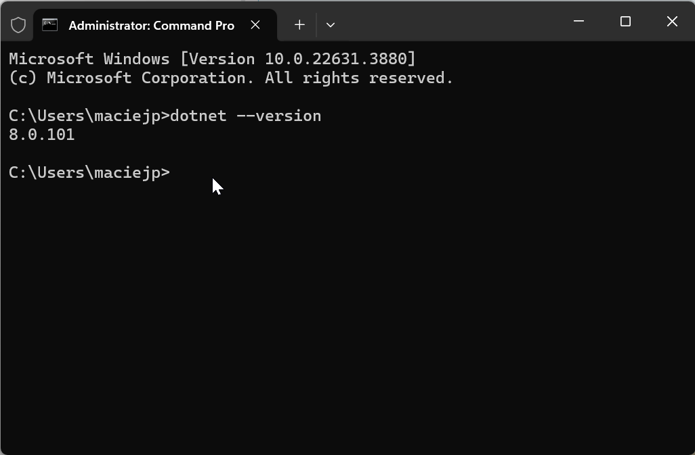

# Requirements

The CompuTec AppEngine is a robust solution designed to enhance your SAP Business One environment. To ensure a smooth installation and optimal performance, it is critical to meet specific system requirements and prerequisites. This guide provides an overview of the necessary components and preparatory steps before installing CompuTec AppEngine version 3.0.

:::note
    CompuTec AppEngine requires **.NET** to work correctly. The version of the .NET supported by AppEngine is **8.0.4 or higher**.
:::

## Prerequisites

### For AppEngine

- **ASP.NET Core Runtime** - Minimum required version: 8.0.4.
- **Database** - If using SAP HANA, ensure that your HANA version is at least HANA Enterprise Edition 2.0 SPS 05, Revision 059.09 (minimal version - 2.17.22).
- **Operating System** - A Windows x64 machine is required.
- **SAP Business One** - The minimal required version is SAP Business One 10.0 FP 2408 and the minimal recommended is SAP Business One 10.0 FP 2502.
- **SAP Business One DI API** - Ensure SAP Business One DI API is installed and properly configured.
- **Supported Database Server** - SQL Server 2012 and higher.
- **CompuTec License Server** - Verify that the CompuTec License Server is installed and accessible.

### Sap Business One - Users Machines

- **.NET Runtime** - the minimum required version is 8.0.4.

<details>
<summary>Click to see how to check .NET version</summary>
<div>
    1. Type in the following command in Command Prompt from Windows applications:
    ```dotnet --version```,
        and click enter.

    2. The result will show the .NET version:

        

    We recommend that you install the latest version of .NET – you can do it using the dedicated tool Windows Update or manually downloading the required files from the Microsoft site: [Microsoft .NET 8.7 (Web Installer)](https://dotnet.microsoft.com/en-us/download).
</div>
</details>

:::note
    CompuTec AppEngine does not require a SAP Business One application client.
:::

:::caution
Before installing CompuTec AppEngine, ensure that the SAP Business One DI API 64-bit is installed on the client machine.
:::

## Working with SAP Business One on the HANA Database

- For proper database functionality, it is essential to run the hdbsetup.exe installation. This step ensures that databases are accessible within the application settings.

- Locate the required file in the b1_shf\SAP_HANA_CLIENT_x64 folder on the machine where SAP Business One is installed.

    

---
By following the outlined prerequisites and verifying system configurations, you can unlock the full potential of CompuTec AppEngine to enhance your operational workflows. For further assistance, consult our technical support.
