# Setting Up Telemetry with Grafana

Telemetry helps you monitor system behavior and identify issues in **CompuTec AppEngine** and **SAP Business One**. This guide explains how to connect your environment to **Grafana Cloud** and view logs, traces, and metrics.

## Configure Grafana

To configure **Grafana**, follow these steps:

1. Visit [**Grafana** website](https://grafana.com/) and create an account.
2. After logging in to **Grafana**, create a new **Stack**.

    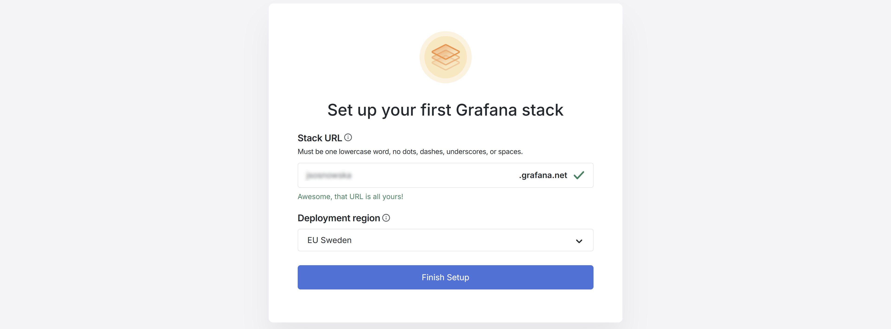

3. Go to **Administration** > **Users and access** > **Service accounts**.

    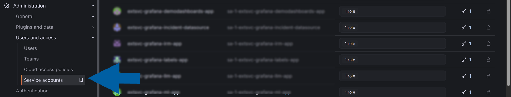

4. Click **Add service account**.

    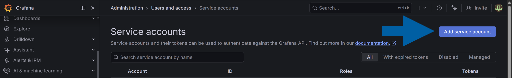

5. Give it a **name** and set a **role**, for example, ``Viewer``, ``Editor``, or ``Admin``.

    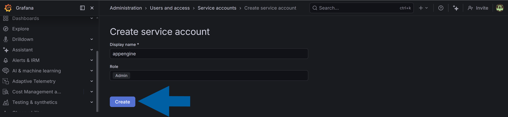

6. Click **Add service account token**.

    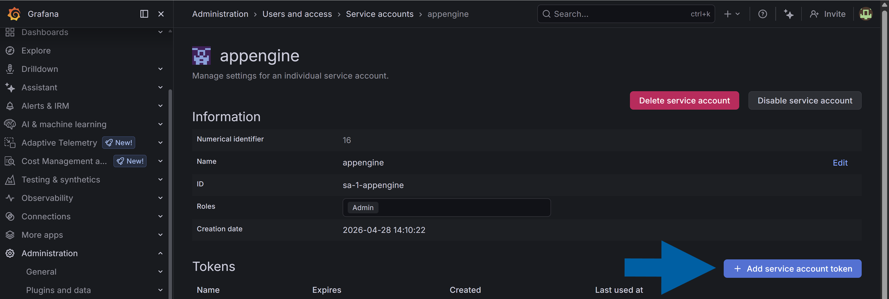

7. Name the token, set an **expiry** (or **no expiry**), and click **Generate token**.

    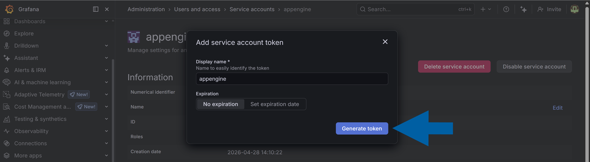

8. Copy the token immediately, because it won't be shown again.

    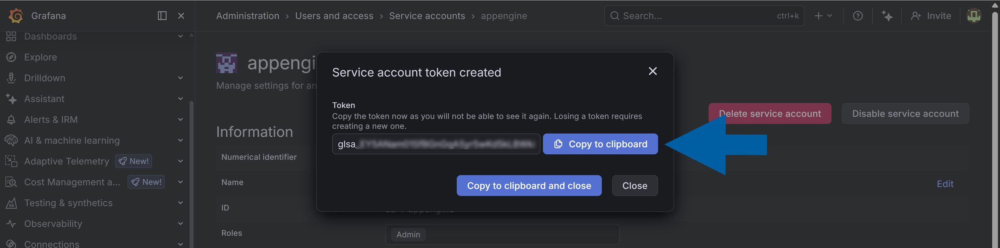

9. In **CompuTec AppEngine Administration Panel**, navigate to **System** > **Telemetry Profiles**.

10. Create a new profile by cloning the predefined `OpenTelemetry_All`

    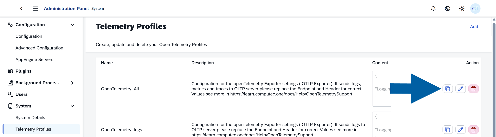

11. Fill the ``Endpoint`` and ``Authorization Header`` by copying the details from your **Grafana** account.

    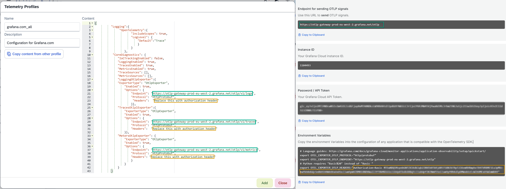

12. Click **Add** to save the profile.
13. Done! Now you can see this profile on the list in **CompuTec AppEngine Administration Panel** > **System** > **Telemetry Profiles**.

## Assigining the Profiles to CompuTec AppEngine

To assign a profile to the CompuTec AppEngine instance:

1. Navigate to **CompuTec AppEngine Administration Panel** > **Configuration** > **AppEngine Servers**.

    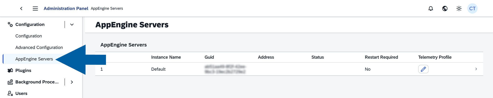

2. Assign the profile to the relevant **CompuTec AppEngine** instance.

    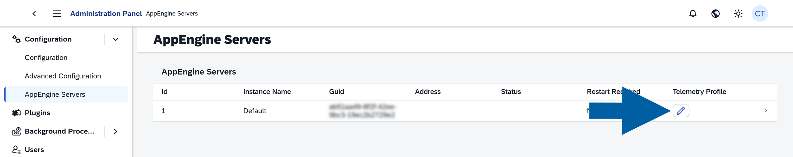

3. Restart the **CompuTec AppEngine Service** to apply the changes.

## Assigning the Profiles to SAP Business One

To assign the profile to the Company:

1. Go to CompuTec AppEngine Administration and select the active company.
2. Assign profiles:
    - To all users in the company
    - Or to specific users needing tailored configurations
3. To assign the default profile, just specify the profile in the company details.

    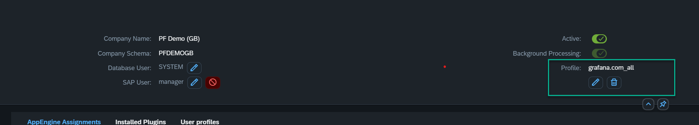
4. To assign the profile for specific company, please select User profiles section and fill the necessary information:

    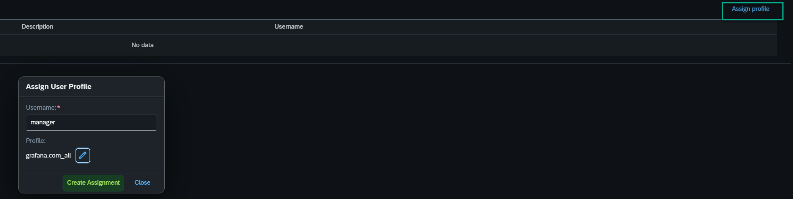

The changes will take effect after restarting Sap Business One.

## Viewing the Profiles and Logs

1. Clock launch in your stack
2. Explore the telemetry by clicking the explore chose the exploration in the combo box ( yellow arrow)

    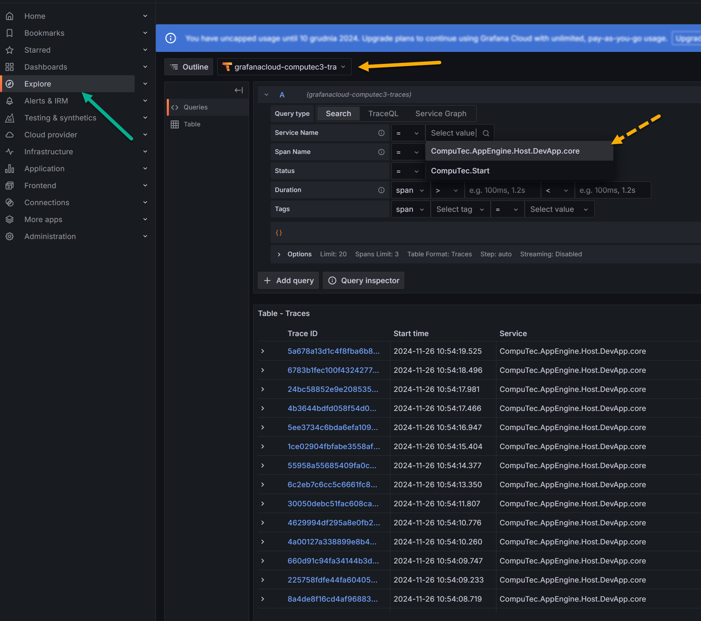

Choose an exploration method from:

- **Traces** - View time-based traces
- **Logs**- Inspect logs
- **Prometheus** - Analyze metrics

**Service Name** - Under the Resource section, locate and input the User Name and Database Id to ensure accurate telemetry tracking.
    - Computec.AppEngine.Host – CompuTec AppEngine Service.
    - Computec.Start – SAP Business One Plugin Activity.

---
