# OpenTelemetry Configuration

**OpenTelemetry** lets you monitor system behavior and troubleshoot issues in **CompuTec AppEngine** and **SAP Business One**.  

This guide explains how to connect your environment to a telemetry backend (such as **Grafana Cloud**) using an **OpenTelemetry** profile, and how to view logs, traces, and metrics.

## Configure OpenTelemetry Profile

To configure **OpenTelemetry** in **OpenTelemetry-compatible backend**, for example, **Grafana Cloud**, follow these steps:

1. Visit [**Grafana** website](https://grafana.com/) and create an account.
2. After logging in, create a new **Stack**.

    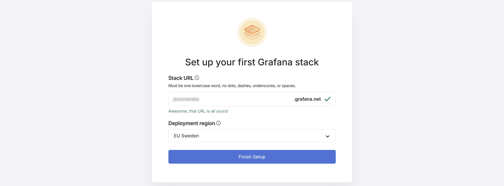

3. Go to **My account**.

    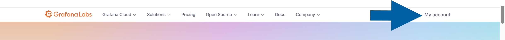

4. Click your **stack name** to manage it.

    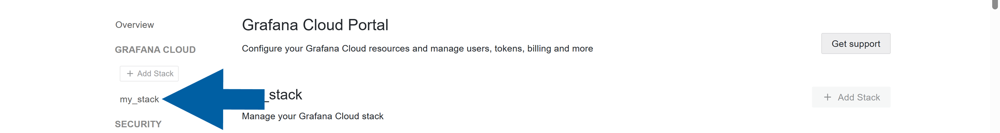

5. Find **OpenTelemetry** integration and click **Configure**.

    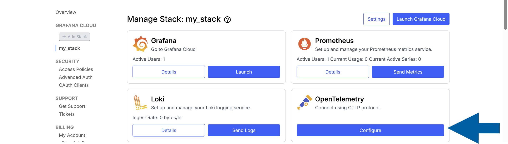

6. In **Password / API Token**, click **Generate now**.

    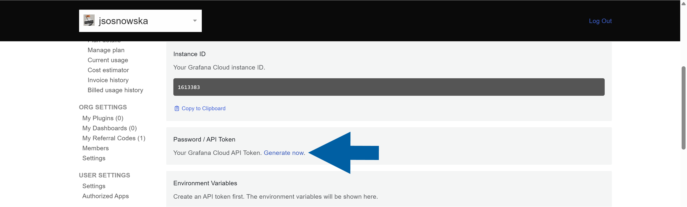

7. Name the token, set an **expiry** (or **no expiry**), and click **Create token**.

    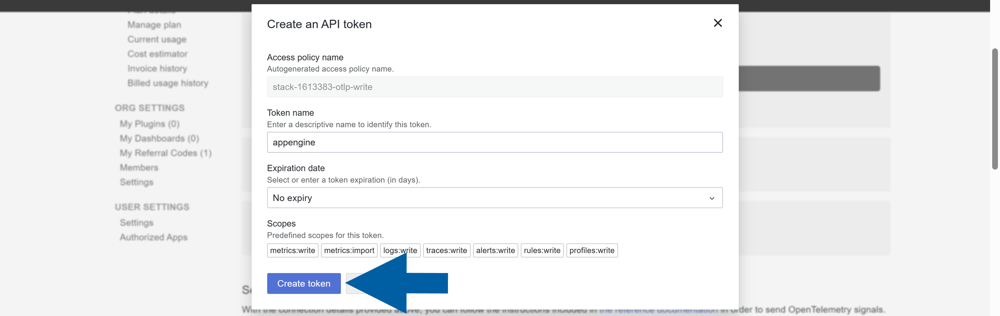

8. In **CompuTec AppEngine Administration Panel**, navigate to **System** > **Telemetry Profiles**.

    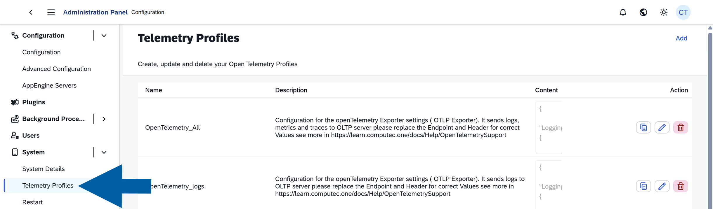

9. Create a new profile by clicking the **copy icon** next to the predefined **OpenTelemetry_All** profile.

    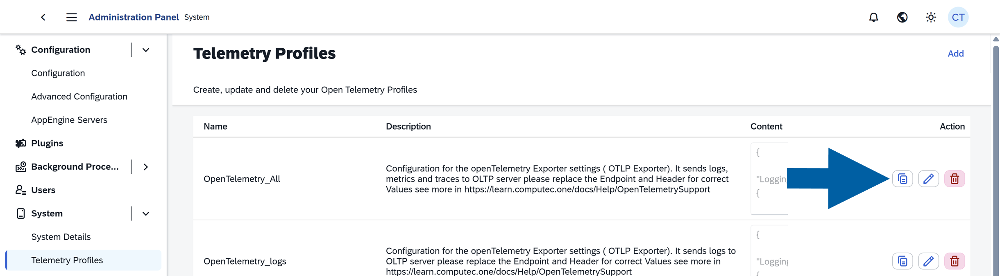

10. Copy **Endpoint for sending OLTP signals** from **Grafana.com**.

    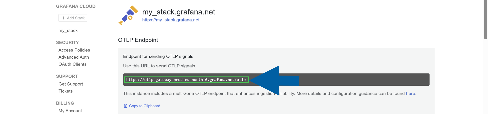

11. Paste it to all ``Endpoint`` fields in your new **CompuTec AppEngine Open Telemetry** profile.

    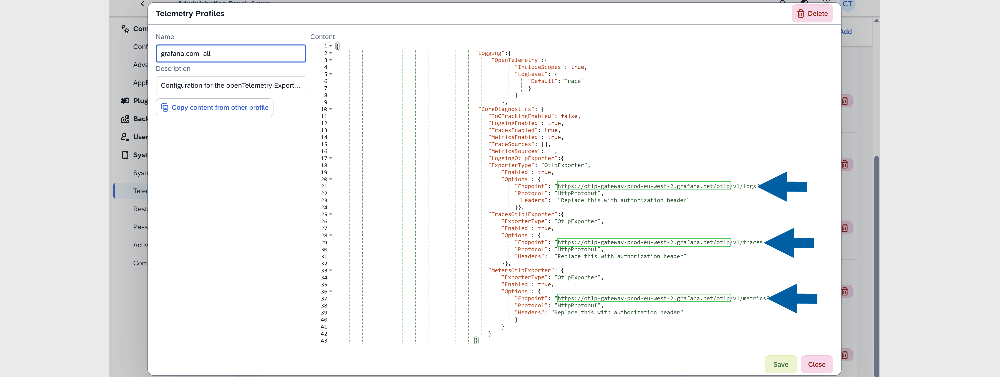

    :::warning[important]
    When replacing the **OpenTelemetry** endpoint, replace only the URL up to and including ``/otlp``. Keep the endpoint suffix for each telemetry type:

    - ``/v1/logs`` for logs
    - ``/v1/traces`` for traces
    - ``/v1/metrics`` for metrics

    For example, if your **OpenTelemetry** endpoint is ``https://example.com/otlp``, use ``https://example.com/otlp/v1/logs``, ``https://example.com/otlp/v1/traces``, and ``https://example.com/otlp/v1/metrics`` in the corresponding configuration entries.
    :::

12. Copy **Environmental Variable OTLP Header** from **Grafana.com**.

    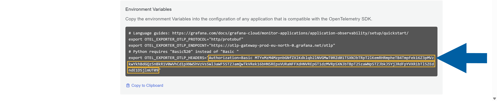

13. Paste it to all ``Headers`` in your new **CompuTec AppEngine Open Telemetry** profile.

    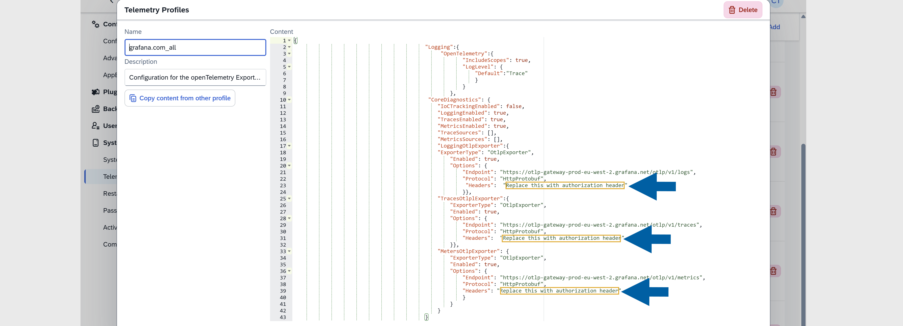

14. In **CompuTec AppEngine Administration Panel**, click **Save**.

    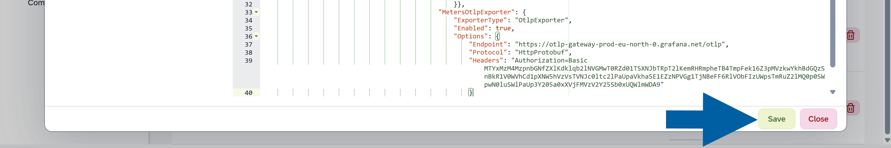

15. Done! Now you can see this profile on the list in **CompuTec AppEngine Administration Panel** > **System** > **Telemetry Profiles**.

## Assign OpenTelemetry Profile to CompuTec AppEngine

To assign a profile to the **CompuTec AppEngine instance**, follow these steps:

1. Navigate to **CompuTec AppEngine Administration Panel** > **Configuration** > **AppEngine Servers**.

    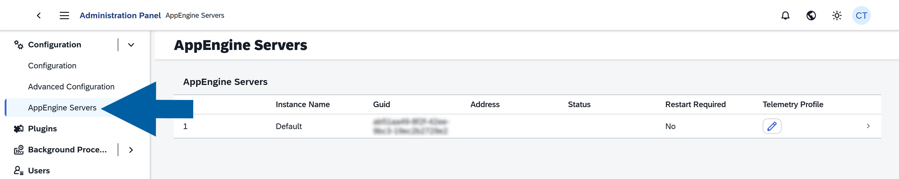

2. Clcik the **edit icon** next to the chosen **CompuTec AppEngine** instance.

    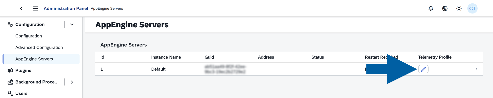

3. Click the **OpenTelemetry profile** you want to assign.

    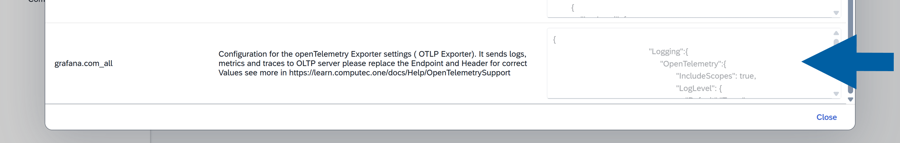

4. Now you can see the **OpenTelemetry profile name** in the list.

    

5. Restart the **CompuTec AppEngine Service** to apply the changes.

## Assign the OpenTelemetry Profile to SAP Business One

To assign the **OpenTelemetry** profile to the **Computec AppEngine company**, follow these steps:

1. Go to **CompuTec AppEngine Administration Panel** > **Configuration**.

    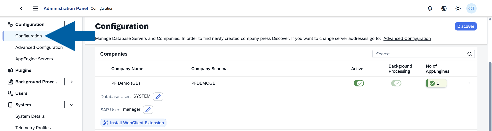

2. Choose the **company name** from the list to see its details.

    

    :::info[note]
    You can assign **OpenTelemetry Profiles**:
    - To all users in the company
    - To specific users needing tailored configurations
    :::

3. To assign the default profile to all users in the company, choose the **company name** from the list to see its details.

    

4. Click the **edit icon** next to **Telemetry Profile**.

    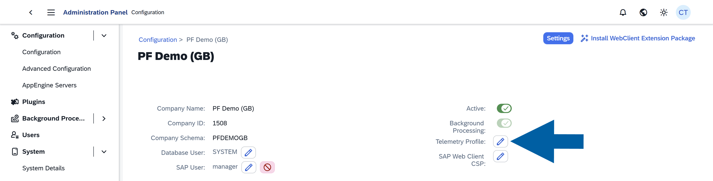

5. Choose the **OpenTelemetry profile** from the list.

    

6. Done! Now you can see the **Telemetry Profile** name assigned to your company.

    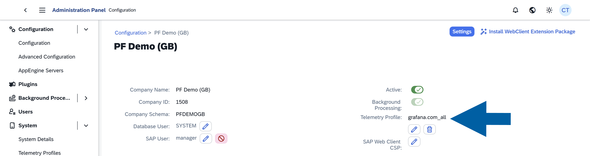

7. To assign the profile for a specific user, navigate to **Telemetry Profiles** in your company details.

    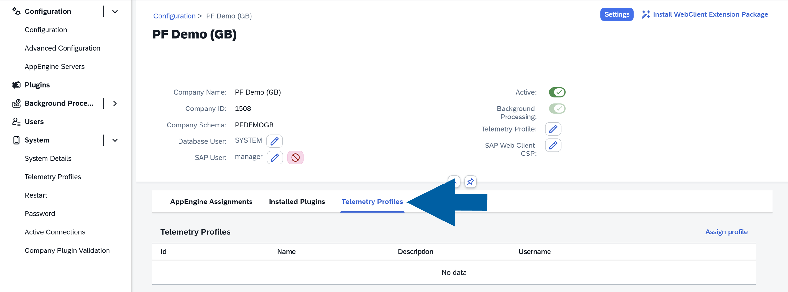

8. Click **Assign profile**.

    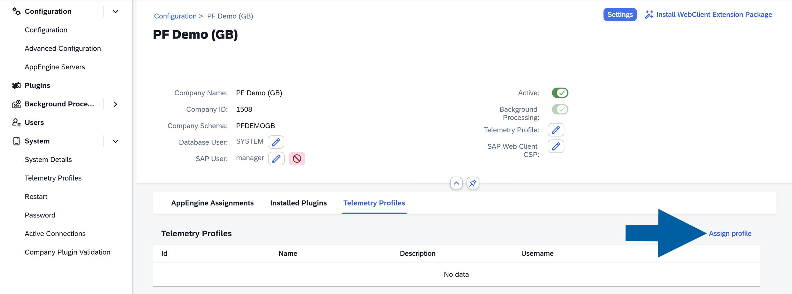

9. Type the **user name**, click the **edit icon** to assign the chosen **Telemetry Profile**, and click **Create Assignment**.

    

10. Restart **Sap Business One** to see the changes.

## Explore the OpenTelemetry Profiles and Logs

1. In Grafana, click **Launch Grafana Cloud**.

    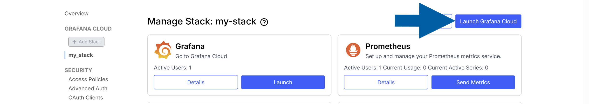

2. Navigate to **Explore**.

    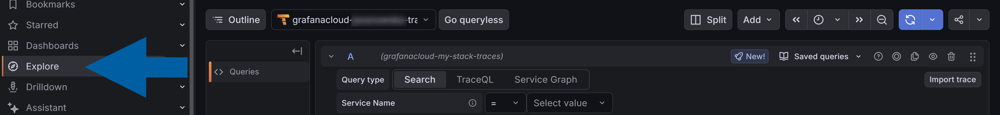

3. Choose the **exploration method** from the list:

    - ``traces``: View time-based traces
    - ``logs``: Inspect logs
    - ``prom``: Analyze metrics

    

4. When viewing traces, use **Service Name** to filter the results by service.  
    Available service names depend on your environment and configuration.

    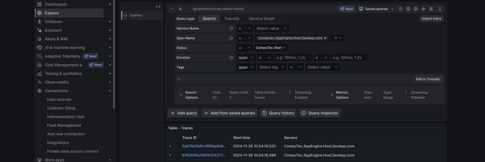

:::note[info]
To further narrow the results by **User Name** or **Database ID**, use the **Tags** filter. Select resource, then select the required attribute and value.
:::

## Export log data from Grafana

You can export log data from Grafana when needed, for example, for further analysis or troubleshooting.

:::note[info]
For instructions, see the [Grafana documentation](https://grafana.com/docs/grafana/latest/visualizations/explore/logs-integration/#download-log-lines).
:::
