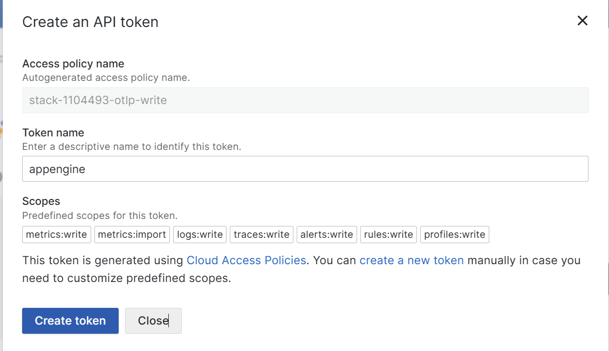
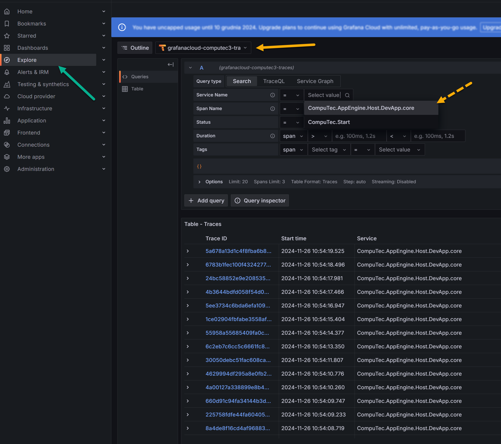

# Setting Up Telemetry with Grafana.com

Telemetry is vital for monitoring and analyzing the performance of your systems, ensuring they operate optimally. By leveraging Grafana's robust tools, you can streamline monitoring and gain valuable insights into your CompuTec AppEngine and SAP Business One environments. This guide walks you through setting up telemetry with Grafana, configuring profiles, and viewing logs and metrics.

---

## Steps to Setup Telemetry using grafana.com

1. Visit [grafana.com](https://grafana.com/) and create an account.
2. After logging in, create a Stack within Grafana.

    

3. Generate an API Token under the credentials section of your stack.

    

4. Create profile in CompuTec AppEngine by cloning the predefined `OpenTelemetry_All`

    

5. Fill the Endpoint and Authorization Header by copying the details from your Grafana account.

    

6. Save the profile. This profile now can be specified in CompuTec AppEngine Configuration.

## Assigining the Profiles to CompuTec AppEngine

To assign a profile to the CompuTec AppEngine instance:

1. Navigate to CompuTec AppEngine Administration > Configuration > AppEngine Servers.
2. Assign the profile to the relevant CompuTec AppEngine instance.

    

3. Restart the CompuTec AppEngine Service to apply the changes.

## Assigning the Profiles to SAP Business One

To assign the profile to the Company:

1. Go to CompuTec AppEngine Administration and select the active company.
2. Assign profiles:
    - To all users in the company
    - Or to specific users needing tailored configurations
3. To assign the default profile, just specify the profile in the company details.

    
4. To assign the profile for specific company, please select User profiles section and fill the necessary information:

    

The changes will take effect after restarting Sap Business One.

## Viewing the Profiles and Logs

1. Clock launch in your stack
2. Explore the telemetry by clicking the explore chose the exploration in the combo box ( yellow arrow)

    

Choose an exploration method from:

- **Traces** - View time-based traces
- **Logs**- Inspect logs
- **Prometheus** - Analyze metrics

**Service Name** - Under the Resource section, locate and input the User Name and Database Id to ensure accurate telemetry tracking.
    - Computec.AppEngine.Host – CompuTec AppEngine Service.
    - Computec.Start – SAP Business One Plugin Activity.

---
