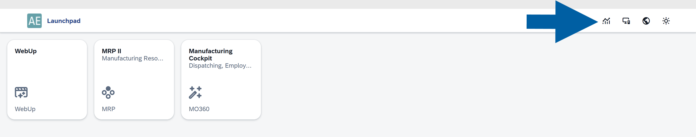
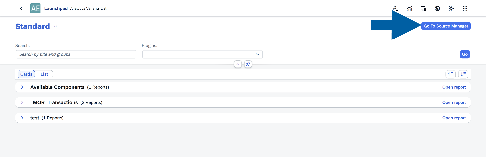
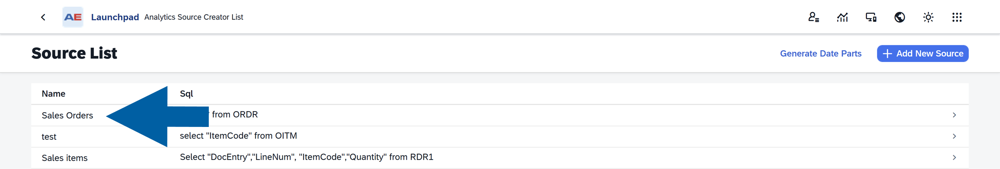
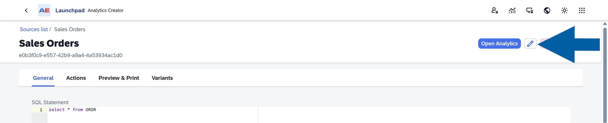
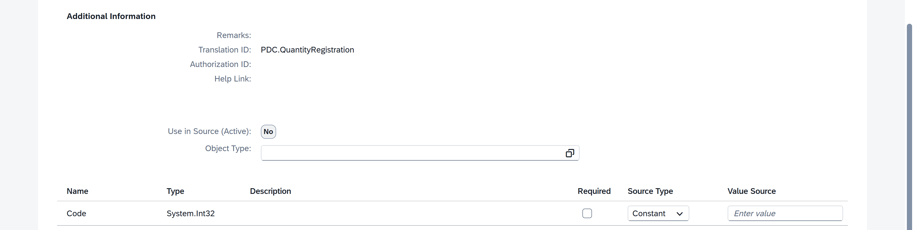

# Actions in Analytics

**Actions** allow users to perform business operations directly from selected rows in **CompuTec AppEngine Analytics** report.  

When users select one or more rows in a table, **CompuTec AppEngine** automatically displays the **Actions** available for that data. For example, users can release a production order, post a document, or run a custom plugin action without leaving the report.  

**Actions** are available only when they are enabled for both the **Source** and the **Variant**.

:::note[FOR DEVELOPERS]
Plugin developers can create custom **CompuTec AppEngine Actions** that become available automatically in **Source** configuration after the plugin is installed. [Read more](/docs/appengine/developers-guide/basic-and-business-logic/appengine-plugin/ae-actions)
:::

## How actions work in Analytics

**Actions** in **CompuTec AppEngine Analytics** are configured on two levels:

1. **Source**: defines which actions are available and how report values are mapped to action parameters
2. **Variant**: defines which actions are visible

Users then execute these configured actions directly from the report. This separation allows you to reuse the same action across multiple report variants while controlling how it appears in each one.

For example:

- In a **Production** variant, you can show the **Release Production Order** action.
- In a **Warehouse** variant, you can hide that action and show only warehouse-related actions.
- In a **Manager** variant, you can rename actions to use more business-friendly labels.

::info[note]
An action must be enabled in a source before it can be configured in a variant.

Variants can't create actions. They can only control the visibility of actions that were previously configured in the source.
:::

## Configure actions in a source

To configure an action in a source:

1. Open **CompuTec AppEngine Launchpad**.

    

2. Go to **Analytics**.

    

3. Navigate to **Source Manager**.

    

4. Click the **source** you want to edit, for example, **Sales Orders**.

    

5. Click the **edit icon**.

    

6. Open the **Actions** tab.

    

7. Select **action** you want to activate.

    

8. In the **Additional Information** section, define how the action receives values from the report:

    - (optional) **Object Type**: Defines how the action should behave depending on the object it is applied to.  
    Example: If an action can work with both the **Sales Orders** and **Manufacturing Orders** object types, you can specify the rules for the selected object type.
    - **Required**: If enabled, the action will not be executed when the mapped value is empty.
    - **Source Type**: Choose how the value will be provided:
        - **Constant**: A fixed value defined manually
        - **Field**: A value taken from a column in the report
    - **Value Source**: Select the column from the report that should be mapped to the action parameter.

    

9. Click **Use in Source** to apply the mapping.

    

10. Click **Update**.

    

11. The action is now activated and available in the report.

## Map action parameters

Actions require some information to know which data should be used when the action is executed, for example, the document's internal number ``DocEntry`` or its unique code ``Code``. These values are called parameters.

For each parameter, you can define where the value should come from.

Available **Source Types** include:

- **Constant** value
- **Field** value

### Constant value

Use **Constant** value when the action should always receive the same value.

    ![Action parameter mapping table showing Object Type and the Source Type setting for two parameters. The table includes DocEntry with type System.Int32, Source Type Field, and an empty Required checkbox, and RscLineNum with type System.Int32, Source Type Constant, and value 1. Column headings read Name, Type, Description, Required, Source Type, and Value Source. A large blue arrow points to the Constant selection. The wider environment is a clean analytics configuration interface for mapping action parameters.](media/actions/12.png)

Example:

- ``DocType``: ``17``
- ``Status``: ``Release``
- ``Type``: ``Header``

### Field value

Use **Field** value when the action should receive data from a selected row in the report.

When the user selects a row and runs the action, the system takes the value from the mapped column and passes it to the action automatically.

### Required parameters

You can mark a parameter as **Required**.

If a required parameter is empty, the action cannot be executed.

For example, if the report row does not contain a value for a required document number, the action will not run.

## Configure actions in a variant

After an action is added to a source, you can control its visibility in each variant.

For example, you may have different variants such as ``Sales``, ``Warehouse``, or ``Production``. Each variant can have its own permissions and therefore only the relevant actions should be enabled for that specific variant.

By configuring **Action Settings**, you ensure that users see only the actions that are appropriate for their role and report context.

To configure **Action Settings** in a variant:

1. Open **CompuTec AppEngine Launchpad**.

    

2. Go to **Analytics**.

    

3. Navigate to **Source Manager**.

    

4. Click the **Source** you want to edit.

    

5. Click the **edit icon**.

    

6. Open the **Variants** tab.

    ![Analytics Creator Sales Orders source with the Variants tab selected and highlighted by a large blue left-pointing arrow. The page shows the breadcrumb Sources list / Sales Orders, the source title Sales Orders, Update and Cancel buttons, and tabs labeled General, Actions, Preview & Print, and Variants. A Variants panel below contains an Add Variant button and a table with Standard and New Variant entries, plus Description, Create Date, and Update Date columns. The interface is clean and neutral.](media/actions/aa-config-action-in-src-v6.png)

7. Select the **variant** you want to edit.

    

8. Open **Action Settings**.

    

9. Set **Visibility** to show or hide an **Action** in a specific **Variant**.

    

10. Click **Update** to save changes in the **Variant**.

    ![Analytics Creator shows the Sales Orders variant with the Actions Settings tab selected. The action CompuTec.AppEnginePlugins.PDCPlugin.Actions.ManufacturingConfirmationAction has its Visible checkbox selected. A large blue arrow points to the Update button at the bottom right of the settings panel, indicating where to save the variant changes. The surrounding interface includes the Sources list / Sales Orders breadcrumb, Update and Cancel controls, and tabs for General, Actions, Preview & Print, and Variants in a clean administrative workspace.](media/actions/aa-config-action-in-src-v10.png)

11. Click **Update** to save the **Source** changes.

    

12. The action is now available in the report.

## How actions appear in reports

The visibility of the **Actions** button depends on the actions enabled in the selected variant, the currently selected report rows, and whether all required parameter values are available for those rows.

If a required value is missing, the related action may be hidden or unavailable.

### No visible actions

If no actions are visible, the **Action** button is hidden.

:::note[info]

Action availability is evaluated dynamically.

Depending on the selected rows, some actions may become unavailable when they require a specific document status, or a mandatory parameter value. They may also support only specific object types.

If these specific conditions are not met, you won't see the **Action** button.
:::

### Visible actions

If one or more actions are visible, the report displays the **Action** button. Clicking it opens the list of available actions.

## Execute actions in a report

To execute an action:

1. Open the chosen **Variant**.
2. Select **one or more rows** in the **Table View** of the report.

    ![Analytics report in the Standard2 variant with one table row selected. A large blue arrow points to the selected row checkbox on the left side of the table. The report header shows Open Manager and Adapt Filter, and the toolbar includes The data will be refreshed in: 8:02 min., Actions, Download Excel, and settings. Visible table headers include Doc ID, Document Type, CANCELED, Handwrt ten, Printed, InvntSttus, Transfered, ObjType, and CardCode. The clean administrative interface has a neutral tone.](media/actions/aa-config-action-in-src-ap-23.png)

    :::note[info]

    Some actions can process multiple selected rows at the same time.

    When a user selects multiple rows, the system passes data from each selected row to the action. Whether multiple-row processing is supported depends on the action implementation.

    For example, users may release multiple production orders in a single operation.
    :::

3. Click **Actions**.

    

4. Choose the **action** you want to run.

The system uses the selected rows and the configured parameter mappings to execute the action.

If no rows are selected, the action cannot be executed.

## Best practices

- Use **Field** value mappings whenever the action depends on report data.
- Use **Constant** value mappings for fixed values that should always be passed.

## Troubleshooting

### Action is not visible

Check the following:

- The action is added to the source
- The action is enabled in the variant
- The user has permission to use the action

### Action is disabled or does not run

Check the following:

- At least one row is selected
- All required parameters are mapped
- Required values are not empty
- The action supports the selected row data

### Wrong data is passed to the action

- Review the parameter mappings and verify that the correct report columns are assigned to the correct action parameters.
