# Overview

This user-friendly tool allows you to quickly and easily create custom reports and analytics based on data from plugins. Designed to simplify data visualization, it provides flexibility and efficiency in managing and analyzing complex data sets.

    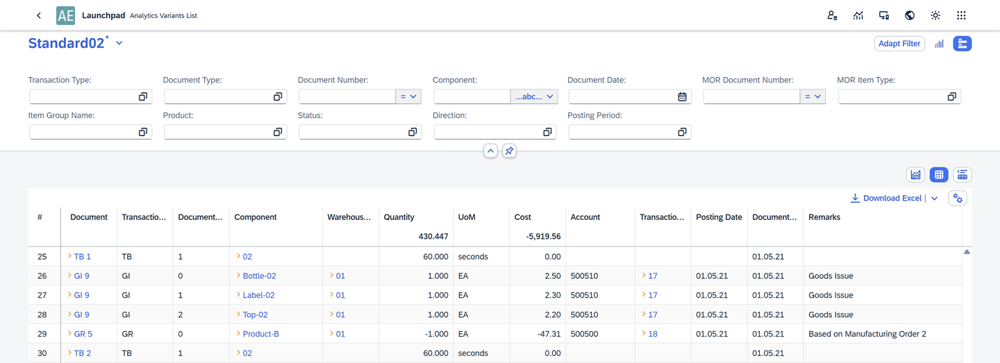

---

## Access

1. After logging in to **CompuTec AppEngine**, click on the **Analytics** icon.

    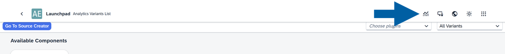

2. Choose your data source by clicking the component name. In our example, we'll be analyzing Manufacturing Order transactions, so we choose MO360.

    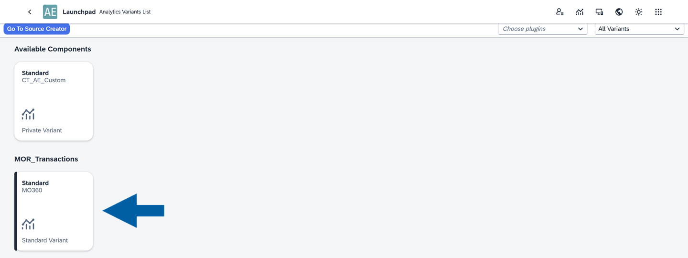

3. Done! Now, you can see your analytics dashboard.

    

## Variants

Variants are preset report configurations. When you install the plugin, you automatically receive one standard variant, which is set as the default. You can easily create your own variants or customize the existing ones.

To **create a new variant**, follow these steps:

1. Click the **arrow** next to your standard variant name.

    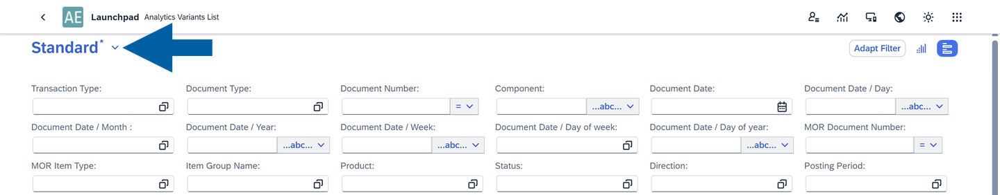

2. Click **Save As**.

    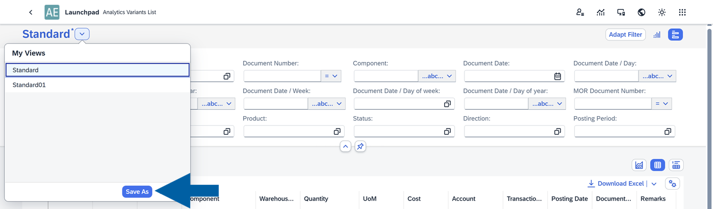

3. Type the variant name and decide if you want to set it as a default one. Here, you can also make it available to all users (Public) or keep it private.

    

4. Click **Save**.

To **manage your existing variants**, follow these steps:

1. Click the **arrow** next to your standard variant name.

    

2. Click **Manage**.

    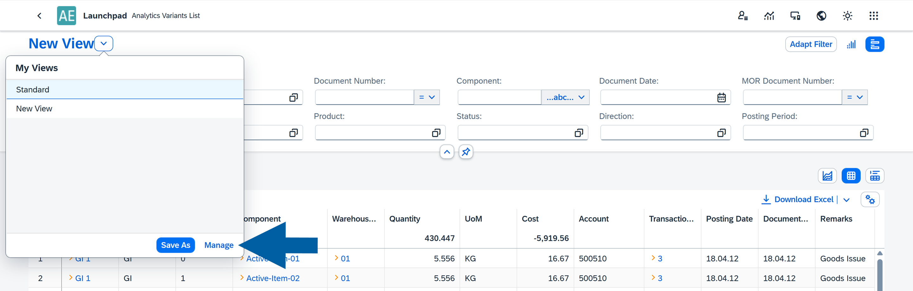

3. Here, you can manage all your existing variants. Dont't forget to click **Save** afterwards.

    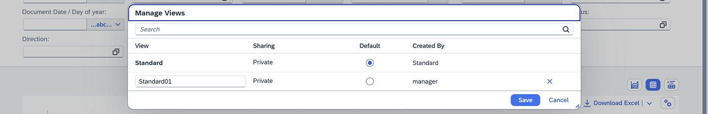

## Main view

Before you begin working with the analytics, it’s helpful to know how each dashboard is structured. It includes two main sections:

- **Filters**, where you define your criteria
- **Reports**, where the filtered results are displayed

### Filter

Filters help you narrow down the data shown in your report by entering specific values. Each filter type lets you refine your dataset based on different criteria.

#### Filter Options

You can use the following filter types:

- **Text**: Allows you to filter data using text values. This is useful for searching for names, keywords, or phrases. Common operators include `Equal`, `Starts With`, `Contains`, and `Between`.

    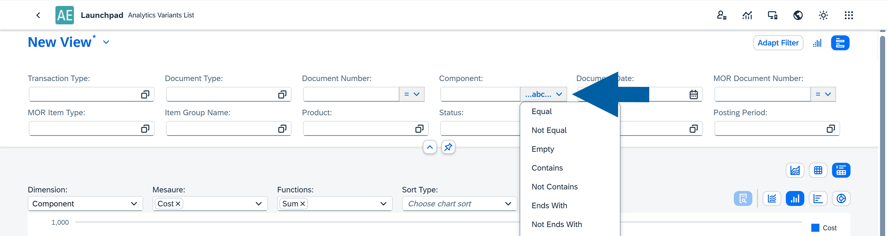

- **Number**: Enables filtering based on numeric values. Typical operators include `Greater Than`, `Less Than`, and `Equal`.

    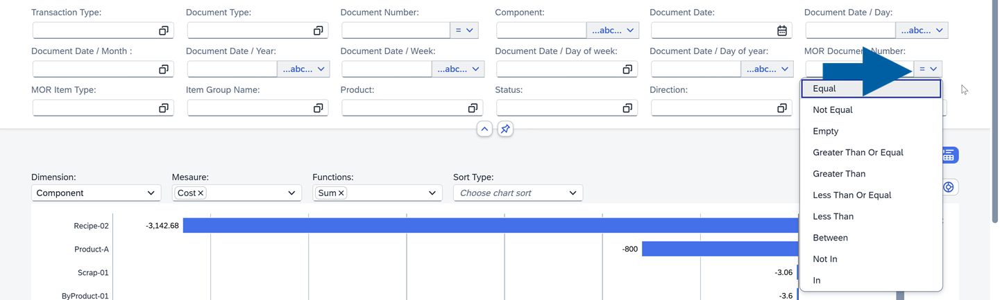

- **Collection**: Allows you to select values from predefined or dynamically loaded lists.
        - **Custom Collection**: A user-defined list of values.
        - **Table Collection**: Values pulled directly from a table field. Example: the `Item Group Name` field.

            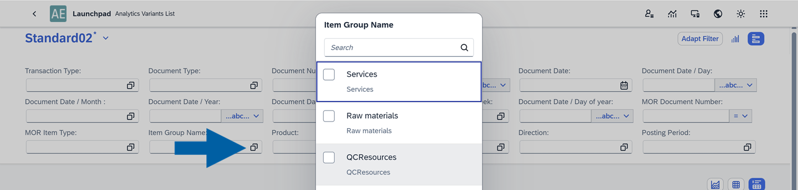

- **Date**: Lets you filter data by a specific date or date range. To select a single day, simply double-click on the date.

    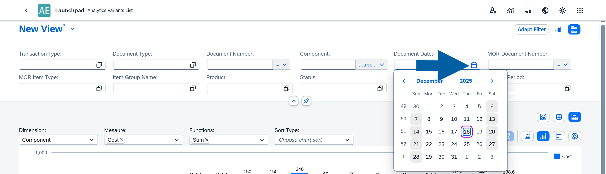

#### Editing filters

The Adapt Filter option lets you choose which filters are shown in the interface. This helps you keep only the filters that matter to you, improving clarity and ease of use.

To customize your filter, follow these steps:

1. Click **Adapt Filter**.

    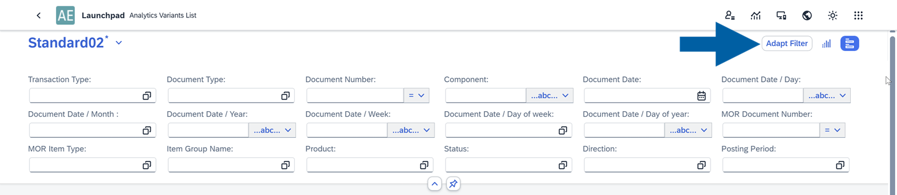

2. Choose which filter options you want to see in your dashboard.

    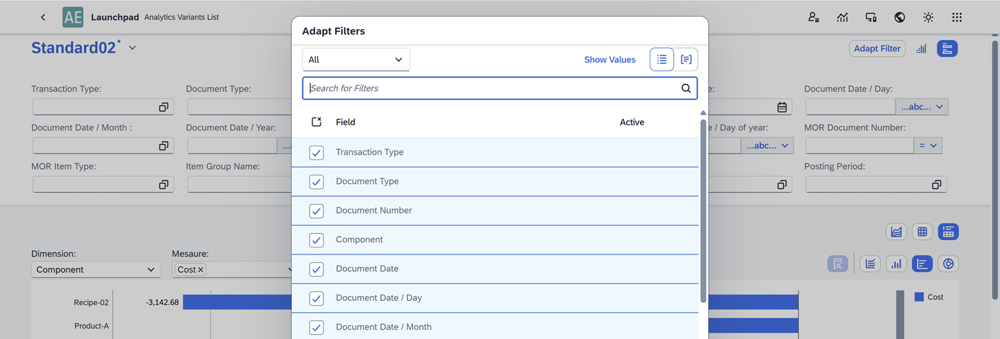

#### Visualization Filters

Selected filters can also be displayed as micro charts. These visual summaries offer an interactive way to drill into your data and quickly understand key metrics. 

You can click on specific parts of the filter to see the detailed data on the metric.

    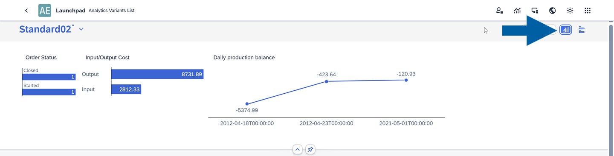

### Report

Reports can be displayed as a Chart, a Table, or a combination of both. You can switch between these display modes at any time.

    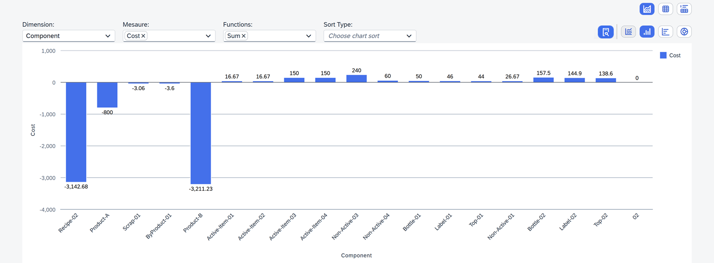

#### Table

The table is the core component of the analytics view and provides powerful tools for interacting with your data.

    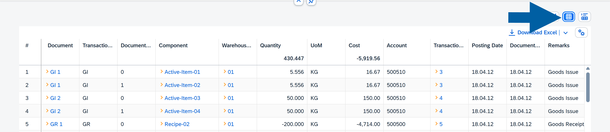

**Table features**:

- **Direct links** – Some cells include yellow arrows that link directly to SAP Business One documents.

    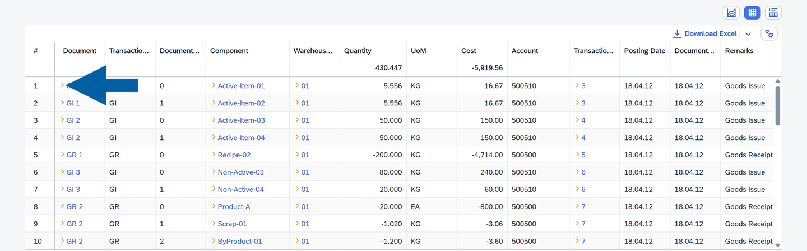

- **Export to Excel** – In browser mode, you can export the table to Excel using the **Download Excel** option in the top-right corner.

    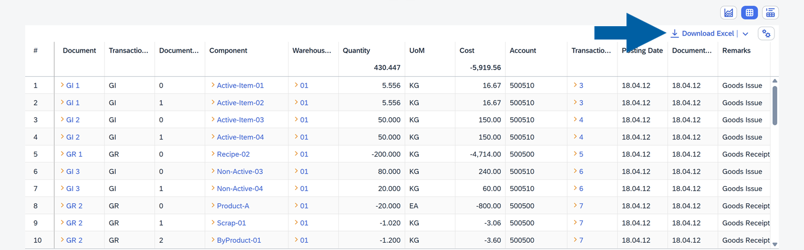

**Table options**

Located in the top-right corner, these options let you customize how your table is displayed:

    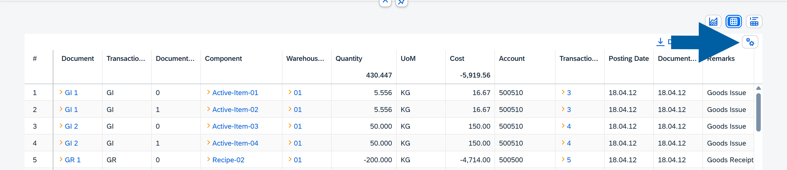

- **Sort**: Sort columns in ascending or descending order.

    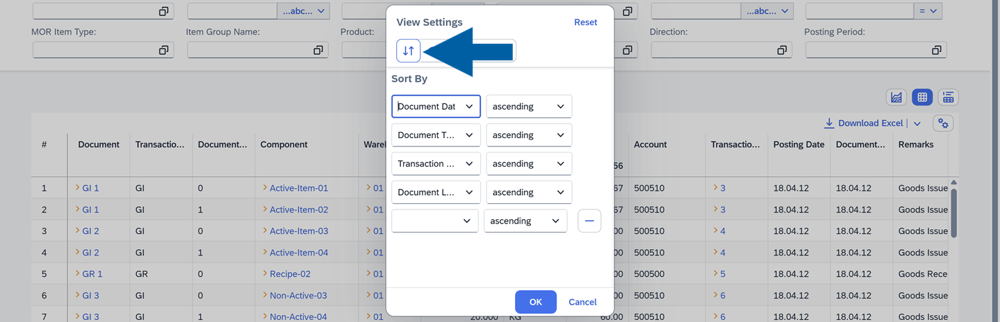

- **Visible**: Choose which columns are shown.

    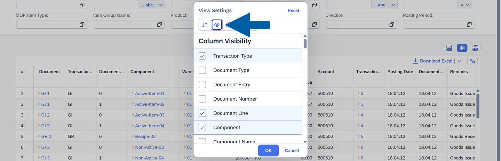

- **Freeze**: Lock selected columns for easier scrolling.

    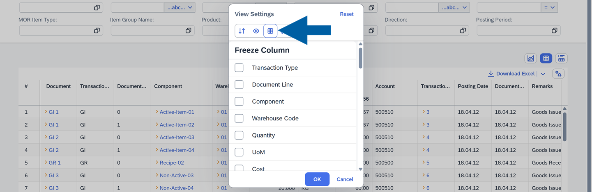

- **Group**: Group rows based on selected columns.

    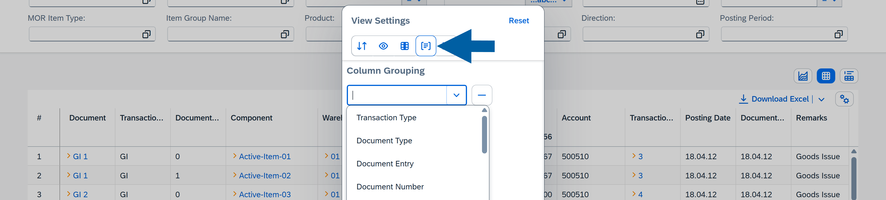

- **Other**:
        - **Display Summaries**: Show totals or summaries for numeric columns.
        - **Auto Row Expand**: Automatically expand grouped results.
        - **Auto Refresh Data**: Refresh data automatically for real-time updates.

    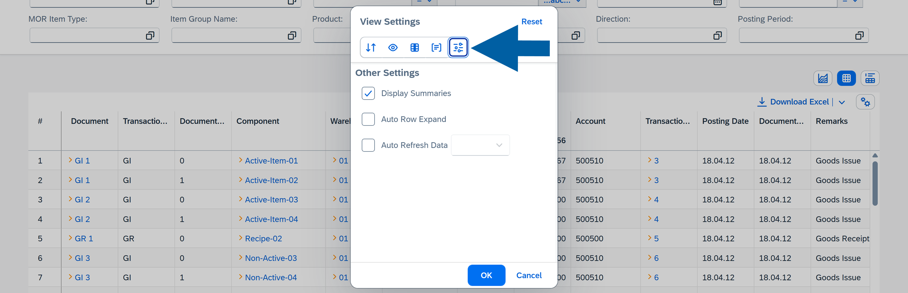

#### Chart

Charts offer a visual way to analyze your data.

    

The available chart types include line, bar, column, and pie. These options give you flexibility in how you represent your dataset.

**Chart Options**

You can adjust the chart using the following settings:

- **Dimension**: Choose any column as the dimension.
- **Measure**: Select the columns used as measures (it must be marked as aggregable in the source creator).
- **Functions**: Apply operations such as `Count`, `Sum`, `Average`, `Minimum`, or `Maximum` (multiple functions allowed).
- **Sort**: Options include: `Without Sort`, `Dimension Ascending`, `Dimension: Descending`, `Measures: Ascending`, `Measures: Descending`.

    

Users can also interact with chart elements to view summaries and download the data in XLSX format.

    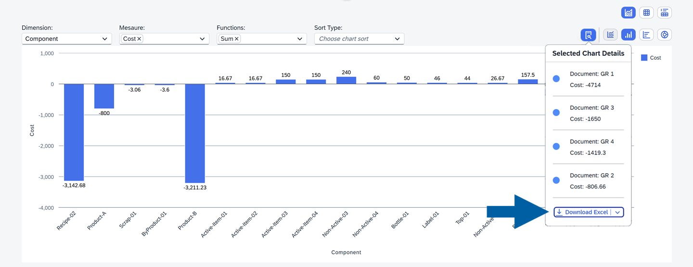

---
