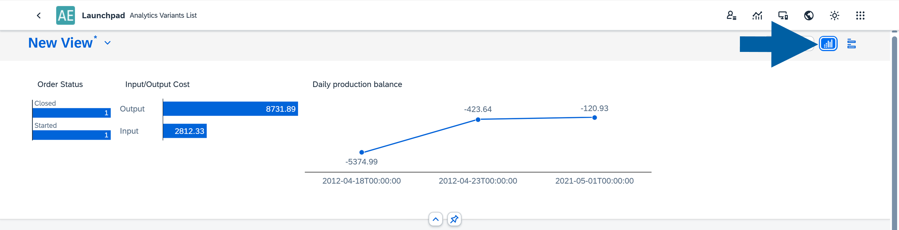
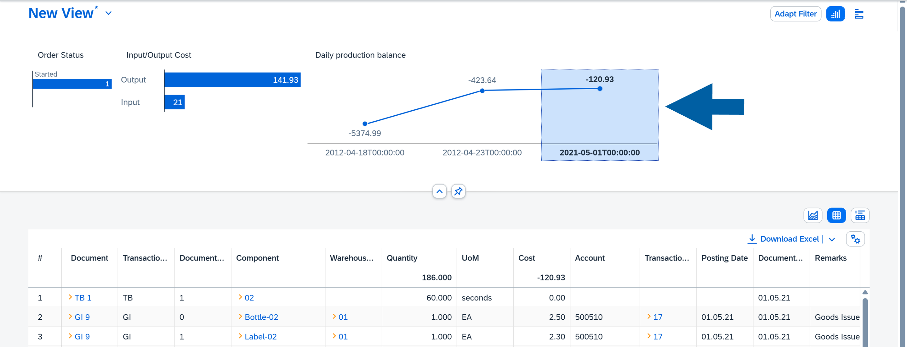
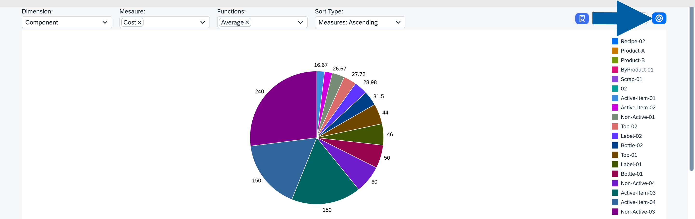

# Overview

The **Analytics** module of **CompuTec AppEngine** enables you to quickly analyze your data and create custom reports using information from connected plugins. It is designed to simplify data visualization while giving you flexible and efficient tools for managing and evaluating complex data sets.

## Access CompuTec AppEngine Analtics

To access the **Analytics** module of **CompuTec AppEngine**, follow these steps:

1. In your browser, open **CompuTec AppEngine site** and choose **Launchpad**.

    

2. Click **Login in with SAP Business One**.

3. Log in using you credentials.

    

4. After logging in to **CompuTec AppEngine**, click on the **Analytics** icon.

    

5. Choose your data source by clicking the component name. In our example, we'll be analyzing **Manufacturing Order** transactions, so we choose **MO360**.

    

6. Done! Now, you can see your **Analytics** dashboard.

    

## About a view

A **View** is a preset report configuration. When you install the CompuTec AppEngine plugin, you automatically receive one standard view, which is set as the default. You can easily create your own views or customize the existing ones.

To **create a new view**, follow these steps:

1. Click the **arrow** next to your extisting view name.

    

2. Click **Save As**.

    

3. Type the view name and decide if you want to set it as a default one. Here, you can also make it available to all users (Public) or keep it private.

    

4. Click **Save**.

To **manage your existing view**, follow these steps:

1. Click the **arrow** next to your extisting view name.

    

2. Click **Manage**.

    

3. Here, you can manage all your existing views. Dont't forget to click **Save** afterwards.

    

## About a dashboard

Before you begin working with the analytics, it’s helpful to know how each dashboard is structured. It includes two main sections:

- **Filters**, where you define your criteria
- **Reports**, where the filtered results are displayed

### Filter your data

Filters help you narrow down the data shown in your report by entering specific values. Each filter type lets you refine your dataset based on different criteria.

#### Filter options

You can use the following filter types:

- **Text**: Allows you to filter data using text values. This is useful for searching for names, keywords, or phrases. Common operators include `Equal`, `Starts With`, `Contains`, and `Between`.

    

- **Number**: Enables filtering based on numeric values. Typical operators include `Greater Than`, `Less Than`, and `Equal`.

    

- **Collection**: Allows you to select values from predefined or dynamically loaded lists.
        - **Custom Collection**: A user-defined list of values.
        - **Table Collection**: Values pulled directly from a table field. Example: the `Item Group Name` field.

            

- **Date**: Lets you filter data by a specific date or date range. To select a single day, simply double-click on the date.

    

#### Edit filters

The Adapt Filter option lets you choose which filters are shown in the interface. This helps you keep only the filters that matter to you, improving clarity and ease of use.

To edit your filters, follow these steps:

1. Click **Adapt Filter**.

    

2. Choose which filter options you want to see in your dashboard.

    

3. Click **Save**.

#### Use microcharts

Selected filters can also be displayed as microcharts. These visual summaries offer an interactive way to drill into your data and quickly understand key metrics.

1. To use microcharts as a filters in your view, click on the **microchart icon** in the **Filters** section of your view.

    

2. Now, you can click on specific parts of the filter to see the detailed data on the metric.

    

### See your data in reports

Reports can be displayed as a **Chart**, a **Table**, or a combination of both. You can switch between these display modes at any time.

    

#### Use a table report

A table is a core component of Analytics and a powerful tool for interacting with your data.

    

**Table features**:

- **Direct links** – Some cells include yellow arrows that link directly to SAP Business One documents.

    

- **Export to Excel** – In browser mode, you can export the table to Excel using the **Download Excel** option in the top-right corner.

    

**Table options**

Located in the top-right corner, these options let you customize how your table is displayed:

    

- **Sort by**: Sort columns in ascending or descending order.

    

- **Column Visbility**: Choose which columns are shown.

    

- **Freeze Column**: Lock selected columns for easier scrolling.

    

- **Group Column**: Group rows based on selected columns.

    

- **Other options**:
        - **Display Summaries**: Show totals or summaries for numeric columns.
        - **Auto Row Expand**: Automatically expand grouped results.
        - **Auto Refresh Data**: Refresh data automatically for real-time updates.

    

#### Use a chart report

Charts offer a visual way to analyze your data.

    

The available chart types include **Line Chart**, **Bar Chart**, **Column Chart**, and **Pie Chart**, giving you flexibility in how you visualize your dataset.

    

**Chart Options**

You can adjust the chart using the following settings:

- **Dimension**: Choose any column as the dimension.
- **Measure**: Select the columns used as measures (it must be marked as aggregable in the source creator).
- **Functions**: Apply operations such as `Count`, `Sum`, `Average`, `Minimum`, or `Maximum` (multiple functions allowed).
- **Sort**: Options include: `Without Sort`, `Dimension Ascending`, `Dimension: Descending`, `Measures: Ascending`, `Measures: Descending`.

    

Users can also interact with chart elements to view summaries and download the data in XLSX format.

    

:::info[note]
Note
If you have any questions, contact us via the [CompuTec Helpdesk Portal](https://support.computec.pl/servicedesk/customer/portals?q=webUp). Feedback on usability and performance is always welcome.
:::
