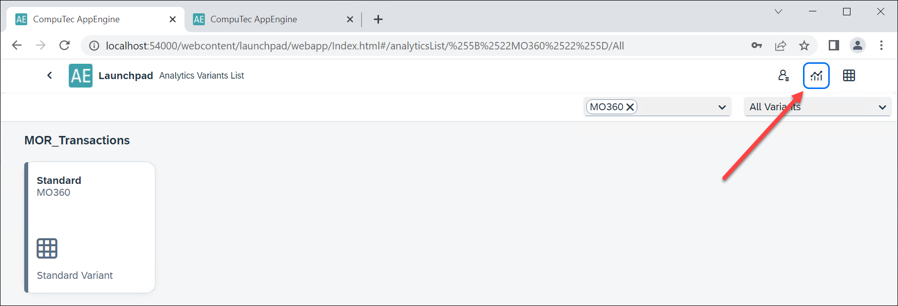
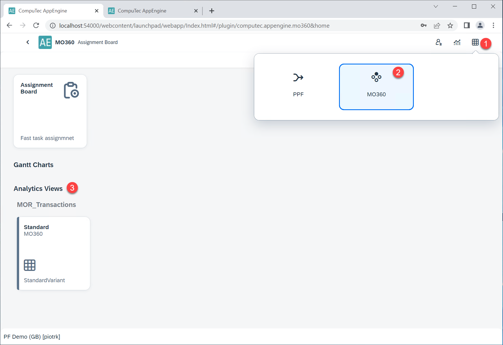
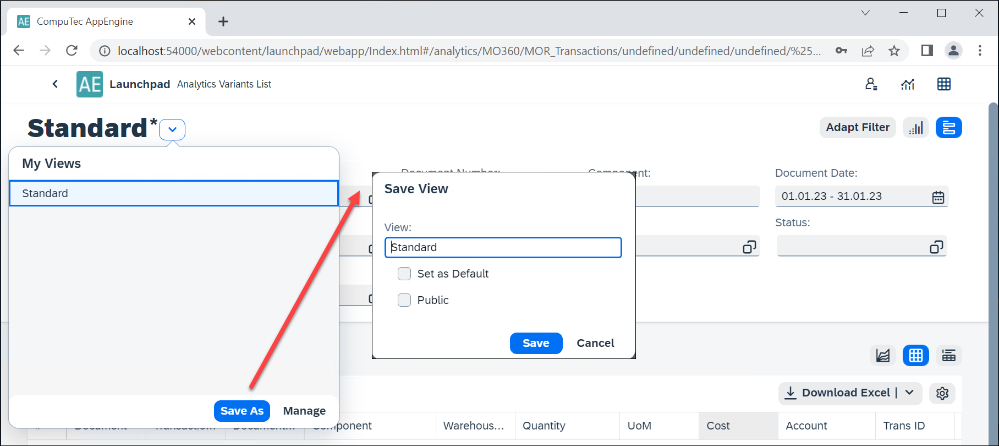
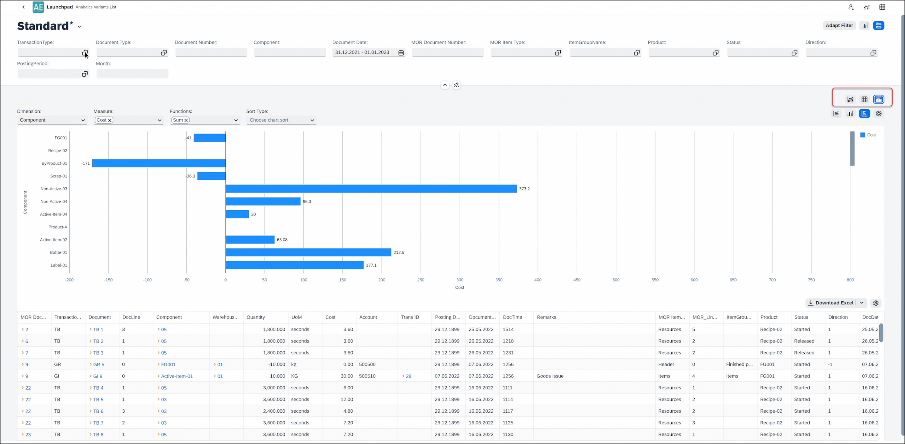
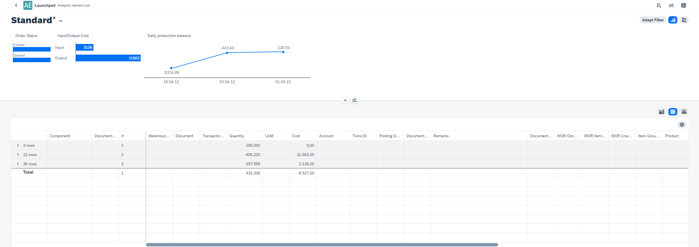
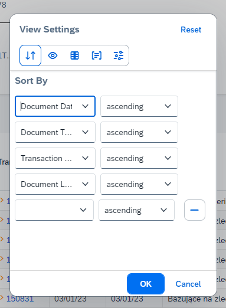

# Overview

This user-friendly tool allows you to quickly and easily create custom reports and analytics based on data from plugins.

In the following manual, the MO360 plugin has been used.

---

Click [**here**](https://www.youtube.com/watch?v=qXK2dS_9z3g) for a video demonstration.

---

## Access

After logging in to AppEngine, you can reach the option by clicking the icon in the upper-right corner of the window:

You can also reach the option from the MO360 view:

## Usage

### Variants

Variants are preset reports. By installing the plugin, you get one standard Variant set as default. You can create and customize the Variants. To create your Variant, open the standard and use the Save As option:

You can set the Variant name, set your Variant as default, and set availability (either Public or Private - available for other users or just for the currently logged-in).

### Main View

Choose one of the variants to open a report. The report view is divided into two sections: filter (1.) and report (2.):

#### Filter

You can put values in the field to filter all the records by these values. Filtered values are displayed in the report.

You can adjust fields that are displayed in the filter by clicking the Adapt Filter button.

<u>In the drop-down list</u> - you can filter all Manufacturing Order fields by the following values: All, Visible, Active, Visible and Active, Mandatory.

<u>Hide/Show Values</u> - in the Adapt Filters view, you can hide/show already chosen values.

<u>List/Group view</u> - the Group view will be implemented in one of the future releases.

The chosen filters can be displayed in the form of micro charts:

#### Report

The report can be displayed in one of three forms: as a chart, as a table, and both at the same time. This option is shown in the following screenshot:

#### Chart options

<u>Chart format</u> - you can choose a line chart, a vertical bar chart, a horizontal bar chart, or a pie chart.

You can set the following settings for a chart: Dimension, Measure, Function, and Sort Type.

#### Table options

You can download the result table as an Excel document (.xlsx) or a CSV file (.csv).

The Table settings:

- Sorting - multi-level sorting, e.g., by Document Date ascending and then by Document Time descending,

- Visibility - you can choose which columns are displayed

- Column Freezing - the "froze" Columns are displayed on the left side of the table all the time, even when you use the scroll bar to scroll further to the right (three left columns in the screenshot below).

- Column Grouping - choose a column by which rows will be grouped. If you choose more than one, the grouping will be performed in levels. In the example below, there are two levels.

