# Overview

The **Analytics** module in **CompuTec AppEngine** helps you analyze your data and build custom reports using information from connected plugins.

It is designed to make data easy to understand, while still giving you flexible tools to work with complex datasets.

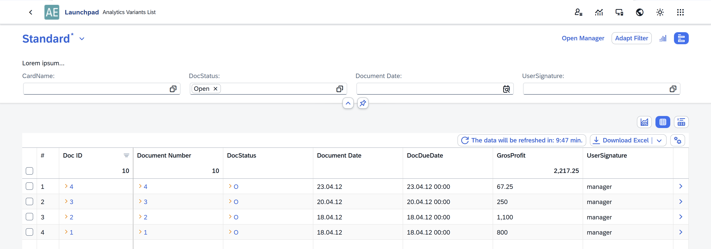

## Access CompuTec AppEngine Analytics

To access the **Analytics** module of **CompuTec AppEngine**, follow these steps:

1. In your browser, open the **CompuTec AppEngine site** and choose **Launchpad**.

    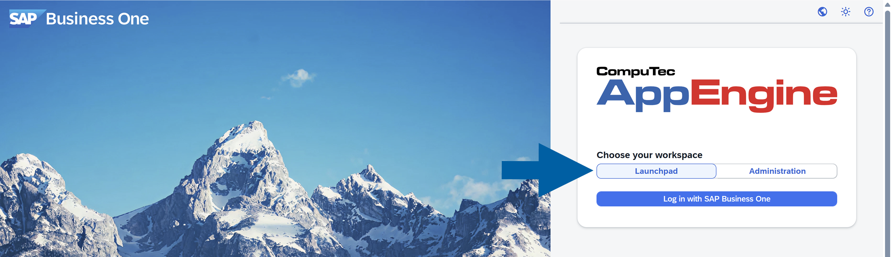

2. Click **Log in with SAP Business One**.

     

3. Log in using your **SAP Business One credentials**.

    

4. After logging into **CompuTec AppEngine**, click on the **Analytics** icon.

    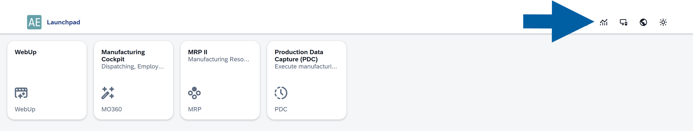

5. You will now see the **Analytics Variants List**, where all available reports and their variants are displayed.

    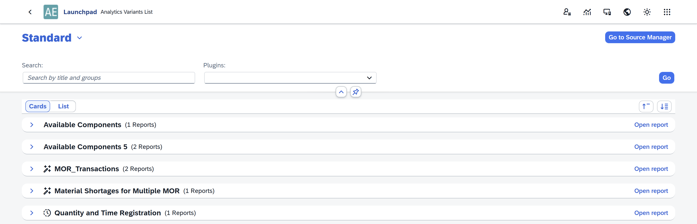

## Analytics Variants List  

The **Analytics Variants List** displays all available reports and their **views**.

You can also create multiple **custom views of the Analytics Variants List** itself. By default, the system provides one main view called **Standard**, but you can modify it and save it as new views to better match your business needs.

Within the **Analytics Variants List**, you can switch between two display modes:

- **Cards View**: Displays reports grouped by Source, with each Variant shown as a card. This view provides a visual overview of the available reports.

    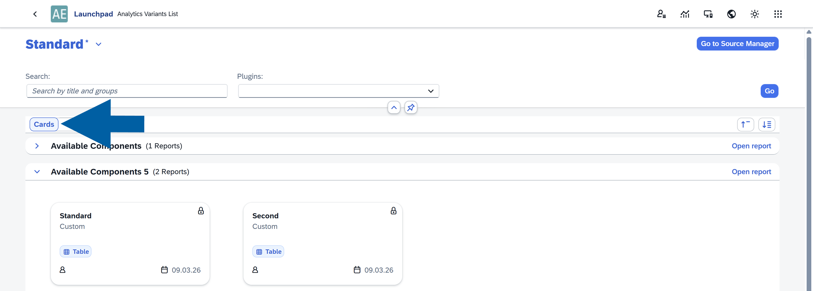

- **List View**: Displays a table containing all available variants, including their details.

    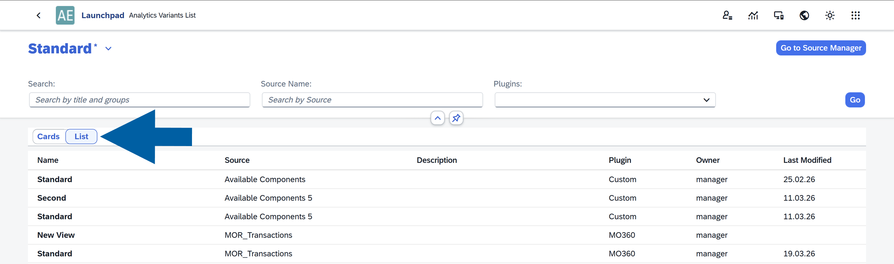

### Create your Analytics Variants List view

You can customize the Analytics Variants List and set your own view as the default one.

To create your own view, follow these steps:

1. Open the list to display available **Plugins**.

    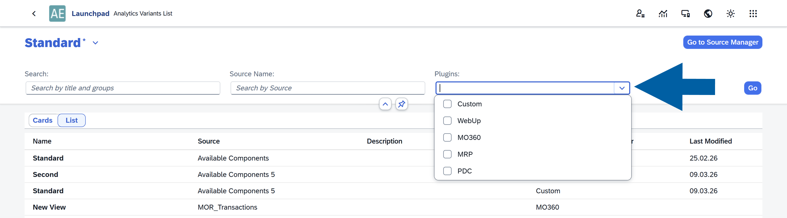

2. Select which reports you want to display. You can choose between:

    - **Custom**: Reports created by you using **Source Creator**.
    - **Plugins**: Predefined reports installed automatically with plugins.

3. Click **Go** to apply the selection.

4. Click the **arrow** next to the current **Analytics Variants List name**.

    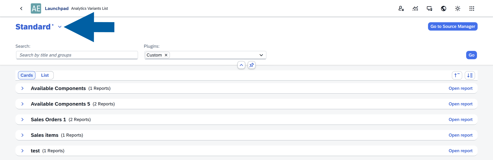

5. Select **Save As**.

    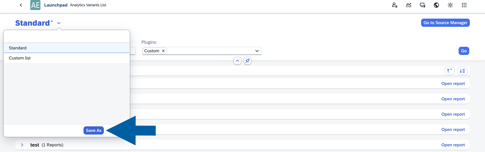

6. Enter a name for the new variant and decide whether it should be **Default** and/or **Public**.

    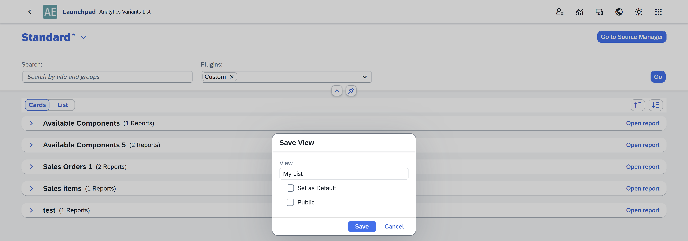

7. Click **Save**. Your custom **view** of **Analytics Variants List** is now created and ready to use.

    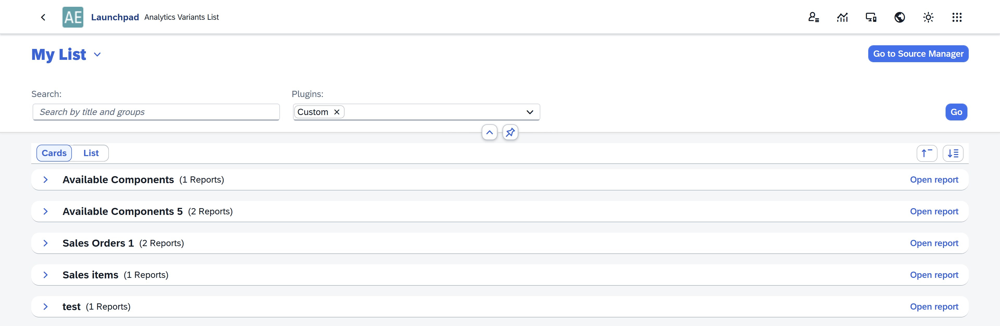

### Edit your Analytics Variants List Views

If you want to edit or manage an existing Analytics Variants List view, follow these steps:

1. Click the **arrow** next to the name of the current **Analytics Variants List**.

    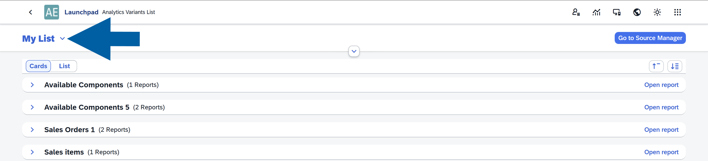

2. Click **Manage**.

    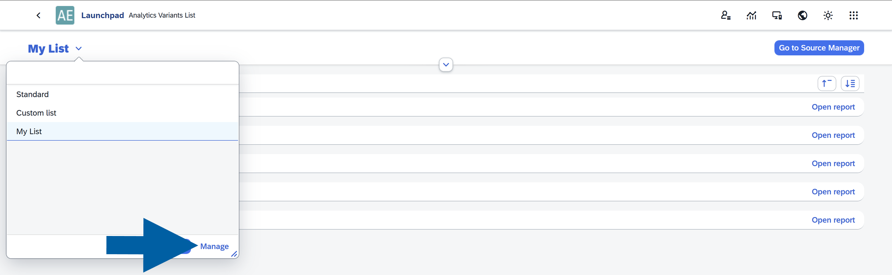

3. The **Manage Views** window will open. From here you can:

    - **Search views**: Use the search bar to quickly find a specific view.
    - **Rename views**: Edit the name directly in the View column.
    - **Control sharing**: Set whether the view is Private (visible only to you) or Public (available to other users). [Read more](http://learn.computec.one/docs/appengine/appengine-users-guide/analytical-page/permissions_in_analytics)
    - **Set a default view**: Select which view should be opened automatically by default.
    - **Delete views**: Remove views you no longer need using the X icon.

    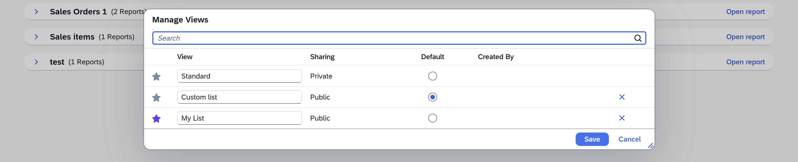

4. After making your changes, click **Save** to apply them or **Cancel** to discard the changes.

## About a Variant

**Variant** is a saved report configuration that defines how a report is displayed and used.

When you install a plugin for CompuTec AppEngine, the plugin may include predefined sources and variants. A source can contain one or multiple variants, depending on how the plugin was designed by its owner.

You can create your own variants or modify existing ones to customize the report layout, filters, table settings, and charts according to your needs.

### Create a new variant

To **create a new variant**, follow these steps:

1. Click the **arrow** next to your existing variant name.

    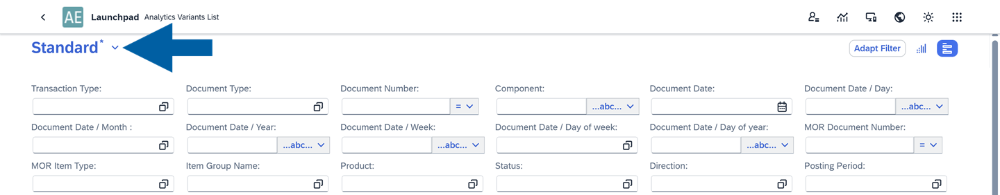

2. Click **Save As**.

    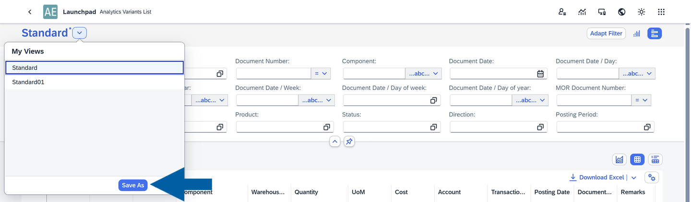

3. Type the variant name and decide if you want to set it as a default one. Here, you can also make it available to all users (**Public**) or keep it private.

    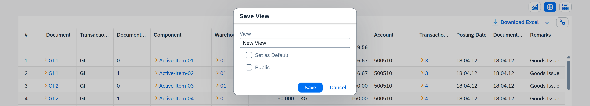

    :::info[note]
    It is recommended to give your variant a clear and specific name, so it is easier to find later. A descriptive name also makes the variant more visible in lists, for example when configuring permissions in the SAP Business One interface.
    :::

4. Click **Save**.

### Edit a variant

To **edit your existing variant**, follow these steps:

1. Click the **arrow** next to your existing variant name.

    

2. Click **Manage**.

    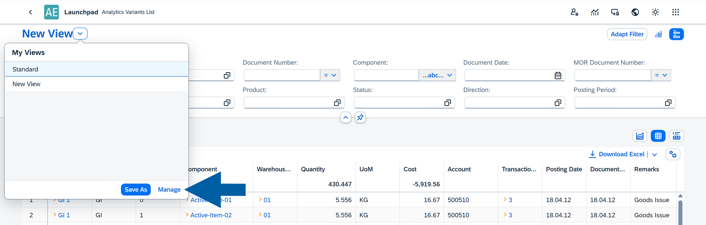

3. Here, you can manage all your existing variants. Don't forget to click **Save** afterwards.

    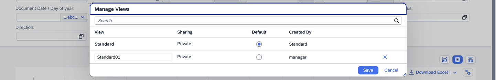

## About a dashboard

Before you begin working with **Analytics**, it’s helpful to know how each dashboard is structured. It includes two main sections:

- **Filters**, where you define your criteria
- **Reports**, where the filtered results are displayed

**Filters** can appear in different forms:

- **Standard filters**, such as text inputs, or date pickers.
- **Microchart filters**, which look like small charts but also function as interactive filters. By clicking elements within the microchart, you can quickly filter the data displayed in the report. [Read more](https://learn.computec.one/docs/appengine/appengine-users-guide/analytical-page/overview#use-microcharts)

**Reports** can be presented in three formats:

- **Tables**: Displays detailed data in rows and columns
- **Charts**: Visualizes the data for easier analysis
- **Table and Chart**: Combines both views in a single report

This flexibility allows you to explore and analyze data directly within the dashboard in a way that best suits your needs.

### Filter your data

Filters help you narrow down the data shown in your report by entering specific values. Each filter type lets you refine your dataset based on different criteria.

#### Filter options

You can use the following filter types:

- **Text**: Allows you to filter data using text values. This is useful for searching for names, keywords, or phrases.  
Common operators include `Equal`, `Starts With`, `Contains`, and `Between`.

    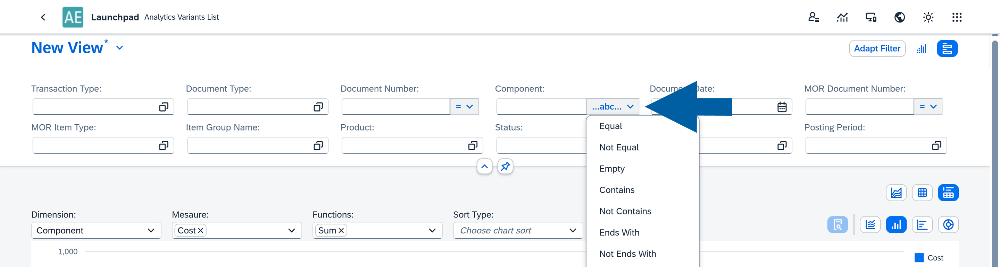

- **Number**: Enables filtering based on numeric values. Typical operators include `Greater Than`, `Less Than`, and `Equal`.

    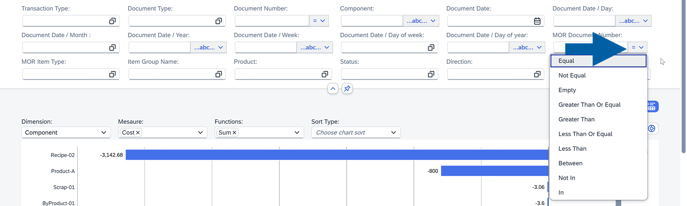

- **Collection**: Allows you to select values from predefined or dynamically loaded lists.

    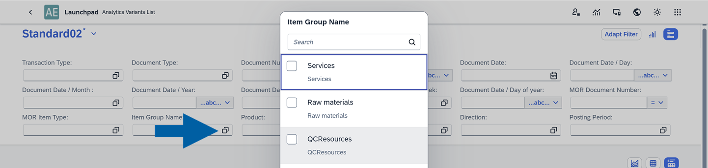

        - **Custom Collection**: A user-defined list of values.
        - **Table Collection**: Values pulled directly from a table field. Example: the `Item Group Name` field.
        - **User Collection**: Available when the **Column Type** is set to **User** in the **Source Manager**. This option automatically provides a list of users in the report. For example, ``CURRENT_USER`` is a variable that always represents the user currently logged in.

- **Date**: Allows you to filter data by a specific date or a date range.

    

- **Date and Time**: Allows you to specify the exact date and time.

    

#### Edit filters

The **Adapt Filter** option allows you to select which filters are visible in the interface and define their order. This helps keep the dashboard focused by displaying only the filters that are relevant.

To edit your filters, follow these steps:

1. Click **Adapt Filter**.

    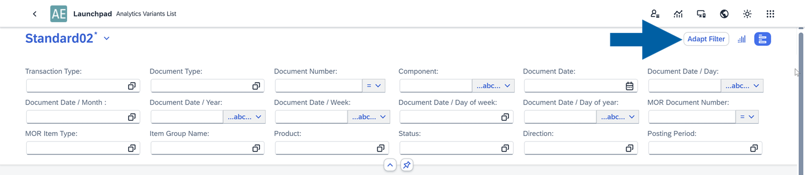

2. Choose which filter options you want to see in your dashboard.

    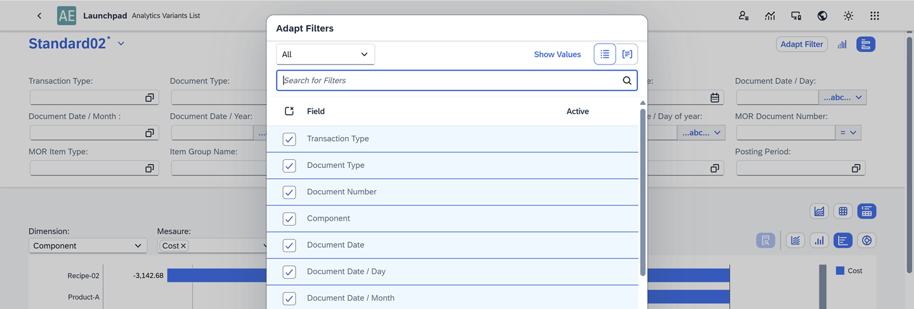

3. Click **Save**.

#### Use microcharts

Selected filters can also be displayed as microcharts. These visual summaries offer an interactive way to drill into your data and quickly understand key metrics.

1. To use microcharts as filters in your variant, click on the **microchart icon** in the **Filters** section of your variant.

    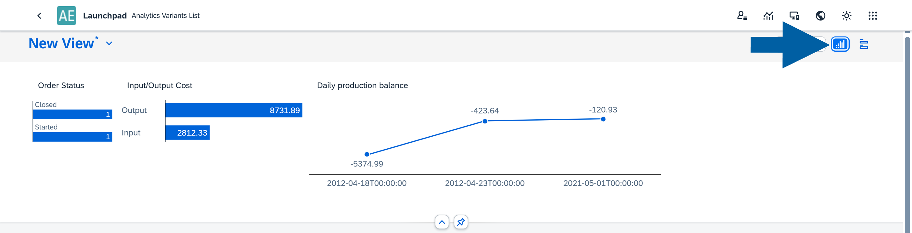

2. Now, you can click on specific parts of the filter to see the detailed data on the metric.

    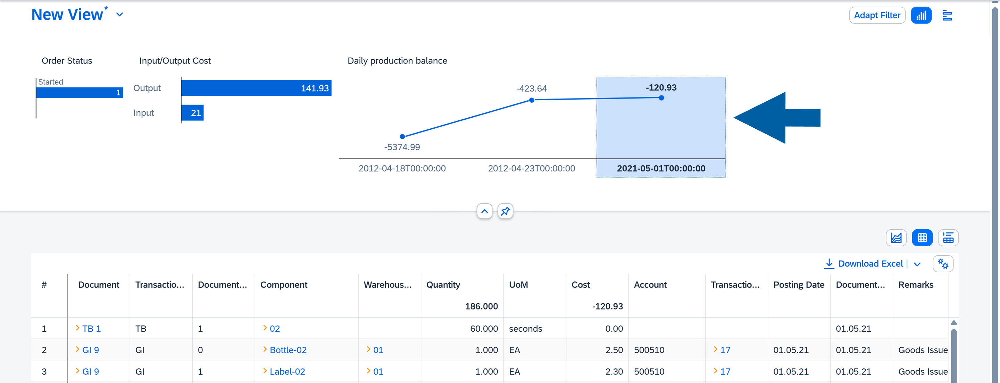

### See your data in reports

Reports can be displayed as a **Chart**, a **Table**, or a combination of both. You can switch between these display modes at any time.

    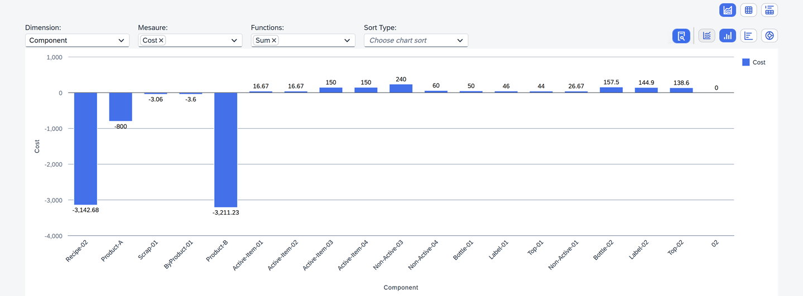

#### Use a table report

A table is a core component of Analytics and a powerful tool for interacting with your data.

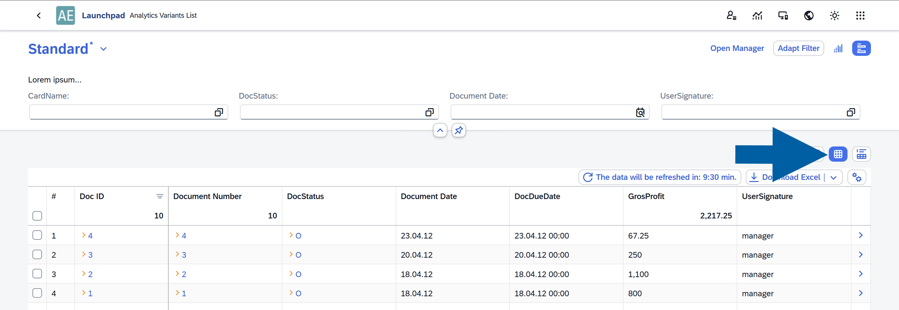

**Table features**:

- **SAP links**: Some cells include yellow arrows that link directly to SAP Business One documents.

    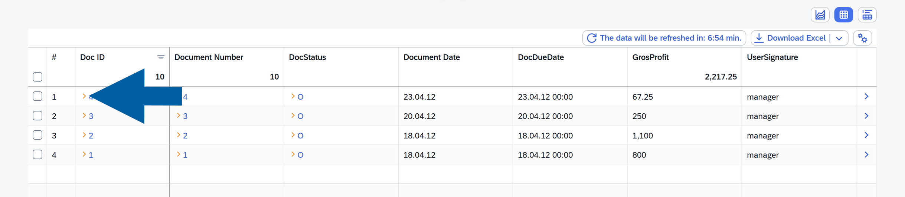

- **Export to Excel**: In browser mode, you can export the table to Excel using the **Download Excel** option in the top-right corner.

    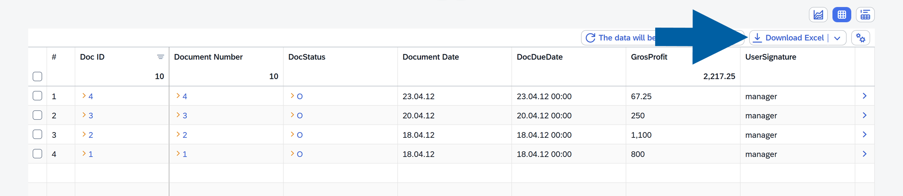

**Table options**

Located in the top-right corner, these options let you customize how your table is displayed:

    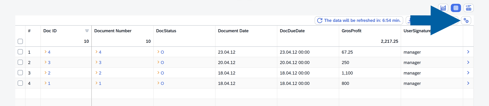

- **Sort by**: Sort columns in ascending or descending order.

    

- **Column Visbility**: Choose which columns are shown.

    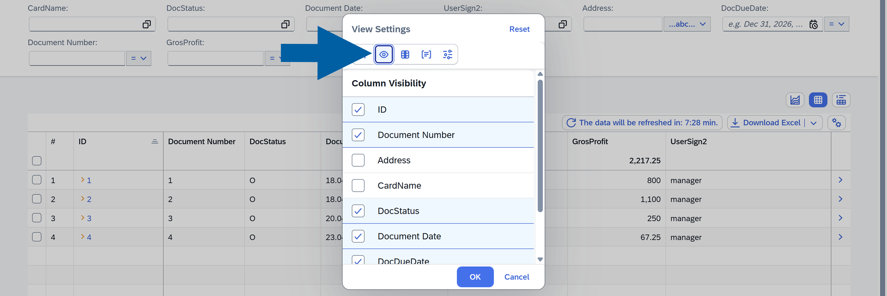

- **Freeze Column**: Lock selected columns for easier scrolling.

    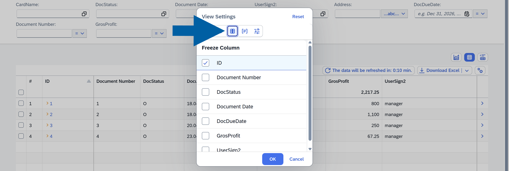

- **Group Column**: Group rows based on selected columns.

    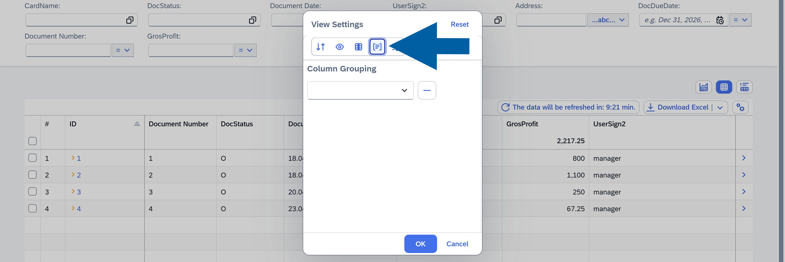

- **Other options**:

  - **Fit Columns**: Automatically adjusts column widths to fit the available space.
  - **Display Summaries**: Show totals or summaries for numeric columns.
  - **Auto Row Expand**: Automatically expand group results.
  - **Show Manual Refresh**: Displays a button that allows users to manually refresh the report data.
  - **Auto Refresh Data**: Refresh data automatically for real-time updates.
  - **Selection Mode**: Defines how rows can be selected in the report:

    - **None**: Rows cannot be selected.
    - **Single**: Only one row can be selected at a time.
    - **Multiple**: Multiple rows can be selected using checkboxes in each row.

    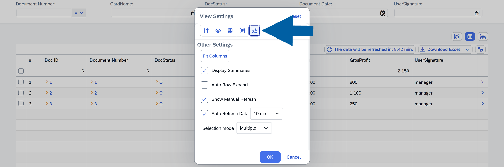

#### Use a Chart Report

Charts offer a visual way to analyze your data.

    

The available chart types include **Line Chart**, **Bar Chart**, **Column Chart**, and **Pie Chart**, giving you flexibility in how you visualize your dataset.

    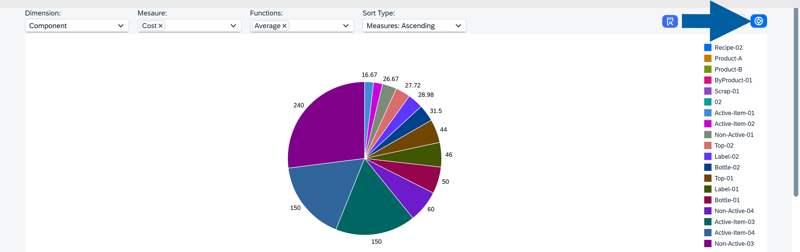

**Chart Options**

You can adjust the chart using the following settings:

- **Dimension**: Choose any column as the dimension.
- **Measure**: Select the columns used as measures (it must be marked as aggregable in the source creator).
- **Functions**: Apply operations such as `Count`, `Sum`, `Average`, `Minimum`, or `Maximum` (multiple functions allowed).
- **Sort**: Options include: `Without Sort`, `Dimension Ascending`, `Dimension: Descending`, `Measures: Ascending`, `Measures: Descending`.

    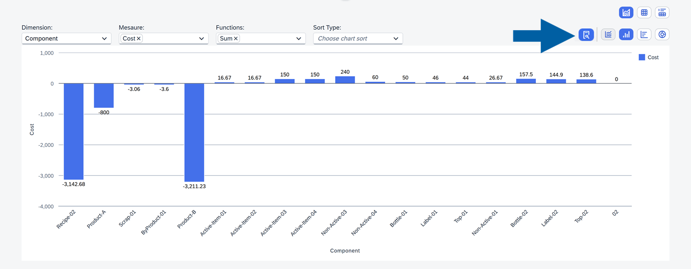

Users can also interact with chart elements to view summaries and download the data in XLSX format.

    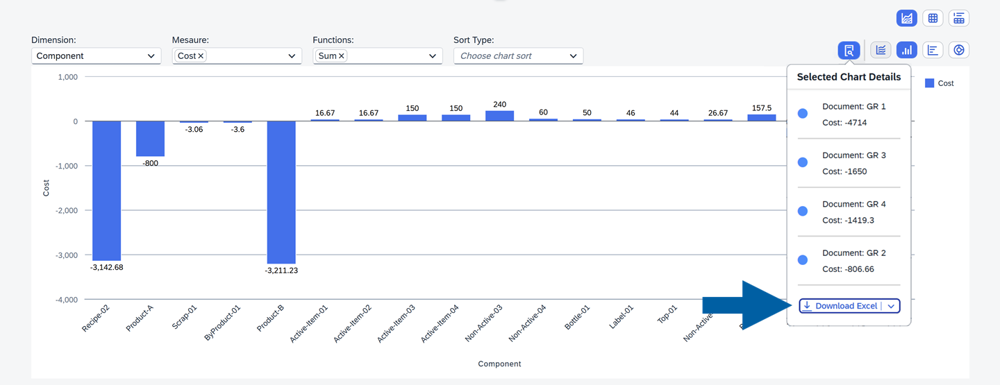

:::warning[important notes]

- When the page is refreshed, all current report settings are saved automatically.
- After configuring the report, you can save it as a new variant.
- The new Variant will appear in the **Analytics Variants List**, where it can be opened and used later. [Read more](https://learn.computec.one/docs/appengine/appengine-users-guide/analytical-page/overview#analytics-variants-list)

:::

:::info[note]
If you have any questions, contact us using [CompuTec Support Portal](https://support.computec.pl/servicedesk/customer/portals?q=webUp).
:::
