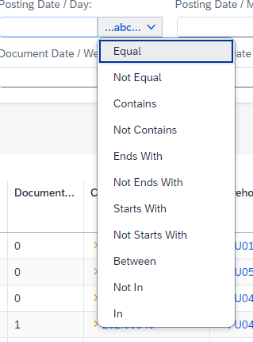
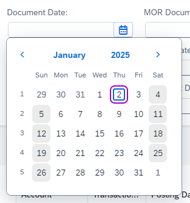

# Overview

This user-friendly tool allows you to quickly and easily create custom reports and analytics based on data from plugins. Designed to simplify data visualization, it provides flexibility and efficiency in managing and analyzing complex data sets.

    

---

## Access

After logging in to AppEngine, you can access the Analytical Page by:

Clicking the icon located at the upper-right corner of the window and navigate through the plugin (In the below example, MO360 has been taken as a reference for analyzing Manufacturing Order transactions):

## Variants

Variants are preset reports. By installing the plugin, you get one standard Variant set as default. You can create and customize the Variants. To create your Variant, open the standard and use the Save As option:

While saving, you can:

- Assign a name to the Variant.
- Set the Variant as the default.
- Define availability as either Public (available for all users) or Private (restricted to the current user).

## Main View

Select a Variant to open a report. The report view consists of two main sections: Filter (1) and Report (2):

### Filter

Filters allow you to refine the data displayed in your report by entering specific values.

#### Filter Options

Filters are designed to refine datasets based on specific criteria. These filters allow users to input values and apply operators to customize the filtering process. The following filters can be used:

- **Text** - Accept textual input for filtering data. It is useful for searching specific words, names, or phrases. Operators such as equal, starts with, or between etc. are often available.

    

- **Number** - Enable filtering based on numeric values. Operators such as greater than, less than, or equal to etc. are often available.

    

- **Collection** - Work with predefined or dynamically sourced data collections:
        - Custom Collection: A user-defined list of values.
        - Table Collection: Data fetched directly from a table field. (Example: Selecting the "Status" field from the OITM table.)

            

- **Date** - Facilitate filtering data based on specific dates or date ranges. To select a single day, simply double-click on the desired date.

    

With the "**Adapt Filter**" feature, users can customize which filters are visible in the interface. This feature enhances usability by allowing users to focus only on relevant filters.

    

Selected filters can be represented as micro charts for a visual summary. **Visualization filters** provide an interactive way to filter data by summarizing key metrics and enabling users to drill down into details.

    

### Report

Reports can be displayed in one of three formats: Chart, Table, or both simultaneously. The display format can be toggled using the following options:

#### Table

The table is the primary component of analytics and offers robust features for data interaction.

    

- **Yellow Arrows** - Cells may include yellow arrows, enabling references to SAP Business One documents.
- **Export Options** - In the browser view of analytics, users can export data to Excel using the "Download Excel" option in the top-right corner.

**Table Options**

Located in the top-right corner, these options include:

    

- **Sort** - Select columns and define sorting order (ascending or descending).
- **Visible** - Choose which columns to display.
- **Freeze** - Lock specific columns for better navigation.
- **Group** - Organize data by selected columns.
- **Other**:
        - **Display Summaries**: View data summaries for numeric columns.
        - **Auto Row Expand**: Automatically expand grouped data.
        - **Auto Refresh Data**: Define refresh intervals for real-time updates.

            

#### Chart

Below is the screenshot of visualization of data in chart:

    

The available chart types include line, bar, column, and pie, offering versatile options for data visualization.

**Chart Options**

These options include:

- **Dimension** - Select any column.
- **Measure** - Choose columns to measure (requires an aggregable flag in the source creator).
- **Functions** - Apply operations like count, sum, average, minimum, or maximum (can use multiple functions).
- **Sort** - Options include no sort, Dimension ASC/DESC, Measures ASC/DESC.

Users can interact with chart data to view summarized information and download selected data in XLSX format.

    

---
