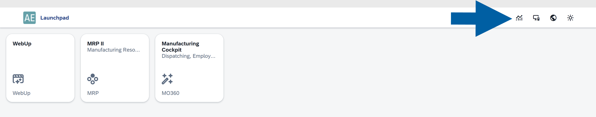
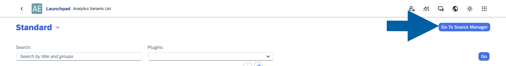
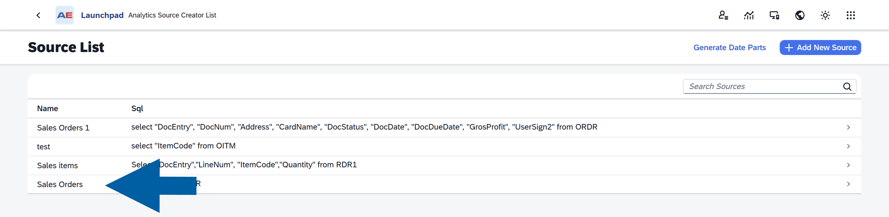
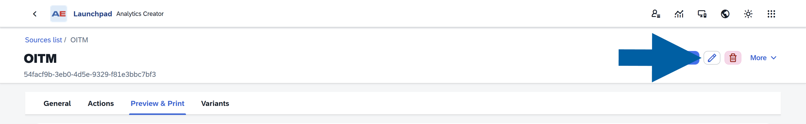
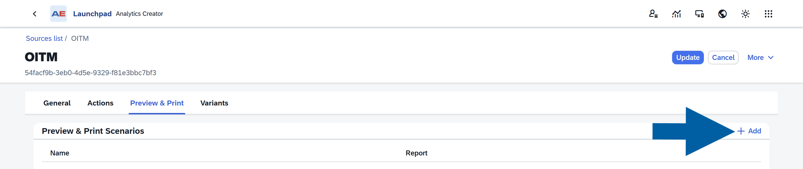
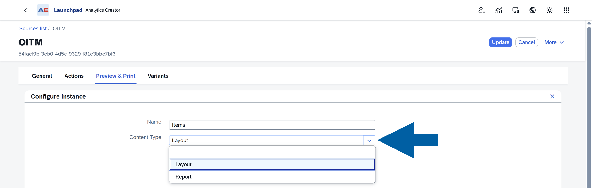
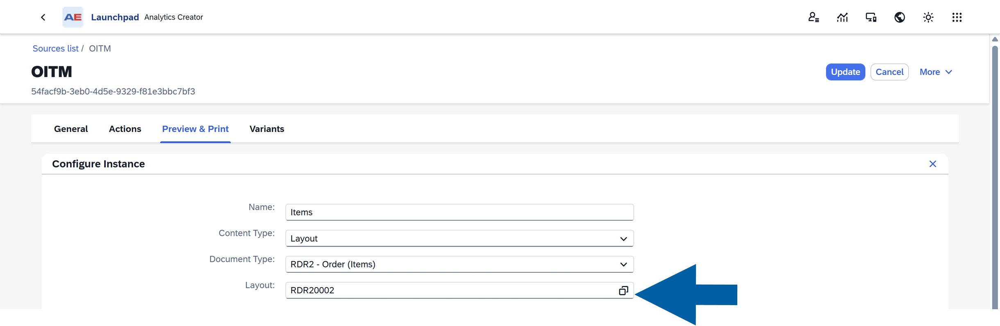
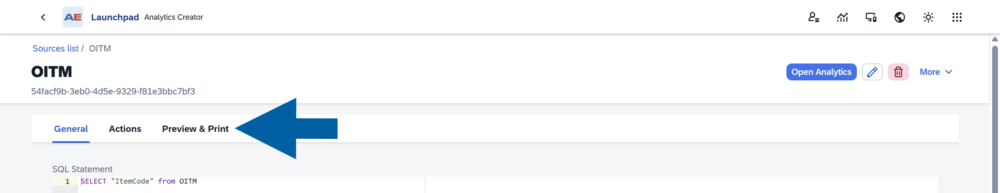

# Preview & Print Feature

The **Preview & Print** feature lets you generate PDF reports directly from an **Analytics** data source. You can preview reports in your browser, download them, or print data for one or multiple records.

Reports use **SAP Business One Crystal Reports** templates configured for the selected **Analytics** source.  

## Before You Begin

Make sure:

- You can access **CompuTec AppEngine Launchpad**.  
- The **Analytics** source already has at least one configured print option.  
- You know which data source you want to use.

## Open Preview & Print

To access the feature:

1. Log in to **CompuTec AppEngine Launchpad**.

    

2. Click the **Analytics** icon.  

    

3. Click **Go to Source Manager**.  

    

4. Select your data source.  

    

5. Open the **Preview & Print** tab.  

    

The tab displays all configured print options available for the selected source.

## Create a New Print Instance

A print instance is a saved print configuration. It defines which report to use and what data is sent to that report.

For example:

- Invoice PDF  
- Order Summary  
- Delivery Confirmation  

To create a new instance:

1. Click the **edit** icon to enter edit mode.

    

2. In the **Preview & Print** tab, click **+ Add**.  

    

3. Enter a **Name**, and select the **Content Type**.  

    

4. Select the **report** or **layout** that will generate the PDF.  

    

    :::info[Note]

    Currently, **Crystal Reports** are fully supported.
    :::

5. Configure the parameters:

    - Use **Constant** when the value should always stay the same. Example: ``CompanyCode`` = ``US01``
    - Use **Field** when the value should come from the Analytics data source. Example: Use the selected row’s **Document Number** column.
    - Enable **Ask** to turn on **Ask at Print Time** feature if users should enter or select a value when generating the report. This is useful when the value changes between print runs.

        

6. Click **Save**.

7. Done! The new print option becomes available for users of this **Analytics source**.  

    

## Combine Multiple Records into One PDF

Some reports support multi-value parameters. If available, you can enable **Combine into Single Export**.

Behavior depends on this setting:

| Selection | Result |
| --- | --- |
| ``Disabled`` | One PDF is generated per selected row |
| ``Enabled`` | One combined PDF is generated for all selected rows |

This option helps when users need a single report containing multiple records.  

## Edit or Delete a Print Instance

To change an existing instance:

1. Open the **Preview & Print** tab.

    

2. Click the **edit icon** to enter the edit mode.

    

3. Select the instance from the list.

    

4. Make your changes.  

5. Click **Save**.

    ![Preview and Print Configure Instance dialog in CompuTec AppEngine Launchpad showing the Configure Instance panel with fields Name: Items; Content Type: Layout; Document Type: RDR2 - Order (Items); Layout: RDR20002. Parameter Mapping table lists DocKey@ with Ask checked, Source Type Constant, Value 1; and ObjectId@ with Source Type Constant, Value 17. A large blue arrow points to the blue Save button at the lower right and a pink Delete button appears next to it. Header text includes Configure Instance and Parameter Mapping; the interface is a white modal over a light grey AppEngine background, tone neutral and instructional.](media/preview_print/prev-and-print14.png)

6. To remove an instance, click **Delete**.

    

:::info[Note]
Deleted instances are no longer available to users.  
:::

## Use Preview & Print in Analytics

After a print instance is configured, users can generate reports directly from the **Analytics** table.

To generate a report, follow these steps:

1. Open the chosen **Analytics source**.  

    text](media/preview_print/prev-and-print16.png)

2. Select one or more rows.  

3. Click **Preview & Print** in the toolbar.  

    

4. Choose a **print option** from the dropdown list.

    

5. If prompted, enter any required parameter values, and click **OK**.

    

6. Wait for the report generation to complete.

    ![Browser print preview dialog showing a PDF order confirmation report. Left column shows a single page thumbnail. Top bar reads Print Preview and AR Sales Order (Item) - CR (GB). Main preview shows the document header Order Confirmation and label Original, with visible fields Document Number 1, Document Date 18.04.12, Page 1/1, Customer No. 00002, PF Demo (GB) UNITED KINGDOM, and Your Contact - No Sales Employee / Buyer. The wider environment is a web application interface with a dark preview sidebar, toolbar icons, and a vertical scroll bar. The tone is neutral and professional.](media/preview_print/prev-and-print20.png)

    When finished, you can:
    - Preview the PDF in your browser  
    - Download the PDF
    - Print the report

## Supported Report Types

- Currently, **Crystal Reports** are supported.
- Layout-based reporting is planned for a future release. If a layout option is selected, the system displays a ``not yet implemented`` message.
