# Source Manager

**Source Manager** is the place where you add and manage the data sources used in your analytics reports. A data source defines where your report data comes from.

There are two types of data sources:  

- **Custom  Data Sources**: You create these yourself by importing a JSON file, entering your own SQL statement, or adding an OData endpoint (a web service URL that provides data).

  

- **Predefined Data Sources**: These are added automatically when you install a plugin. They are ready to use, but you can’t edit them. You can easily identify them by spotting a plugin icon next to the source name.

  

## Access Source Manager

You can access **Source Manager**, following these steps:

1. Log in to **CompuTec AppEngine Launchpad**.
  
    

2. Click the **Analytics** icon.

    

3. Click **Go to Source Manager**.

    

4. Done! You will now see a list of all available data sources. From here, you can:

    - **Add a new data source**: Create a new source of data to use in your reports. Data can be added using an SQL statement, an OData endpoint, or by importing a JSON file.
    - **Edit existing sources**: Modify existing data sources to adjust them to your reporting needs.
    - **Generate data parts**: Use this option when a date field is configured to use Date Parts. The system generates additional date-related fields (such as year, month, or day) for a selected date range, based on the scope you define.

    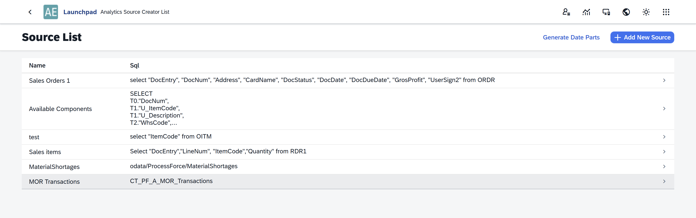

## Add a source

To add a new source, follow these steps:

1. Log in to **CompuTec AppEngine Launchpad**.
  
    

2. Click the **Analytics** icon.

    

3. Click **Go to Source Manager**.

    

4. Here you can see the list of all your data sources. Click **+ Add New Source**.

   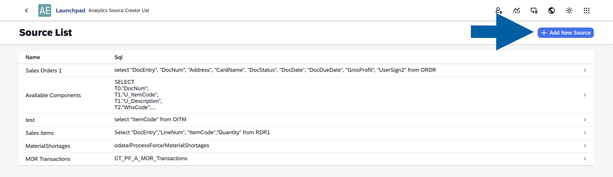

5. Enter the source name.

    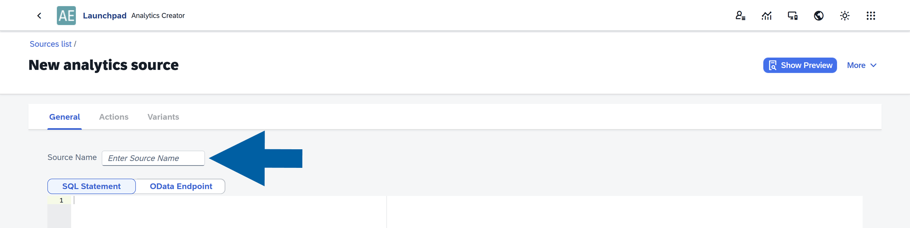

6. Now you can add your own **SQL Statement** or **OData Endpoint**.

    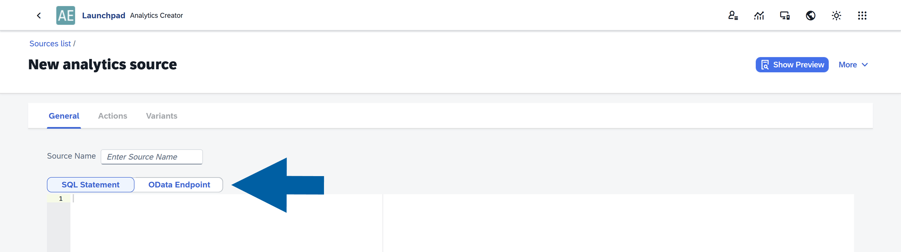

    :::note[info]
    If you want to find **OData** endpoints, you can use our **WebAPI** documentation. You can find it in the **CompuTec AppEngine** login screen after clicking the **help icon** in the upper right corner and selecting **Explore WebAPI**.

    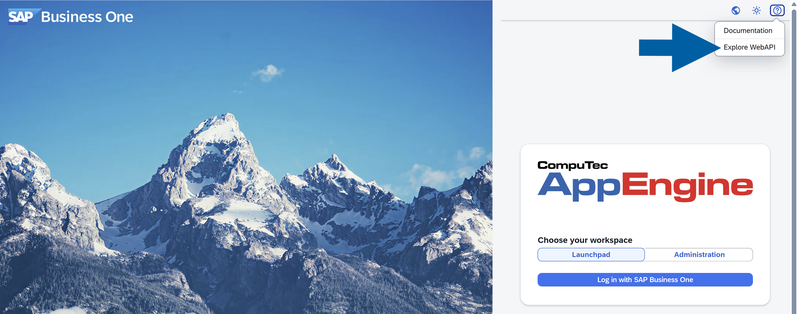

    After selecting a definition from the list, you cand find the **OData** endpoints you can use in **Source Manager** when creating a new data source.  

    Just make sure that it returns correct **List OData** format. Example: ``odata/ProcessForce/AcceptanceQualityLimit``.

      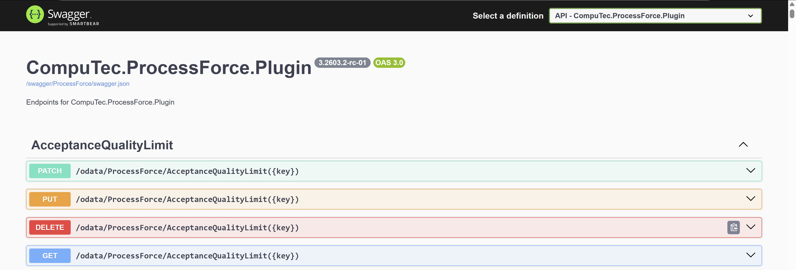
    :::

7. Click **Show Preview** to check how your data looks in the reports.

    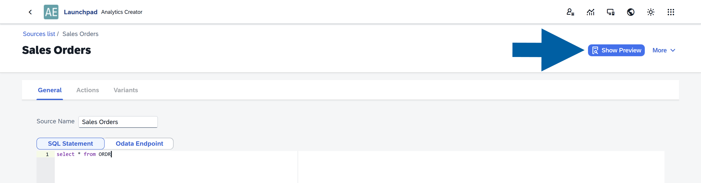

8. In preview mode, you can adjust how your data appears in the analytics report. This allows you to review and refine the presentation of the data before it is used in reports.

    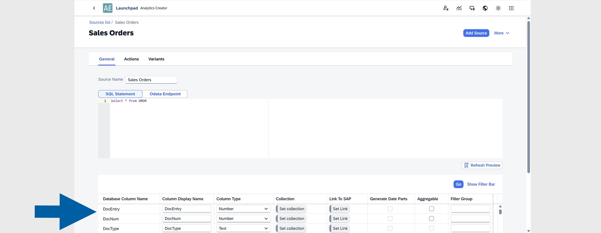

    :::note[info]
    In [this article](http://learn.computec.one/docs/appengine/appengine-users-guide/analytical-page/table-and-chart-options), you can learn more about how to edit your table and chart settings.
    :::

9. If all the data is correct, click **Add Source**.

    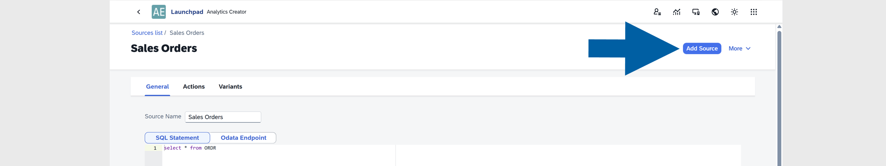

10. After you add a source, you can click **Open Analytics** to see your data in reports.

    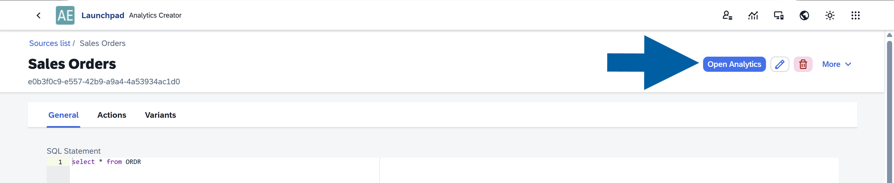

11. Done! You’ve successfully added a new data source.

    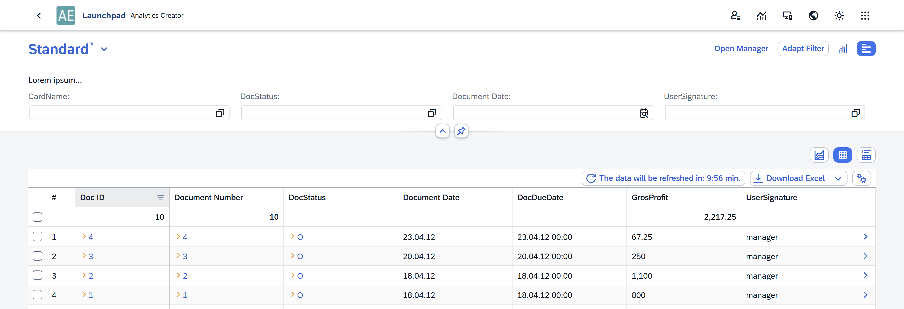

## Import a source

To import a new source from a Json file, follow these steps:

1. Log in to **CompuTec AppEngine Launchpad**.

    

2. Click the **Analytics** icon.

    

3. Click **Go to Source Manager**.

    

4. Here you can see the list of all your data sources. Click **+ Add new Source**.

    

5. Enter the source name.

    

6. Click **More** and choose **Import** from the list.

    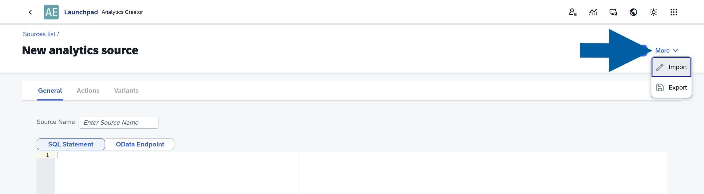

7. Select the Json file and click **Accept**.

    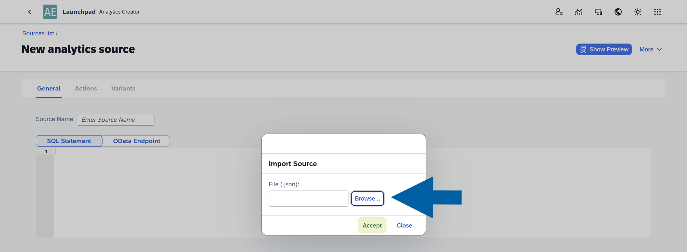

8. Check the **Preview** of your reports and edit it if you need to.

    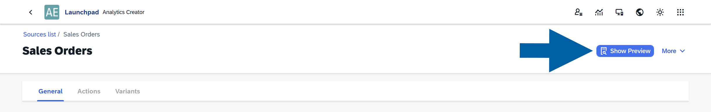

    :::note[info]
    In [this article](http://learn.computec.one/docs/appengine/appengine-users-guide/analytical-page/table-and-chart-options), you can learn more about how to edit your table and chart settings.  
    :::

9. If all the data is correct, click **Add Source**.

    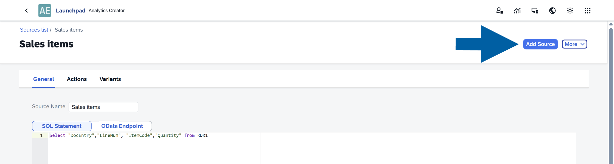

10. After you add a source, you can click **Open Analytics** to see your data in reports.

    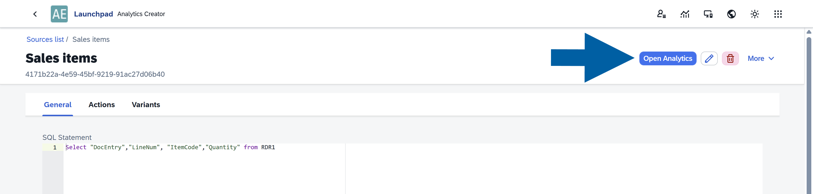

11. Done! You’ve successfully added a new data source.

    

## Edit a source

To edit an existing data source, follow these steps:

1. Log in to **CompuTec AppEngine Launchpad**.

    

2. Click the **Analytics** icon.

    

3. Click **Go to Source Manager**.

    

4. Here you can see the list of all your data sources. Choose the source you want to edit.

    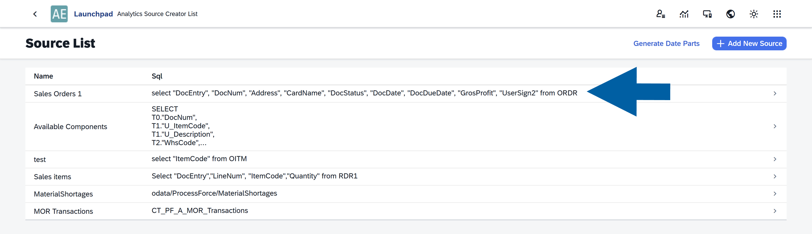

5. Click the **edit** icon to enter the edit mode.

    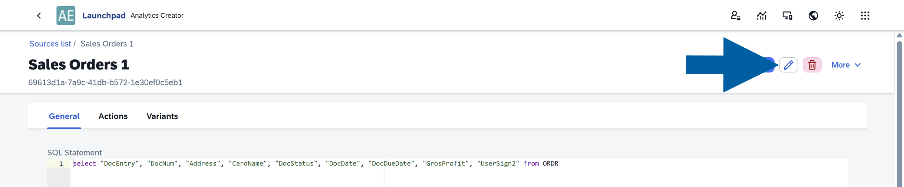

6. In edit mode, you can modify the table and chart settings, and manage analytics actions and variants. [Read more](http://learn.computec.one/docs/appengine/appengine-users-guide/analytical-page/table-and-chart-options)

    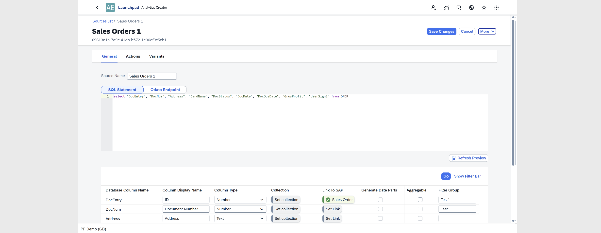

7. After editing your settings, click **Save Changes**.

    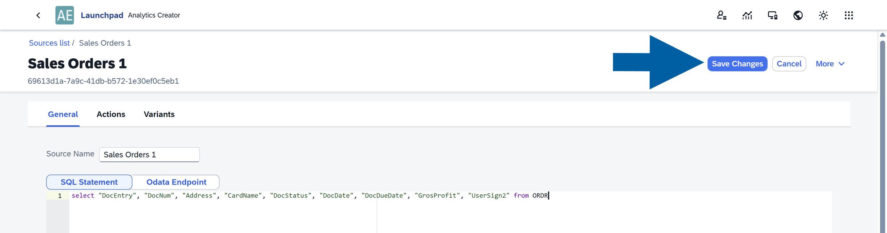

8. Done! Now you know how to edit your existing data sources.
