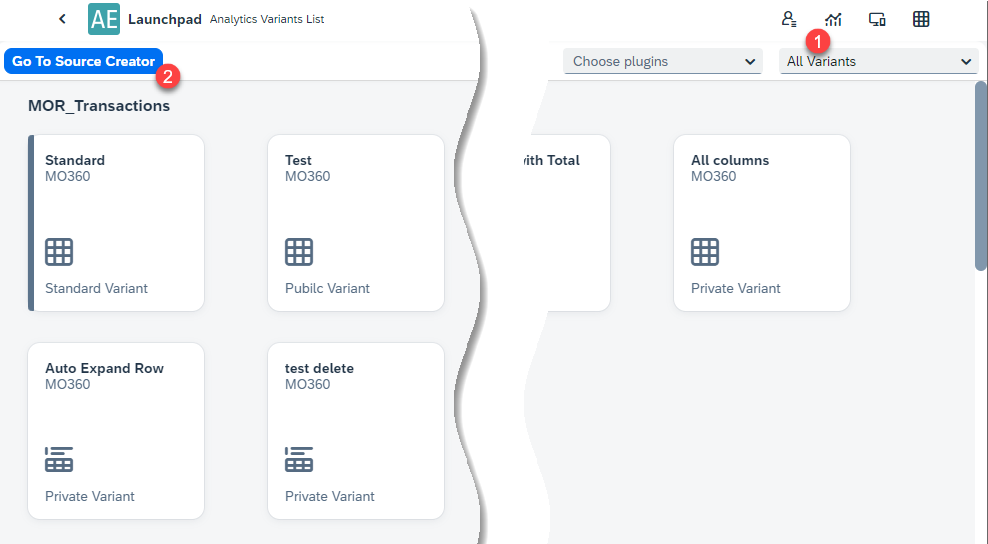

# Source Creator

The Source Creator feature provides advanced configuration options for data presented in [custom reports and analytics of the Analytical Page](../analytical-page/overview.md#usage). This tool allows you to define data sources, customize their structure, and manage variants to optimize data visualization and reporting. With its intuitive interface, users can easily create and configure sources for streamlined analytics.

Below are key terms used in the Source Creator:

- **Standard Variant** - A variant created by CompuTec, typically one per view.
- **Source** - Metadata about the analytics, including information about the table, columns, types, aggregability, names, descriptions, etc.
- **Variant** - UI configurations associated with a source, such as visible columns, filters, grouping, and chart/table settings.

---

To open the option, click the Analytical Page button (1.) in Launchpad and then the Go To Source Creator button:

This leads to the Source List:

The Source List displays all created sources. Users can:

- **Remove** - Delete an existing source.
- **Duplicate** - Create a copy of an existing source.
- **Show** -View the details of a source.

## Creator

The Creator is divided into two main sections:

1. Source
2. Variants

  

### Source

The Source section is further divided into three parts:

1. **Source Name** (Required) - A unique name for the source.
2. **SQL Statement** (Required) - The SQL query used to retrieve data.
3. **Table with Columns** - Displays the structure of the data, which is automatically filled upon clicking "Show Preview" after entering the Source Name and SQL Statement. For each column, you can define the following:

    - Column Name: The name of the column in the table.
    - Column Name Displayed: The name shown in analytics.
    - Column Description: A brief description of the column.
    - Column Type: The data type of the column.

        
    - Collection: Assign a collection to the column:

      - Table Collection

          

      - Custom Collection

          

    - Link to SAP: Link the column to an SAP field (e.g., for ItemCode, select the appropriate SAP field).

         

    - Generate Date Parts: Create additional columns for date parts (e.g., week, day of the month).
    - Aggregable: Enable aggregation for numeric columns, making them usable as measures in charts.
    - Filter Group: Assign the column to a filter group.

### Variants

In the Variants tab, you can manage the variants associated with a source. Variants allow you to customize how data is presented and accessed. Key actions include:

- **Add** - Create new variants.
- **Edit** - Modify existing variants.
- **Delete** - Remove unused variants.

  

To add a Variant, Click + Add Variant.

  
  

You can configure all visualization settings for the source.

Here you can define:

- **Basic Settings** -  Name, View, Default, Accessibility (Public/Private);
- **Table Startup Settings** - settings related to the [Table view](../analytical-page/overview.md#table).
- **Chart Startup Settings** - settings related to the [Chart view](../analytical-page/overview.md#chart).
- **Visual Filter Startup Settings** - settings related to the [charts](../analytical-page/overview.md#chart).

### Export Source

If you're unable to complete creating the source, you can save your progress by exporting it.

  

---
The Source Creator provides a powerful, flexible tool for configuring data sources and variants, enabling tailored analytics and reports. By leveraging its advanced settings, users can effectively structure and customize data for insightful decision-making. Whether adding a new source or managing existing variants, the Source Creator is a key component in optimizing the Analytical Page’s functionality.
