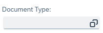
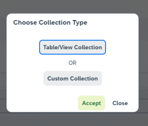

# Source Creator

This option allows advanced configuration of data presented in [AppEngine User's Guide](../analytical-page/overview.md#usage).

---

To open the option, click the Analytical Page button (1.) in Launchpad and then the Go To Source Creator button:

This leads to the Source List:

This is a list of sources currently used in the [Variants](/docs/appengine/appengine-users-guide/analytical-page/overview#variants) used in Analytical views.

You can add a new Variant by clicking the Add New Source button:

## Source tab

Here you can configure:

- the name of the Variant
- the source – an MS SQL query that will be a source of data for the Variant
available fields (for a specific query) – the list is available after clicking the Show - Preview button after entering a query. Here you can modify the Variant by changing values for specific lines. You can set:

        - Displayed Column Name
        - Column Description
        - Column Type
        - Set a Custom Collection (different than in related Table View)

          

          
Click here to find out more.

          

          A collection is a group of vocabulary values available for some fields, e.g., Status - Started, Closed, etc.

          In the context of the Analytical Page, collections are used for filters. In this case, there is a special icon that you can click to open a list of values to choose from:

          

          

          You can either take the values from the related table (the Table/View Collection option) or set them manually (the Custom Collection option):

          

          The Table/View Collection:

          

          The Custom Collection option:

          
          

          

## Variants tab

In this tab, you can manage (add, edit, delete) variants for a source:

Click the + Add Variant to add a Variant:

Here you can define:

- Basic Settings: Name, View, Default, Accessibility (Public/Private);
- Table Startup Settings: settings related to the [AppEngine User's Guide](../analytical-page/overview.md#table-options).
- Chart Startup Settings: settings related to the [AppEngine User's Guide](../analytical-page/overview.md#chart-options).
- Visual Filter Startup Settings: settings related to the [AppEngine User's Guide](../analytical-page/overview.md#chart-options).
