# Table and Chart Options

When you [create a new data source](http://learn.computec.one/docs/appengine/appengine-users-guide/analytical-page/source-creator#add-a-source) or [edit an existing one](http://learn.computec.one/docs/appengine/appengine-users-guide/analytical-page/source-creator#edit-a-source), you can customize many aspects of the analytics report to match your business needs. These settings allow you to control how data is displayed, filtered, summarized, and visualized in tables and charts.

This article explains the available table and chart configuration options and how to manage variants, actions, and drill-down navigation.

## General Tab

The **General** tab allows you to configure the data source and define how individual columns behave in the analytics table.

### Edit Column Display Name

Defines the name displayed in the column header in the report.

### Change Column Type

Select the data type for the column.

Available types include:

- **Text**
- **Date**
- **Date and Time**
- **Number**
- **Integer** (no decimal places)
- **Percent**
- **Price**
- **Amount**
- **Quantity**
- **Duration**
- **Boolean** (Yes/No)
- **User**

### Set Collection

Collections allow you to map values to additional information.

You can choose from three collection types:

- **Table**/**View**: This collection retrieves values directly from a database table field. Use this option when the values already exist in an SAP table.  
Example: Getting the Item Group Name from a table field.
- **Custom**: This collection is a user-defined list of values. Use it when you want to manually map values to more readable names.  
Example: **Key**: ``HR``, **Name**: ``Header``
- **Dynamic**: This collection automatically reads values from the analytics table. It only shows values that are currently visible in the report and updates automatically when filters are applied.  
Required information: **Key** – The field name used to retrieve values.

:::note[info]
**User Collection** is available when the **Column Type** is set to ``User`` in **Source Manager**. This option automatically provides a list of system users for use in reports.  
Example: ``CURRENT_USER`` — A variable that always represents the user currently logged in.
:::

To create a new collection, follow these steps:

1. Select the collection **Type**.

2. Provide the required information:

        - **Table**/**View** collection: Provide **Collection** (the SAP table name that contains the data, for example, ``OWHS``), **Key** (the field used to match the data, for example, ``WhsCode``), and your custom name for the collection.

            

        - **Custom** collection: Provide the **Key** and **Name** pairs that match the current field values, for example: ``HR`` and ``Header``.

            

        - **Dynamic** collection: Provide **Key** based on **Field** name. It limits selectable values based on the report results. 
        With a **Dynamic** collection, the system shows only values that exist in the report output, instead of all values from the source table. 

            

3. Click **Accept** to save the collection.

### Link To SAP

Allows you to link the column directly to **SAP Business One** objects.

You can configure:

- **Object Type**: Use this option to link the column to a specific **SAP Business One** object.

  - **Object Type** – defines which SAP object to open (for example, ``Sales Order`` or ``Business Partner``)
  - **Key** – specifies which column value is used to identify the record

  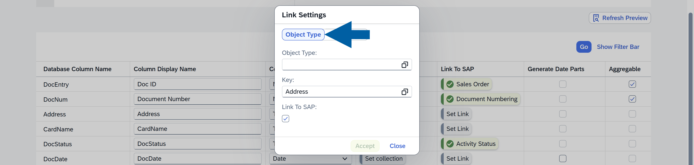

    This option is best when you want to navigate directly to a specific type of document or master data.

- **Field**: Use this option to create a link based on a specific field.
  - **Field** – defines the target field used for navigation
  - **Key** – specifies which column value is used as the reference.

  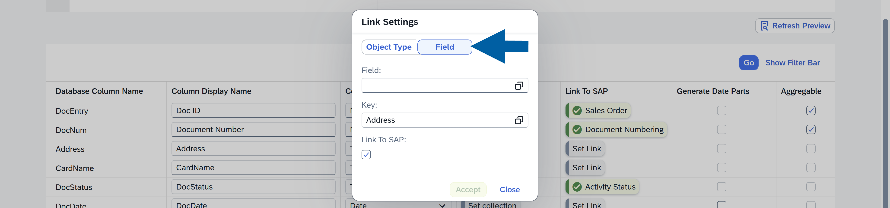

    This option provides more flexibility when linking data that is not tied to a single object type.

When enabled, users can click a value in the report and open the related record in SAP Business One. This makes it easier to navigate reports to source data and quickly access detailed information.

### Generate Date Parts

Splits a date field **into additional components**, such as month number, or week number of the month.  These new fields are automatically added as additional columns.

This option is available only for **Date** data types.

### Define Whether the Data is Aggregable

**Aggregable** option determines whether the column can be used in:

- Chart calculations
- Table summaries

This option is available only for **numeric data types**.

### Configure Filter Group

The **Filter Group** option assigns a column to a specific group of filters in the report.

This grouping helps organize filters in the report interface. Columns assigned to the same group appear together in the **Adapt Filters** panel, making related filters easier to find and manage.

In the configuration table, you define the **Filter Group** for each column. When users open **Adapt Filters**, the filters are displayed under the group names you defined (for example ``First``, ``Second``, etc.). Filters that are not assigned to a group appear in the **Others** section.

#### View Filter Groups

To see your filter groups, follow these steps:

1. In the chosen **Variant**, click **Adapt Filter**.

        

2. Click the **Group View** icon.

        

3. You will now see the filters organized according to the **Filter Groups** defined in the configuration.

        

You can then enable or disable individual filters within each group and choose which ones should be visible in the report.

:::warning[important]
After changing table settings, you may see a **warning** in the **Variants** tab.

This happens because changes in table configuration can affect existing variants.

To resolve this issue:

1. Go to the **Variants** tab.

2. Review the changes.

3. Click **Fix All Variants**.

        

4. **Update** the changes.

        

:::

## Actions Tab

In the Actions tab, you can review Linked Objects associated with the selected data source. Actions allow users to trigger specific operations for a selected row directly from the report.

Actions are defined in plugins, so after installing plugins, additional actions become available for use in Analytics.

To use actions in a report:

1. Click **edit icon** to enable edit mode in the chosen source.

        

2. In the **Actions** tab of the variant configuration, click the name of the  **Action** you want to edit.

        

3. Once configured, you can enable or disable these actions to allow users to perform operations directly from the analytics report.

        

## Variants Tab

The **Variants** tab displays all variants created for the selected data source.

**Variants** allow you to save different report configurations, including filters, table layouts, and chart settings. In this tab, you can review existing variants, add new variants, or edit the existing existing ones.

:::note[info]
You can read more about variants in [our article](http://learn.computec.one/docs/appengine/appengine-users-guide/analytical-page/overview#about-a-variant).
:::

### Basic Settings

In the Basic Settings section, you can:

- Edit the **Variant Name**
- Add a **Description**
- Set the variant as **Default** for the data source
- Make the variant **Public** or keep it private
- Configure additional permissions

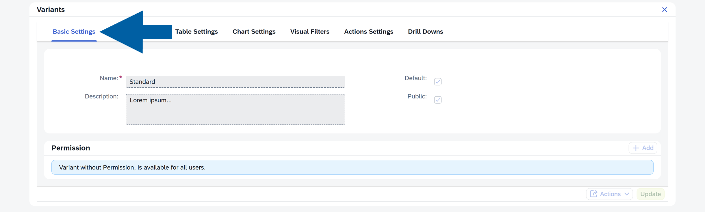

:::note[info]
For more information about managing permissions, see the [our article on Analytics permissions](http://learn.computec.one/docs/appengine/appengine-users-guide/analytical-page/permissions_in_analytics).
:::

### Forms Definition

**Forms Definition** allows you to add an **Analytics** report to the **SAP Business One** interface. You can make the report available either:

- in the **SAP Business One** main menu, or
- as a **right-click** (context menu) option within a selected form (for example, a Manufacturing Order)

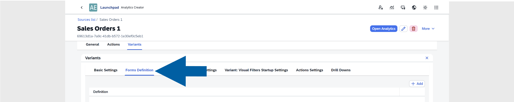

This enables users to open **CompuTec AppEngine Analytics** reports directly from **SAP Business One**, without switching applications. For example, users can launch the report through a dedicated SAP menu option or by using the right-click context menu, for example, from a Manufacturing Order.

### Add a Forms Definition

To add a form definition:

1. Click the **edit icon** to enter the edit mode.

        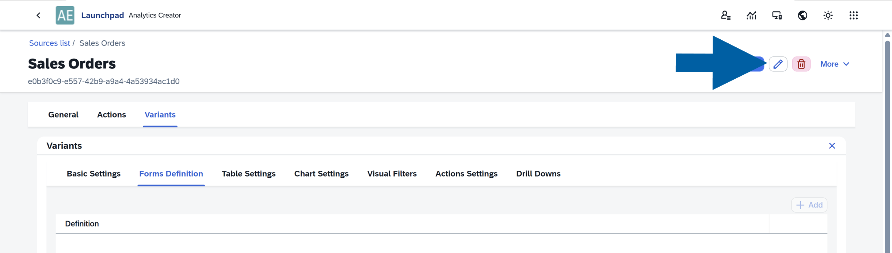

2. Click **+ Add**.

        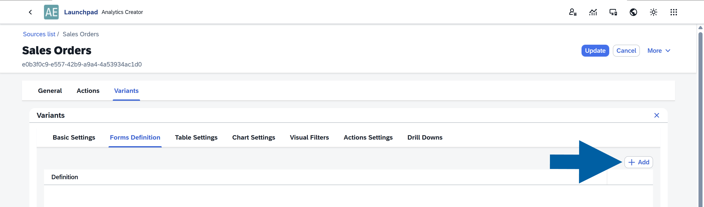

3. Enter the form definition.

        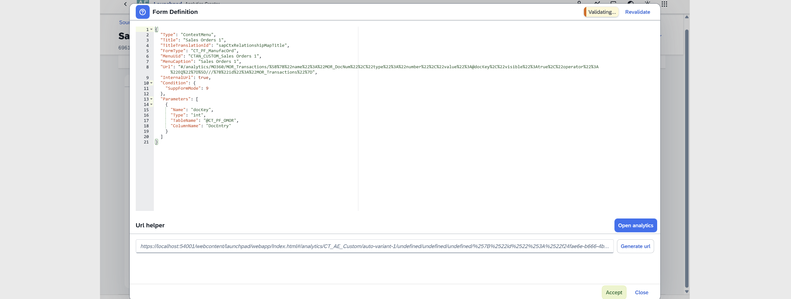

4. Review the results. The system validates the definition automatically. You can also manually click **Revalidate**.

5. (optional) You can use the **URL helper** and select **Open Analytics** to preview the report.

6. If the results are correct, click **Accept**, and then click **Update** in the **Form Definition** tab.

        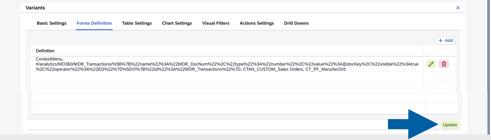

### Table Settings

The **Table Settings** section controls how the report table behaves and appears.

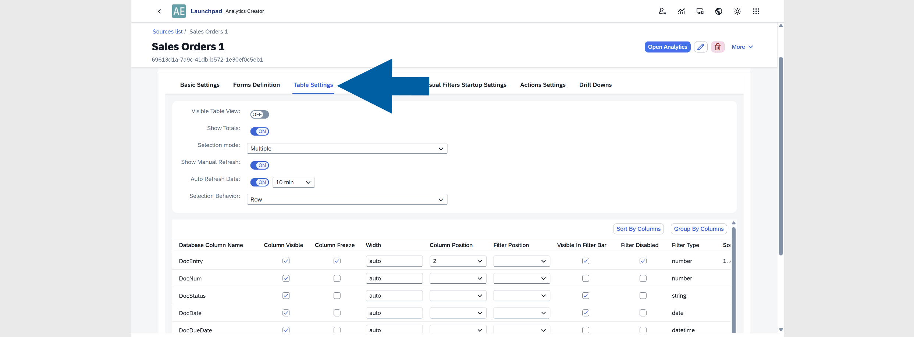

Available options include:

- **Visible**:  Show or hide the table in the report.
- **Show Totals**:  Display summary totals in numeric column headers.
- **Selection Mode**:  Defines row selection behavior. Available options: ``None``, ``Single``, ``Multiple``.

    :::info[NOTE]  
    If you plan to use **Actions** or **Drill Downs**, it is recommended to set **Selection Mode** to ``Multiple``.
    :::

- **Show Manual Refresh**: Displays a **Refresh** button in the report.
- **Auto Refresh Data**: Automatically refreshes the data every ``1``, ``5``, ``10``, ``30``, or ``60`` minutes.
- **Selection Behavior**: Available options: ``Row Selector``, ``Row Only``, or ``Row``.
- You can configure individual columns with the following options:

  - **Column Visibility**: Show or hide the column
  - **Column Freeze**: Keep the column fixed when scrolling
  - **Width**: Set the column width. Supported units include: em, ex, rem, vw, vh, vmin, vmax, cm, mm, in, pc, pt, px. Read more
  - **Position**: Default column order
  - **Filter Position**: Default position of the filter
  - **Filter Visible**: Show or hide the filter
  - **Filter Disabled**: Disable the filter in the report
  - **Filter Type**: Defines the filter type
  - **Sort**: Default sorting (``Ascending`` or ``Descending``)
  - **Group**: Group rows by this column
  - **Filter Value**: Set a default filter value for the variant

### Chart Settings

The **Chart Settings** section controls how data is visualized.

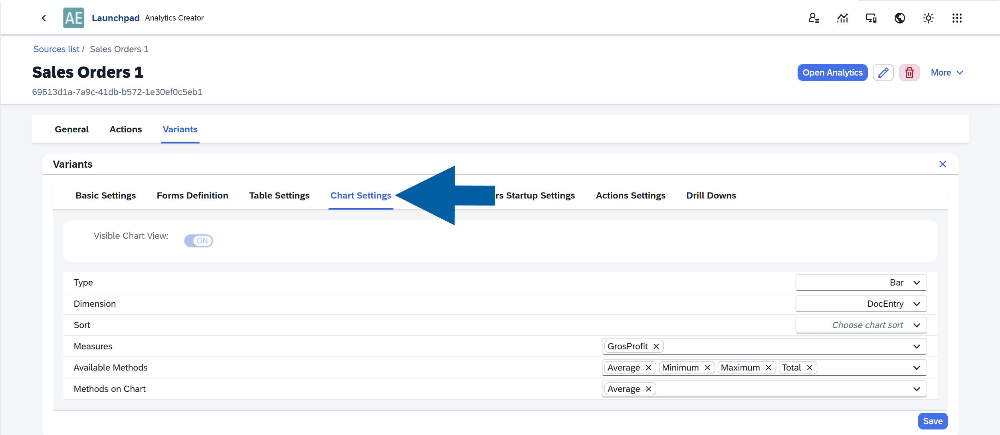

Available options:

- **Visible Chart View**:  Show or hide the chart in the report.
- **Chart Type**: Available chart types: ``Bar``, ``Column``, ``Line``, ``Pie``.
- **Dimension**: Defines the field used as the chart dimension.
- **Sort**: Options include: ``No sorting``, ``Ascending``, ``Descending``.
- **Measures**: Defines the value used to measure the selected dimension.
- **Available Methods**: Select calculation methods available in the chart: ``Sum``, ``Average``, ``Minimum``, ``Maximum``, ``Total``.
- **Methods on Chart**; Defines which calculation methods are displayed in the chart. Examples: ``Total``, ``Min``, ``Max``, ``Average``.

### Visual Filters

This section allows you to configure **Visual Filters**.

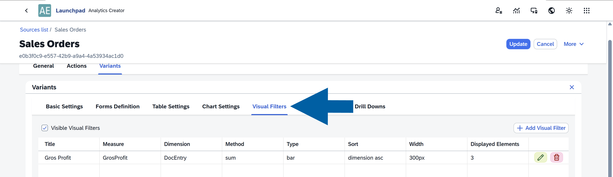

In this section, you can:

- Show or hide visual filters
- Modify filter settings
- Add new visual filters
- Remove existing filters

**Visual Filters** provide a quick, interactive way to filter report data. They are displayed as **microcharts** directly within your analytics reports. [Read more](https://learn.computec.one/docs/appengine/appengine-users-guide/analytical-page/overview/#use-microcharts)

### Action Settings

In this section, you configure which actions are available for the selected report variant.

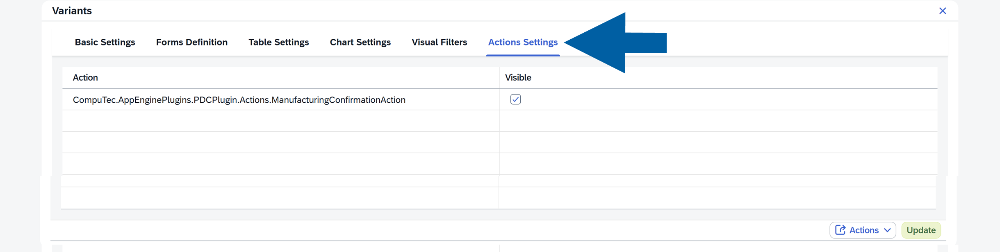

This allows you to control which operations users can perform directly from the report, depending on the variant they are using.

For example, you may have different variants such as **Sales**, **Warehouse**, or **Production**. Each variant can have its own permissions and therefore only the relevant actions should be enabled for that specific variant.

By configuring **Action Settings**, you ensure that users see only the actions that are appropriate for their role and report context.

:::note[info]
You can read more about **Actions** in [our documentation](http://learn.computec.one/docs/appengine/appengine-users-guide/analytical-page/table-and-chart-options#actions-tab).
:::

#### Activate an Action

To activate an Action, you must configure the connection between the report Source and the Action parameters by mapping the required values. These values are then passed to the Action as arguments when it is triggered.

To activate an action, follow these steps:

1. Go to the **Source** where you want to enable the Action and open the **Actions** tab.

    

2. Enter the edit mode by clicking the **edit icon**.

    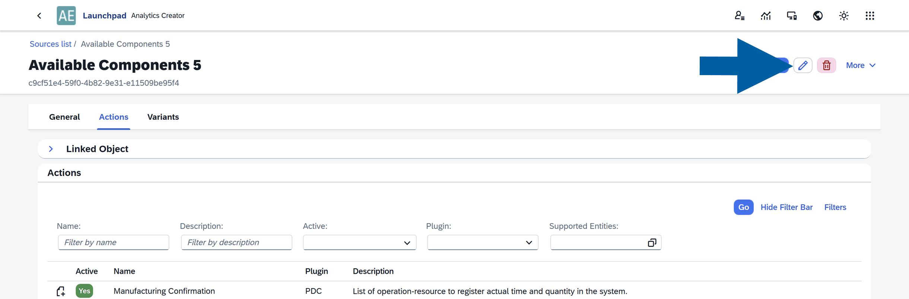

3. Select **Action** you want to activate.

    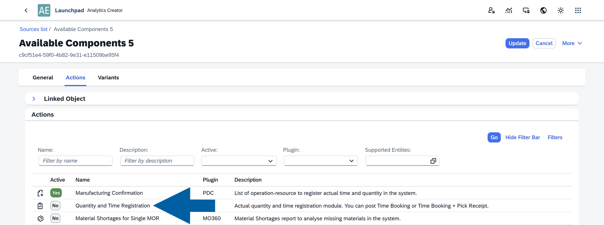

4. In the **Additional Information** section, configure how the Action should receive data from the report:

    - (optional) **Object Type**: Defines how the Action should behave depending on the object it is applied to.  
    Example: if an Action can work with both the **Sales Orders** and **Manufacturing Orders** object types, you can specify the rules for the selected object type.
    - **Required**: If enabled, the Action will not be executed when the mapped value is empty.
    - **Source Type**: Choose how the value will be provided:

        - **Constant**: A fixed value defined manually
        - **Field**: A value taken from a column in the report

    - **Value Source**: Select the column from the report that should be mapped to the Action parameter.

    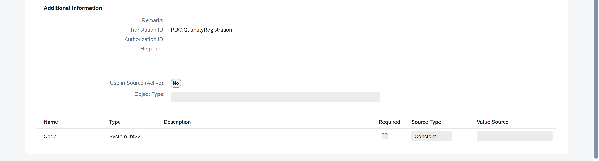

5. Click **Use in Source** to apply the mapping.

    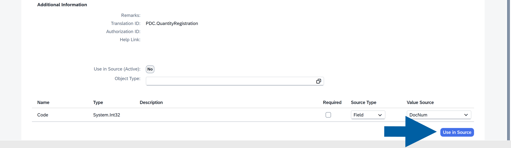

6. Click **Update**.

    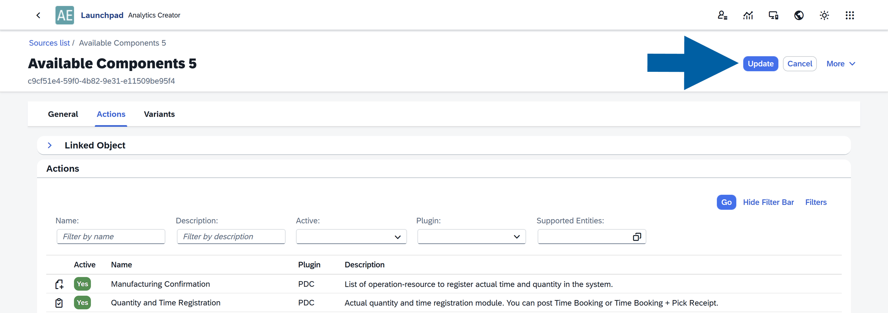

7. Done! The **Action** is now activated and available in the report.

### Drill Downs

The **Drill Downs** section allows you to create connections between reports. Here you can:

- View existing drill-down definitions
- Edit them
- Add new ones
- Delete existing drill-downs

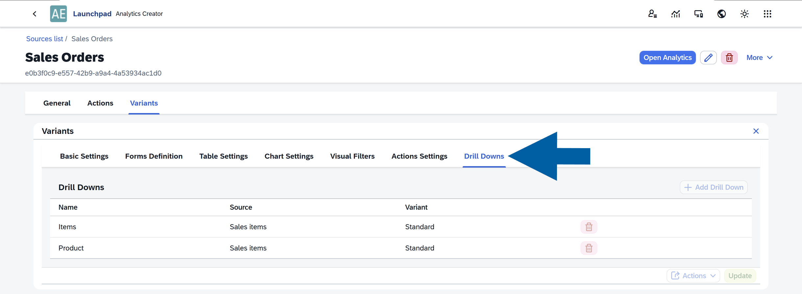

**Drill Down** connects one report to another. When a drill-down is configured, an arrow icon appears on the right side of the table. Users can click it to open a related report with additional details.

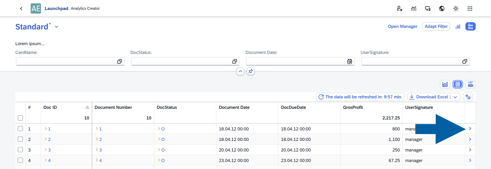

#### Add a new Drill Down

To add a new Drill Down:

1. Open **CompuTec AppEngine Launchpad**.

2. Navigate to **Source Manager**.

3. Select the data variant you want to edit.

    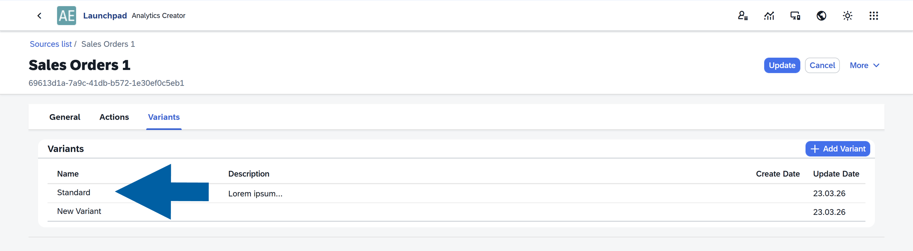

4. Click the **edit icon**.

    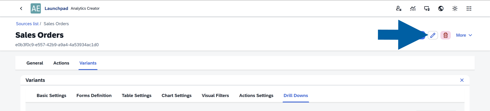

5. Navigate to **Drill Downs**.

    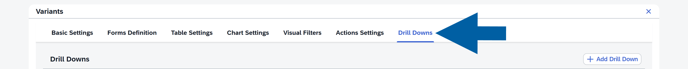

6. Click **+ Add Drill Down**.

    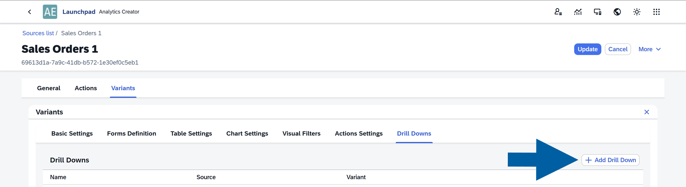

7. Enter your **Drill Down Name**.

    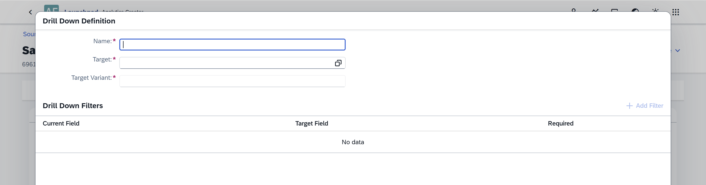

8. Choose the **Target** for your **Drill Down**: The report that will open when the drill-down is used.

    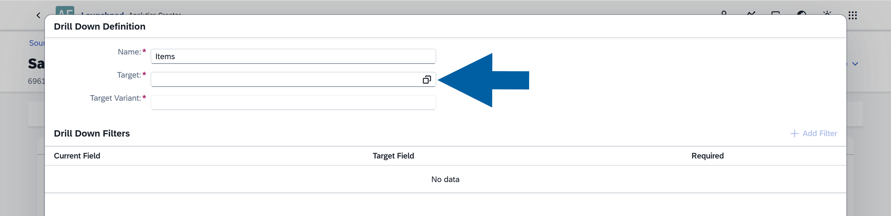

9. Choose the **Target Variant**: the variant of the target report.

    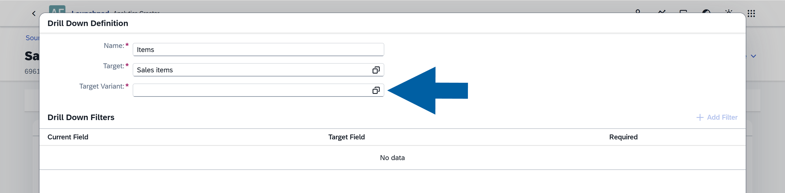

10. (optional) You can filter drill-down results so that the target report displays only relevant data. To add a filter:
    - Click **+ Add Filter**.

        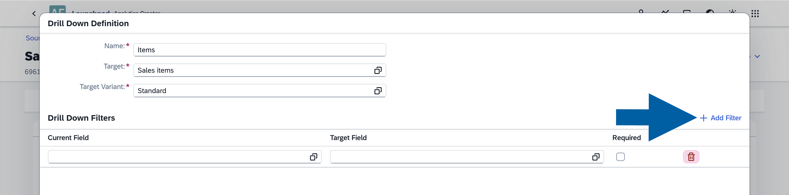

    - Select **Current Field** and **Target Field**. These fields are used to map and connect the reports.
    - If you enable **Required**, the drill-down option will not appear when the **Current Field** value is empty.
    - After configuring the drill-down, save your changes.

    :::info[note]
    If multiple drill-downs are configured, users will see several navigation options when clicking the Drill Down arrow in the report.

    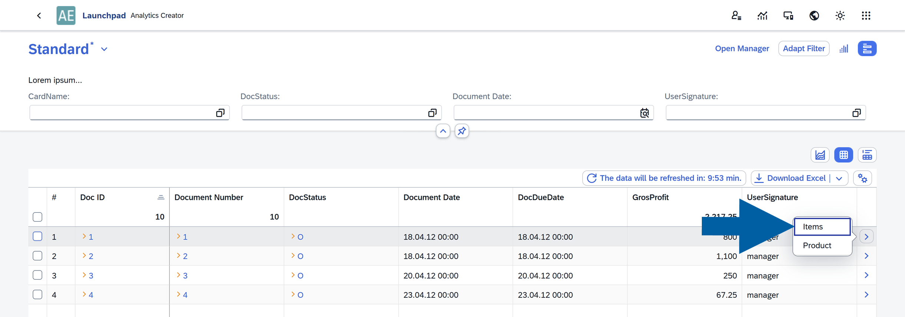
    :::

11. (optional) Click **Actions** to save the existing settings as a new variant.

    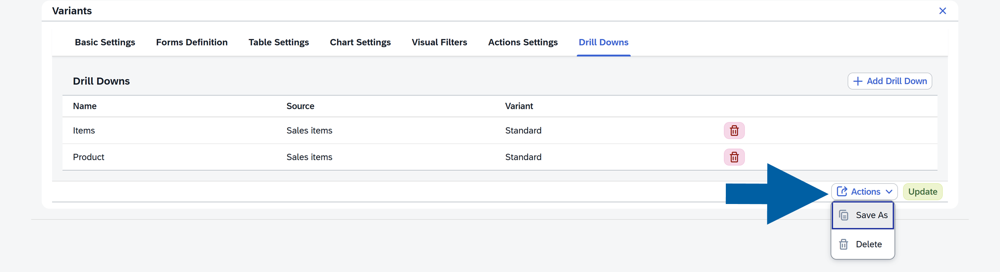

12. Click **Update** to update the edited variant.

    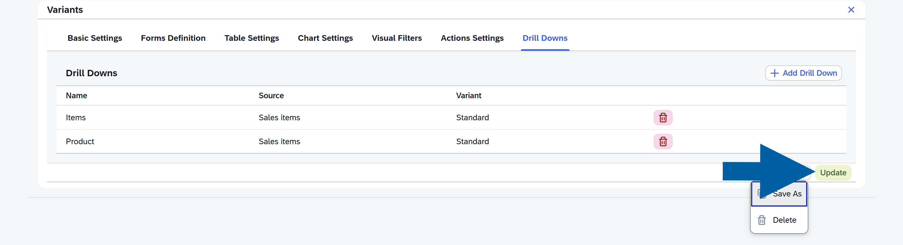

13. Click **Update** next to the source name to save your changes.

    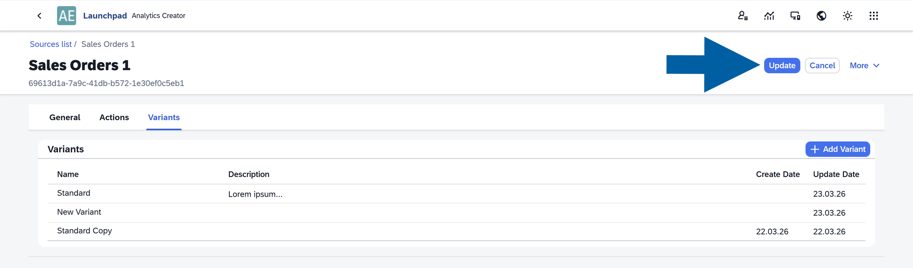

:::info[note]
If you have any questions, contact us using [CompuTec Support Portal](https://support.computec.pl/servicedesk/customer/portals?q=webUp).
:::
