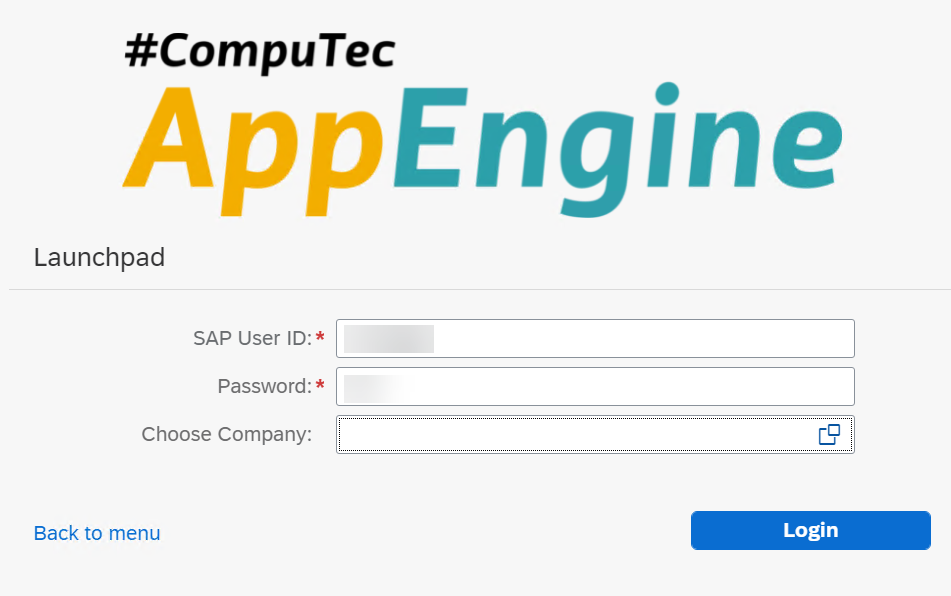
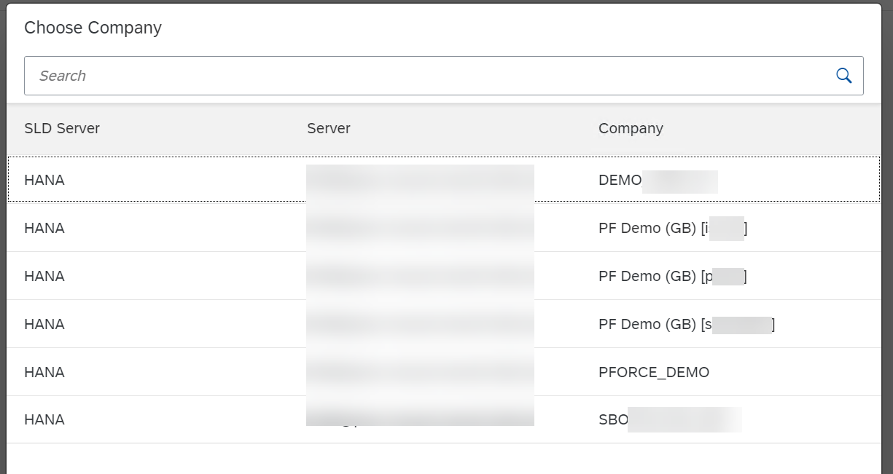
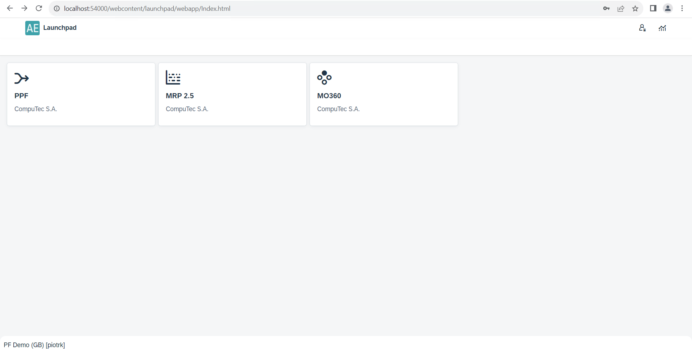

# Launchpad

Once the [Launchpad Configuration](../administrators-guide/configuration-and-administration/overview.md) is completed, you can log in (using an SAP Business One user) to Launchpad to use the plugins on a specific scheme:

If the user has access to more than on scheme, you have to choose one to work with from the list (by clicking the icon in the Choose Company field):

After logging in, the panel with plugins is displayed (represented by tiles). In the following example, three plugins are installed:

You can define what plugins are available for a specific scheme in [Plugin Settings](../administrators-guide/configuration-and-administration/overview.md#plugins)

Click a plugin tile to start working with it. Check the [Plugins User's Guide](../plugins-user-guide/overview.md) for manuals of specific plugins.
