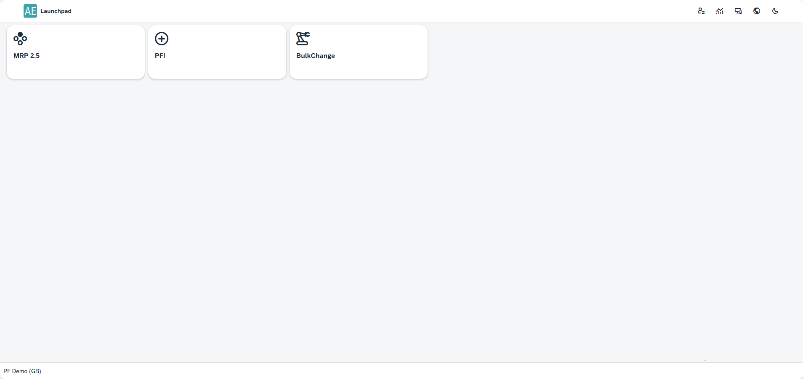

# Launchpad

The Launchpad serves as a central hub for accessing and managing plugins in your SAP Business One environment. After completing the necessary [Launchpad Configuration](../administrators-guide/configuration-and-administration/configuration.md), users can log in using their SAP Business One credentials to leverage the platform’s capabilities tailored to a specific scheme

---

Once configured, you can access the Launchpad interface.

After logging in, the Launchpad displays a panel organized into tiles, each representing an available plugin. For instance, a configuration might include three plugins, as shown below:

The availability of plugins for specific schemes is defined in the [Plugin Settings](../administrators-guide/configuration-and-administration/plugins/overview.md)

Users can click on any plugin tile to start working with it. For detailed guidance on individual plugins, refer to the [Plugins User's Guide](../plugins-user-guide/overview.md).

---
