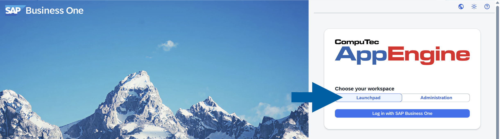
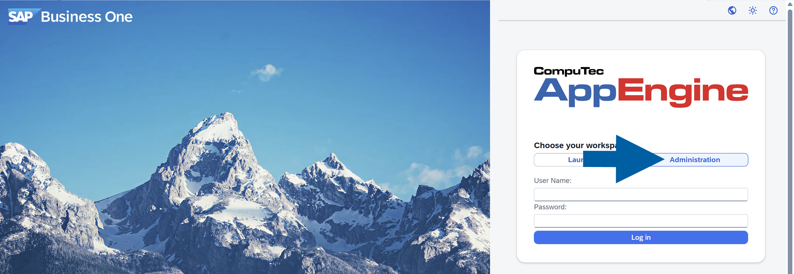
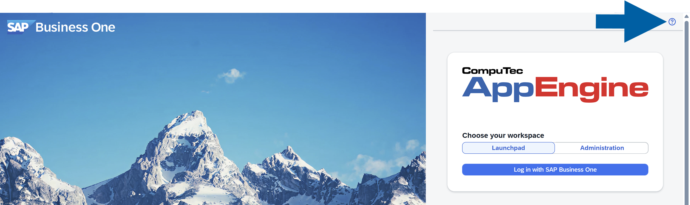

# Overview

The main window of the platform provides access to three key areas:

- **Launchpad**: Access your applications and start working with available modules. In Launchpad, you'll also find the Analytics module. [Read more](https://learn.computec.one/docs/appengine/appengine-users-guide/launchpad)

    

- **Administration** : Manage system settings, plugins, users, and other configuration options. [Read more](https://learn.computec.one/docs/appengine/administrators-guide/configuration-and-administration/installation)

    

- **REST/OData API Documentation**:   Explore available APIs for integration and development purposes. [Read more](https://learn.computec.one/docs/appengine/developers-guide/rest-odata-api/rest-odata-api-documentation)

  
