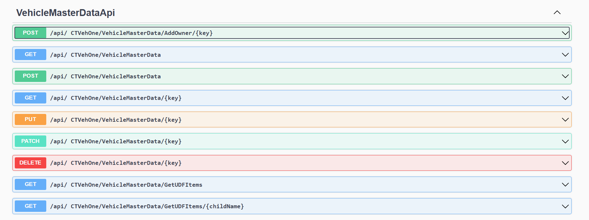
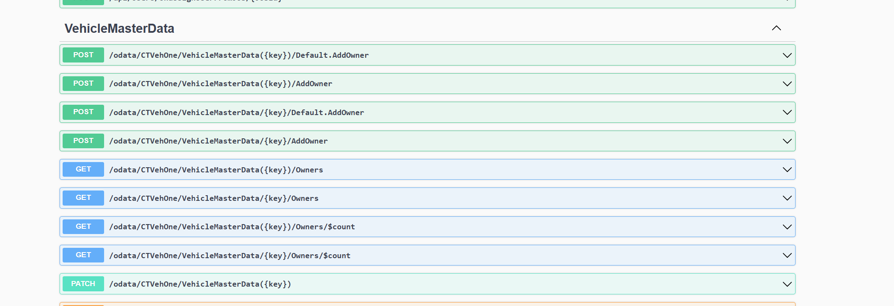

# Extending Generated OData or CRUD Controllers

Generated controllers are public partial classes, allowing you to add custom endpoints by creating a file with your own endpoint code. This guide covers extending CRUD and OData controllers to include custom methods, such as an AddOwner endpoint.

---

## Extending CRUD Controllers

Generated controllers in your application are public partial classes, making it straightforward to augment their functionality. Below is an example of adding a custom AddOwner endpoint to a VehicleMasterDataApiController.

```csharp
partial class VehicleMasterDataApiController
{
    [HttpPost]
    [Route("AddOwner/{key}")]
    public async Task<ActionResult<VehicleMasterData>> AddOwner(string key, [FromBody] Owner vehicleMasterData)
    {
        var udo = await GetEntityByKeyAsync(key);
        udo.Owners.SetCurrentLine(udo.Owners.Count - 1);
        if (udo.Owners.IsRowFilled())
            udo.Owners.Add();
        udo.Owners.U_OwnerName = vehicleMasterData.Name;
        udo.Owners.U_OwnerAddress = vehicleMasterData.Address;
        
        var result = udo.Update();
        return result != 0 ? BadRequest("Error") : Ok(Serializer.ToModel(udo));
    }
}
```

All controllers are visible in Swagger:



## Extending OData Controllers

For OData controllers, adding custom actions involves updating the model description and defining the method in a partial class.

**Steps to Add a Custom Method to OData Controllers**:

1. Extend Model Definition

Override the `BuildCustomEdmModel` in the `PluginInfo` class to register the entity action:

    ```csharp
    public override void BuildCustomEdmModel(ODataConventionModelBuilder builder)
    {
        var action = builder.EntityType<VehicleMasterData>().Action("AddOwner");
        action.Parameter<Owner>("owner");
        action.ReturnsFromEntitySet<VehicleMasterData>("VehicleMasterData");
    }
    ```

2. Add Method to OData Controller

Define the `AddOwner` method in a partial class of the generated controller:

    ```csharp
    [HttpPost]
    public async Task<IActionResult> AddOwner([FromODataUri] string key, ODataActionParameters parameters)
    {
        if (!parameters.TryGetValue("owner", out var cowner) || !(cowner is COwner owner))
        {
            return BadRequest("Owner is required");
        }

        var udo = await GetEntityByKey(key);
        if (udo == null)
        {
            return NotFound();
        }

        udo.Owners.SetCurrentLine(udo.Owners.Count - 1);
        if (udo.Owners.IsRowFilled())
        {
            udo.Owners.Add();
        }

        udo.Owners.U_OwnerName = owner.Name;
        udo.Owners.U_OwnerAddress = owner.Address;

        var result = udo.Update();
        return result != 0 ? BadRequest("Error updating the entity") : Ok(Serializer.ToModel(udo));
    }
    ```

All controllers are visible in Swagger:



---
Extending CRUD and OData controllers with custom endpoints provides tailored functionality, making your application more versatile and aligned with business requirements. Empower your application by leveraging these techniques to meet complex API needs efficiently!
