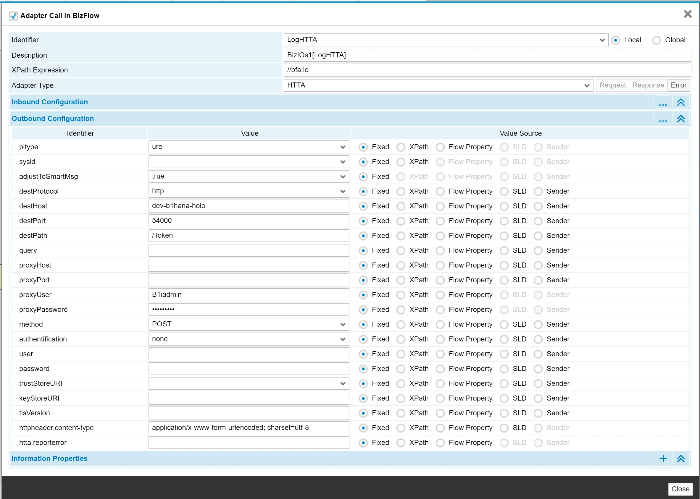
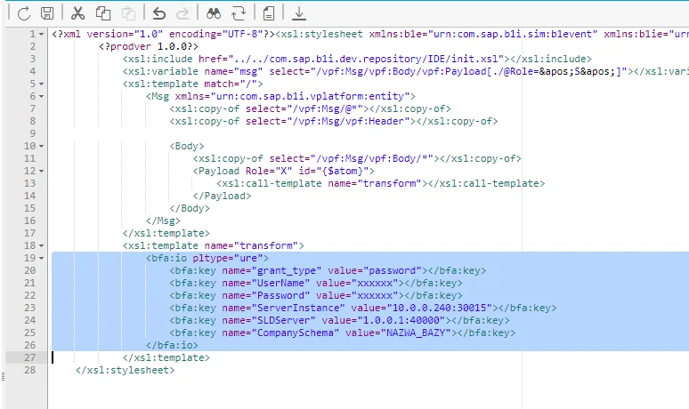
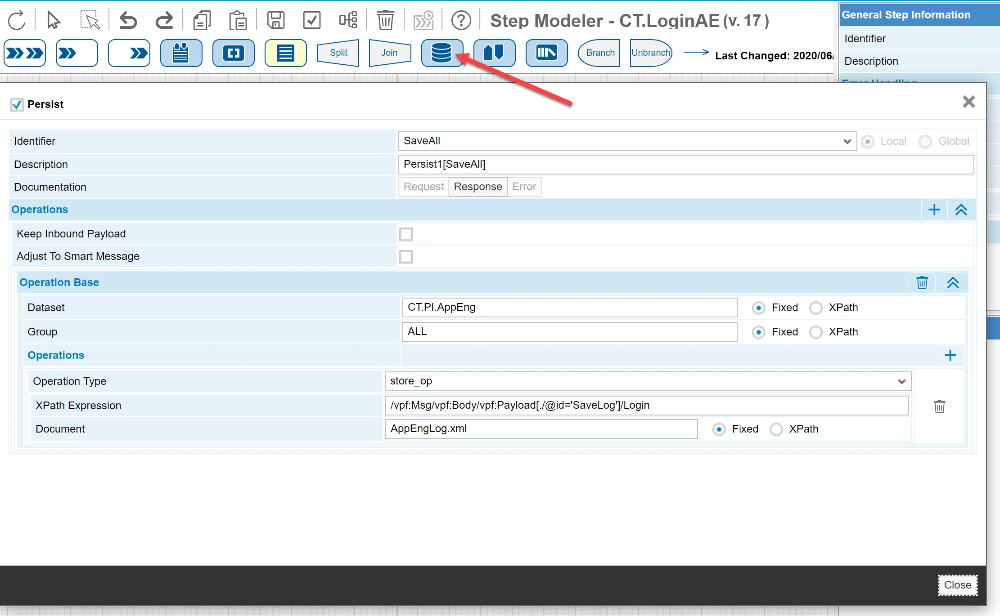
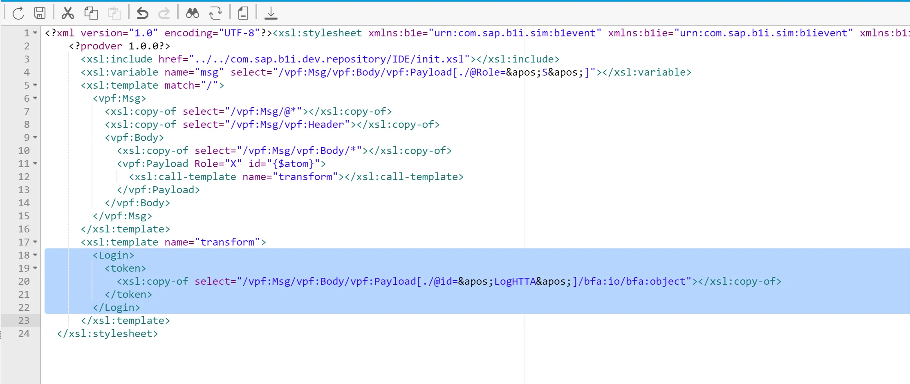
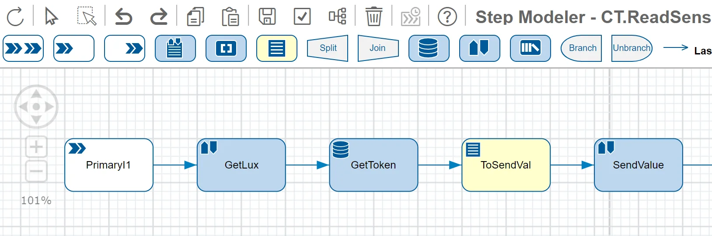
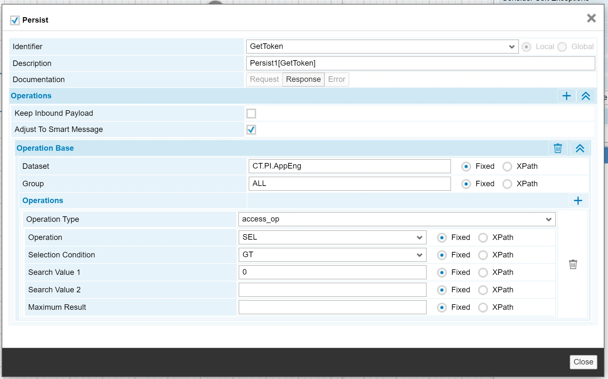
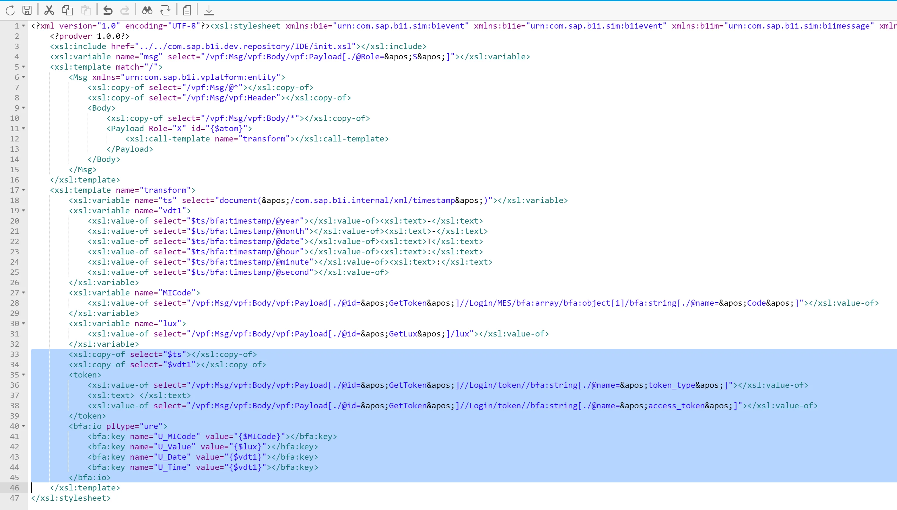
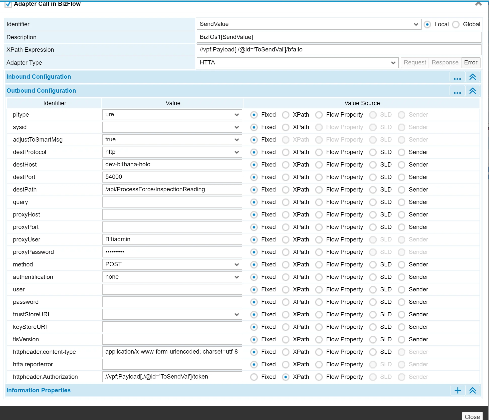

# Connecting to AppEngine from SAP Business One Integration Framework (B1if)

:::warning
    Currently, there is an issue while running simultaneous transactions using API. The workaround for this solution is calling Login and Logout separately for each transaction.
:::

Example of a connection made from B1if (v2.0) to AppEngine using REST API.

There are two methods available to authenticate: using **cookies** or a **token**. In the example below, we use token authentication as it is preferable in such usage.

The token is generated after a successful login operation and has a limited lifespan (20 minutes). After expiration, a new token needs to be generated. There is an additional challenge here to store tokens in B1if as an Integration Package with Scenarios can connect to one AppEngine and many different company databases. The best solution, in this case, is storing tokens in BizStore.

---

## Login

We will use the HTTA atom configured as shown below:

Login data are prepared in the XSL transformation atom. The most crucial part that prepares the structure for API is marked on the screenshot:

## Storing Token

The generated token can be saved using the Persit atom:

Data (token) that are selected by XPath expression can be prepared in transformation atom:

After that, we can save it to BizStore with parameters:

- Operation Type: store_op
- Document: Name of a document in BizStore where we want to save the token.

## Using token in an integration scenario

Below is an example of sending data to AppEngine. Authentication is done using the token saved in the previous steps.

1. GetLux – an atom that prepares data that will be sent to AppEngine.
2. GetToken – an atom that gets a saved token (Operation Type: access_op).

    
3. ToSendVal - prepares JSON structure (according to documentation for a given object - in our example, this is InspectionReading) that will be sent to AppEngine. Atom prepares data in variables, creates \<token\> section and place JSON structure in \<bfa:io\> section.

    
4. SendValue - HTTA atom sends data to AppEngine.

    

    Parameters:

    - destPath - points to a function called API function.
    - XPath Expression points to JSON data.
    - Outbound Configuration - in this section, we need to add the following parameters:

      - httpheader.content-type - application/x-www-form-urlencoded; charset=UTF-8
      - httpheader.Authorization - points to prepared token

## Summary

As pointed out at the beginning of the integration environment, there can be many connections to AppEngine. The described scenario minimizes the required authentication calls by saving tokens in BizStore. The token's lifetime is limited, and a new token must be obtained after its expiration. This can be done by simply recursively calling the Login and Store token, or a more sophisticated solution would be checking if a token is active and then conditionally calling the Login and Store token. The choice of a solution depends on a given business case. Error handling should also be added to the presented solution.
