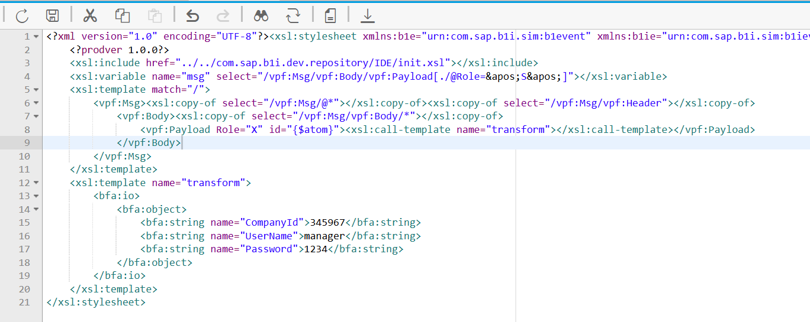
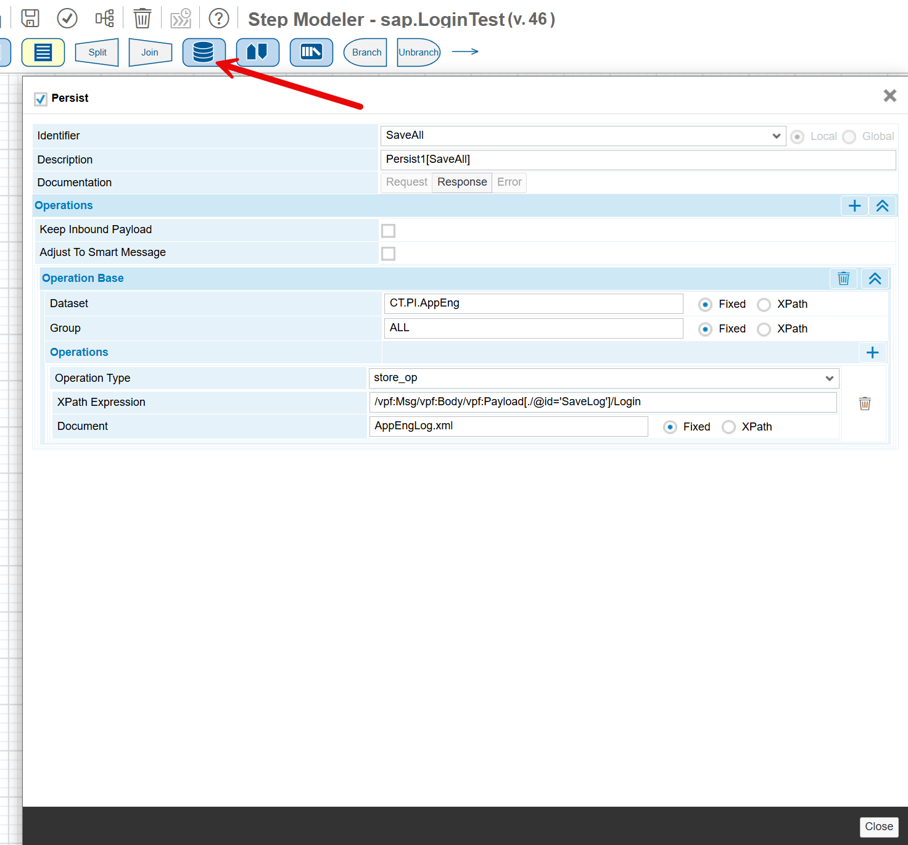
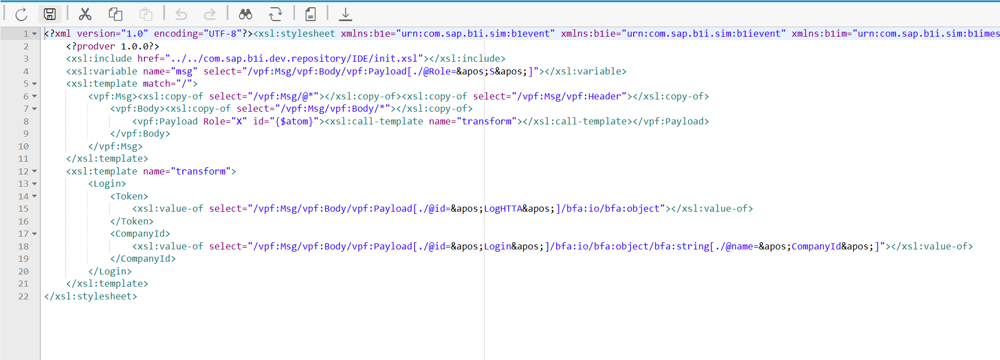
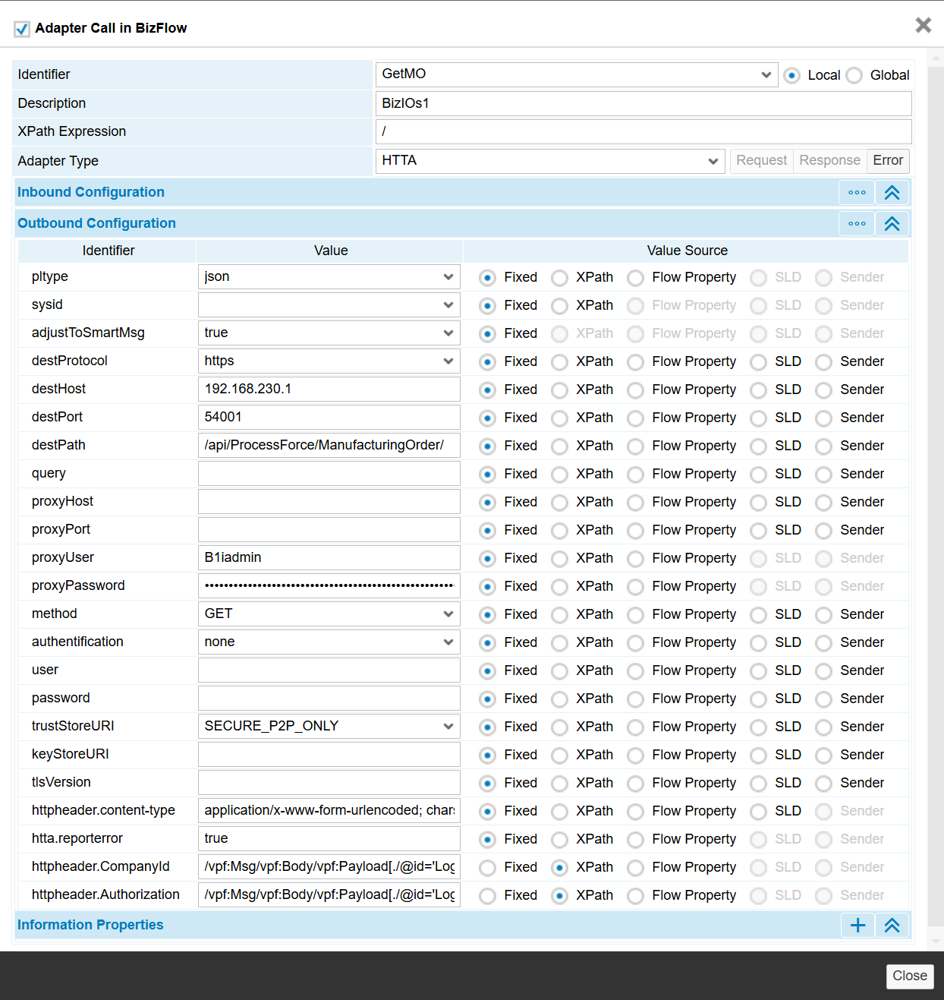

# Connecting to CompuTec AppEngine from SAP Business One Integration Framework

Efficient integration between SAP Business One Integration Framework (B1if v2.0) and external systems like CompuTec CompuTec AppEngine is essential for seamless data exchange. This document demonstrates how to establish such a connection using REST API and token-based authentication.

---

Example of a connection made from B1if (v2.0) to CompuTec AppEngine using REST API:

When integrating B1if (v2.0) with CompuTec AppEngine via REST API, two authentication methods are available: **cookies** and tokens. This example focuses on token-based authentication, which is more secure and suitable for such scenarios.

Tokens are generated upon a successful login and have a limited validity of 20 minutes. Once the token expires, a new one must be obtained to maintain functionality.

A key challenge in this setup is managing tokens efficiently within B1if, especially when integration scenarios involve connecting a single CompuTec AppEngine instance to multiple company databases. The optimal solution for this challenge is to store tokens in **BizStore**, ensuring secure and streamlined token management across integration scenarios.

## Login

1. **Login via HTTA Atom**
    - The HTTA atom is configured to handle the login process.

        
    - Login credentials are prepared using an XSL transformation atom, which structures the data for the API call.

        

2. **Preparing Login Data**

    The `CompanyId` parameter, essential for authentication, is retrieved from the CompuTec AppEngine configuration.

        

## Storing Token

Efficient token management is critical in integration scenarios where multiple company databases are involved. Tokens are stored using the Persist atom, ensuring they can be reused until expiration.

1. **Preparing Data for Storage**

    - Token data is selected using an XPath expression and prepared using a transformation atom.

        

    - Token data is selected using an XPath expression and prepared using a transformation atom.

        

    - The data is saved in BizStore with the following parameters:
            - **Operation Type**: store_op
            - **Document**: Specifies the BizStore document where the token will be saved.

## Using Token in an Integration Scenario

The following example demonstrates how to retrieve data from CompuTec AppEngine using the token and CompanyId saved during the previous steps:

1. **GetToken** – This atom retrieves the saved token from BizStore using the operation type `access_op`.

2. **LoginCredentials** - This atom prepares the JSON structure required for the API call. Based on the documentation for the target object (in this example, no content is sent to CompuTec AppEngine since the GET method is used), the atom:
    - Creates the `<Token>` and `<CompanyId>` sections.
    - Places the complete JSON structure into the `<bfa:io>` section.

        

3. **GetMO** - The HTTA atom is configured to call the GET method for the endpoint `/api/ProcessForce/ManufacturingOrder/`.

    

In this process, the following parameters are set:

- **destPath** - specifies the target API function.
- **XPath Expression** - points to the JSON data.
- **Outbound Configuration** - in this section, the following parameters are to be added:
        - **httpheader.content-type**: application/x-www-form-urlencoded; charset=UTF-8
        - **httpheader.Authorization**: points to the prepared token.
        - **httpheader.CompanyId**: specifies the CompanyId for which the token was generated.

---
As highlighted earlier, integration environments often involve multiple connections to CompuTec AppEngine. The proposed approach optimizes authentication by storing tokens in BizStore, thereby reducing the need for repeated login requests. Since tokens have a limited lifespan, they must be refreshed upon expiration. This can be achieved through a simple recursive process that repeatedly calls the login and store token operations. Alternatively, a more advanced solution could involve verifying the token's validity before deciding whether to refresh it. The choice between these strategies should be guided by the specific requirements of the business case. Additionally, robust error handling is essential to ensure smooth operation and address potential issues such as token expiration or API errors.
