# Use CompuTec REST/OData API

## Overview

CompuTec AppEngine provides a **REST and OData API** that allows external systems and tools to communicate with **CompuTec** solutions such as **CompuTec ProcessForce** running on **SAP Business One**.

Using the API, you can automatically read data from the system, create documents, or update existing records without manually entering data in **SAP Business One**.

Typical **REST/OData API** use cases include:

- Integrating **CompuTec** with external systems (for example e-commerce, or custom applications)
- Automating repetitive processes
- Creating or updating documents programmatically
- Retrieving operational data for reporting or monitoring

:::note[info]
All available **REST/OData API methods** are listed in [our documentation](http://learn.computec.one/docs/appengine/developers-guide/rest-odata-api/rest-odata-api-documentation#access-computec-restodata-api-documentation).
:::

### About API

An **API** (**Application Programming Interface**) is a way for different software systems to communicate with each other. Instead of manually clicking buttons in the application interface, another system can send a request to the API. The API processes the request and returns a response.

For example, an **API request** could:

- Create a **Pick Order**
- Retrieve information about production orders
- Update item quantities
- Post a new **Receipt**

This makes it possible to automate operations and connect **CompuTec** with other systems.

The general workflow for using the API is:

1. Send a request to ``/api/login`` to log in.
2. After successful authentication, send additional **API requests** using the same session.

### About CompuTec API Documentation

**CompuTec** provides an interactive API documentation using **Swagger**.

**Swagger** allows you to:

- Browse available API endpoints
- See request formats
- Test API calls
- View example responses

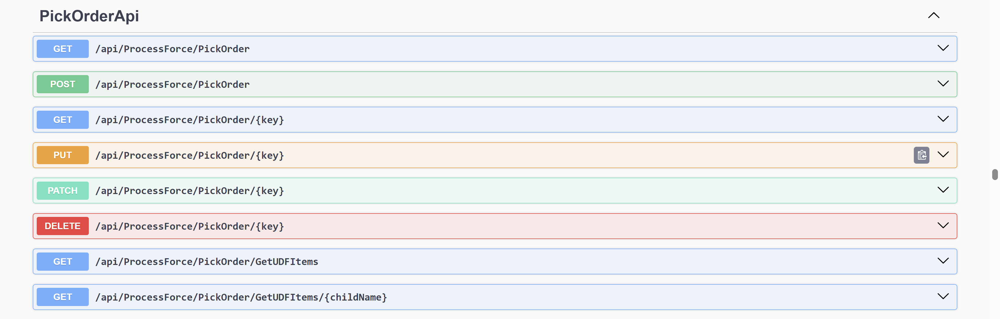

## Access CompuTec REST/OData API documentation

To see all available **CompuTec REST and OData API endpoints**, follow these steps:

1. Open the **CompuTec AppEngine login screen** in your browser.
2. Click the **help icon**.

        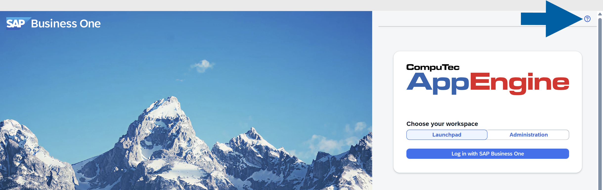

3. Click **Explore WebAPI**.

        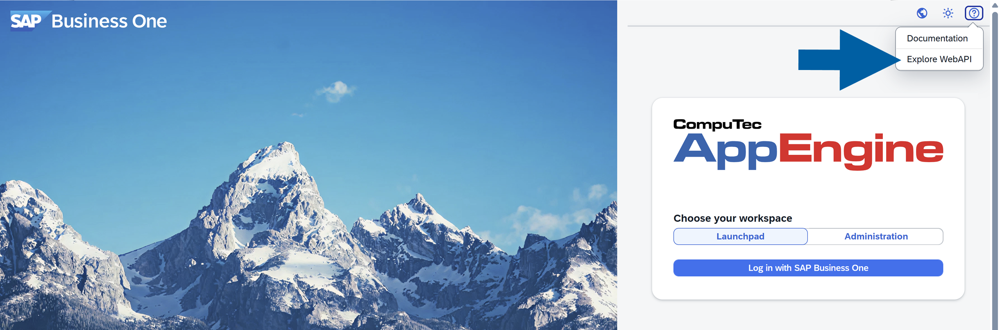

4. The **Swagger site** will open. Now you can browse all available **REST and OData API endpoints**.

        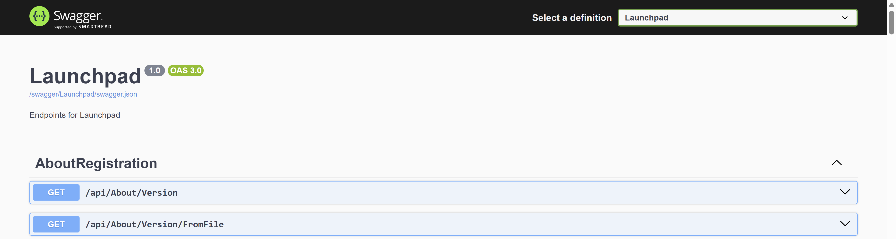

        :::info[note]
        The list of available API endpoints depends on the plugins installed and activated in your CompuTec AppEngine instance.

        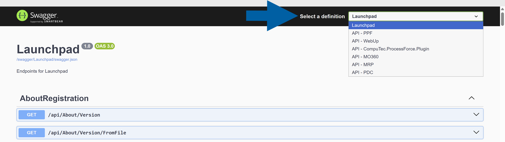

        :::

## Log in to use CompuTec API

There are two ways to access and use the API:

- Using an **external integration tool** (for example **Postman** or **Visual Studio Code REST client**)
- Using **Swagger** through the **CompuTec AppEngine Launchpad**

### Log in using Postman or another integration tool

This method is typically used when building system integrations, testing API calls, or developing custom automations.

To log in using an **integration tool**, follow these steps:

1. Open **Postman**, **Visual Studio Code integration** or any other **external tool**.
2. Create a **new request** or **.http file**.
3. In the file, paste the **login request**.

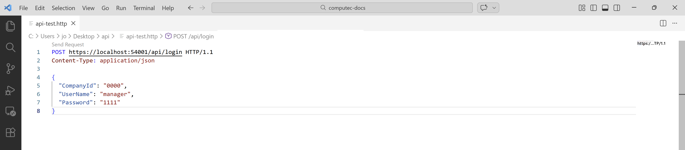

Example of the **login request**:

```http
POST https://localhost:54001/api/login HTTP/1.1 
Content-Type: application/json 
 
{ 
  "CompanyId": "0000", 
  "UserName": "manager", 
  "Password": "1111" 
} 
```

        :::note[info]
        You have to replace the sample values with credentials from your own environment.

        - The **API address** (for example ``https://localhost:54001``): depends on where your **CompuTec AppEngine** is installed and where you are connecting from. If **CompuTec AppEngine** is installed on another server, replace ``localhost`` with the appropriate **server name** or **IP address**.
        - **CompanyId**: the ID of the company configured in your **CompuTec AppEngine** instance
        - **UserName**: your SAP Business One user name
        - **Password**: the password for that SAP Business One user

        To find your **Company ID**:

        1. Log in the **CompuTec AppEngine Administration Panel**.

                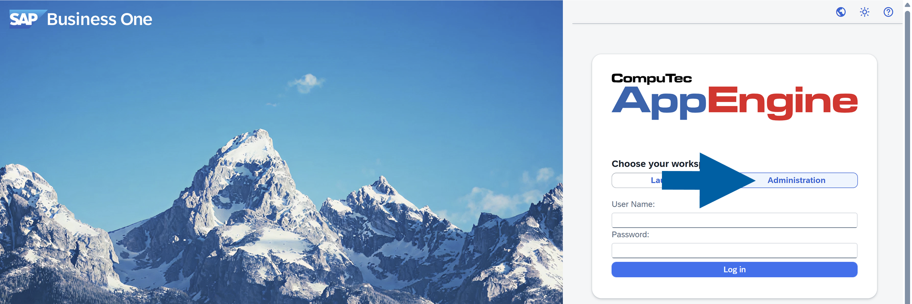

        2. Go to **Configuration**.

                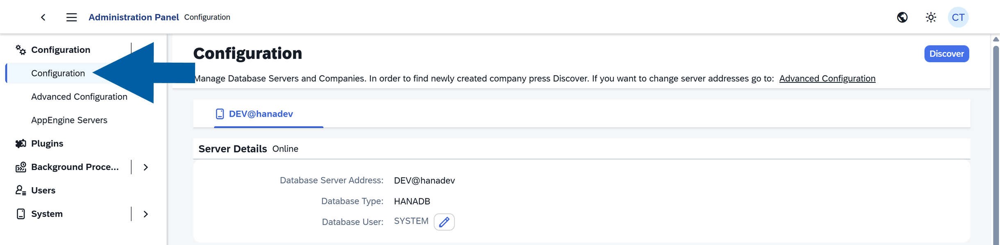

        3. Select your company.

                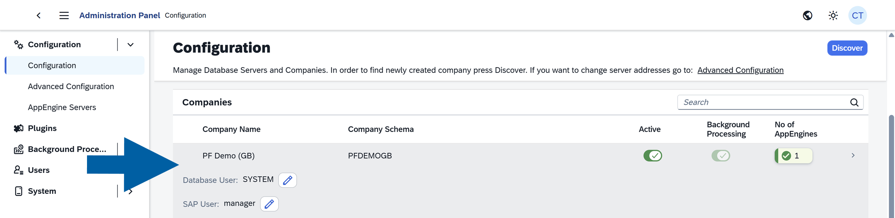

        4. You can see the **Company ID** under the **Company Name**.

                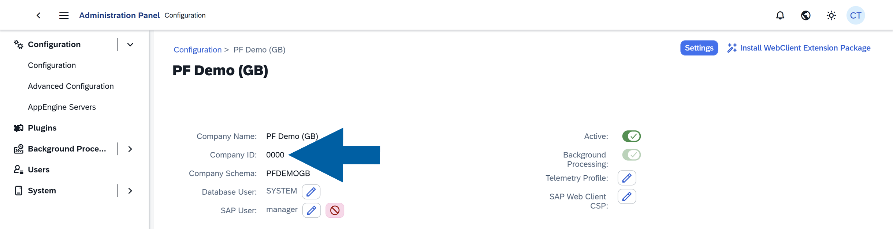

        :::

4. Click **Send Request**.

        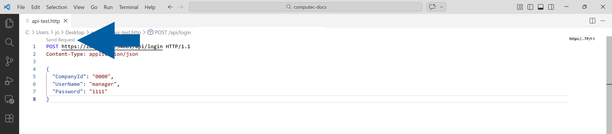

5. If the login is successful, the API returns an **OK** response.

        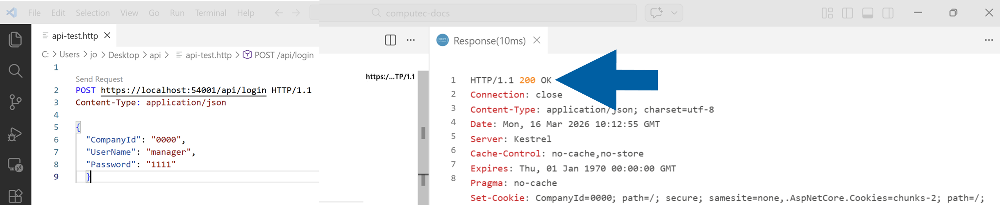

6. Done! The API session is authenticated, and you can begin sending further requests.

### Log in using the CompuTec AppEngine Launchpad and Swagger

This method allows you to test API calls directly in the browser without using external tools such as Postman or Visual Studio Code.

To access the API through Swagger, follow these steps:

1. Open **CompuTec AppEngine Launchpad** and log in.

        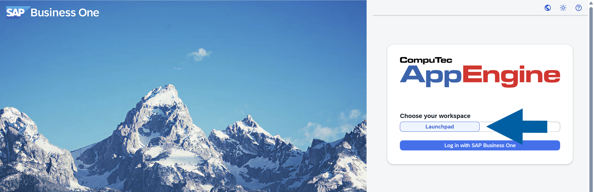

2. Select the **company** you want to work with and keep the session active.

3. Open the **Swagger documentation** in another browser window: use [this link](https://localhost:54001/swagger/index.html) or access it using the **help icon** on the login screen.

        

4. Click **Explore WebAPI**.

        

5. Done! You’re now logged in, and you can immediately start testing API endpoints.

        

        :::info[note]
        If Swagger is opened without an active Launchpad session (for example by opening the Swagger URL directly, using another browser, or an incognito session), you must authenticate using the /api/login API endpoint.  
 
        To log in: 

        1. Open the **Launchpad** definition in **Swagger**.

                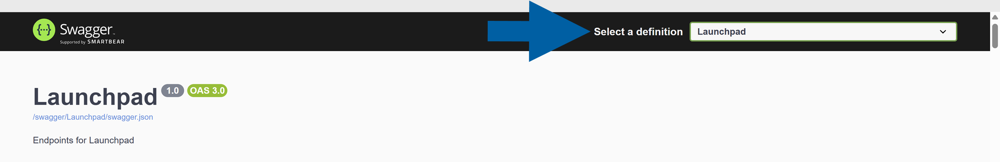

        2. Scroll to the **Login** section.
        3. Select the **/api/Login** endpoint. 

                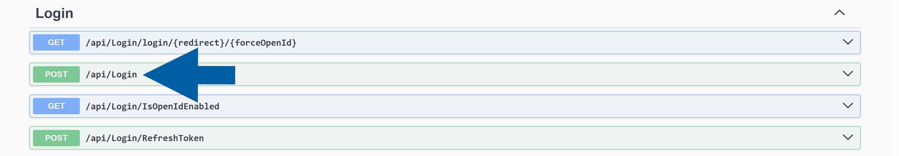 

        4. Click **Try it out**.

                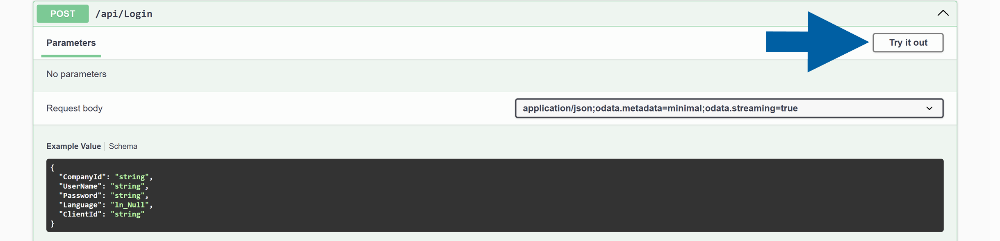
        
        5. In **Parameters**, change the example to your own credentials: 

                - **CompanyId**: the ID of the company configured in your **CompuTec AppEngine** instance.  
                You can find it after logging in to **CompuTec AppEngine Administration Panel** > **Configuration**. After you select your company, you’ll find the **Company ID** under the **Company Name**. 
                - **UserName**: your **SAP Business One** user name 
                - **Password**: the password for that **SAP Business One** user

                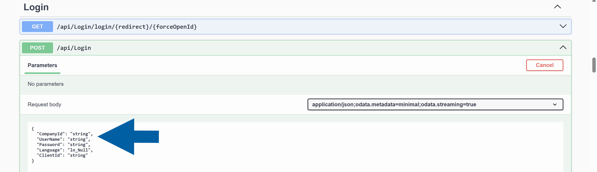

        6. Click **Execute**.

                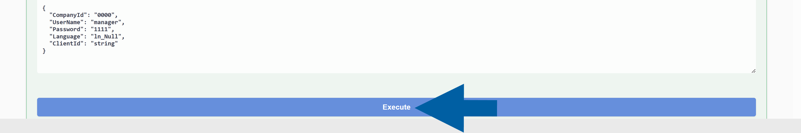

        7. If the login is successful, the API returns an **OK** response. This means the API session is authenticated and you can begin sending further requests.

                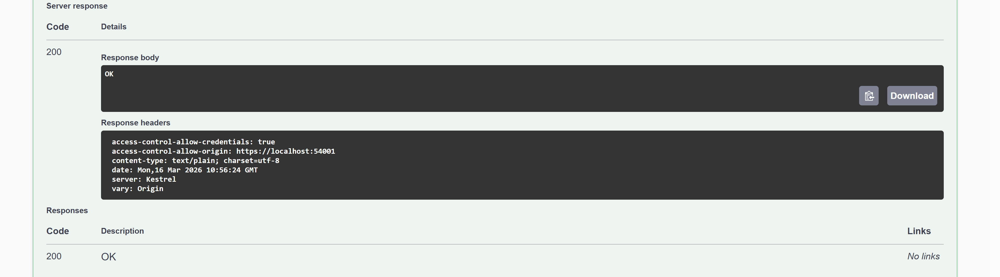
        :::

## Use cases

### Create a Pick Order

Creating a **Pick Order** through the API is a two-step process:

1. Create an empty **Pick Order** document
2. Update the **Pick Order** with item details

:::info[note]
You can find a list of all the available methods in the **CompuTec REST and OData API documentation** in **Swagger**.

        

:::

#### Step1: Create an empty Pick Order

Example request:

```http
POST http://localhost:54000/api/ProcessForce/CreatePickOrderForProductionIssue 
Content-Type: application/json 
{ 
"ManufacturingOrderDocEntries": 
[ 1799] 
} 
```

Example with additional parameters:

```http
POST http://localhost:54000/api/ProcessForce/CreatePickOrderForProductionIssue 
Content-Type: application/json 
 
{ 
"IssueType":"Operations", 
"LineNumbers":  { 
  "1086": [ 
    1 
  ] 
  }, 
"ManufacturingOrderDocEntries": 
[ 1796] 
} 
```

This request creates a **Pick Order** document without a list of items to issue.

#### Step 2: Update the Pick Order with item details

To update the **Pick Order**, you must provide the **DocEntry number** of the created document.

Example for batch-managed items:

```http
PATCH http://localhost:54000/odata/ProcessForce/PickOrder(166) 
Content-Type: application/json 
 
{ 
  "RequiredItems": [ 
    { 
      "U_PickedQty": 0.2, 
      "U_ItemCode": "Active-Item-02", 
      "U_LineNum": 1, 
      "PickedItems": 
      [ 
        { 
          "U_ItemCode": "Active-Item-02", 
          "U_BnDistNumber": "2012-04-18-3", 
          "U_Quantity": 0.1 
        }, 
        { 
          "U_ItemCode": "Active-Item-02", 
          "U_BnDistNumber": "2012-04-18-3", 
          "U_Quantity": 0.1 
        } 
      ] 
    } 
  ] 
} 
```

Example for non-batch-managed items:

```http
PATCH http://localhost:54000/odata/ProcessForce/PickOrder(157) 
Content-Type: application/json 
 
{ 
  "RequiredItems": [ 
    { 
      "U_PickedQty": 0.1, 
      "U_ItemCode": "Label-01", 
      "U_LineNum": 2 
      
    }
  ]
}
```

### Create a Pick Receipt

Pick Receipt creation also requires two steps.

1. Create an empty **Pick Receipt**
2. Add item details

#### Step 1: Create an empty Pick Receipt

Example of **Final Goods** receipt:

```http
POST http://localhost:54000/api/ProcessForce/CreatePickReceiptForProductionReceipt 
Content-Type: application/json 
 
{ 
"PickOrderdReceiptType": "FinalGood", 
"ManufacturingOrderDocEntries": 
[ 1953] 
}
```

Example of **Coproducts** receipt:

```http
POST http://localhost:54000/api/ProcessForce/CreatePickReceiptForProductionReceipt 
Content-Type: application/json 
 
{ 
"PickOrderdReceiptType": "Coproducts", 
"ManufacturingOrderDocEntries": 
[ 1796] 
} 
```

Example of **Scraps** receipt:

```http
POST http://localhost:54000/api/ProcessForce/CreatePickReceiptForProductionReceipt 
Content-Type: application/json 
 
{ 
"PickOrderdReceiptType": "Scraps", 
"ManufacturingOrderDocEntries": 
[ 1953] 
} 
```

Example of **All** receipt:

```http
POST http://localhost:54000/api/ProcessForce/CreatePickReceiptForProductionReceipt 
Content-Type: application/json 
 
{ 
"ManufacturingOrderDocEntries":[1656], 
"PickOrderdReceiptType": "All" 
} 
```

This way you can create the actual **Pick Receipts**.

#### Step 2: Update Pick Receipt with item details

Example for batch-managed items:

```http
PATCH http://localhost:54000/odata/ProcessForce/PickReceipt(600) 
Content-Type: application/json 
 
{ 
  "U_Date": "2025-10-03T07:43:24.181Z", 
  "RequiredItems": [ 
    { 
      "U_PickedQty": 1.0, 
      "U_LineNum": 1, 
      "PickedItems": 
      [ 
        { 
          "U_ItemCode": "Product-A", 
          "U_BnDistNumber": "2025-10-13-1", 
          "U_Quantity": 1.0 
        } 
      ] 
      
    } 
  ] 
}
```

### Additional API Operations

The API provides many additional operations, including:

- Retrieving production orders
- Managing pick lists
- Updating documents
- Reading operational data

You can find all available endpoints in the **CompuTec REST/Odata API documentation** in **Swagger** using [this link](https://localhost:54001/swagger/index.html).

:::note[info]

On the list of definitions, you’ll see all the plugins you have added and activated for your CompuTec AppEngine company.

        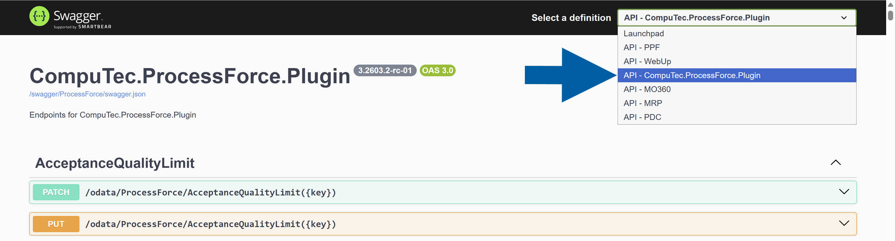
:::
