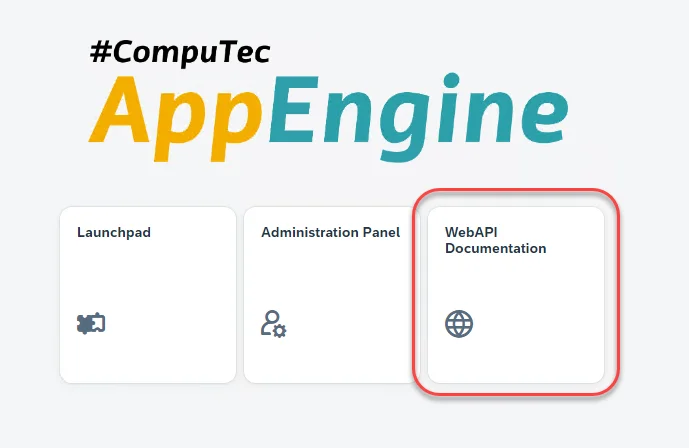
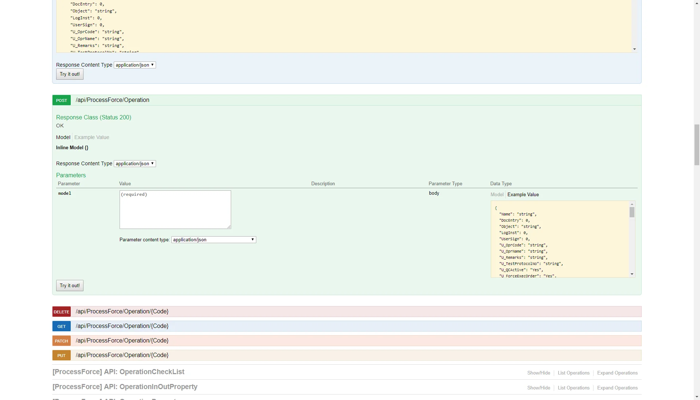

# REST/OData API Documentation

On-demand REST/OData API Swagger documentation is generated by choosing the API documentation panel in the main menu:

An example view of the documentation:

API usage examples in Postman:

<!-- TODO: Link -->
