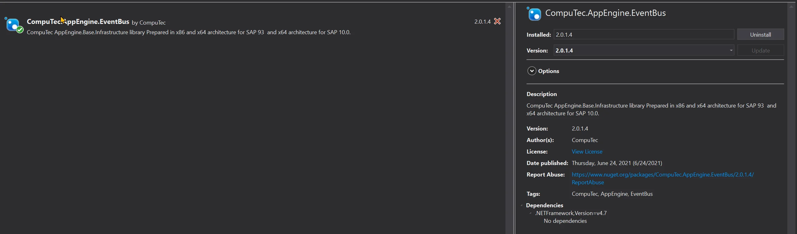
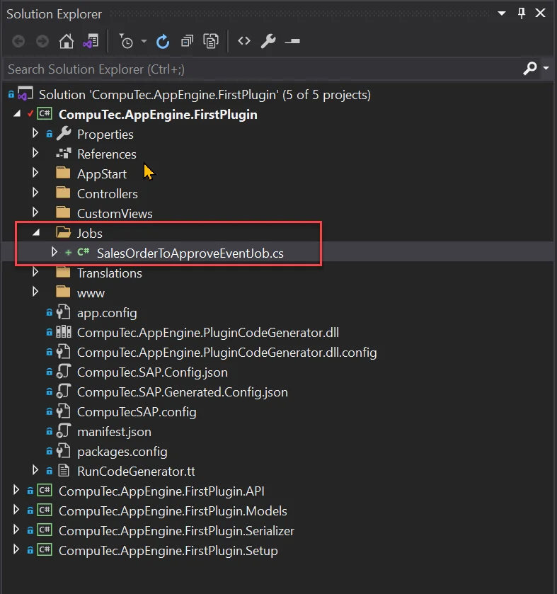
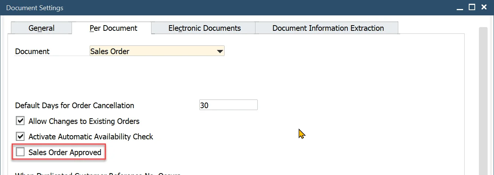
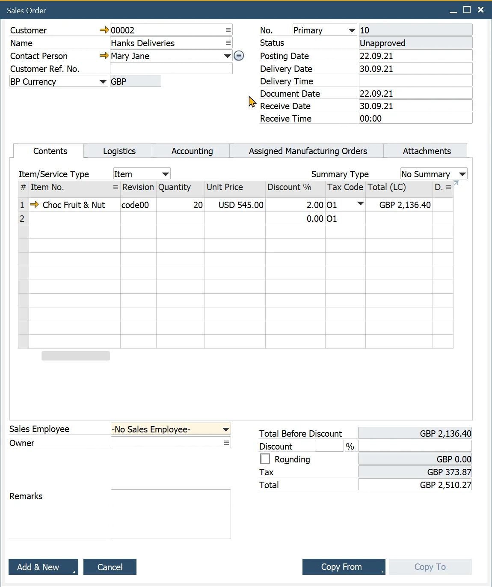
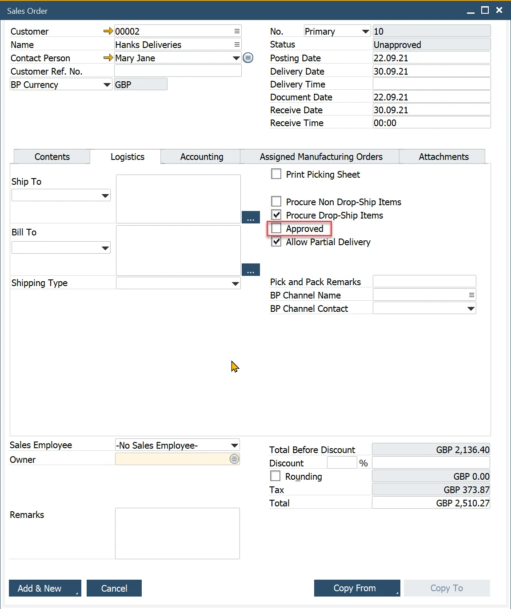
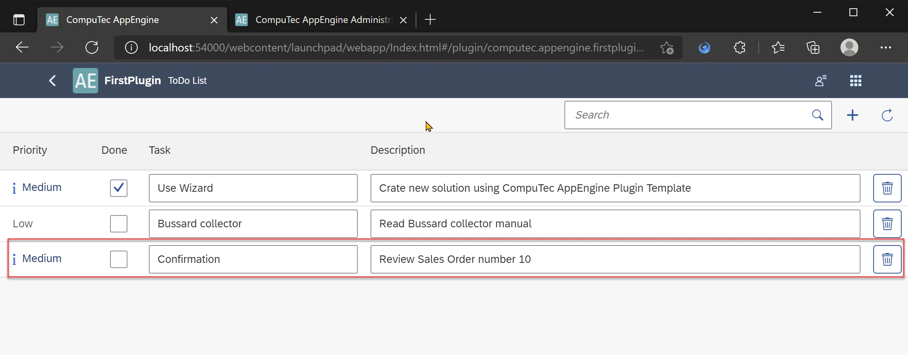

# AppEngine Jobs

## Prerequisites

Configured Background processing. Described here: Configuration and Administration -> Background processing.

## Description

In the following tutorial, we will show you how to create an AppEngine Job. We will create Job that will react to adding Sales Order that is not approved. This job will create a new ToDo task.

## Adding new Job

1. AppEngine Jobs requires CompuTec.AppEngine.EventBus so we need to add it to our Plugin project.

    
2. In Plugin, project create a new folder named Jobs and new class in it named SalesOrderToApproveEventJob.cs

    
3. This class needs to inherit from CompuTec.AppEngine.Base.Infrastructure.Jobs.EventBusSecureJob.
4. As soon as we add this inheritance we will get information in Visual Studio that we need to implement abstract method call() and parametrized constructor. After doing so this class will look like this:

    SalesOrderToApproveEventJob.cs

    ```csharp
    using CompuTec.AppEngine.Base.Infrastructure.Jobs;
    using CompuTec.AppEngine.Base.Infrastructure.Security;
    using NLog;
    using StructureMap;

    namespace CompuTec.AppEngine.FirstPlugin.Jobs
    {
        public class SalesOrderToApproveEventJob : EventBusSecureJob
        {
            Logger _logger;
            public SalesOrderToApproveEventJob(Session session, IContainer container, EventBus.Message message) : base(session, container, message)
            {
                _logger = container.GetInstance<Logger>();
            }

            public override void Call()
            {
            }
        }
    }
    ```

5. By adding Logger we will be able to log messages that later can be checked directly from AppEngine Administration Panel.
6. Now there is only one piece missing that will allow this Job to be called from AppEngine. EventBusJob annotations from CompuTec.AppEngine.Base.Infrastructure.Jobs.Annotations namespace. In this annotation, we can provide information about our job as well as on what type and action it should be triggered.
7. Let us add an annotation to our job

    - JobId - Id of this job that will be used by AppEngine. It is visible in AppEngine Administration Panel
    - Description - Description of the job. Visible in AppEngine Administration Panel
    - ContentType - ObjectType that we want to react on. This is the same object that is used in variable object_type in SBO_SP_TransactionNotification and SBO_SP_PostTransactionNotice.
    - ActionType - action type of event for example: A - Add, U - Update, D - Delete
    - In our example, we want to react to adding Sales Order hence we set ContentType to "17" and ActionType to "A".

    ```csharp
    [EventBusJob(JobId = "SalesOrderToApproveEventJob", Description = "Crate new To Do Job for Added Sales Orders that are unapproved", ContentType = "17", ActionType = "A")]
    ```

    SalesOrderToApproveEventJob.cs

    ```csharp
    using CompuTec.AppEngine.Base.Infrastructure.Jobs;
    using CompuTec.AppEngine.Base.Infrastructure.Jobs.Annotations;
    using CompuTec.AppEngine.Base.Infrastructure.Security;
    using NLog;
    using StructureMap;

    namespace CompuTec.AppEngine.FirstPlugin.Jobs
    {
        [EventBusJob(JobId = "SalesOrderToApproveEventJob", Description = "Crate new To Do Job for Added Sales Orders that are unapproved", ContentType = "17", ActionType = "A")]
        public class SalesOrderToApproveEventJob : EventBusSecureJob
        {
            Logger _logger;
            public SalesOrderToApproveEventJob(Session session, IContainer container, EventBus.Message message) : base(session, container, message)
            {
                _logger = container.GetInstance<Logger>();
            }

            public override void Call()
            {
            }
        }
    }
    ```

8. Now after rebuilding, our action is already available in background processing in Administration Panel, and we can activate it. (If you don;t know how to do it then please check Configuration and Administration#Backgroundprocessing) When you open Job configuration you can see ale details from our annotation and also plugin id - from plugin manifest.

    
9. Now lets add logic to our Job.
10. First we need to retrieve Sales Order DocEntry from event Message. We can do it by deserializing message

    ```csharp
    dynamic json = JsonConvert.DeserializeObject(Message.Body);
    int DocEntry = json.DocEntry;
    ```

11. Now we can get derails regarding Sales Order using simple Query. We will create separate method for this

    GetSalesOrderDetails

    ```csharp
    private CTRecordset GetSalesOrderDetails(int DocEntry)
    {
        var qm = new QueryManager();
        qm.SetSimpleResultFields("DocEntry", "DocNum", "CardCode", "Confirmed");
        qm.SimpleTableName = "ORDR";
        qm.SetSimpleWhereFields("DocEntry");

        return qm.ExecuteSimpleParameters(Session.Token, DocEntry);
    }
    ```

12. Finally we can add new To Do task.

    AddNewToDoTask

    ```csharp
    private void AddNewToDoTask(int DocNum)
    {
        IToDo toDoTask = CompuTec.Core2.CoreManager.GetUDO(Session.Token, "SAMPLE_TO_DO");
        toDoTask.U_TaskName = $"Confirmation";
        toDoTask.U_Description = $"Review Sales Order number {DocNum}";
        toDoTask.U_Priority = API.Enums.ToDoPriority.Medium;
        if (toDoTask.Add() != 0)
            throw new Exception($"Exception while adding ToDo task: {Session.Company.GetLastErrorDescription()}");
    }
    ```

13. At the end SalesOrderToApproveEventJob.cs will be as follows:

    SalesOrderToApproveEventJob.cs

    ```csharp
    using CompuTec.AppEngine.Base.Infrastructure.Jobs;
    using CompuTec.AppEngine.Base.Infrastructure.Jobs.Annotations;
    using CompuTec.AppEngine.Base.Infrastructure.Security;
    using CompuTec.AppEngine.FirstPlugin.API.BusinessObjects.ToDo;
    using CompuTec.BaseLayer.DI;
    using CompuTec.Core2.DI.Database;
    using Newtonsoft.Json;
    using NLog;
    using StructureMap;
    using System;

    namespace CompuTec.AppEngine.FirstPlugin.Jobs
    {
        [EventBusJob(JobId = "SalesOrderToApproveEventJob", Description = "Crate new To Do Job for Added Sales Orders that are unapproved", ContentType = "17", ActionType = "A")]
        public class SalesOrderToApproveEventJob : EventBusSecureJob
        {
            Logger _logger;
            public SalesOrderToApproveEventJob(Session session, IContainer container, EventBus.Message message) : base(session, container, message)
            {
                _logger = container.GetInstance<Logger>();
            }

            public override void Call()
            {
                try
                {
                    _logger.Trace($"Job :SalesOrderToApproveEventJob Started for :{Message.Body}");
                    dynamic json = JsonConvert.DeserializeObject(Message.Body);
                    int DocEntry = json.DocEntry;

                    bool approved;
                    int DocNum;
                    using (CTRecordset rs = this.GetSalesOrderDetails(DocEntry))
                    {
                        DocNum = rs.Fields.Item("DocNum").Value;
                        string Confirmed = rs.Fields.Item("Confirmed").Value;
                        approved = Confirmed == "Y" ? true : false;
                    }

                    if (!approved)
                    {
                        AddNewToDoTask(DocNum);
                        _logger.Trace($"Job :SalesOrderToApproveEventJob finished successfully. To Do Task added");
                    }
                    else
                    {
                        _logger.Trace($"Job :SalesOrderToApproveEventJob finished successfully - Nothing to do, Sales Order already approved.");
                    }
                }
                catch (Exception e)
                {
                    _logger.Error(e, $"Job :SalesOrderToApproveEventJob failed:{e.Message}");
                    throw;
                }

            }
            private void AddNewToDoTask(int DocNum)
            {

                IToDo toDoTask = CompuTec.Core2.CoreManager.GetUDO(Session.Token, "SAMPLE_TO_DO");
                toDoTask.U_TaskName = $"Confirmation";
                toDoTask.U_Description = $"Review Sales Order number {DocNum}";
                toDoTask.U_Priority = API.Enums.ToDoPriority.Medium;
                if (toDoTask.Add() != 0)
                    throw new Exception($"Exception while adding ToDo task: {Session.Company.GetLastErrorDescription()}");
            }

            private CTRecordset GetSalesOrderDetails(int DocEntry)
            {
                var qm = new QueryManager();
                qm.SetSimpleResultFields("DocEntry", "DocNum", "CardCode", "Confirmed");
                qm.SimpleTableName = "ORDR";
                qm.SetSimpleWhereFields("DocEntry");

                return qm.ExecuteSimpleParameters(Session.Token, DocEntry);
            }
        }
    }
    ```

## Results

To test it we will need to add new Sales Order that is not approved.

### Optional

There is setting in SAP that define if newly added Sales Order should be approved or not. You can find it here:



1. Create new Sales Order and make user it is unapproved

    

    
2. This will trigger our Job. We can see current status of job in Recent calls in AppEngine Administration Panel

    
3. After job complete we should have new To Do task added to list.

    
