# Attachments

## Description

AppEngine comes with built-in, handy controllers for managing attachments in SAP Business One. If you open Documentation (swagger)...


...you can find description of the controllers.

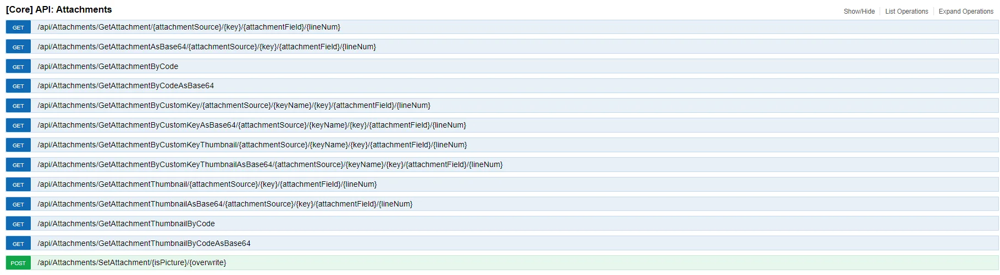

Below is an example of receiving and adding attachments from and to Sales Orders.

## Getting attachments from Sales Order

We will extend the Sales Orders list example that we have used so far. We will add a button that will display a dialog with attachments for particular Sales Order.

### Adding attachment information to Sales Orders list

1. Open SalesOrder.view.xml

    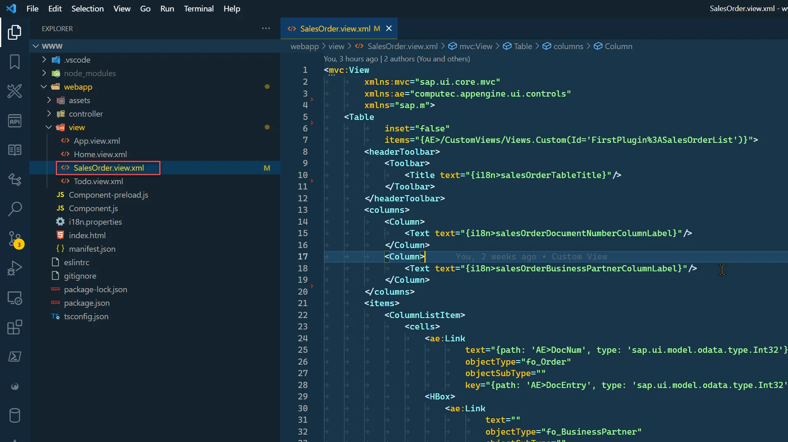
2. Add new column Attachments.

    ```xml
    <Column>
        <Text text="{i18n>salesOrderAttachmentsColumnLabel}"/>
    </Column>
    ```

3. Add translation as described here.

    ```xml
    <Message id="salesOrderAttachmentsColumnLabel" param="0">
        <translation lang="Default" Date="2011-08-09T15:55:59">Attachments</translation>
        <translation lang="ln_English" Date="2011-08-09T15:55:59">Attachments</translation>
        <translation lang="ln_Polish" Date="2011-08-09T15:55:59">Załączniki</translation>
    </Message>
    ```

4. To make it a little bit more interesting, let's add the GenericTag control with ObjectNumber that will display number of attachments for each of orders.

    - First, we need to add information about attachments in our custom view that is used to list Sales Orders:

        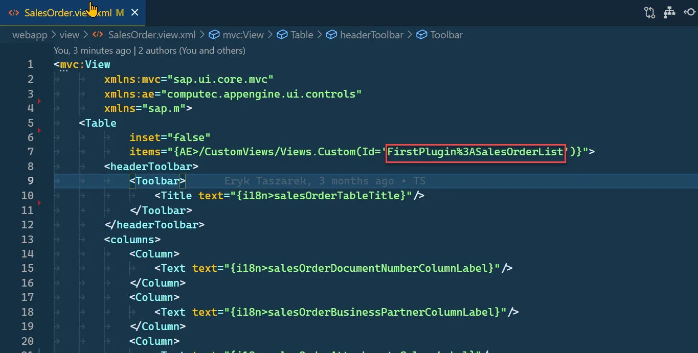
    - Let's modify this custom view to add NumberOfAttachments to it. More details about Custom Views can be found here: here.

        SalesOrderList.customview.json

    - Now we can add control and bind NumberOfAttachments to it like it is shown below. We add custom data app:AtcEntry – this will be needed to get correct attachments in event handler.

        ```xml
        <GenericTag
            design="StatusIconHidden"
            visible="{= %{path: 'AE>NumberOfAttachments', type: 'sap.ui.model.odata.type.Int32'} > 0}"
            press=".onAttachmentsButtonPress">
            <ObjectNumber
                state="Information"
                emphasized="false"
                number="{path: 'AE>NumberOfAttachments', type: 'sap.ui.model.odata.type.Int32'}"
                unit=""/>
        </GenericTag>
        ```

    - Finally, the SalesOrder.view.xml should look like this:

        SalesOrder.view.xml

        ```xml
        <mvc:View
                xmlns:mvc="sap.ui.core.mvc"
                xmlns:ae="computec.appengine.ui.controls"
                xmlns:app="http://schemas.sap.com/sapui5/extension/sap.ui.core.CustomData/1"
                xmlns="sap.m">
            <Table
                    inset="true"
                    items="{AE>/CustomViews/Views.Custom(Id='FirstPlugin%3ASalesOrderList')}">
                <headerToolbar>
                    <Toolbar>
                        <Title text="{i18n>salesOrderTableTitle}"/>
                    </Toolbar>
                </headerToolbar>
                <columns>
                    <Column>
                        <Text text="{i18n>salesOrderDocumentNumberColumnLabel}"/>
                    </Column>
                    <Column>
                        <Text text="{i18n>salesOrderBusinessPartnerColumnLabel}"/>
                    </Column>
                    <Column>
                        <Text text="{i18n>salesOrderAttachmentsColumnLabel}"/>
                    </Column>
                </columns>
                <items>
                    <ColumnListItem>
                        <cells>
                            <ae:Link
                                    text="{path: 'AE>DocNum', type: 'sap.ui.model.odata.type.Int32'} ({path: 'AE>DocEntry', type: 'sap.ui.model.odata.type.Int32'})"
                                    objectType="fo_Order"
                                    objectSubType=""
                                    key="{path: 'AE>DocEntry', type: 'sap.ui.model.odata.type.Int32'}"/>
                            <HBox>
                                <ae:Link
                                        text=""
                                        objectType="fo_BusinessPartner"
                                        objectSubType=""
                                        key="{path: 'AE>CardCode', type: 'sap.ui.model.odata.type.String'}"/>
                                <ObjectIdentifier
                                        title="{path: 'AE>CardName', type: 'sap.ui.model.odata.type.String'}"
                                        text="{path: 'AE>CardCode', type: 'sap.ui.model.odata.type.String'}"/>
                            </HBox>
                            <GenericTag
            ="{path: 'AE>AtcEntry', type: 'sap.ui.model.odata.type.Int32'}"
                                    design="StatusIconHidden"
                                    visible="{= %{path: 'AE>NumberOfAttachments', type: 'sap.ui.model.odata.type.Int32'} > 0}"
                                    press=".onAttachmentsButtonPress">
                                <ObjectNumber
                                        state="Information"
                                        emphasized="false"
                                        number="{path: 'AE>NumberOfAttachments', type: 'sap.ui.model.odata.type.Int32'}"
                                        unit=""/>
                            </GenericTag>
                        </cells>
                    </ColumnListItem>
                </items>
            </Table>
        </mvc:View>
        ```

### Results

For Sales Orders with attachments GenericTag will be visible with numbers of Attachments

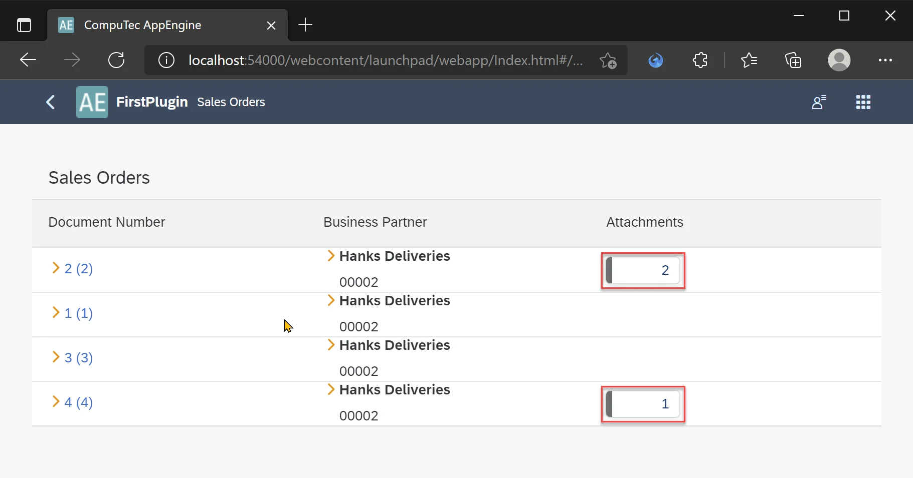

### Creating Dialog for Attachments

#### Creating controller for Sales Orders view

To handle onAttachmentsButtonPress event that will be triggered from GenericTag on user click, we need to create controller for Sales Orders view.

1. Create new file in controllers folder and name it SalesOrder.controller.js

    
2. Implement simple controller:

    SalesOrder.controller.js

    ```js
    sap.ui.define(
    ["computec/appengine/core/BaseController"],
    /**
     *
     * @param {typeof computec.appengine.core.BaseController} BaseController
     * @returns
     */
    function (BaseController) {
        "use strict";

        return BaseController.extend(
        "computec.appengine.firstPlugin.controller.SalesOrder",
        {
            onInit: function () {
            BaseController.prototype.onInit.call(this);
            this.setPageName("Sales Orders");
            },
        }
        );
    }
    );
    ```

3. No we need to add controller information into our view.

    ```xml
    <mvc:View
            controllerName="computec.appengine.firstplugin.controller.SalesOrder"
            xmlns:mvc="sap.ui.core.mvc"
            xmlns:ae="computec.appengine.ui.controls"
            xmlns="sap.m">
    ```

#### Creating view for Attachments Dialog

Here we will create new view fragment that later will be used in our controller.

1. Lets create new view fragment with our Attachments Dialog: SalesOrderAttachmentsDialog.fragment.xml. For simplicity we will create it directly in view folder.

    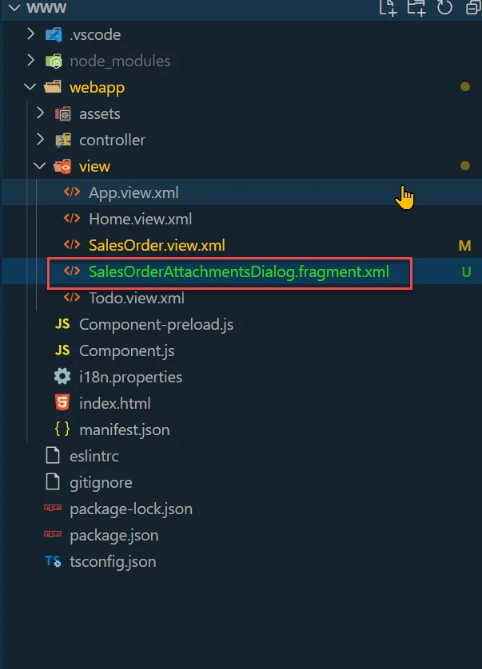
2. We will create simple dialog with list of attachments for given Sales Order

    SalesOrderAttachmentsDialog.fragment.xml

    ```xml
    <core:FragmentDefinition
            xmlns="sap.m"
            xmlns:core="sap.ui.core"
            xmlns:app="http://schemas.sap.com/sapui5/extension/sap.ui.core.CustomData/1">
        <Dialog title="Attachments">
            <Table
                    growing="true"
                    growingThreshold="10"
                    inset="false"
                    items="{AT>/}"
                    fixedLayout="false">
                <columns>
                    <Column>
                        <Text text="Attachment Name"/>
                    </Column>
                    <Column>
                        <Text text="Download"/>
                    </Column>
                </columns>
                <items>
                    <ColumnListItem>
                        <cells>
                            <Text text="{path: 'AT>FileName'}"/>
                            <Button
                                    icon="sap-icon://download"
                                    press=".onAttachmentsDialogDownloadInNewTab"
                                    app:AbsEntry="{path: 'AT>AbsEntry'}"
                                    app:Line="{path: 'AT>Line'}"/>
                        </cells>
                    </ColumnListItem>
                </items>
            </Table>
            <endButton>
                <Button
                        text="Close"
                        press=".onAttachmentsDialogCloseFragment"/>
            </endButton>
        </Dialog>
    </core:FragmentDefinition>
    ```

#### Adding custom view for Attachments

We will create parametrized custom view that will return Attachments for selected Sales Order.

1. Create new custom view in your Plugin Project named Attachments.customview.json.

    Attachments.customview.json

    ```json
    {
    "Id": "Attachments",
    "Description": "getting attachments of sales order",
    "Source": {
        "Hana": "SELECT \"FileName\", \"FileExt\",\"AbsEntry\",\"Line\" FROM ATC1 WHERE \"AbsEntry\" = @AbsEntry",
        "MsSql": "SELECT FileName, FileExt, AbsEntry, Line FROM ATC1 WHERE AbsEntry = @AbsEntry"
    }
    }
    ```

#### Opening dialog

Attachments dialog will be opened after user click on GenericTag. Thus, we need to add implementation in SalesOrders.controller.js. Set in the SalesOrders.view.xml that press event is onAttachmentsButtonPress. Create function in our controller with exactly that name.

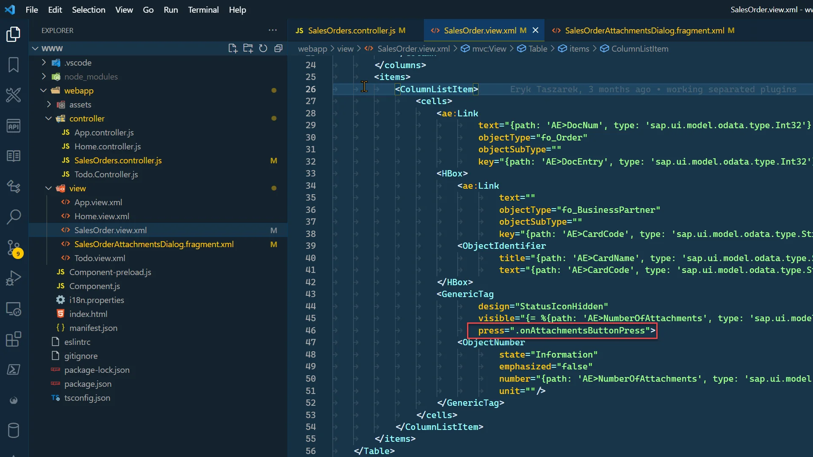

1. Open SalesOrders.controller.js and add sap.ui.core.Fragment, sap.ui.model.json.JSONModel, computec.appengine.ui.model.http.Http to sap.ui.define:

    ```js
    sap.ui.define([
        "computec/appengine/core/BaseController",
        "sap/ui/core/Fragment",
        "sap/ui/model/json/JSONModel",
        "computec/appengine/ui/model/http/Http"
    ],
        /**
         *
         * @param {typeof computec.appengine.core.BaseController} BaseController
         * @param {typeof sap.ui.core.Fragment} Fragment
         * @param {typeof sap.ui.model.json.JSONModel} JSONModel
         * @param {typeof computec.appengine.ui.model.http.Http} Http
         * @returns
         */
        function (BaseController, Fragment, JSONModel, Http) {
    ```

2. Now let's create the handler. In it, we need to retrieve attachments for given Order, load fragment, bind attachments to it and then open it.

    - \_get – this function that sends GET request to backend:

        ```js
        _get: function (sUrl) {
                        return new Promise((resolve, reject) => {
                            Http.request({
                                method: 'GET',
                                withAuth: true,
                                url: sUrl,
                                done: resolve,
                                fail: reject
                            });
                        });
                    },
        ```

    - getAttachmentsByDocEntry – this function calls get with the correct URL. URL points to Attachments custom view created earlier and contains AbsEntry parameter value.

        ```js
        getAttachmentsByDocEntry: function (sDocNum) {
                        const sUrl = encodeURIComponent(`odata/CustomViews/Views.CustomWithParameters(Id='FirstPlugin:Attachments',Parameters=["AbsEntry=${sDocNum}"],paramType=Default.ParamType'Custom')`);
                        return this._get(sUrl);
                    },
        ```

    - getCustomDataForElement – this function retrieves AtcEntry defined as custom attribute

        

        ```js
        getCustomDataForElement: function (oElement, sCustomDataCode) {
                        let oCustomData = oElement.getCustomData().find(x => x.getKey() === sCustomDataCode);
                        if (oCustomData)
                            return oCustomData.getValue();
                        return null;
                    },
        ```

    - onOpenDialog – this function loads the defined Attachments Dialog fragment, set attachments to it and opens it.

        ```js
        onOpenDialog: async function (data) {
                        const that = this;
                        const oView = this.getView();

                        if (!this._attachmentsDialog) {
                            this._attachmentsDialog = await Fragment.load({
                                id: oView.getId(),
                                name: "computec.appengine.firstplugin.view.SalesOrderAttachmentsDialog",
                                controller: this
                            });
                            oView.addDependent(this._attachmentsDialog);
                        }

                        this._attachmentsDialog.setModel(new JSONModel(data), "AT");
                        this._attachmentsDialog.open();
                    },
        ```

    - onAttachmentsButtonPress – this function will be called upon Attachments GenericTag user click.

        ```js
        onAttachmentsButtonPress: async function (oEvent) {
            /** @type {sap.m.GenericTag} */
            const oGenericTag = oEvent.getSource();

            const nAtcEntry = this.getCustomDataForElement(oGenericTag, "AtcEntry");
            const data = await this.getAttachmentsByDocEntry(nAtcEntry);
            this.onOpenDialog(data.value);
        },
        ```

    - onAttachmentsDialogCloseFragment – function that will be called when user click on Close button in Attachments Dialog.

        ```js
        onAttachmentsDialogCloseFragment: function () {
            this._attachmentsDialog.close();
        },
        ```

    - Finally the SalesOrder.controller.js should look like this:

        SalesOrder.controller.js

        ```js
        sap.ui.define([
            "computec/appengine/core/BaseController",
            "sap/ui/core/Fragment",
            "sap/ui/model/json/JSONModel",
            "computec/appengine/ui/model/http/Http"
        ],
            /**
            *
            * @param {typeof computec.appengine.core.BaseController} BaseController
            * @param {typeof sap.ui.core.Fragment} Fragment
            * @param {typeof sap.ui.model.json.JSONModel} JSONModel
            * @param {typeof computec.appengine.ui.model.http.Http} Http
            * @returns
            */
            function (BaseController, Fragment, JSONModel, Http) {
                "use strict";

                return BaseController.extend("computec.appengine.firstPlugin.controller.SalesOrder", {
                    _attachmentsDialog: null,
                    onInit: function () {
                        BaseController.prototype.onInit.call(this);
                        this.setPageName("Sales Orders");
                    },
                    onAttachmentsButtonPress: async function (oEvent) {
                        /** @type {sap.m.GenericTag} */
                        const oGenericTag = oEvent.getSource();

                        const nAtcEntry = this.getCustomDataForElement(oGenericTag, "AtcEntry");
                        const data = await this.getAttachmentsByDocEntry(nAtcEntry);
                        this.onOpenDialog(data.value);
                    },


                    onOpenDialog: async function (data) {
                        const that = this;
                        const oView = this.getView();

                        if (!this._attachmentsDialog) {
                            this._attachmentsDialog = await Fragment.load({
                                id: oView.getId(),
                                name: "computec.appengine.firstplugin.view.SalesOrderAttachmentsDialog",
                                controller: this
                            });
                            oView.addDependent(this._attachmentsDialog);
                        }

                        this._attachmentsDialog.setModel(new JSONModel(data), "AT");
                        this._attachmentsDialog.open();
                    },
                    onAttachmentsDialogCloseFragment: function () {
                        this._attachmentsDialog.close();
                    },
                    // #region INTERNAL
                    getCustomDataForElement: function (oElement, sCustomDataCode) {
                        let oCustomData = oElement.getCustomData().find(x => x.getKey() === sCustomDataCode);
                        if (oCustomData)
                            return oCustomData.getValue();
                        return null;
                    },
                    getAttachmentsByDocEntry: function (sDocNum) {
                        const sUrl = encodeURIComponent(`odata/CustomViews/Views.CustomWithParameters(Id='FirstPlugin:Attachments',Parameters=["AbsEntry=${sDocNum}"],paramType=Default.ParamType'Custom')`);
                        return this._get(sUrl);
                    },

                    _get: function (sUrl) {
                        return new Promise((resolve, reject) => {
                            Http.request({
                                method: 'GET',
                                withAuth: true,
                                url: sUrl,
                                done: resolve,
                                fail: reject
                            });
                        });
                    },

                    //#endregion

                });
            });
        ```

### Results {#results-2}

At this moment we are able to show number of attachments on the sales orders list and display attachments.


#### Downloading Attachment

Having a dialog with attachments list in place, it is time to add function that will handle attachment download. To accomplish this, use core APIAttachments controller, precisely this GET method:

```text
/api/Attachments/GetAttachmentByCustomKey/{attachmentSource}/{keyName}/{key}/{attachmentField}/{lineNum}
```

Open SalesOrder.controller.js.

Add new function named onAttachmentsDialogDownloadInNewTab – this is the same name as declared in the press attribute of Download button in Attachments Dialog.

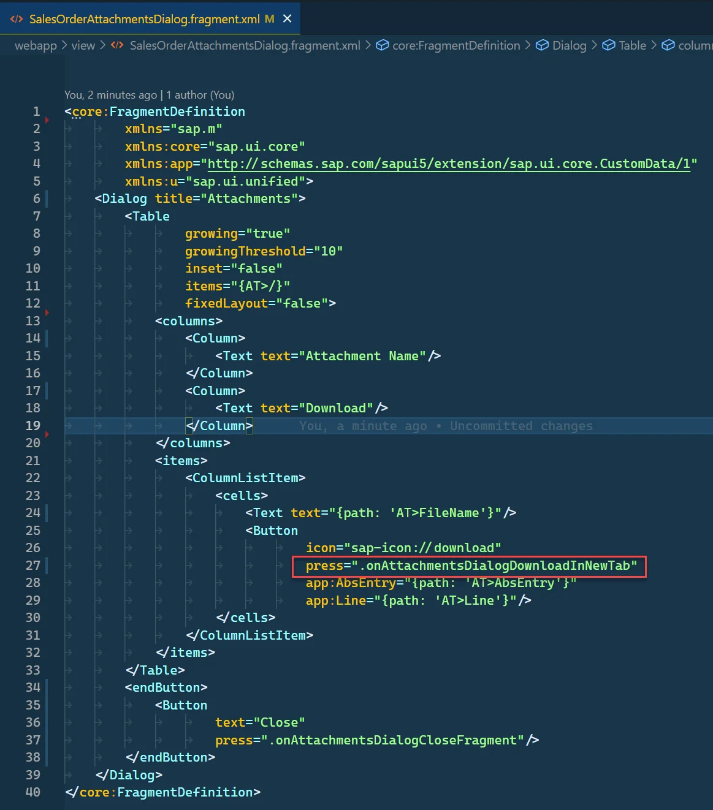

```js
onAttachmentsDialogDownloadInNewTab: function (oEvent) {
    const oSource = oEvent.getSource();
    const AbsEntry = this.getCustomDataForElement(oSource, "AbsEntry");
    const Line = this.getCustomDataForElement(oSource, "Line");
    const sUrl = `${window.location.origin}/api/Attachments/GetAttachmentByCustomKey/ORDR/DocEntry/${AbsEntry}/null/${Line}`;
    window.open(sUrl, '_blank');
},
```

As you can see in this method we are preparing URL that consists of 5 parameters:

- attachmentSource – table name of our document. In our example ORDR (Sales Order),
- keyName - table key name. For Sales Order it is DocEntry,
- key – value of table key. In case of Sales Order it is value of document DocEntry,
- attachmentField – this field is used if you would like to get Attachment from custom field. In Our case we can set this value to null as we don't need it.
- lineNum – Line number (Line column in ATC1) value of required attachment.

## Result

When user click on download button, file will be download using our REST API Attachment controller.

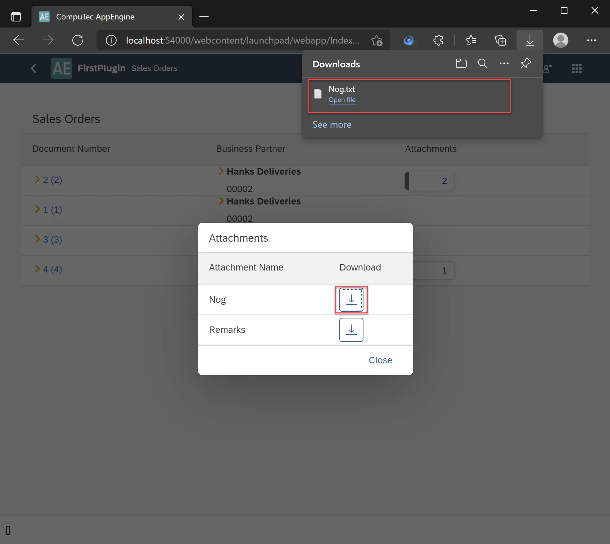

### Adding attachments

Finally, we can finish the example with possibility to add attachments. Below is a step-by-step description how to achieve this.

#### Adding new File Upload Dialog

For selection of the file we will add a new Dialog SalesOrderAttachmentsDialogAdd.fragment.xml.

SalesOrderAttachmentsDialogAdd.fragment.xml

```xml
<core:FragmentDefinition
        xmlns="sap.m"
        xmlns:core="sap.ui.core"
        xmlns:app="http://schemas.sap.com/sapui5/extension/sap.ui.core.CustomData/1"
        xmlns:u="sap.ui.unified">
    <Dialog title="Add Attachment">
        <u:FileUploader
                id="FileUploader"
                fileType="txt"
                placeholder="Upload File"
                class="sapUiSmallMargin"
                width="20em"/>
        <beginButton>
            <Button
                    width="10em"
                    text="Add Attachment"
                    press=".onAddAttachmentSubmit"></Button>
        </beginButton>
        <endButton>
            <Button
                    text="Close"
                    press=".onAddAttachmentDialogClose"/>
        </endButton>
    </Dialog>
</core:FragmentDefinition>
```

#### Extending Attachments Dialog

To our Attachments Dialog we need to add button that will simply open newly created File Upload Dialog.

```xml
<customHeader>
    <OverflowToolbar>
        <Title text="Attachments"/>
        <ToolbarSpacer/>
        <Button
                icon="sap-icon://add-document"
                text="Add Attachment"
                press=".onAttachmentDialogAddAttachment"></Button>
    </OverflowToolbar>
</customHeader>
```

Finally SalesOrderAttachmentsDialog.fragment.xml should look like this.

SalesOrderAttachmentsDialog.fragment.xml

```xml
<core:FragmentDefinition
        xmlns="sap.m"
        xmlns:core="sap.ui.core"
        xmlns:app="http://schemas.sap.com/sapui5/extension/sap.ui.core.CustomData/1">
    <Dialog title="Attachments">
        <customHeader>
            <OverflowToolbar>
                <Title text="Attachments"/>
                <ToolbarSpacer/>
                <Button
                        icon="sap-icon://add-document"
                        text="Add Attachment"
                        press=".onAttachmentDialogAddAttachment"></Button>
            </OverflowToolbar>
        </customHeader>
        <Table
                growing="true"
                growingThreshold="10"
                inset="false"
                items="{AT>/}"
                fixedLayout="false">
            <columns>
                <Column>
                    <Text text="Attachment Name"/>
                </Column>
                <Column>
                    <Text text="Download"/>
                </Column>
            </columns>
            <items>
                <ColumnListItem>
                    <cells>
                        <Text text="{path: 'AT>FileName'}"/>
                        <Button
                                icon="sap-icon://download"
                                press=".onAttachmentsDialogDownloadInNewTab"
                                app:AbsEntry="{path: 'AT>AbsEntry'}"
                                app:Line="{path: 'AT>Line'}"/>
                    </cells>
                </ColumnListItem>
            </items>
        </Table>
        <endButton>
            <Button
                    text="Close"
                    press=".onAttachmentsDialogCloseFragment"/>
        </endButton>
    </Dialog>
</core:FragmentDefinition>
```

#### Adding logic to SalesOrder.controller.js

1. Having all views ready, we can now implement all the missing parts in the controller.
2. Open SalesOrder.controller.js.
3. Add the following functions to it:

    - onAttachmentDialogAddAttachment event handler for newly added Add Attachment button that will run onOpenAddAttachmentDialog function:

        ```js
        onAttachmentDialogAddAttachment: async function (oEvent) {
            await this.onOpenAddAttachmentDialog();
        },
        ```

    - onOpenAddAttachmentDialog – Opens SalesOrderAttachmentsDialogAdd Dialog:

        ```js
        onOpenAddAttachmentDialog: async function (data) {
            const oView = this.getView();
            if (!this._attachmentsAddDialog) {
                this._attachmentsAddDialog = await Fragment.load({
                    id: oView.getId(),
                    name: "computec.appengine.firstplugin.view.SalesOrderAttachmentsDialogAdd",
                    controller: this
                });
                oView.addDependent(this._attachmentsAddDialog);
            }
            this._attachmentsAddDialog.open();
        },
        ```

    - onAddAttachmentSubmit – event handler for Add Attachment button on SalesOrderAttachmentsDialogAdd Dialog. If file was specified it will upload it and send it to backend using Attachement controller POST metod `/api/Attachments/SetAttachment/{isPicture}/{overwrite}`. Then we will add a file name to the attachments view, just to see this file on the list. Download won't work on it at this moment.

        ```js
        onAddAttachmentSubmit: async function () {
            /** @type {sap.ui.unified.FileUploader} */
            const oFileUploader = this.byId("FileUploader");
            let domRef = oFileUploader.getFocusDomRef(),
                file = domRef.files[0];
            if (!file) {
                alert("No File Uploaded!");
                return;
            }
            const fromData = new FormData();
            fromData.append("file", file);
            const sUrl = `${window.location.origin}/api/Attachments/SetAttachment/false/false`;

            try {
                const response = await fetch(sUrl, {
                    method: 'POST',
                    body: fromData
                });
                console.log(response);
                const oATModel = this._attachmentsDialog.getModel("AT");
                const aAttachments = oATModel.getProperty("/");
                aAttachments.push({
                    FileName: file.name
                });
                oATModel.refresh();

            } catch (oError) {
                console.log(oError);
            } finally {
                this.onAddAttachmentDialogClose();
            }
        },
        ```

    - onAddAttachmentDialogClose – close SalesOrderAttachmentsDialogAdd dialog

        ```js
        onAddAttachmentDialogClose: function () {
            this._attachmentsAddDialog.close();
        },
        ```

4. Finally, SalesOrder.controller.js should look like this.

    SalesOrder.controller.js

    ```js
    sap.ui.define([
        "computec/appengine/core/BaseController",
        "sap/ui/core/Fragment",
        "sap/ui/model/json/JSONModel",
        "computec/appengine/ui/model/http/Http"
    ],
        /**
         *
         * @param {typeof computec.appengine.core.BaseController} BaseController
         * @param {typeof sap.ui.core.Fragment} Fragment
         * @param {typeof sap.ui.model.json.JSONModel} JSONModel
         * @param {typeof computec.appengine.ui.model.http.Http} Http
         * @returns
         */
        function (BaseController, Fragment, JSONModel, Http) {
            "use strict";

            return BaseController.extend("computec.appengine.firstPlugin.controller.SalesOrder", {
                _attachmentsAddDialog: null,
                onInit: function () {
                    BaseController.prototype.onInit.call(this);
                    this.setPageName("Sales Orders");
                },
                onAttachmentsButtonPress: async function (oEvent) {
                    /** @type {sap.m.GenericTag} */
                    const oGenericTag = oEvent.getSource();

                    const nAtcEntry = this.getCustomDataForElement(oGenericTag, "AtcEntry");
                    const data = await this.getAttachmentsByDocEntry(nAtcEntry);
                    this.onOpenDialog(data.value);
                },


                onOpenDialog: async function (data) {
                    const oView = this.getView();

                    if (!this._attachmentsDialog) {
                        this._attachmentsDialog = await Fragment.load({
                            id: oView.getId(),
                            name: "computec.appengine.firstplugin.view.SalesOrderAttachmentsDialog",
                            controller: this
                        });
                        oView.addDependent(this._attachmentsDialog);
                    }

                    this._attachmentsDialog.setModel(new JSONModel(data), "AT");
                    this._attachmentsDialog.open();
                },
                onAttachmentsDialogCloseFragment: function () {
                    this._attachmentsDialog.close();
                },
                onAttachmentsDialogDownloadInNewTab: function (oEvent) {
                    const oSource = oEvent.getSource();
                    const AbsEntry = this.getCustomDataForElement(oSource, "AbsEntry");
                    const Line = this.getCustomDataForElement(oSource, "Line");
                    const sUrl = `${window.location.origin}/api/Attachments/GetAttachmentByCustomKey/ORDR/DocEntry/${AbsEntry}/null/${Line}`;
                    window.open(sUrl, '_blank');
                },


                //#region ADD ATTACHMENTS DIALOG
                onAttachmentDialogAddAttachment: async function (oEvent) {
                    await this.onOpenAddAttachmentDialog();
                },
                onOpenAddAttachmentDialog: async function (data) {
                    const oView = this.getView();
                    if (!this._attachmentsAddDialog) {
                        this._attachmentsAddDialog = await Fragment.load({
                            id: oView.getId(),
                            name: "computec.appengine.firstplugin.view.SalesOrderAttachmentsDialogAdd",
                            controller: this
                        });
                        oView.addDependent(this._attachmentsAddDialog);
                    }
                    this._attachmentsAddDialog.open();
                },
                onAddAttachmentSubmit: async function () {
                    /** @type {sap.ui.unified.FileUploader} */
                    const oFileUploader = this.byId("FileUploader");
                    let domRef = oFileUploader.getFocusDomRef(),
                        file = domRef.files[0];
                    if (!file) {
                        alert("No File Uploaded!");
                        return;
                    }
                    const fromData = new FormData();
                    fromData.append("file", file);
                    const sUrl = `${window.location.origin}/api/Attachments/SetAttachment/false/false`;

                    try {
                        const response = await fetch(sUrl, {
                            method: 'POST',
                            body: fromData
                        });
                        console.log(response);
                        const oATModel = this._attachmentsDialog.getModel("AT");
                        const aAttachments = oATModel.getProperty("/");
                        aAttachments.push({
                            FileName: file.name
                        });
                        oATModel.refresh();

                    } catch (oError) {
                        console.log(oError);
                    } finally {
                        this.onAddAttachmentDialogClose();
                    }
                },
                onAddAttachmentDialogClose: function () {
                    this._attachmentsAddDialog.close();
                },
                //#endregion

                // #region INTERNAL
                getCustomDataForElement: function (oElement, sCustomDataCode) {
                    let oCustomData = oElement.getCustomData().find(x => x.getKey() === sCustomDataCode);
                    if (oCustomData)
                        return oCustomData.getValue();
                    return null;
                },
                findElementByCustomId: function (oDialog, sCustomId) {
                    const oCtr = oDialog.findElements(true).find(
                        el => {
                            let sElId = this.getCustomDataForElement(el, "id");
                            return sElId == sCustomId;
                        }
                    );
                    return oCtr;
                },
                getAttachmentsByDocEntry: function (sDocNum) {
                    const sUrl = encodeURIComponent(`odata/CustomViews/Views.CustomWithParameters(Id='FirstPlugin:Attachments',Parameters=["AbsEntry=${sDocNum}"],paramType=Default.ParamType'Custom')`);
                    return this._get(sUrl);
                },

                _get: function (sUrl) {
                    return new Promise((resolve, reject) => {
                        Http.request({
                            method: 'GET',
                            withAuth: true,
                            url: sUrl,
                            done: resolve,
                            fail: reject
                        });
                    });
                },

                //#endregion

            });
        });
    ```

#### Results

Finally, the application not only displays the list of Attachments for the given Sales Order, but also allows user to add new attachments. Attachments in this example are uploaded to the backend into SAP attachments location:

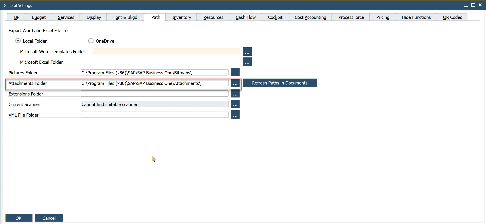

:::note
In this example we are only adding attachment to the backend. We are not linking this attachment to a Sales Order. This needs to be done in a custom controller. We are adding attachments from this example to Sales Orders in Custom controller tutorial.
:::

#### Final look of application

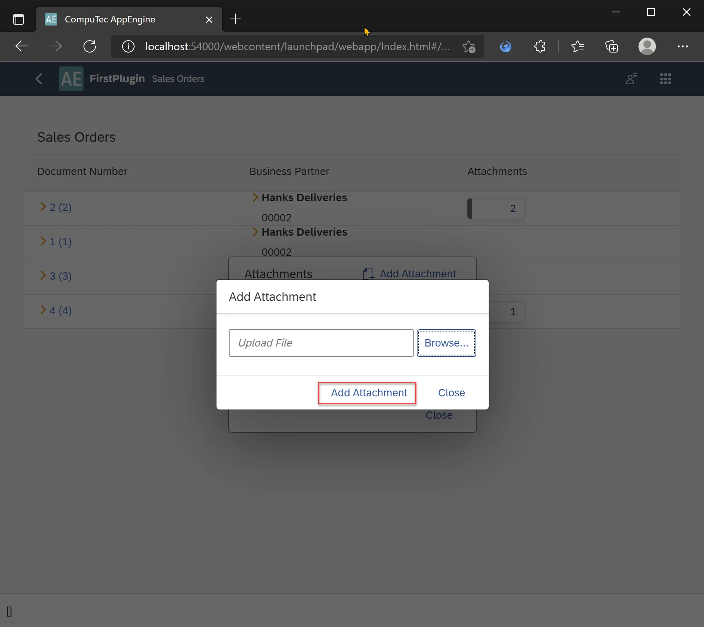

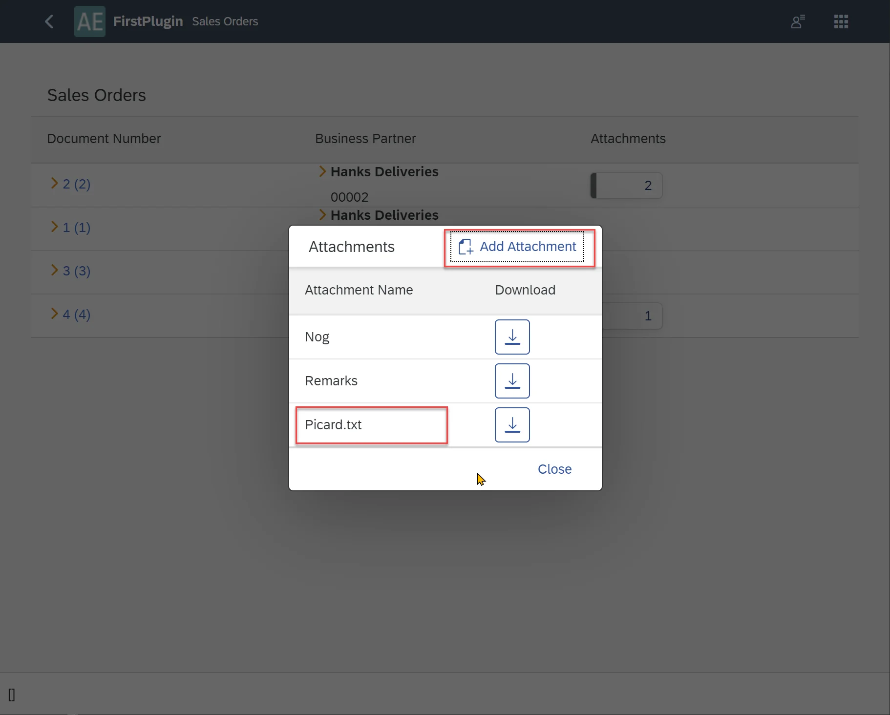
