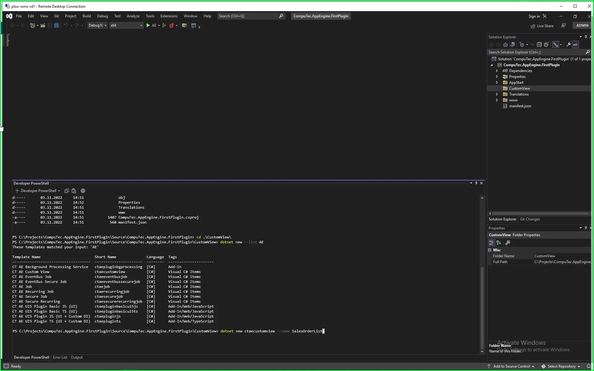
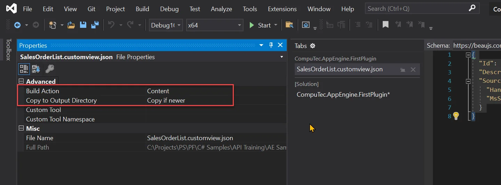
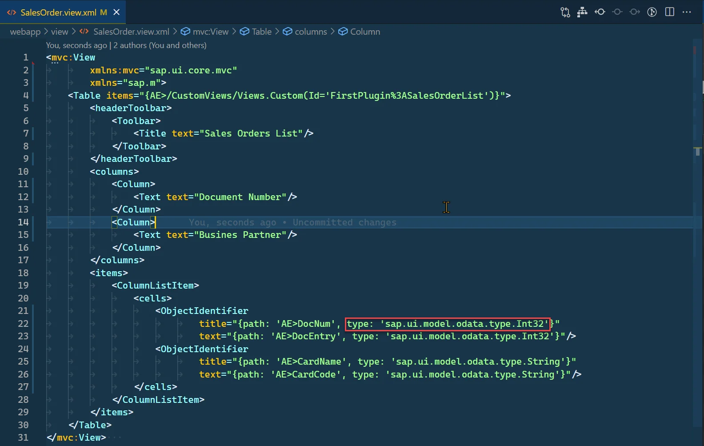
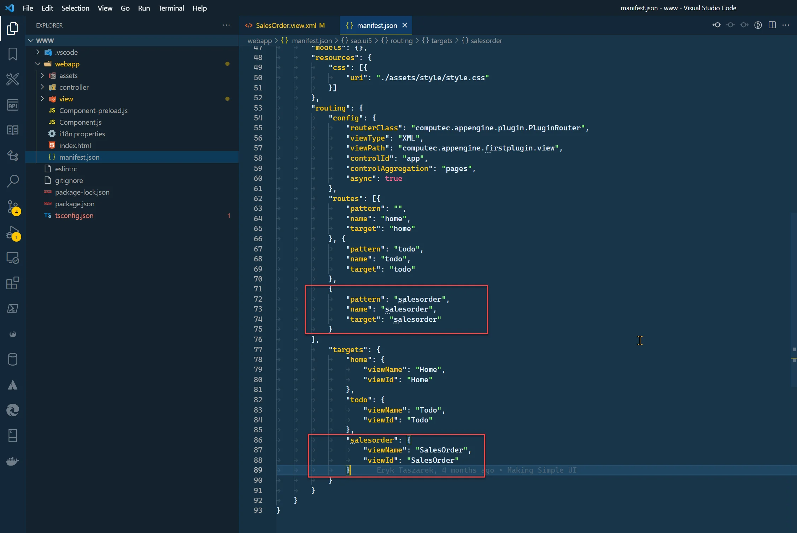
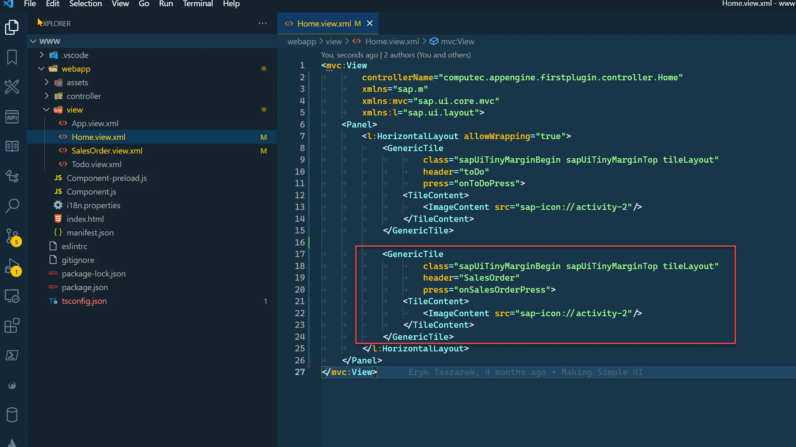
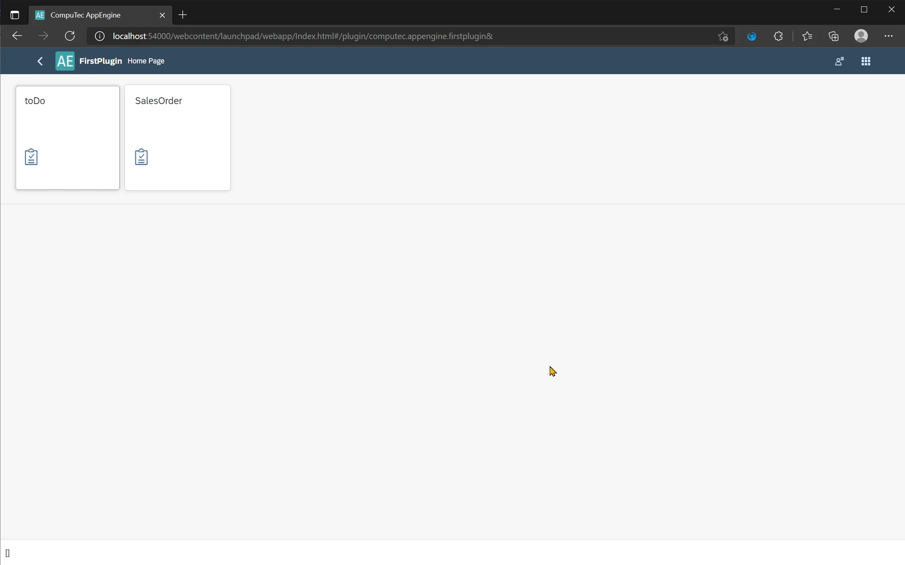
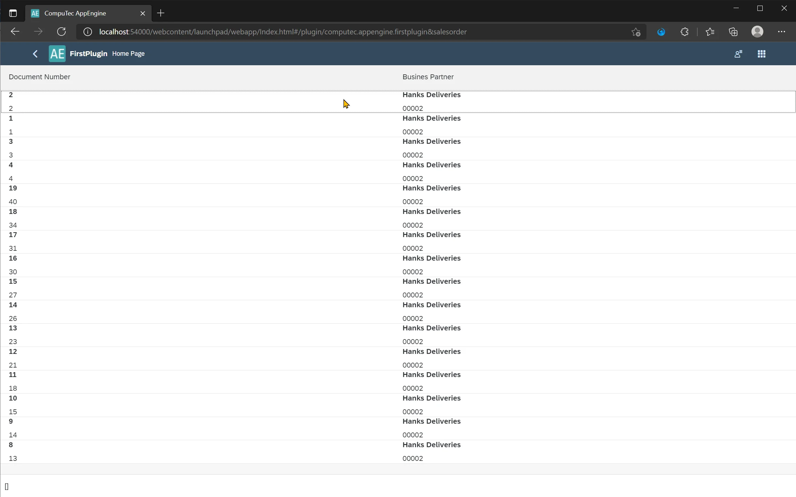

# Creating a Custom View

CompuTec AppEngine provides a mechanism for encapsulating complex database queries as simple structures and exposing them as REST API and OData.

---

## Features

- simplified data consumption in Web API client or UI
- supports OData V4
- supports SAP HANA and Microsoft SQL Server
- supports CompuTec AppEngine plugins
- the CustomViews folder is available in the AppEngine installation directory, and ProgramData/CompuTec/AppEngine.

## Usage

### Create a custom view

1. Open a plugin project in Visual Studio.
2. Create a folder, e.g., CustomView (right-click on a Project → New Folder), and go to it.
3. Open Terminal (View → Terminal).
4. Navigate to the created folder.
5. Create a new custom view by using the following command in Terminal (named SalesOrderList in the following example):

    ```javascript
    dotnet new ctaecustomview --name SalesOrderList
    ```

    
6. Open the properties of the added file and set up the following values:

    - Build Action to Content
    - Copy to Output Directory to "Copy if newer."

    
7. Open the created file and define queries for HANA and MSSQL in the following structure:

   - Id – Id of a CustomView. This ID will be used to retrieve data from this view
   - Description – meaningful description of this view for developer reference
   - Source
   - Hana – SQL Query for HANA server type
   - MsSql – SQL Query for MSSQL server type
8. Example of a defined view:

    SalesOrderList.customview.json

    ```json
    {
    "Id": "SalesOrderList",
    "Description": "Sales Order List",
    "Source": {
        "Hana": "SELECT \"DocEntry\", \"DocNum\", \"CardCode\", \"CardName\" FROM ORDR",
        "MsSql": "SELECT DocEntry, DocNum, CardCode, CardName  FROM ORDR"
    }
    }
    ```

### Bind custom view to control in UI5

1. To bind a created custom view to our control, we need to use the following syntax:

    ```text
    AE>/CustomViews/Views.Custom(Id='<PluginId>:<ViewId>')
    ```

2. Open the www folder in the preferred IDE. In the below examples, we use Visual Studio Code.
3. Now, in the view folder, let's create a new file, SalesOrder.view.xml.

    
4. Add View definition and table definition in it:

    SalesOrder.view.xml

    ```xml
    <mvc:View
            xmlns:mvc="sap.ui.core.mvc"
            xmlns="sap.m">
        <Table items="{AE>/CustomViews/Views.Custom(Id='FirstPlugin%3ASalesOrderList')}">
            <headerToolbar>
                <Toolbar>
                    <Title text="Sales Orders List"/>
                </Toolbar>
            </headerToolbar>
            <columns>
                <Column>
                    <Text text="Document Number"/>
                </Column>
                <Column>
                    <Text text="Business Partner"/>
                </Column>
            </columns>
            <items>
                <ColumnListItem>
                    <cells>
                        <ObjectIdentifier
                                title="{path: 'AE>DocNum', type: 'sap.ui.model.odata.type.Int32'}"
                                text="{path: 'AE>DocEntry', type: 'sap.ui.model.odata.type.Int32'}"/>
                        <ObjectIdentifier
                                title="{path: 'AE>CardName', type: 'sap.ui.model.odata.type.String'}"
                                text="{path: 'AE>CardCode', type: 'sap.ui.model.odata.type.String'}"/>
                    </cells>
                </ColumnListItem>
            </items>
        </Table>
    </mvc:View>
    ```

5. As you can notice, we bind our custom view to Table control items aggregation. AE is a model alias available when you run your plugin inside Launchpad (your plugin Component needs to extend Computec.AppEngine.ui.core.Component). Please note that you must change ":" in Custom View ID to its URL encoded version %3A, as shown below.

    
6. To bind controls inside our table, we must provide data type. This is required in the case of Custom Views because we don't have the $metadata definition of our custom view.

    

### Test of created View

1. To test our view, we need to set up a route to it. To do this, open the manifest.json file.
2. There, you need to add a route and target as shown below:

    
3. Now you can navigate to this path manually: `http://localhost:54000/webcontent/launchpad/webapp/Index.html#/plugin/computec.appengine.firstplugin&salesorder`
4. Optionally, you can add a tile to the Home view with navigation, as shown below.

#### Adding navigation to the Sales Orders view

1. Edit Home.view.xml.
2. Add the following Tile inside the Horizontal Layout.

    Home.view.xml

    ```xml
    <GenericTile
        class="sapUiTinyMarginBegin sapUiTinyMarginTop tileLayout"
        header="SalesOrder"
        press="onSalesOrderPress">
        <TileContent>
            <ImageContent src="sap-icon://activity-2"/>
        </TileContent>
    </GenericTile>
    ```

    
3. Now, we need to add the "onSalesOrderPress" function to Home.controller.js.

    Home.controller.js

    ```js
    onSalesOrderPress: function (env) {
        var router = this.  getRouter();
        router.navTo("salesorder");
    },
    ```

    

##### Results

1. Plugin navigation Tiles.

    
2. Sales Orders view.

    
