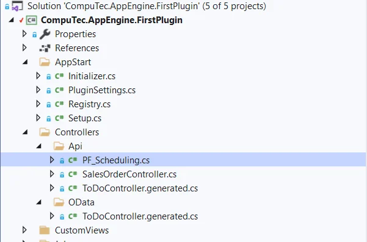
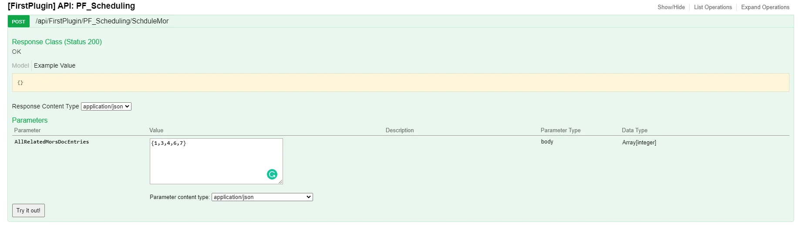

# Custom controller that uses ProcessForce API

## Description

In this example, we will show how to add a custom controller that uses ProcessForce objects and logic. In this example, we will create a controller that is responsible for scheduling Manufacturing Orders.

## Creating custom controller

1. Open your plugin solution in Visual Studio.
2. Create a new class: PF_SchedulingController.cs inside Controllers/Api.

    
3. This controller needs to inherit from CompuTec.AppEngine.Base.Infrastructure.Controllers.API.AppEngineSecureController, because we need to authenticate a user to work on SAP document.

    SalesOrderController.cs

    ```csharp
    using CompuTec.AppEngine.Base.Infrastructure.Controllers.API;

    namespace CompuTec.AppEngine.FirstPlugin.Controllers.Api
    {
        public class PF_SchedulingController: AppEngineSecureController
        {

        }
    }
    ```

4. Add a Post Method, which as a parameter will require a list of integers that represents a Manufacturing order DocEntrys.

    GetSalesOrder

    ```csharp
    [HttpPost]

            [Route("SchduleMor")]
            public IHttpActionResult SchduleMor([FromBody] List<int> AllRelatedMorsDocEntries)
            {
                bool saving = false;
                //iF YOU NEED pf COMPANY PLEASE USE THIS
                var pfCompany = Session.GetCompany<IProcessForceCompany>();


                // you are already connected
                List<IManufacturingOrder> listOfMorsToBeAdded = BulkUdoConverter.GetBulkObjects<IManufacturingOrder, int>(Session.Token, ObjectTypes.ManufacturingOrder, AllRelatedMorsDocEntries);
                //GetListOfMors
                //You can manipulate Manufacturing orders now by iterating them and injest all the logic
                foreach (var item in listOfMorsToBeAdded)
                {
                    item.U_SchedulingMtd = PF_MORSchedulingMthd.Forward;
                    item.U_PlannedStartDate = DateTime.Today.AddDays(1);
                    item.U_PlannedStartTime = item.U_PlannedStartDate;
                }

                // AllRelatedMorsDocEntries this is a list that contains docentry of MORS to be scheduled on one run
                var sm = new CompuTec.ProcessForce.API.Scheduling.ScheduleManager(Session.Token);

                MultiScheduleParameters param =
                        Activator.CreateInstance(typeof(MultiScheduleParameters),
                        System.Reflection.BindingFlags.NonPublic |
                            System.Reflection.BindingFlags.Instance,
                        null, new object[] { Session.Token }, null) as MultiScheduleParameters;

                listOfMorsToBeAdded.ForEach(m => param.Add(m));
                param.UpdateParents();
                var scheduledMors = sm.Schedule(param);
                //save the mor list scheduledMors
                if (saving)
                {
                    foreach (var item in listOfMorsToBeAdded)
                    {
                        item.Update();
                    }
                }

                return Ok("");
            }
    ```

5. Now you can see the method in Swagger.

    
6. Calling Controller:

    - Address: URL of the AppEngine and controller
    - HTTP method: POST
    - Content-Type: json
    - Body content:

    ```json
    [11,6,7,8]
    ```

:::note
If you want to use the IProcessForceCompany object, get it from the session object.

`var pfCompany = Session.GetCompany<IProcessForceCompany>();`
:::
