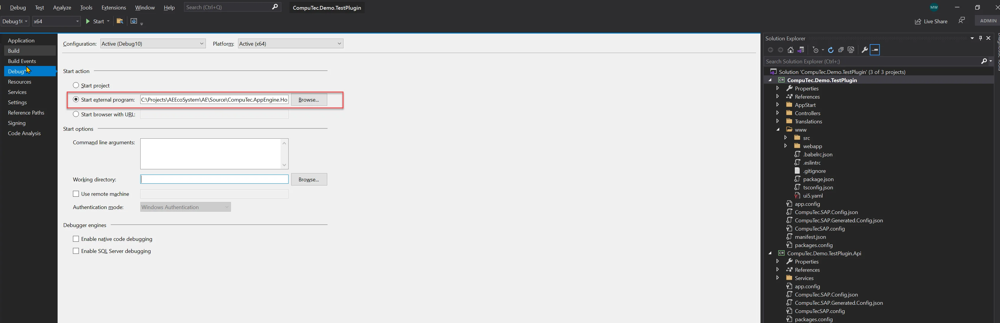
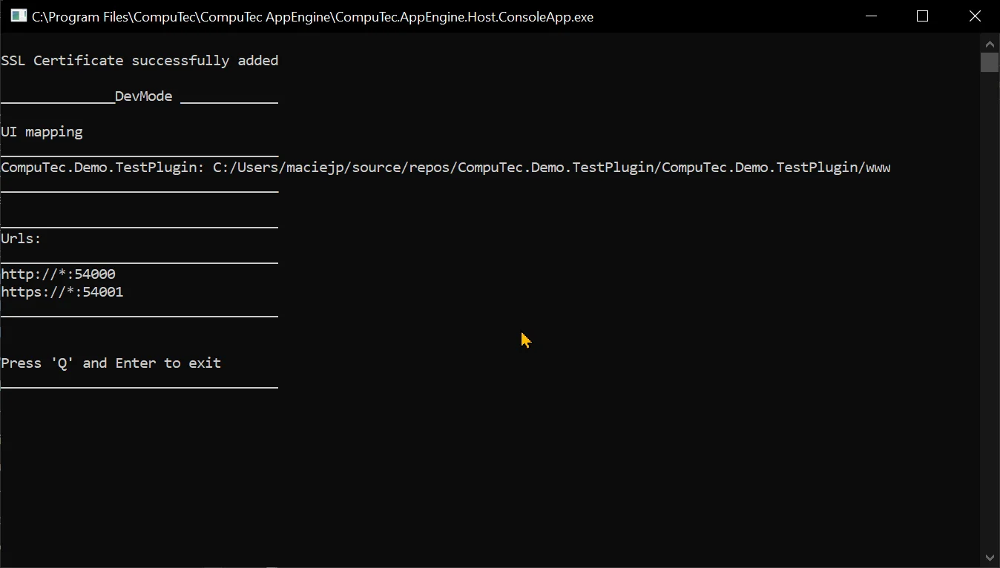

# Development tips for AppEngine and UI5 TypeScript

## Prerequisites

Node.js version 12 or higher

## Visual Studio Code recommended extensions

- SAP Fiori tools - Extension Pack
- UI5 Language Assistant
- XML Toolkit
- ESLint

## Recommended configuration for build and debug

1. Set up build path for the Plugin project. Thanks to that, files will be build to the location where AppEngine keeps all plugins.

    1. Open your Plugin Solution in Visual Studio
    2. Open Properties for Plugin Project.
    3. Open Build tab and set up Output path as shown below. AppEngine stores all plugins in ProgramData/Computec/AppEngine/Plugins. There you can create a new folder with a name that is the same as Plugin Route (RoutePrefix in AppEngine manifest.json).

    

    :::warning
        To run plugins without plugin installation procedure, AppEngine needs to be in DevMode. Configuration of AppEngine is described in the III point.
    :::

2. Set up debug in Visual Studio. This will allow you to debug you start AppEngine and your plugin in Debug mode.

    1. Open your Plugin Solution in Visual Studio
    2. Open Properties for Plugin Project
    3. Open Debug tab.
    4. As Start Action select Start External Program and set up path to CompuTec.AppEngine.Host.ConsoleApp.exe in installation directory. In case of default install this file will be located in: Program Files\CompuTec\CompuTec AppEngine\CompuTec.AppEngine.Host.ConsoleApp.exe.

    

3. Set up AppEngine to get frontend files directly from your project. This setting will allow you to change frontend files directly in your project and see changes without the need to rebuild after each change.

    1. Start CompuTec.AppEngine.Host.ConsoleApp.exe by debugging your plugin or from the command line. This first run will create separate configuration files for debug mode (in ProgramData\Computec\AppEngine):

        1. dev_appengine.config
        2. dev_backgroundProcessing.config
    2. Stop CompuTec.AppEngine.Host.ConsoleApp.exe
    3. To turn on debug mode on frontend, edit dev_appengine.config file.
    4. Set up:

        1. DevMode to True
        2. UIDevMode to True
        3. In DevUIMapping specify the path to source code of your UI5 Application files as following key value pair: `<PluginId>:<PluginPath>`. Frontend files from this path will be used instead of files from the AppEngine plugins directory.

    5. Path mapping example:

        ```json
        "DevMode": "True",
            "UIDevMode": "True",
            "DevUIMapping": {
                "CompuTec.Demo.TestPlugin": "C:/Users/maciejp/source/repos/CompuTec.Demo.TestPlugin/CompuTec.Demo.TestPlugin/www"
            },
        ```

    6. Start CompuTec.AppEngine.Host.ConsoleApp.exe and you can verify your settings in the console.

        
    7. Open your www folder in Visual Studio.
    8. In the terminal, start build script in watch mode:

        ```bash
        npm run "watch:ts"
        ```

    9. Go to AppEngine Administration Panel to activate your plugin if it is not activated yet.
    10. Go to AppEngine Launchpad and open your plugin.
    11. To check if path mapping is set up correctly, change something in your UI5 application and check if this change is reflected after refreshing the browser.
