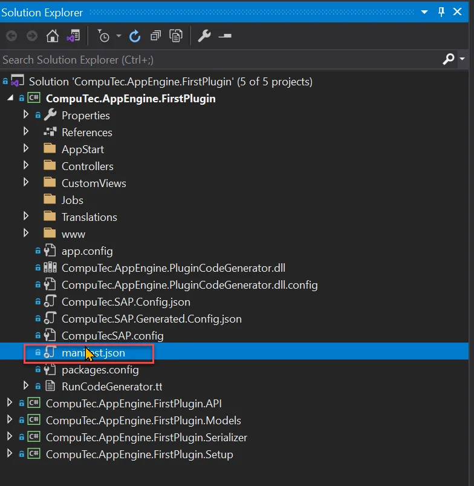
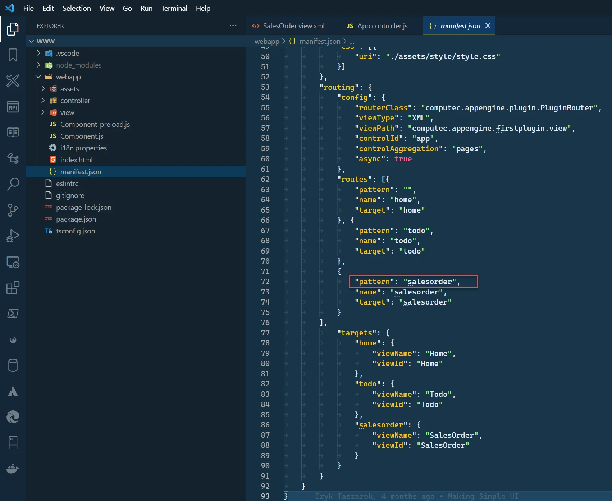
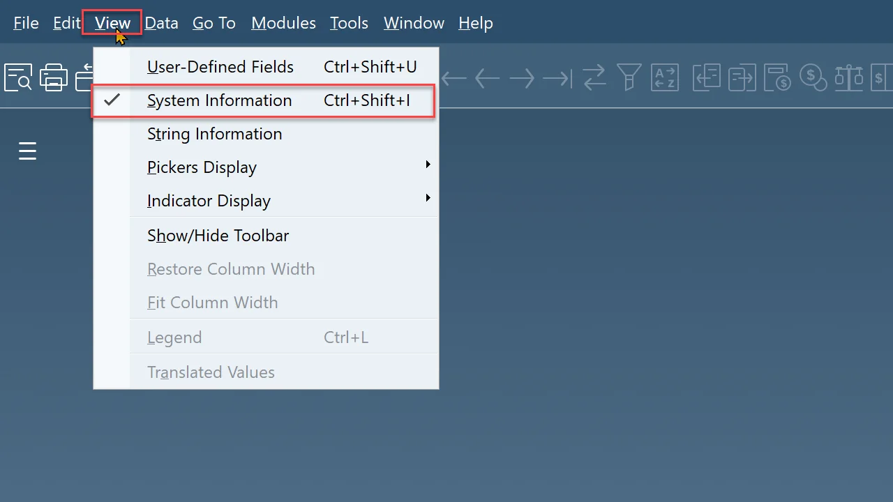
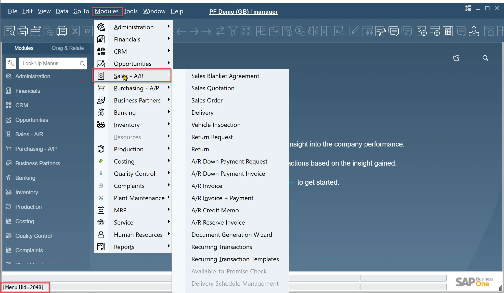
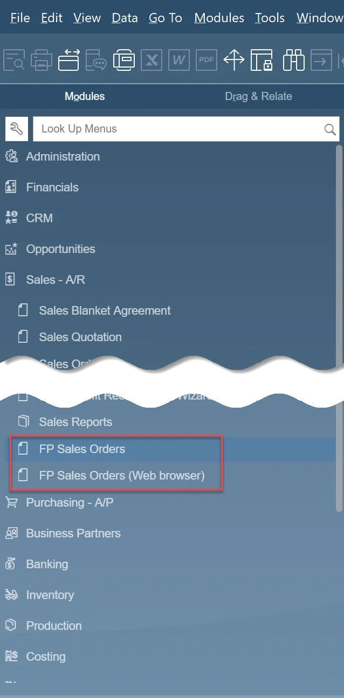

# Embedding plugin form in ProcessForce

## Description

ProcessForce allows starting AppEngine Plugin directly inside SAP. This is done base on the manifest configuration of the Plugin. Base on this configuration new positions related to Plugins will appear inside SAP Menu. Opening such a position will open a new Form with a browser that will open the AppEngine launchpad and inside it navigate to the correct plugin.

### ProcessForce AppEngine connection configuration

To make it work, ProcessForce needs to connect to AppEngine. Connection configuration is described in the following article: SAP Business One settings.

### Plugin configuration

If you want to open the plugin from SAP Business One, add the "sapForm" element to the plugin description (manifest.json file inside your plugin project).

Here add a menu entry that leads to the Sales Orders list created in previous tutorials.

1. Open manifest.json file localized in your Plugin project:

    
2. Add new sapForm entry into ui.apps.sapForms array:

    - uniqueId – a unique form id, set this to firstplugin_salesorder
    - formMode – a boolean which says to open as rootView or as redirection. When opening a plugin inside a SAP Business One form, you should always set this to "false". This has impact to AppEngine launchpad behavior.
    - URL – here you can define the path pattern. It should match pattern inside our UI5 manifest.json sap.ui5.routing.routes configuration. In our example, we are using salesorders.

        
    - fatherUID – ID of the element under which we want to put the plugin menu entry. You can find element ID inside SAP Business One. To do this:

        - first, turn on System Information in View.

            
        - To find the element's Id, open Modules and hover pointer over the desired position. In the status bar you can find it's Id.

            
    - menuItem – setting this to true adds a menu entry. If it is false, the menu entry will not be created (this is useful if someone would like to open this form programmatically but do not want to have menu entry)
    - menuCaption – a title of the menu entry that will be displayed in SAP Business One Menu.

    SAP Form entry

    ```js
    {
        "uniqueId": "firstplugin_salesorder",
        "formMode": false,
        "url": "salesorder",
        "fatherUID": "2048",
        "menuItem": true,
        "menuCaption": "FP Sales Orders"
    }
    ```

3. Finally, the manifest.json should look like this:

    manifest.json

    ```js
    {
    "version": "1.0.0",
    "id": "FirstPlugin",
    "name": "FirstPlugin",
    "icon": "sap-icon://activate",

    "company": "",
    "api": {
        "routePrefix": "FirstPlugin",
        "setupAssembly": "CompuTec.AppEngine.FirstPlugin",
        "assemblies": [
        "CompuTec.AppEngine.FirstPlugin",
        "CompuTec.AppEngine.FirstPlugin.Models",
        "CompuTec.AppEngine.FirstPlugin.Serializer",
        "CompuTec.AppEngine.FirstPlugin.API",
        "CompuTec.AppEngine.FirstPlugin.Setup"
        ],
        "dependencies": {
        }
    },
    "ui": {
        "apps": [
        {
            "icon": "sap-icon://example",
            "namespace": "computec.appengine.firstplugin",
            "tile": "FirstPlugin",
            "target": "home",
            "type": "User",
            "sapForms": [
            {
                "uniqueId": "firstplugin_salesorder",
                "formMode": false,
                "url": "salesorder",
                "fatherUID": "2048",
                "menuItem": true,
                "menuCaption": "FP Sales Orders"
            }
            ]
        }
        ]
    }
    }
    ```

## Results

After rebuilding the solution and restarting AppEngine we need to restart SAP Business One (Make sure that your plugin is activated on the correct company)

Now our menu entry is visible in SAP Menu:


