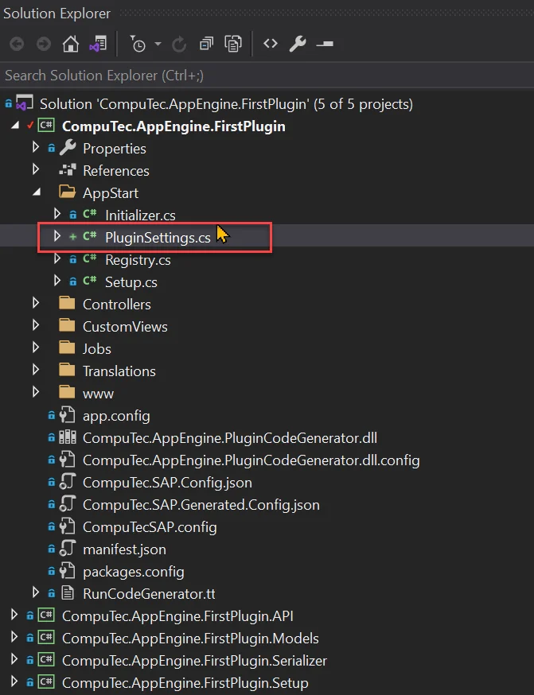
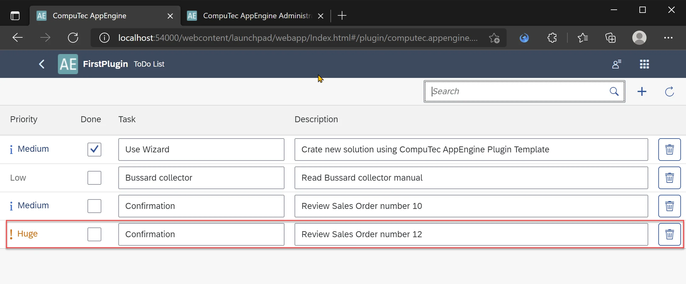

# Plugin configuration

AppEngine allows plugins to expose additional configuration. This configuration can be changed when you navigate to Plugin inside AppEngine Administration Panel. In this tutorial we will add configuration for our FirstPlugin and use it inside SalesOrderToApproveEventJob Job that we created in pervious tutorial.


## Adding configuration to plugin

1. Create new class PluginSettings.cs that implement abstract class `CompuTec.AppEngine.Base.Infrastructure.Configuration.SettingsCollection<IPluginConfiguration>`

    
2. You are required to implement GetSettings method - this method should return configuration of out plugin.

    PluginSettings.cs

    ```csharp
    using CompuTec.AppEngine.Base.Infrastructure.Configuration;
    using CompuTec.AppEngine.Base.Infrastructure.Plugins;
    using System;
    using System.Collections.Generic;

    namespace CompuTec.AppEngine.FirstPlugin.AppStart
    {
        public class PluginSettings : SettingsCollection<IPluginConfiguration>
        {
            public override List<SettingDefinition> GetSettings()
            {
                throw new NotImplementedException();
            }
        }
    }
    ```

3. Lets add simple configuration that will allow as to choose priority for Task created inside SalesOrderToApproveEventJob Job

    - Create new SettingDefinition lists

        `List<SettingDefinition> settings = new List<SettingDefinition>();`
    - Add new configuration node named SalesOrderToApproveEventJob

        `settings.Add(new SettingDefinition<Dictionary<string, object>>("SalesOrderToApproveEventJob", new Dictionary<string, object>(), false, true));`
    - Add TaskPriority setting inside this node. Notice that to do this you need to set Key as `<parentName>:<childName>`. Below we are defining also default value for this setting to Medium. You can also see that there is validationFunc declared - PriorityValidation.
        - key – setting name
        - defautlValue – setting a default value
        - validationFunc - function that will be used for validaton
        - secure – determines whether you will be able to see your setting in Administration Panel or not
        - editable – determines whether you can edit once made setting

        `settings.Add(new SettingDefinition<string>($"SalesOrderToApproveEventJob:TaskPriority", ToDoPriority.Medium.ToString(), PriorityValidation, null, false, true));`

    - Add validation function - PriorityValidation. Here we are just checking if value exists in ToDoPriority enumerator and if not we are displaying list of possible values.

        ```csharp
        public static void PriorityValidation(string key, string newStatus, IConfiguration configuration)
        {
            if (!Enum.TryParse<ToDoPriority>(newStatus, out var a))
            {
                List<string> allowedPriorities = new List<string>();
                foreach(var e in (typeof(ToDoPriority).GetEnumValues())) {
                    allowedPriorities.Add(e.ToString());
                }

                throw new AppEngineException($"Incorrect value for Priority: {newStatus}. Allowed values: {string.Join(",", allowedPriorities)}");
            }

        }
        ```

4. Finally PluginSettings.cs will have following form

    PluginSettings.cs

    ```csharp
    using CompuTec.AppEngine.Base.Infrastructure.Configuration;
    using CompuTec.AppEngine.Base.Infrastructure.Exceptions;
    using CompuTec.AppEngine.Base.Infrastructure.Plugins;
    using CompuTec.AppEngine.FirstPlugin.API.Enums;
    using System;
    using System.Collections.Generic;

    namespace CompuTec.AppEngine.FirstPlugin.AppStart
    {
        public class PluginSettings : SettingsCollection<IPluginConfiguration>
        {
            public override List<SettingDefinition> GetSettings()
            {
                List<SettingDefinition> settings = new List<SettingDefinition>();

                #region  SalesOrderToApproveEventJob node
                settings.Add(new SettingDefinition<Dictionary<string, object>>("SalesOrderToApproveEventJob", new Dictionary<string, object>(), false, true));

                settings.Add(new SettingDefinition<string>($"SalesOrderToApproveEventJob:TaskPriority", ToDoPriority.Medium.ToString(), PriorityValidation, null, false, true));
                #endregion

                return settings;
            }

            public static void PriorityValidation(string key, string newStatus, IConfiguration configuration)
            {
                if (!Enum.TryParse<ToDoPriority>(newStatus, out var a))
                {
                    List<string> allowedPriorities = new List<string>();
                    foreach (var e in (typeof(ToDoPriority).GetEnumValues()))
                    {
                        allowedPriorities.Add(e.ToString());
                    }

                    throw new AppEngineException($"Incorrect value for Priority: {newStatus}. Allowed values: {string.Join(",", allowedPriorities)}");
                }

            }
        }
    }
    ```

### Results

Now after you rebuild and start AppEngine your configuration will be added to AppEngine configuration (appengine.config or respectively dev_appengine.config). This can be seen in Administration Panel in Plugin Settings.


This is also visible in global AppEngine Settings.


You can check if validation works by trying to set incorrect value.


## Using configuration value inside job

Having plugin configuration added, now it's time to use it. We will retrieve value from configuration and use it inside SalesOrderToApproveEventJob Job.

1. Open configuration in Administration Pane and set Priority to Huge

    

2. Open SalesOrderToApproveEventJob.cs file in Visual Studio and add method GetDefaultPriority. To retrieve value we need to use method Get on configuration with appropriate key (same key as in configuration definition). After that we are returning enumerator value.

    ```csharp
    private ToDoPriority GetDefaultPriority()
    {
        var configuration = Container.GetInstance<IPluginConfiguration>();
        string priority = configuration.Get<string>($"SalesOrderToApproveEventJob:TaskPriority");
        return (ToDoPriority)Enum.Parse(typeof(ToDoPriority), priority);
    }
    ```

3. Than we just need to replace line where we set Task priority to

    ```csharp
    toDoTask.U_Priority = GetDefaultPriority();
    ```

4. Finally after Job class should be same as below

    SalesOrderToApproveEventJob.cs

    ```csharp
    using CompuTec.AppEngine.Base.Infrastructure.Jobs;
    using CompuTec.AppEngine.Base.Infrastructure.Jobs.Annotations;
    using CompuTec.AppEngine.Base.Infrastructure.Plugins;
    using CompuTec.AppEngine.Base.Infrastructure.Security;
    using CompuTec.AppEngine.FirstPlugin.API.BusinessObjects.ToDo;
    using CompuTec.AppEngine.FirstPlugin.API.Enums;
    using CompuTec.BaseLayer.DI;
    using CompuTec.Core2.DI.Database;
    using Newtonsoft.Json;
    using NLog;
    using StructureMap;
    using System;

    namespace CompuTec.AppEngine.FirstPlugin.Jobs
    {
        [EventBusJob(JobId = "SalesOrderToApproveEventJob", Description = "Crate new To Do Job for Added Sales Orders that are unapproved", ContentType = "17", ActionType = "A")]
        public class SalesOrderToApproveEventJob : EventBusSecureJob
        {
            Logger _logger;
            public SalesOrderToApproveEventJob(Session session, IContainer container, EventBus.Message message) : base(session, container, message)
            {
                _logger = container.GetInstance<Logger>();
            }

            public override void Call()
            {
                try
                {
                    _logger.Trace($"Job :SalesOrderToApproveEventJob Started for :{Message.Body}");
                    dynamic json = JsonConvert.DeserializeObject(Message.Body);
                    int DocEntry = json.DocEntry;

                    bool approved;
                    int DocNum;
                    using (CTRecordset rs = this.GetSalesOrderDetails(DocEntry))
                    {
                        DocNum = rs.Fields.Item("DocNum").Value;
                        string Confirmed = rs.Fields.Item("Confirmed").Value;
                        approved = Confirmed == "Y" ? true : false;
                    }

                    if (!approved)
                    {
                        AddNewToDoTask(DocNum);
                        _logger.Trace($"Job :SalesOrderToApproveEventJob finished successfully. To Do Task added");
                    }
                    else
                    {
                        _logger.Trace($"Job :SalesOrderToApproveEventJob finished successfully - Nothing to do, Sales Order already approved.");
                    }
                }
                catch (Exception e)
                {
                    _logger.Error(e, $"Job :SalesOrderToApproveEventJob failed:{e.Message}");
                    throw;
                }

            }

            private ToDoPriority GetDefaultPriority()
            {
                var configuration = Container.GetInstance<IPluginConfiguration>();
                string priority = configuration.Get<string>($"SalesOrderToApproveEventJob:TaskPriority");
                return (ToDoPriority)Enum.Parse(typeof(ToDoPriority), priority);
            }

            private void AddNewToDoTask(int DocNum)
            {
                IToDo toDoTask = CompuTec.Core2.CoreManager.GetUDO(Session.Token, "SAMPLE_TO_DO");
                toDoTask.U_TaskName = $"Confirmation";
                toDoTask.U_Description = $"Review Sales Order number {DocNum}";
                toDoTask.U_Priority = GetDefaultPriority();
                if (toDoTask.Add() != 0)
                    throw new Exception($"Exception while adding ToDo task: {Session.Company.GetLastErrorDescription()}");
            }

            private CTRecordset GetSalesOrderDetails(int DocEntry)
            {
                var qm = new QueryManager();
                qm.SetSimpleResultFields("DocEntry", "DocNum", "CardCode", "Confirmed");
                qm.SimpleTableName = "ORDR";
                qm.SetSimpleWhereFields("DocEntry");

                return qm.ExecuteSimpleParameters(Session.Token, DocEntry);
            }
        }
    }
    ```

## Results

Now when we add new Sales Order that is unapproved we should see new task with Huge priority:



