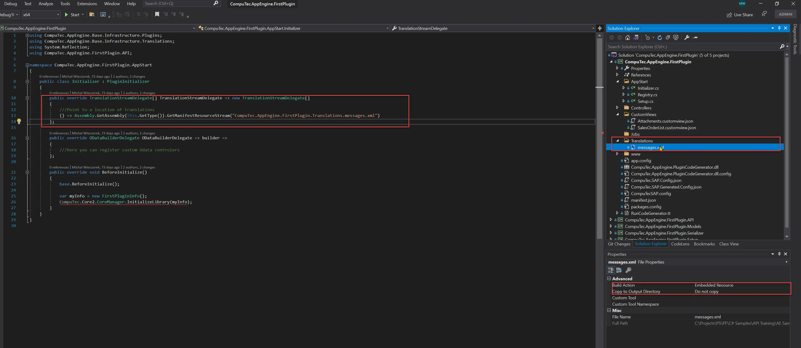
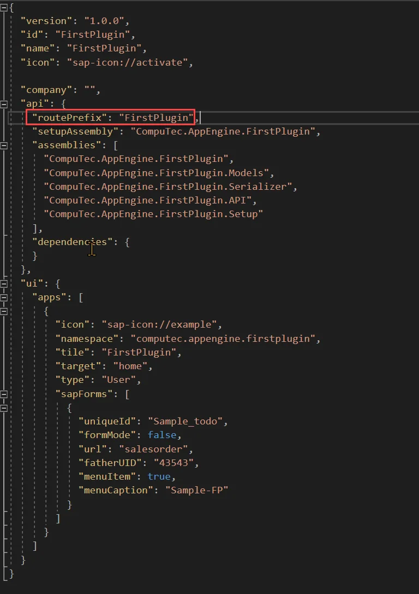
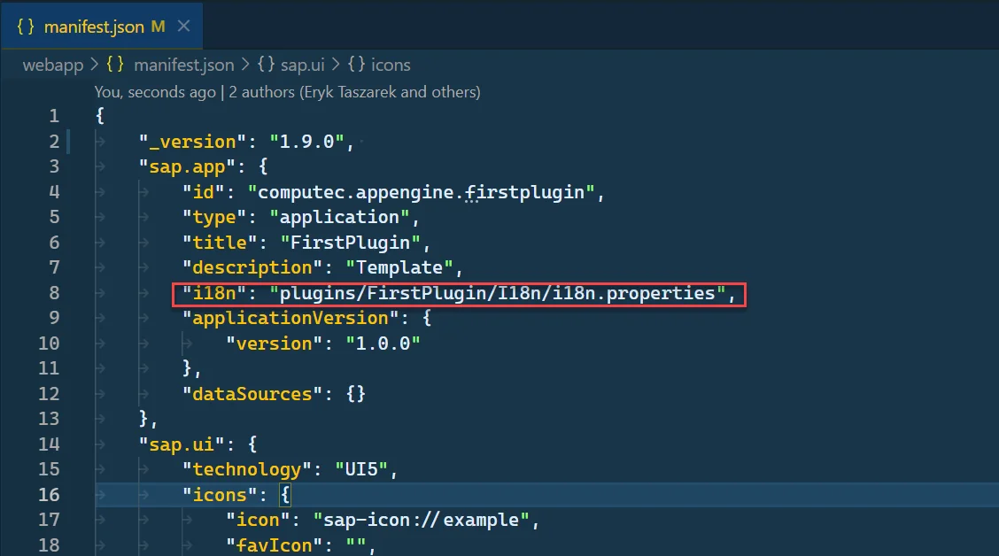
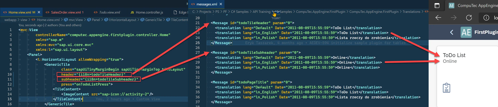
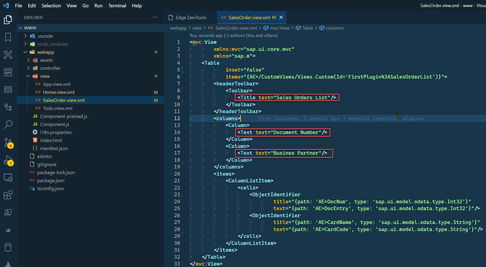
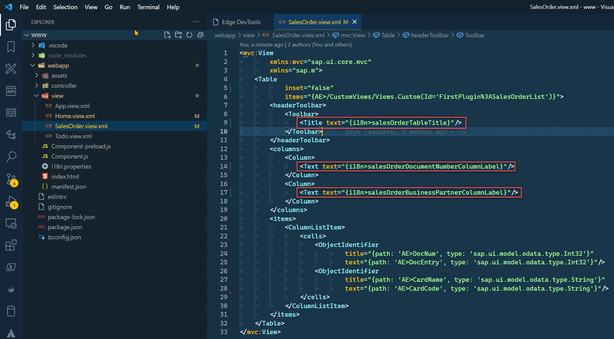
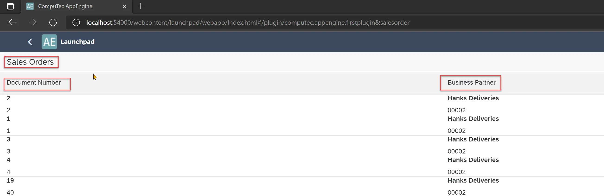

# Translations from backend

## Description

When using AppEngine, you can define your translation resource files directly in your project plugin. If you created a plugin with CompuTecthe AppEngine Plugin Template, the translation file is already added and registered. Translations require the following to work:

1. The translations file is an XML file with the following structure:

    Translations file structure

    ```xml
    <?xml version="1.0" encoding="utf-8"?>
    <messageTranslations xmlns:xsi="http://www.w3.org/2001/XMLSchema-instance" xmlns:xsd="http://www.w3.org/2001/XMLSchema">

    <Message id="[translationID]" param="0">
        <translation lang="[language]" Date="[Translation Adding date]">[Translated text for given Language]</translation>
        <translation lang="[language2]" Date="[YYYY-MM-DDThh:mm:ss]">[Translated text for given Language]</translation>
    </Message>

    <Message id="[translationID2]" param="0">
        <translation lang="[language]" Date="[Translation Adding date]">[Translated text for given Language]</translation>
        <translation lang="[language2]" Date="[Translation Adding date]">[Translated text for given Language]</translation>
    </Message>

    </messageTranslations>
    ```

    - id (translationID) – id that will be used in the UI5 app
    - lang (language) – a translation element for a given language.

        List of possible languages

        ```xml
        Default
        ln_Polish
        ln_English
        ln_German
        ln_Arabic
        ln_Chinese
        ln_Czech_Cz
        ln_Danish
        ln_Dutch
        ln_Finnish
        ln_French
        ln_Greek
        ln_Hebrew
        ln_Hungarian
        ln_Italian
        ln_Japanese_Jp
        ln_Korean_Kr
        ln_Norwegian
        ln_Portuguese
        ln_Portuguese_Br
        ln_Russian
        ln_Serbian
        ln_Slovak_Sk
        ln_Spanish
        ln_Spanish_Ar
        ln_Spanish_La
        ln_Spanish_Pa
        ln_Swedish
        ln_TrdtnlChinese_Hk
        ln_Turkish_Tr
        ln_Ukrainian
        ```

    - date (Translation adding date) – Date of adding translations in XSD DateTime format `<YYYY-MM-DDThh:mm:ss>`
2. Definition of TranslationStreamDelegate in PluginInitializer.

    
3. Pointing to backend translation in Plugin manifest.json by adding an i18n element to the sap.app.

    ```json
    "i18n": "plugins/<Plugin Route>/I18n/i18n.properties"
    ```

    - Plugin Route - The Plugin Route is defined when creating a Plugin from the wizard. You can find this value in the AppEngine plugin manifest.json.

        
    - Example

        

## Using internationalization in UI5 applications

If you created a Plugin Project from the, you can already check translations on Home.view.xml. The following screenshot shows how it works.

- In Home.view.xml file we defined binding for header of Generic Tile to `{i18n>todoTileHeader}` and subheder o `{i18n>todoTileSubheader}`. This is the standard way of defining translations in UI5.
- Translations IDs (todoTileHeader, todoTileSubheader) can be found in messages.xml. Based on the selected language (English in this example), the correct text is returned by AppEngine.



### Example of adding a translation to the Sales Orders list

In this example, we will add translations to our example from Creating a Custom View.

1. Let open SalesOrder.view.xml.
2. Now we will change Table Title text and column Texts to use translations:

    
3. To do this we just need to bind this properties to i18n and provide id. We will change

    - `<Title text="Sales Orders List"/>` to `<Title text="{i18n>salesOrderTableTitle}"/>`
    - `<Text text="Document Number"/>` to `<Text text="{i18n>salesOrderDocumentNumberColumnLabel}"/>`
    - `<Text text="Busines Partner"/>` to `<Text text="{i18n>salesOrderBusinessPartnerColumnLabel}"/>`

    

4. Now, we need to add translations for the added translations ID to the messages.xml file.

    messages.xml

    ```xml
    <Message id="salesOrderTableTitle" param="0">
    <translation lang="Default" Date="2011-08-09T15:55:59">Sales Orders</translation>
    <translation lang="ln_English" Date="2011-08-09T15:55:59">Sales Orders</translation>
    <translation lang="ln_Polish" Date="2011-08-09T15:55:59">Zlecenia sprzedaży</translation>
    </Message>
    <Message id="salesOrderDocumentNumberColumnLabel" param="0">
    <translation lang="Default" Date="2011-08-09T15:55:59">Document Number</translation>
    <translation lang="ln_English" Date="2011-08-09T15:55:59">Document Number</translation>
    <translation lang="ln_Polish" Date="2011-08-09T15:55:59">Number dokumentu</translation>
    </Message>
    <Message id="salesOrderBusinessPartnerColumnLabel" param="0">
    <translation lang="Default" Date="2011-08-09T15:55:59">Business Partner</translation>
    <translation lang="ln_English" Date="2011-08-09T15:55:59">Business Partner</translation>
    <translation lang="ln_Polish" Date="2011-08-09T15:55:59">Business Partner</translation>
    </Message>
    ```

5. Now, we need to rebuild the plugin project. Start AppEngine and refresh the plugin to see the changes. (Restart is needed only to refresh messages.xml file).

    
