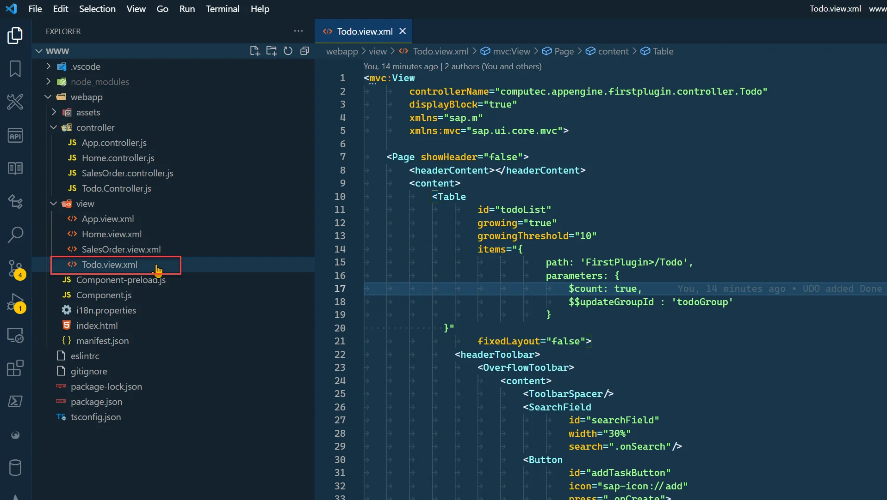
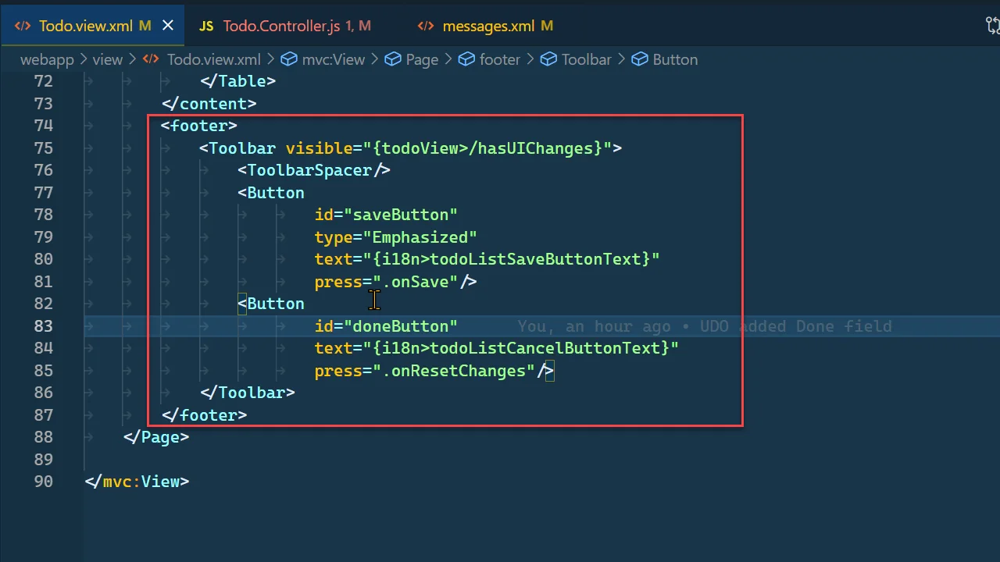
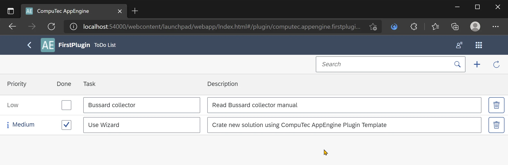

# Using User-Defined Objects in UI5 application

## Prerequisites

Example User Defined Object (UDO) in AppEngine Plugin Project completed.

## Description

After generating controllers, models, and serializers in User Defined Object (UDO) in AppEngine Plugin Project we will now adjust the ToDo view and controller on the frontend.

### Fixing binding in ToDo.view.xml

1. Open ToDo.view.xml

    
2. We need to change table binding:

    - from FirstPlugin>/Todo to FirstPlugin>/ToDo
    - we will remove $count and $$updateGroupId

    `items="{FirstPlugin>/ToDo}"`
3. Now, let's fix columns and items definition

    Add a new column for Task Description and appropriate translations to messages.xlm (you can find instructions here: Translations from backend)

    ```xml
    <Column id="taskColumnDescription">
    <Text text="{i18n>todoTableTaskColumnDescription}" />
    </Column>
    ```

    ```xml
    <Message id="todoTableTaskColumnDescription" param="0">
    <translation lang="Default" Date="2011-08-09T15:55:59">
        Description
    </translation>
    <translation lang="ln_English" Date="2011-08-09T15:55:59">
        Description
    </translation>
    <translation lang="ln_Polish" Date="2011-08-09T15:55:59">
        Opis
    </translation>
    </Message>
    ```

    - Add a new column for Priority and appropriate translations to messages.xlm

    ```xml
    <Column id="taskColumnPriority" width="8em">
    <Text text="{i18n>todoTableTaskColumnPriority}" />
    </Column>
    ```

    ```xml
    <Message id="todoTableTaskColumnPriority" param="0">
    <translation lang="Default" Date="2011-08-09T15:55:59">
        Priority
    </translation>
    <translation lang="ln_English" Date="2011-08-09T15:55:59">
        Priority
    </translation>
    <translation lang="ln_Polish" Date="2011-08-09T15:55:59">
        Priorytet
    </translation>
    </Message>
    ```

    - Change definition for ColumnListItem

    ```xml
    <ColumnListItem>
    <cells>
        <ObjectStatus
        icon="{= ${path: 'FirstPlugin>U_Priority', type: 'sap.ui.model.odata.type.String', formatter: '.getIconForPriority'}}"
        state="{= ${path: 'FirstPlugin>U_Priority', type: 'sap.ui.model.odata.type.String', formatter: '.getStateForPriority'}}"
        text="{= ${path: 'FirstPlugin>U_Priority', type: 'sap.ui.model.odata.type.String'}}"
        />
        <CheckBox selected="{ path: 'FirstPlugin>U_Done', type: 'computec.appengine.ui.controls.YesNoBoolType'}" />
        <Input value="{FirstPlugin>U_TaskName}" />
        <Input value="{FirstPlugin>U_Description}" />
    </cells>
    <Button icon="sap-icon://delete" press=".onDelete"></Button>
    </ColumnListItem>
    ```

4. We will also remove the footer as we are now working in $auto submit mode.

    
5. Finally, the definition of our Todo.view.xml should look like this.

    Todo.view.xml

    ```js
    <mvc:View
    controllerName="computec.appengine.firstplugin.controller.Todo"
    displayBlock="true"
    xmlns="sap.m"
    xmlns:mvc="sap.ui.core.mvc"
    >
    <Page showHeader="false">
        <content>
        <Table
            id="todoList"
            growing="true"
            growingThreshold="10"
            items="{FirstPlugin>/ToDo}"
            fixedLayout="false"
        >
            <headerToolbar>
            <OverflowToolbar>
                <content>
                <ToolbarSpacer />
                <SearchField id="searchField" width="30%" search=".onSearch" />
                <Button
                    id="addTaskButton"
                    icon="sap-icon://add"
                    press=".onCreate"
                >
                    <layoutData>
                    <OverflowToolbarLayoutData priority="NeverOverflow" />
                    </layoutData>
                </Button>
                <Button
                    id="refreshTodoListButton"
                    icon="sap-icon://refresh"
                    press=".onRefresh"
                />
                </content>
            </OverflowToolbar>
            </headerToolbar>
            <columns>
            <Column id="taskColumnPriority" width="8em">
                <Text text="{i18n>todoTableTaskColumnPriority}" />
            </Column>
            <Column id="isDoneColumn" width="3rem">
                <Text text="{i18n>todoTableIsDoneColumnTitle}" />
            </Column>
            <Column id="taskColumn" width="20em">
                <Text text="{i18n>todoTableTaskColumnTitle}" />
            </Column>
            <Column id="taskColumnDescription">
                <Text text="{i18n>todoTableTaskColumnDescription}" />
            </Column>
            <Column id="actions" width="3rem">
                <Text text="" />
            </Column>
            </columns>
            <items>
            <ColumnListItem>
                <cells>
                <ObjectStatus
                    icon="{= ${path: 'FirstPlugin>U_Priority', type: 'sap.ui.model.odata.type.String', formatter: '.getIconForPriority'}}"
                    state="{= ${path: 'FirstPlugin>U_Priority', type: 'sap.ui.model.odata.type.String', formatter: '.getStateForPriority'}}"
                    text="{= ${path: 'FirstPlugin>U_Priority', type: 'sap.ui.model.odata.type.String'}}"
                />
                <CheckBox selected="{ path: 'FirstPlugin>U_Done', type: 'computec.appengine.ui.controls.YesNoBoolType'}" />
                <Input value="{FirstPlugin>U_TaskName}" />
                <Input value="{FirstPlugin>U_Description}" />
                </cells>
                <Button icon="sap-icon://delete" press=".onDelete"></Button>
            </ColumnListItem>
            </items>
        </Table>
        </content>
    </Page>
    </mvc:View>
    ```

### Adjusting Todo.controller.js

1. Beacuse we are using computec.appengine.ui.controls.YesNoBoolType we need to add it to sap.ui.define

    ```js
    sap.ui.define([
        "computec/appengine/core/BaseController",
        "sap/ui/model/json/JSONModel",
        "sap/m/MessageBox",
        "sap/m/MessageToast",
        "sap/ui/model/Sorter",
        "sap/ui/model/Filter",
        "sap/ui/model/FilterOperator",
        "sap/ui/model/FilterType",
        "computec/appengine/ui/controls/YesNoBoolType"
    ], function (BaseController, JSONModel, MessageBox, MessageToast,
            Sorter, Filter, FilterOperator, FilterType, YesNoBoolType) {
    ```

2. We need to fix the onCreate function. We will change the object definition in the oBinding.create method.

    ```js
    onCreate: function () {
        var oList = this.byId("todoList"),
            oBinding = oList.getBinding("items"),

        oContext = oBinding.create({
                U_Priority: 'Low',
                U_Done: 'No'
            });

        oList.getItems().some(function (oItem) {
            if (oItem.getBindingContext() === oContext) {
                oItem.focus();
                return true;
            }
        });
    },
    ```

3. Also, the onSearch function can be expanded to search by Task Name and Description

    ```js
    onSearch: function () {
        var oView = this.getView(),
            sValue = oView.byId("searchField").getValue();

        const aFilters = [];
        if (typeof sValue === 'string' && sValue.length > 0) {
            aFilters.push(new Filter({
                path: 'U_TaskName',
                operator: FilterOperator.Contains,
                value1: sValue
            }));
            aFilters.push(new Filter({
                path: 'U_Description',
                operator: FilterOperator.Contains,
                value1: sValue
            }))
        }

        const oFilter = new Filter({
            filters: aFilters,
            and: false
        });

        oView.byId("todoList").getBinding("items").filter(oFilter);
    },
    ```

4. We will remove the onSave, onInputChange, and \_setUIChanges methods because we are now working in $auto submit mode.
5. We can also simplify the onInit method as we no longer need a view model.

    ```js
    onInit: function () {
        BaseController.prototype.onInit.call(this);

        this.setPageName("todoPageTitle");
    },
    ```

6. Our formatter functions for Priority ObjectStatus control are shown below

    - getIconForPriority

        ```js
        getIconForPriority: function (sPriority) {
            let sIcon;
            switch (sPriority) {
                case 'Low':
                    break;
                case 'Medium':
                    sIcon = 'sap-icon://hint';
                    break;
                case 'Huge':
                    sIcon = 'sap-icon://warning';
                    break;
                default:
                    sIcon = null;
                    break;
            }
            return sIcon;
        },
        ```

    - getStateForPriority

        ```js
        getStateForPriority: function (sPriority) {
            let sState;
            switch (sPriority) {
                case 'Low':
                    break;
                case 'Medium':
                    sState = 'Information';
                    break;
                case 'Huge':
                    sState = 'Warning';
                    break;
                default:
                    sState = 'None';
                    break;
            }
            return sState;
        }
        ```

7. In result Todo.controller.js should look like this.

    Todo.controller.js

    ```js
    sap.ui.define(
    [
        "computec/appengine/core/BaseController",
        "sap/ui/model/json/JSONModel",
        "sap/m/MessageBox",
        "sap/m/MessageToast",
        "sap/ui/model/Sorter",
        "sap/ui/model/Filter",
        "sap/ui/model/FilterOperator",
        "sap/ui/model/FilterType",
        "computec/appengine/ui/controls/YesNoBoolType",
    ],
    function (
        BaseController,
        JSONModel,
        MessageBox,
        MessageToast,
        Sorter,
        Filter,
        FilterOperator,
        FilterType,
        YesNoBoolType
    ) {
        "use strict";

        return BaseController.extend(
        "computec.appengine.firstplugin.controller.Todo",
        {
            onInit: function () {
            BaseController.prototype.onInit.call(this);

            this.setPageName("todoPageTitle");
            },

            onCreate: function () {
            var oList = this.byId("todoList"),
                oBinding = oList.getBinding("items"),
                oContext = oBinding.create({
                U_Priority: "Low",
                U_Done: "No",
                });

            oList.getItems().some(function (oItem) {
                if (oItem.getBindingContext() === oContext) {
                oItem.focus();
                return true;
                }
            });
            },

            onDelete: function (oEvent) {
            oEvent
                .getSource()
                .getBindingContext("FirstPlugin")
                .delete("$auto")
                .then(
                function () {
                    MessageToast.show(
                    this.geti18n().getText("deletionSuccessMessage")
                    );
                }.bind(this),
                function (oError) {
                    MessageBox.error(oError.message);
                }
                );
            },

            onResetChanges: function () {
            this.byId("todoList").getBinding("items").resetChanges();
            },

            onRefresh: function () {
            var oBinding = this.byId("todoList").getBinding("items");

            if (oBinding.hasPendingChanges()) {
                this.byId("todoList").getBinding("items").resetChanges();
            }

            oBinding.refresh();
            },

            onSearch: function () {
            var oView = this.getView(),
                sValue = oView.byId("searchField").getValue();

            const aFilters = [];
            if (typeof sValue === "string" && sValue.length > 0) {
                aFilters.push(
                new Filter({
                    path: "U_TaskName",
                    operator: FilterOperator.Contains,
                    value1: sValue,
                })
                );
                aFilters.push(
                new Filter({
                    path: "U_Description",
                    operator: FilterOperator.Contains,
                    value1: sValue,
                })
                );
            }

            const oFilter = new Filter({
                filters: aFilters,
                and: false,
            });

            oView.byId("todoList").getBinding("items").filter(oFilter);
            },

            getIconForPriority: function (sPriority) {
            let sIcon;
            switch (sPriority) {
                case "Low":
                break;
                case "Medium":
                sIcon = "sap-icon://hint";
                break;
                case "Huge":
                sIcon = "sap-icon://warning";
                break;
                default:
                sIcon = null;
                break;
            }
            return sIcon;
            },
            getStateForPriority: function (sPriority) {
            let sState;
            switch (sPriority) {
                case "Low":
                break;
                case "Medium":
                sState = "Information";
                break;
                case "Huge":
                sState = "Warning";
                break;
                default:
                sState = "None";
                break;
            }
            return sState;
            },
        }
        );
    }
    );
    ```

## Results

After these changes To Do view will work with our newly generated controllers for To Do User Defined Objects. We can now search, add, delete and change them. All changes are automatically send to backend to be saved.


