# User-Defined Object (UDO) in AppEngine Plugin Project

## Description

AppEngine offers out-of-the-box support for User Defined Objects. This allows a developer to easily define User Defined Tables, Fields, and Objects. These definitions will be used during the plugin update process on the selected database.

Additionally, you can use CompuTec AppEngine Plugin Code Generator you can generate models, serializes, and controllers (REST API and OData v4) for your business objects. In this document, we are describing this process in detail.

## Structure Definition

The following steps present examples of the creation of User Defined Tables, Fields, and Objects.

### Adding a new Project to the solution

1. Just for the sake of order, let's create a separate project where we will keep UDO definitions.
2. Right-click on the solution and select Add → New Project...

    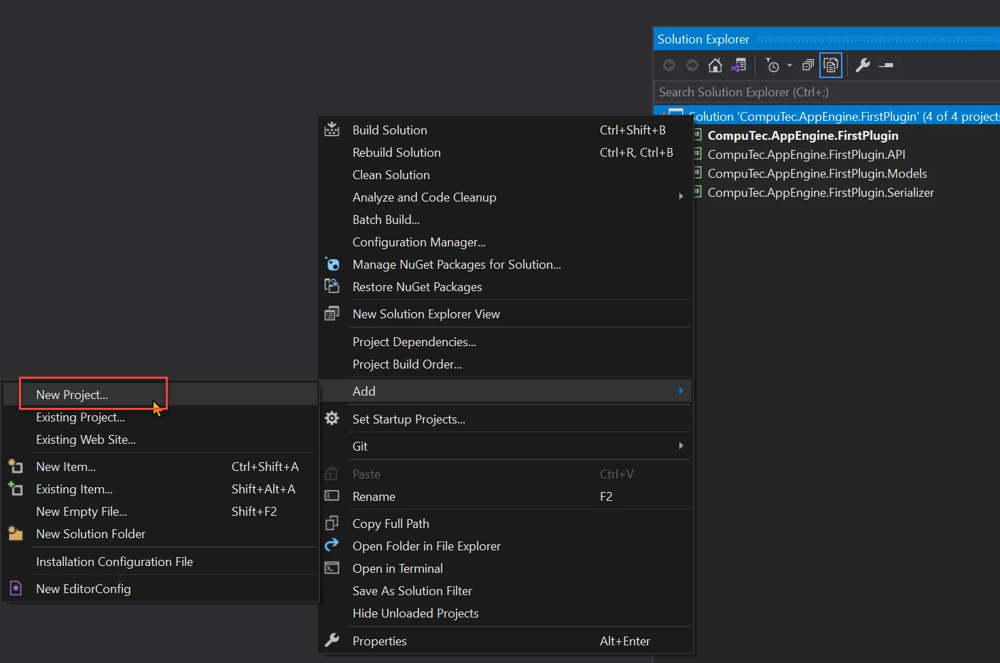
3. Choose Class Library (.NET Framework).

    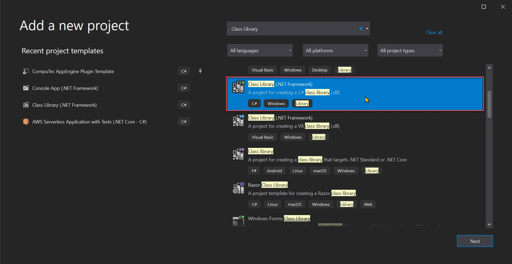
4. Specify name and location. In our case, this will be CompuTec.AppEngine.FirstPlugin.Setup.

    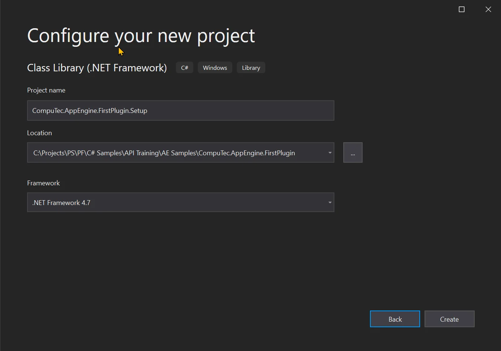
5. After adding a new project, it is necessary to set up the configuration.

    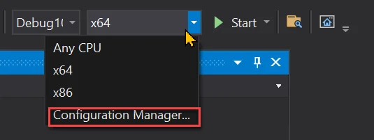

    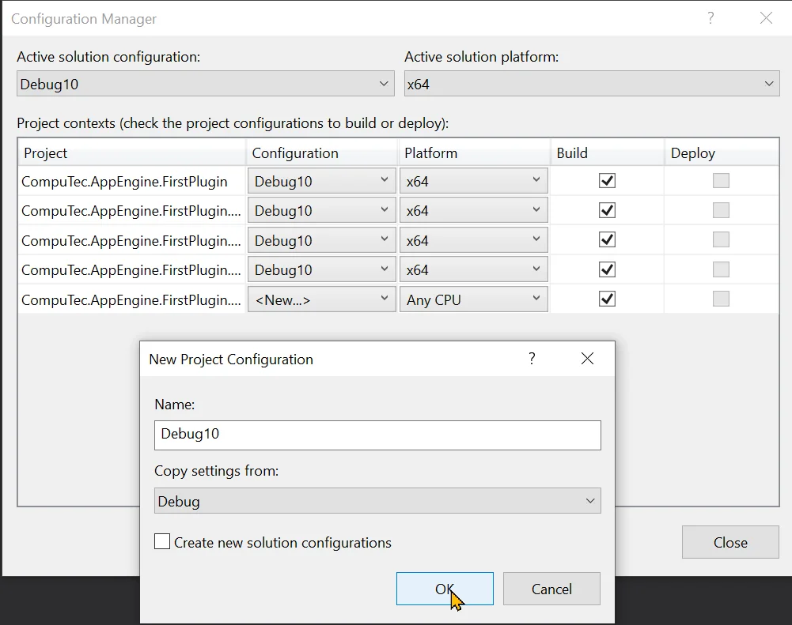

    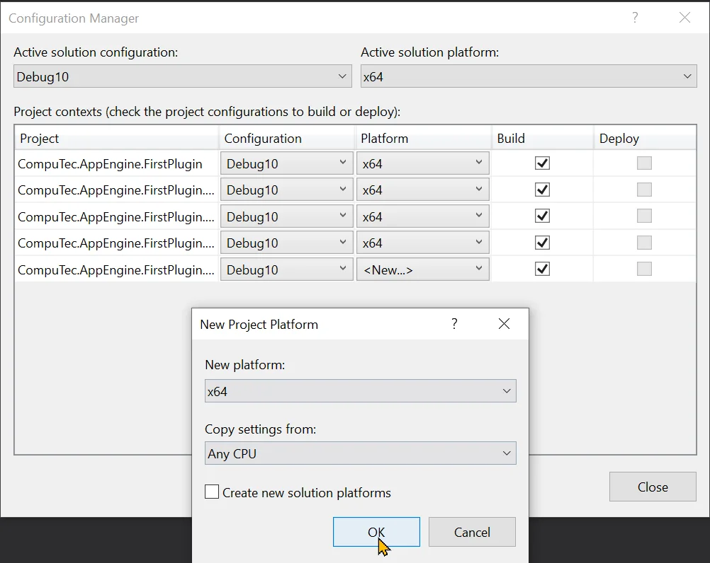

### Adding UDO definitions

#### Defining ToDo and ToDoRequirements User-Defined tables

1. Add a new folder and name its Tables to create a Setup project.
2. In this example, we will create a UDO with the Master Data type and in it, we will keep a To Do list. We will also create Master Data Lines for the To Do list with required Items for each To Do entry.
3. In the Table folder, add a new Folder named ToDo and add a new class to its ToDoTable.

    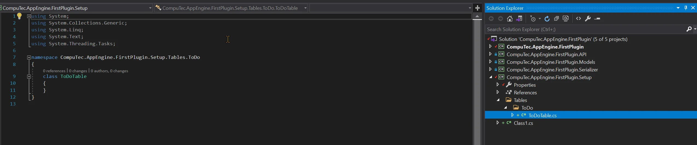
4. Our ToDoTable class needs to extend CompuTec.Core2.DI.Setup.UDO.Model.UDOManger class and annotate it with CompuTec.Core2.DI.Setup.Attributes.TableInstall. First, we will need to add Computec.Core2 to our project.
5. To do this, we will Open NuGet Manager for the Setup project.

    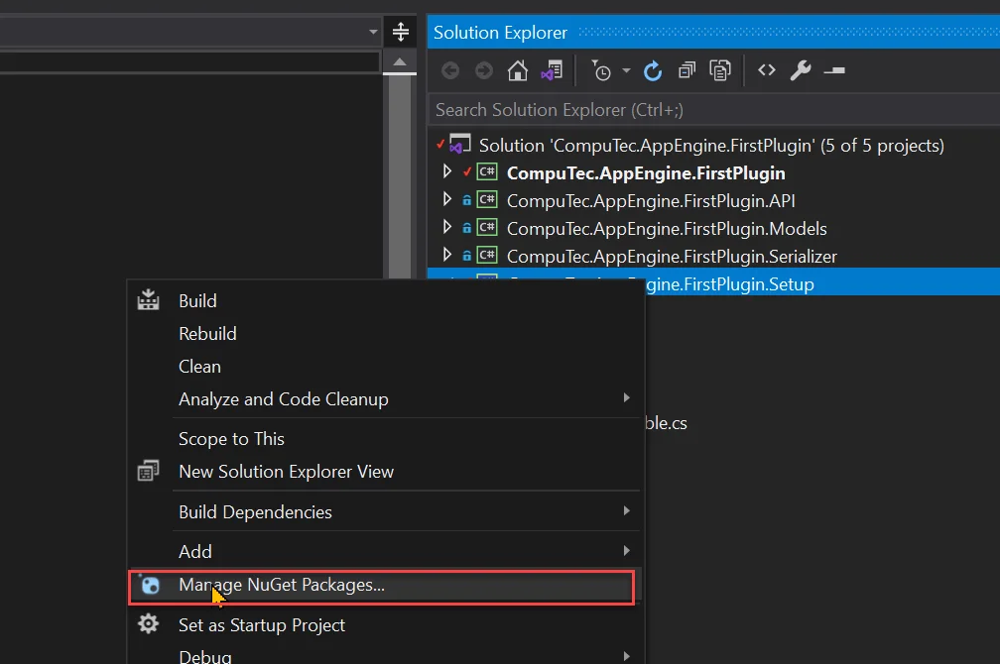
6. Now, we need to search for CompuTec.Core2 and install it.
7. If CompuTec.Core2 is not visible after installation, reopen the solution.
8. Now we can implement our ToDoTable class:

    - Add TableInstall annotation
    - Extend UDOManager
    - Implement constructor with IDIConnection parameter
    - Implement the CreateUDOTable method that will return the definition of our custom table. Here we define:
    - Object Code
    - Table Name
    - Fields (CreateFieldsForHeaderTable)
    - Table Type
    - Details regarding UDO.

    ToDoTable.cs

    ```csharp
    using CompuTec.BaseLayer.Connection;
    using CompuTec.BaseLayer.DI;
    using CompuTec.Core2.DI.Setup.Attributes;
    using CompuTec.Core2.DI.Setup.UDO.Model;
    using System;
    using System.Collections.Generic;

    namespace CompuTec.AppEngine.FirstPlugin.Setup.Tables.ToDo
    {
    [TableInstall]
    public class ToDoTable : UDOManager
    {
        public const String OBJECT_CODE = "SAMPLE_TO_DO";
        public const String TABLE_NAME = "SAMPLE_OTDO";
        public const String TABLE_DESCRIPTION = "Sample To Do"; // max 30 characters
        public const String ARCHIVE_TABLE_NAME = "SAMPLE_ATDO";

        public ToDoTable(IDIConnection connection) : base(connection) { }

        protected override IUDOTable CreateUDOTable()
        {
            List<IUDOField> fields = this.CreateFieldsForHeaderTable();
            List<IUDOFindColumn> findColumns = this.CreateFindColumnsList();
            var UdoTable = new UDOTable(fields, findColumns, TABLE_NAME, TABLE_DESCRIPTION, BoUTBTableType.bott_MasterData, this.CreateKeys())
            {
                RegisteredUDOName = TABLE_NAME,
                RegisteredUDOCode = OBJECT_CODE,
                CanArchive = BoYesNoEnum.tYES,
                CanCancel = BoYesNoEnum.tNO,
                CanClose = BoYesNoEnum.tYES,
                CanCreateDefaultForm = BoYesNoEnum.tYES,
                CanDelete = BoYesNoEnum.tYES,
                CanFind = BoYesNoEnum.tYES,
                CanLog = BoYesNoEnum.tYES,
                CanYearTransfer = BoYesNoEnum.tYES,
                ArchiveTableName = ARCHIVE_TABLE_NAME
            };
            return UdoTable;
        }

        private List<IUDOFindColumn> CreateFindColumnsList()
        {
            List<IUDOFindColumn> findList = new List<IUDOFindColumn>();

            var taskName = new UDOFindColumn();
            taskName.SetColumnAlias("U_TaskName");
            taskName.SetColumnDescription("Task Name");
            findList.Add(taskName);

            return findList;
        }

        private List<IUDOField> CreateFieldsForHeaderTable()
        {
            var fields = new List<IUDOField>();

            //adding task name column
            var TaskName = new UDOTableField();
            TaskName.SetName("TaskName");
            TaskName.SetDescription("Task Name"); // max 80 characters
            TaskName.SetType(BoFieldTypes.db_Alpha);
            TaskName.SetEditSize(100);
            fields.Add(TaskName);


            //description column
            var TaskDescription = new UDOTableField();
            TaskDescription.SetName("Description");
            TaskDescription.SetDescription("Task description");
            TaskDescription.SetType(BoFieldTypes.db_Alpha);
            TaskDescription.SetEditSize(254);
            fields.Add(TaskDescription);

            //priority column
            var TaskPriority = new UDOTableField();
            TaskPriority.SetName("Priority");
            TaskPriority.SetDescription("Priority");
            TaskPriority.SetType(BoFieldTypes.db_Alpha);
            TaskPriority.ValidValuesMD = new Dictionary<string, string>()
            {
                { "L","Low Priority" },
                { "M", "Medium Priority" },
                { "H", "High Priority" }
            };
            TaskPriority.DefaultValue = "L";
            TaskPriority.SetEditSize(1);
            fields.Add(TaskPriority);


            //deadline column
            var TaskDeadline = new UDOTableField();
            TaskDeadline.SetName("Deadline");
            TaskDeadline.SetDescription("Deadline");
            TaskDeadline.SetType(BoFieldTypes.db_Date);
            TaskDeadline.SetEditSize(10);
            fields.Add(TaskDeadline);  var Done = new UDOTableField();

            Done.SetName("Done");
            Done.SetDescription("Done");
            Done.SetType(BoFieldTypes.db_Alpha);
            Done.ValidValuesMD = new Dictionary<string, string>()
            {
                { "Y","Yes" },
                { "N", "No" }
            };
            Done.DefaultValue = "N";
            Done.SetEditSize(1);
            fields.Add(Done);

            return fields;

        }
        private List<IUDOTableKey> CreateKeys()
        {
            List<IUDOTableKey> list = new List<IUDOTableKey>();
            return list;
        }
        protected override void SetChildTables(){ }
    }
    }
    ```

    :::note
        Make sure to use only uppercase letters and no spaces as Table Name – currently using lowercase letters will lead to the exception: "This entry already exists in following tables..."
    :::

9. In the same manner, we will add ToDoTableRequirementsTable:

    ToDoTableRequirementsTable.cs

    ```csharp
    using CompuTec.BaseLayer.Connection;
    using CompuTec.BaseLayer.DI;
    using CompuTec.Core2.DI.Setup.Attributes;
    using CompuTec.Core2.DI.Setup.UDO.Model;
    using System;
    using System.Collections.Generic;

    namespace CompuTec.AppEngine.FirstPlugin.Setup.Tables.ToDo
    {
        [TableInstall]
        public class ToDoTableRequirementsTable : UDOManager
        {
            public const String OBJECT_CODE = "SAMPLE_TO_DO_REQ";
            public const String TABLE_NAME = "SAMPLE_TDO1";
            public const String TABLE_DESCRIPTION = "Sample To Do Requirements";
            public const String ARCHIVE_TABLE_NAME = "SAMPLE_ATDO1";

            public ToDoTableRequirementsTable(IDIConnection connection) : base(connection) { }

            protected override IUDOTable CreateUDOTable()
            {
                List<IUDOField> fields = this.DefineChildFields();

                IUDOTable UdoTable = new UDOTable(fields, TABLE_NAME, TABLE_DESCRIPTION, BoUTBTableType.bott_MasterDataLines);

                UdoTable.RegisteredUDOName = TABLE_NAME;
                UdoTable.RegisteredUDOCode = OBJECT_CODE;
                UdoTable.ArchiveTableName = ARCHIVE_TABLE_NAME;

                return UdoTable;
            }

            private List<IUDOField> DefineChildFields()
            {
                var fields = new List<IUDOField>();

                //adding task name column
                var Name = new UDOTableField();
                Name.SetName("Name");
                Name.SetDescription("Name");
                Name.SetType(BoFieldTypes.db_Alpha);
                Name.SetEditSize(100);
                fields.Add(Name);

                //description column
                var Quantity = new UDOTableField();
                Quantity.SetName("Quantity");
                Quantity.SetDescription("Quantity");
                Quantity.SetType(BoFieldTypes.db_Numeric);
                Quantity.SetEditSize(11);
                fields.Add(Quantity);

                return fields;
            }

            protected override void SetChildTables()
            {
            }

        }
    }
    ```

10. It is very important to add information about this child table to the header table, in our case, the ToDoTable class. To do this in the ToDoTable class we need to add a ChildTable class name to the SetChildTables method:

    ```csharp
    protected override void SetChildTables()
    {
        ChildTablesClasses.AddRange(new string[] { "ToDoTableRequirementsTable" });
    }
    ```

#### Adding Custom User-Defined Fields

1. For the purpose of demonstration, let's also create a UDF field for an SAP object. In the example below, we will add a sample field: Field to Item Master Data (OITM table).
2. We will create new CustomUDOFields.cs file in the Tables folder:

    CustomUDOFields.cs

    ```csharp
    using CompuTec.Core2.DI.Setup.UDO.Model;
    using System.Collections.Generic;

    namespace CompuTec.AppEngine.FirstPlugin.Setup.Tables
    {
        public class CustomUDOFields
        {

            /// <summary>
            /// in this method, you can list all UDF fields that need to be installed with the plugin
            /// </summary>
            /// <returns></returns>
            public static List<ICustomField> getCustomFields()
            {
                var list = new List<ICustomField>();
                ///UDF U_FirstUDF of type alphanumeric with size 20 will be added to the Items object
                var udf = new TableCustomField();
                udf.SetName("FistUDF");
                udf.SetDescription("Fisrst Plugin First UDF");
                udf.SetTableName("OITM");
                udf.SetEditSize(20);
                udf.SetType(BaseLayer.DI.BoFieldTypes.db_Alpha);
                list.Add(udf);

                return list;
            }
        }
    }
    ```

#### Preparing setup

To allow AppEngine to run this setup, we need to provide a Setup class in our plugin that extends CompuTec.AppEngine.Base.Infrastructure.Plugins.PluginSetup class. If you create a Plugin solution from our CompuTec AppEngine Plugin Template, then in the plugin project, you will already have boiler code that you can use.

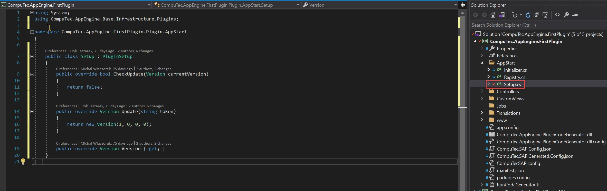

1. The first step is to add a reference to our Setup project to the Plugin project. To do this, we need to open Add Reference on our Plugin project.

    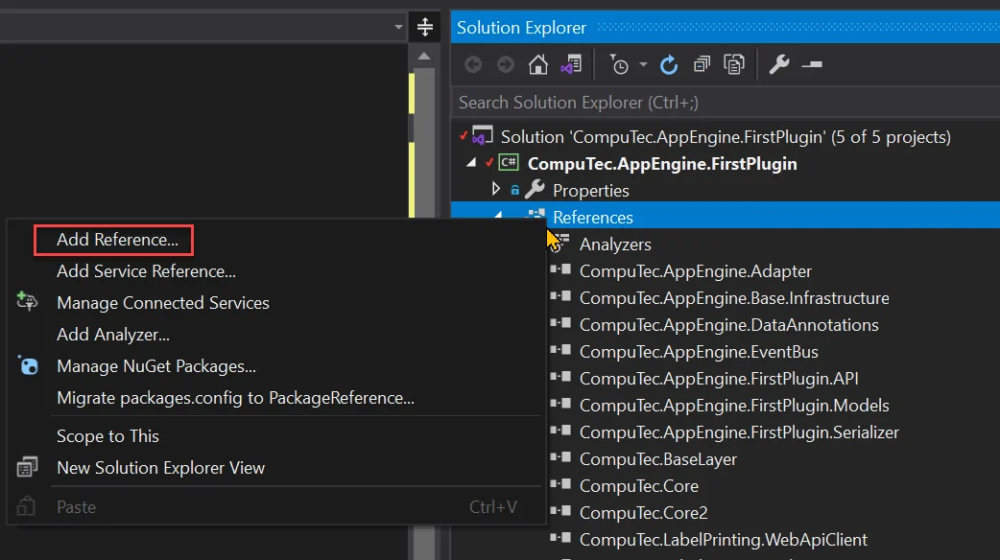
2. On the Projects Tab, select the Setup project and click OK.

    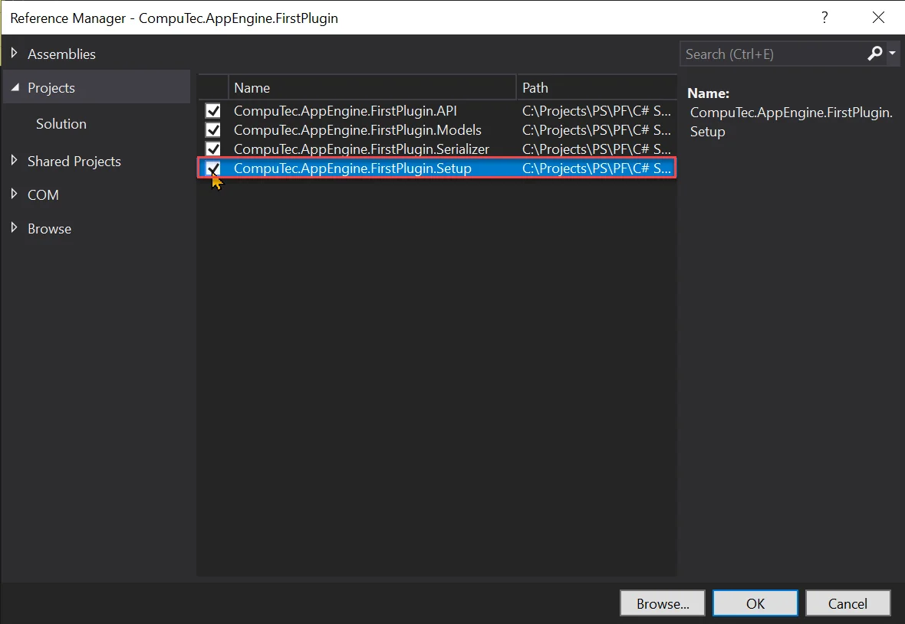
3. Now we can add implementation to our Setup.cs:

   - It needs to extend CompuTec.AppEngine.Base.Infrastructure.Plugins.PluginSetup
   - CheckUpdate method – if return true, then installation will be performed
   - Update method – this method should run CompuTec.Core2.DI.Setup.UDO.Setup.Udate and return System.Version after successful update
   - Version method – needs to return System.A version of plugin (not the installed version, but the current version of the run plugin)

   Setup.cs

    ```csharp
        using System;
    using System.Collections.Generic;
    using System.Text;
    using CompuTec.AppEngine.Base.Infrastructure.Plugins;
    using CompuTec.AppEngine.FirstPlugin.API;
    using CompuTec.AppEngine.FirstPlugin.Setup.Tables;

    namespace CompuTec.AppEngine.FirstPlugin.Plugin.AppStart
    {
        ///Plugin Setup Implementation
        ///here you can implement all logic of plugin installation on a specific database
        public class Setup : PluginSetup
        {
            public override bool CheckUpdate(Version currentVersion)
            {
                return currentVersion < new Version(FirstPluginInfo.NameVersion);
            }

            public override Version Update(string token)
            {

                var info = new FirstPluginInfo();

                Console.WriteLine("Update");

                List<CompuTec.Core2.DI.Setup.UDO.Model.ICustomField> customUdoFieldList = CustomUDOFields.getCustomFields();
                CompuTec.Core2.DI.Setup.UDO.Setup setup = new CompuTec.Core2.DI.Setup.UDO.Setup(token, customUdoFieldList, false, System.Reflection.Assembly
                    .GetAssembly(typeof(FirstPlugin.Setup.Tables.ToDo.ToDoTable)), "CompuTec.AppEngine.FirstPlugin.Setup.Tables", "CompuTec.AppEngine.FirstPlugin.Setup.Tables",
                    "CompuTec.AppEngine.FirstPlugin.Setup.Tables", "CompuTec.AppEngine.FirstPlugin.Setup.Tables", "CompuTec.AppEngine.FirstPlugin.Setup.Tables");

                setup.BaseLibInformation = info;

                if (setup.IsUpdateRequiredNew(true))
                {
                    Console.WriteLine("Instaling...");
                    var updateResult = setup.Update();

                    if (!updateResult.Success)
                    {
                        var message = new StringBuilder();

                        updateResult.Errors.ForEach(e =>
                        {
                            message.Append(e.Message);
                        });

                        throw new Exception(message.ToString());
                    }


                    Console.WriteLine(updateResult.ToString());
                }

                Console.WriteLine("Install finish");

                return Version;
            }

            public override Version Version => new Version(FirstPluginInfo.NameVersion);
        }
    }
    ```

4. Setup requires BaseLibInformation to point to the class inheriting from abstract class CompuTec.Core2.CoreInfo. To meet this requirement's we will add a new file FirstPluginInfo.cs in CompuTec.AppEngine.FirstPlugin.API project. In it, we can define Version information and version retrieval methods, declare implemented objects, and bind interfaces to implementations. We will add this information after we prepare the Business Objects implementation in the second part of this tutorial.

    FirstPluginInfo.cs

    ```csharp
    using CompuTec.AppEngine.FirstPlugin.API.BusinessObjects.ToDo;
    using CompuTec.Core2;
    using System.Collections.Generic;
    namespace CompuTec.AppEngine.FirstPlugin.API {


        /// <summary>
        /// This is a CoreInfo Dependency loader.
        /// This class is responsible for registering all custom UDO Object implementation
        /// </summary>
        public class FirstPluginInfo : CoreInfo
        {
            public const string Name = "FirstPlugin";
            public const string NameVersion = "1.0.0.1";
            public const double DbVersion = 1.1d;
            //List of Business Object types that are implemented in this library
            private readonly List<string> implementedObjects = new List<string>();

            public FirstPluginInfo() : base(Name, NameVersion, DbVersion) {}

            /// <summary>
            /// Factory method that is used to create BusinessObjects based on type
            /// </summary>
            /// <param name="Token"></param>
            /// <param name="ObjectType"></param>
            /// <returns>returns null if this library does not implement this object
            /// returns a new instance of the object for the specified type
            /// </returns>
            public override dynamic CreateObject(string Token, string ObjectType)
            {
                return null;
            }
            /// <summary>
            /// This Function is used to determine the current instation number used in the update to obain if setup needs to be triggered
            /// </summary>
            /// <param name="Token"></param>
            /// <returns></returns>
            public override double GetCurrentDBVersion(string Token)
            {
                return 1.0d;
            }

            /// <summary>
            /// Indicates weather this library implements specific businessObject
            /// </summary>
            /// <param name="ObjectType"></param>
            /// <returns>true if implements</returns>
            public override bool ImplementObject(string ObjectType)
            {
                bool implemented = implementedObjects.Contains(ObjectType);
                return implemented;
            }
        }
    }
    ```

### Results

Now having the definition of User Defined Objects, we can test it by running the setup from CompuTec AppEngine Administration Panel.

1. Open Administration Panel in your browser and navigate to the Plugins tab.
2. Open the plugin configuration by clicking on it Tile.
3. Activate Plugin on the selected database.
4. Click Update to start the installation procedure.

    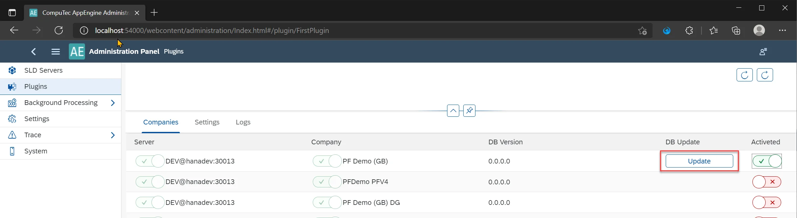
5. In Dialog that will open you need to authenticate using SAP user credentials.

    After successful installation returned Version number is saved to the configuration file. This means that all defined objects were created in SAP.
6. After successful installation returned Version number is saved to the configuration file. This means that all defined objects were created in SAP.

    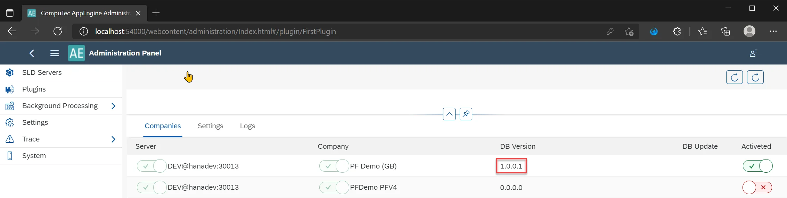
7. We can check created tables, fields, and registered objects in SAP.

    

    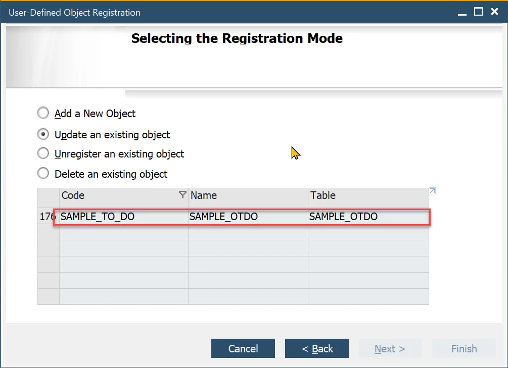

## Exposing objects in API

CompuTec AppEngine Plugin Code Generator can generate controllers, models, and serializers based on defined interfaces. Below is a step-by-step description of how to achieve this.

### Adding and configuring generator

1. First, we will need to add Code Generator to our Plugin project. We can do this using NuGet Manager.
2. Search for CompuTec.AppEngine.PluginCodeGenerator and install it.

    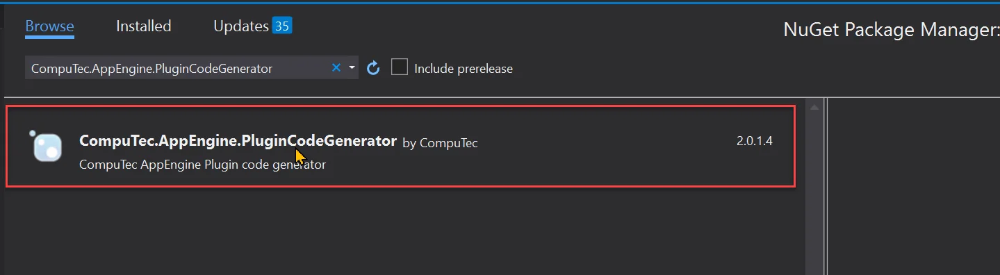
3. After installation, ReadMe.txt file opens with description of how to configure T4 Text Template file.
4. Right-click on the plugin project and select Add New Item.
5. Search for T4 and select Text Template.
6. Set a name to it like RunCodeGenerator.tt.
7. Copy a template example from ReadMe.txt.

    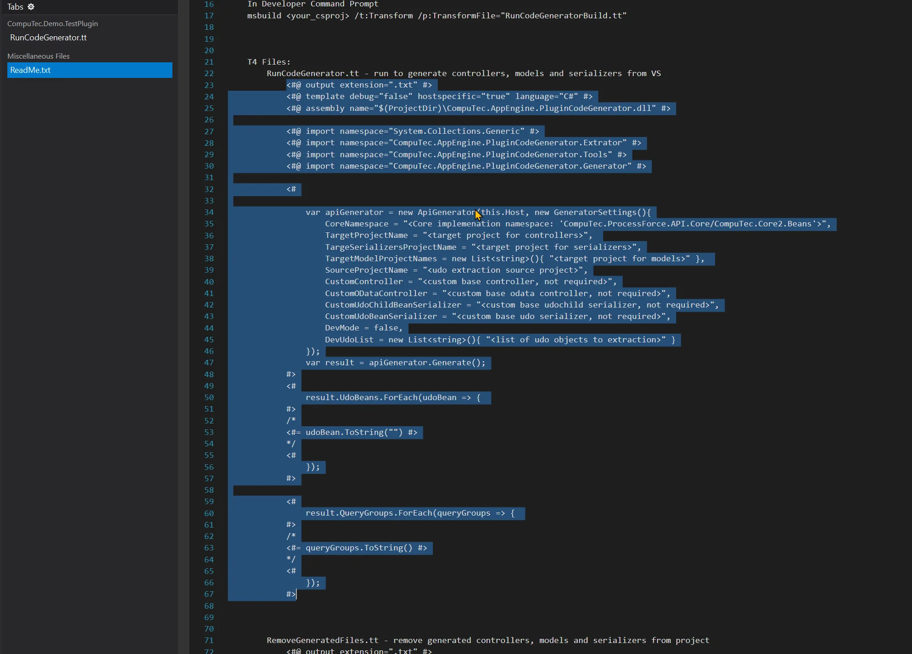
8. Paste it to the newly created RunCodeGenerator.tt
9. Now we need to modify Generator Settings part accordingly to our solution. Only the following part will be changed:

    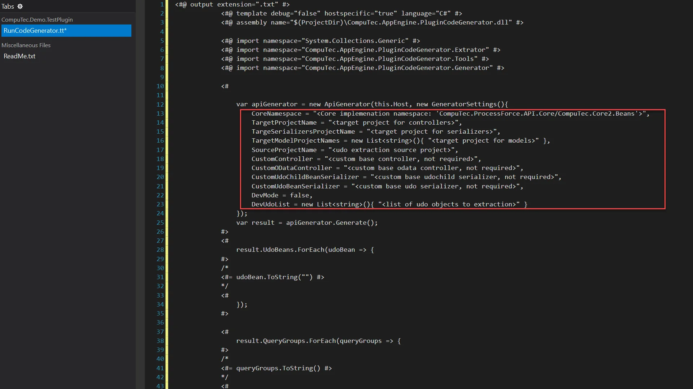
10. First, remove not required elements:

    - CustomController,
    - CustomODataController,
    - CustomUdoChildBeanSerializer,
    - CustomUdoBeanSerializer,
    - DevUdoList.
11. Now we need to define:

    - CoreNamespace to CompuTec.Core2.Beans,
    - TargetProjectName to CompuTec.AppEngine.FirstPlugin - project in which controllers will be created,
    - TargeSerializersProjectName to CompuTec.AppEngine.FirstPlugin.Serializer - project in which serializers will be created,
    - TargetModelProjectNames to CompuTec.AppEngine.FirstPlugin.Models - project in which models will be created,
    - SourceProjectName to CompuTec.AppEngine.FirstPlugin.API - project with objects definitions.
12. Finally this T4 file in case of our example will look like this:

    ```csharp
    <#@ output extension=".txt" #>
                <#@ template debug="false" hostspecific="true" language="C#" #>
                <#@ assembly name="$(ProjectDir)\CompuTec.AppEngine.PluginCodeGenerator.dll" #>

                <#@ import namespace="System.Collections.Generic" #>
                <#@ import namespace="CompuTec.AppEngine.PluginCodeGenerator.Extrator" #>
                <#@ import namespace="CompuTec.AppEngine.PluginCodeGenerator.Tools" #>
                <#@ import namespace="CompuTec.AppEngine.PluginCodeGenerator.Generator" #>

                <#

                    var apiGenerator = new ApiGenerator(this.Host, new GeneratorSettings(){
                        CoreNamespace = "CompuTec.Core2.Beans",
                        TargetProjectName = "CompuTec.AppEngine.FirstPlugin",
                        TargeSerializersProjectName = "CompuTec.AppEngine.FirstPlugin.Serializer",
                        TargetModelProjectNames = new List<string>(){ "CompuTec.AppEngine.FirstPlugin.Models" },
                        SourceProjectName = "CompuTec.AppEngine.FirstPlugin.API",

                        DevMode = false

                    });


                    var result = apiGenerator.Generate();
                #>
                <#
                    result.UdoBeans.ForEach(udoBean => {
                #>
                /*
                <#= udoBean.ToString("") #>
                */
                <#
                    });
                #>

                <#
                    result.QueryGroups.ForEach(queryGroups => {
                #>
                /*
                <#= queryGroups.ToString() #>
                */
                <#
                    });
                #>
    ```

    :::warning
        Saving T4 file will start generator.
    :::

13. If you created a plugin solution from a wizard, then all this projects are already created, excluding Serializer. We need to add this project the samee way as we did in case of our Setup project.

    1. Right-click on the Solution and choose Add new project,
    2. Select Class Library (.NET Framework),
    3. Set a name to CompuTec.AppEngine.FirstPlugin.Serializer,
    4. After adding, set up configuration in the same way as in case of Setup project.

### Defining Interfaces

1. We will create all our BusinessObject in the FirstPlugin.API project.
2. The Generator use CompuTec.AppEngine.DataAnnotations so we will need to add this library to this project. We can do this using NuGet Manager sam way as previously.

    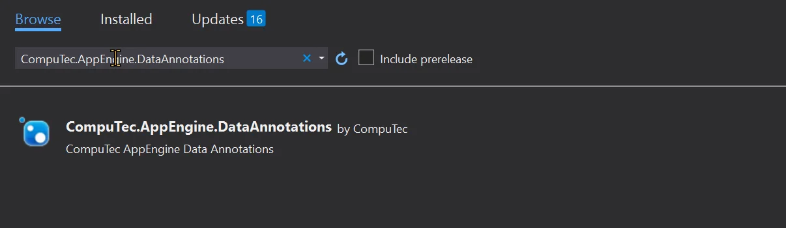
3. In Business Object definition we will need Priority enumerator, so let's create it upfront.

    1. Add a new folder to the API project named Enum,
    2. In it, create a new class file ToDoPriority.cs with following code,
    3. EnumType annotation allows Core2 to bind Enum to database values. So for this example saving to database priority Low will set value in column appropriate column to 'L',

    ```csharp
    using CompuTec.Core2.DI.Attributes;

    namespace CompuTec.AppEngine.FirstPlugin.API.Enums
    {
        [EnumType(new int[] { 1, 2, 3 }, new string[] { "L", "M", "H" }, 2)]
        public enum ToDoPriority
        {
            Low = 1, Medium = 2, Huge = 3
        }
    }
    ```

4. The same way, create a YesNoType.cs enum type that will be used to mark the Done property of the ToDo task.

   1. Add a new file YesNoType.cs inside the Enum folder.
   2. Add the following code in it:

    ```csharp
    using CompuTec.Core2.DI.Attributes;

    namespace CompuTec.AppEngine.FirstPlugin.API.Enums
    {
        [EnumType(new int[] { 1, 2 }, new string[] { "Y", "N" }, 2)]
        public enum YesNoType { Yes = 1, No = 2 }
    }
    ```

5. For sake of order, create a new folder and call it BusinessObjects and in it ToDo folder.
6. In this folder, create interfaces for the To Do and the To Do Requirment.
7. Add new interfaces files inside BussinessObject and call them IToDo.cs and IToDoRequirement.cs.
8. Below you can find the definitions of IToDo.cs:

    - the Interface need to be based on CompuTec.Core2.Beans.IUDOBean – this is required by Core2 to manage our object
    - For AppEngine we need to annote our interface with CompuTec.AppEngine.DataAnnotations.AppEngineUDOBean
    - Object Type needs to be the same as in ToDoTable.cs definition.
    - TableName needs to be the same as in ToDoTable.cs with additional '@' prefix – this is real table name in datbase.
    - [AppEngineProperty(IsMasterKey = true)] – this annotation should be specified on the key column (this will be key on all crud operations)

    IToDo.cs

    ```csharp
    using CompuTec.AppEngine.DataAnnotations;
    using CompuTec.AppEngine.FirstPlugin.API.Enums;
    using CompuTec.Core2.Beans;
    using System;
    using System.ComponentModel;

    namespace CompuTec.AppEngine.FirstPlugin.API.BusinessObjects.ToDo
    {
        /// <summary>
        /// Public interface that is exposed to 3rd party application - can be used in powershell import etc
        ///
        /// AppEngine Annonations are used to descripte REST and OData Modes and Serializers used in Plugin controlers
        /// </summary>
        [AppEngineUDOBean(Ignore = false, ObjectType = "SAMPLE_TO_DO", TableName = "@SAMPLE_OTDO")]
        public interface IToDo : IUDOBean
        {
            [AppEngineProperty(IsMasterKey = true)]
            String Code { get; set; }
            String Name { get; set; }
            DateTime UpdateDate { get; set; }
            DateTime U_Deadline { get; set; }
            string U_TaskName { get; set; }
            string U_Description { get; set; }
            [DefaultValue(ToDoPriority.Medium)]
            ToDoPriority U_Priority { get; set; }
            [DefaultValue(YesNoType.No)]
            YesNoType U_Done { get; set; }
            IToDoRequirement Requirements { get; set; }
        }
    }
    ```

9. Below you can find the definition of IToDoRequirement.cs:

    - Our child Interface needs to based on CompuTec.Core2.Beans.IUDOChildBean - this is required by Core2 to manage our object
    - Child interface also need to be Enumberable
    - `[AppEngineUDOChildBean()]` – this annotation mark this interface as child (lines):

    IToDoRequirement

    ```csharp
    using CompuTec.AppEngine.DataAnnotations;
    using CompuTec.Core2.Beans;
    using System;
    using System.Collections.Generic;

    namespace CompuTec.AppEngine.FirstPlugin.API.BusinessObjects.ToDo
    {
        [AppEngineUDOChildBean()]
        public interface IToDoRequirement : IUDOChildBean, IEnumerable<IToDoRequirement>
        {
            String U_Name { get; set; }
            int U_Quantity { get; set; }
            new int U_LineNum { get; set; }
        }
    }
    ```

### Implementing Interfaces

1. We will implement a ToDo class as a partial class to keep logic and field getter and setters separately. We will also add BusinessObjects class in BusinessObjects.

    - BusinessObjects.cs

        ```csharp
        namespace CompuTec.AppEngine.FirstPlugin.API.BusinessObjects
        {
        public  class BusinessObjects
            {
                public const string ToDoObjectCode = "SAMPLE_TO_DO";

            }
        }
        ```

    - ToDo.cs – Business logic.

        - In constructor UDOCode and TableName needs to be set up accordingly to ToDoTable.cs properites
        - Children and ChildDictionaries needs to be initialized as shown below:

        ```csharp
        using CompuTec.Core2.Beans;
        using System;
        using System.Collections.Generic;

        namespace CompuTec.AppEngine.FirstPlugin.API.BusinessObjects.ToDo
        {
            public partial class ToDo
            {
                public ToDo()
                {
                    this.UDOCode = BusinessObjects.ToDoObjectCode;
                    this.TableName = "SAMPLE_OTDO";

                    this.Childs = new Dictionary<string, ChildBeans>();
                    this.ChildDictionary = new Dictionary<string, string>();

                    this.Childs.Add("Requirements", new ToDoRequirement(true, this));
                    this.ChildDictionary.Add("SAMPLE_TDO1", "Requirements");

                }

                protected override bool BeforeAdd()
                {

                    this.U_Deadline = DateTime.Today.AddDays(7);
                    this.Code = Guid.NewGuid().ToString();
                    return base.BeforeAdd();
                }

                protected override bool BeforeUpdate()
                {

                    return base.BeforeUpdate();
                }

            }
        }
        ```

    - ToDo.properties.cs – getters and setters for fields. FiledDictionary is maintained by Core2.

        ```csharp
        using CompuTec.AppEngine.FirstPlugin.API.Enums;
        using CompuTec.Core2.Beans;
        using System;

        namespace CompuTec.AppEngine.FirstPlugin.API.BusinessObjects.ToDo
        {
            public partial class ToDo : UDOBean, IToDo
            {
                public String Code
                {
                    get { return FieldDictionary["Code"].Value; }
                    set { FieldDictionary["Code"].Value = value; }
                }
                public String Name
                {
                    get { return FieldDictionary["Name"].Value; }
                    set { FieldDictionary["Name"].Value = value; }
                }
                public DateTime UpdateDate
                {
                    get { return FieldDictionary["UpdateDate"].Value; }
                    set { FieldDictionary["UpdateDate"].Value = value; }
                }
                public DateTime U_Deadline
                {
                    get { return FieldDictionary["U_Deadline"].Value; }
                    set { FieldDictionary["U_Deadline"].Value = value; }
                }
                public string U_TaskName
                {
                    get { return FieldDictionary["U_TaskName"].Value; }
                    set { FieldDictionary["U_TaskName"].Value = value; }
                }
                public string U_Description
                {
                    get { return FieldDictionary["U_Description"].Value; }
                    set { FieldDictionary["U_Description"].Value = value; }
                }
                public ToDoPriority U_Priority
                {
                    get { return FieldDictionary["U_Priority"].Value; }
                    set { FieldDictionary["U_Priority"].Value = value; }
                }
                public YesNoType U_Done
                {
                    get { return FieldDictionary["U_Done"].Value; }
                    set { FieldDictionary["U_Done"].Value = value; }
                }
                public IToDoRequirement Requirements
                {
                    get => this.Childs["Requirements"].CurrentChild as IToDoRequirement;
                    set { this.Childs["Requirements"].CurrentChild = value as IToDoRequirement; }
                }

            }
        }
        ```

    - ToDoRequirement.cs:

        ```csharp
        using CompuTec.Core2.Beans;
        using System;
        using System.Collections.Generic;
        using System.Collections;

        namespace CompuTec.AppEngine.FirstPlugin.API.BusinessObjects.ToDo
        {
            public class ToDoRequirement : ChildBeans, IToDoRequirement
            {
                public ToDoRequirement()
                {
                }
                public ToDoRequirement(ChildBeans childBeans) : base(childBeans) { }
                public ToDoRequirement(bool master, UDOBean baseUDO) : base(master, baseUDO) { }

                public String U_Name
                {
                    get { return FieldDictionary["U_Name"].Value; }
                    set { FieldDictionary["U_Name"].Value = value; }
                }
                public int U_Quantity
                {
                    get { return FieldDictionary["U_Quantity"].Value; }
                    set { FieldDictionary["U_Quantity"].Value = value; }
                }
                public IEnumerator<IToDoRequirement> GetEnumerator()
                {
                    return new ChildBeansEnum<IToDoRequirement>(this);
                }
                IEnumerator IEnumerable.GetEnumerator()
                {
                    return (IEnumerator<IToDoRequirement>)GetEnumerator();
                }
            }
        }
        ```

2. Having implementation of our Business Objects ready, we can add information about implemented objects to FirstPluginInfo.cs.

    - We will add entry to implemented object list with the Code of our object.

        ```csharp
        implementedObjects.Add(BusinessObjects.BusinessObjects.ToDoObjectCode);
        ```

    - Also we need to implement creating ToDo object in CreateObject method.

        ```csharp
        if (ObjectType.Equals(BusinessObjects.BusinessObjects.ToDoObjectCode))
        {
            IToDo x = CoreManager.GetUDO<ToDo>(Token) as IToDo;
            return x;
        }
        ```

    - After this changes FirstPluginInfo.cs will look like this:

        ```csharp
        using CompuTec.AppEngine.FirstPlugin.API.BusinessObjects.ToDo;
        using CompuTec.Core2;
        using System.Collections.Generic;
        namespace CompuTec.AppEngine.FirstPlugin.API {


            /// <summary>
            /// This is a CoreInfo Dependency loader.
            /// this class is responsible to register all custom UDO Object imlementation
            /// </summary>
            public class FirstPluginInfo : CoreInfo
            {
                public const string Name = "FirstPlugin";
                public const string NameVersion = "1.0.0.1";
                public const double DbVersion = 1.1d;
                //List of Busienss Object types that are implemented in this library
                private readonly List<string> implementedObjects = new List<string>();

                public FirstPluginInfo() : base(Name, NameVersion, DbVersion)
                {
                    ///Register UDO Object for Core2 repository
                    implementedObjects.Add(BusinessObjects.BusinessObjects.ToDoObjectCode);

                }

                /// <summary>
                /// Factory method that is used to create BusinessObjects based on type
                /// </summary>
                /// <param name="Token"></param>
                /// <param name="ObjectType"></param>
                /// <returns>returns null if this library does not implement this object
                /// returns new instance of object for specified type
                /// </returns>
                public override dynamic CreateObject(string Token, string ObjectType)
                {

                    if (ObjectType.Equals(BusinessObjects.BusinessObjects.ToDoObjectCode))
                    {
                        IToDo x = CoreManager.GetUDO<ToDo>(Token) as IToDo;
                        return x;
                    }
                    return null;
                }
                /// <summary>
                /// This Function is used to determine the current instation number is used in update to obatin if setup needs to be triggered
                /// </summary>
                /// <param name="Token"></param>
                /// <returns></returns>
                public override double GetCurrentDBVersion(string Token)
                {
                    return 1.0d;
                }

                /// <summary>
                /// Inidicates weather this library implements specific businessObject
                /// </summary>
                /// <param name="ObjectType"></param>
                /// <returns>true if implements</returns>
                public override bool ImplementObject(string ObjectType)
                {
                    bool implemented = implementedObjects.Contains(ObjectType);
                    return implemented;
                }
            }
        }
        ```

### Generating API

Finally we can run CompuTec AppEngine Plugin Code Generator. Base on defined interafaces, it will create Controllers, Models and Serializers.

1. Before running generator, we suggest to remove Controllers/TodoController.cs from Plugin project. That file was added from the Template and we don't need it.
2. Save all changes – during generation process projects files are changed.
3. Right-click on RunCodeGenerator.tt and select Run Custom Tool.

    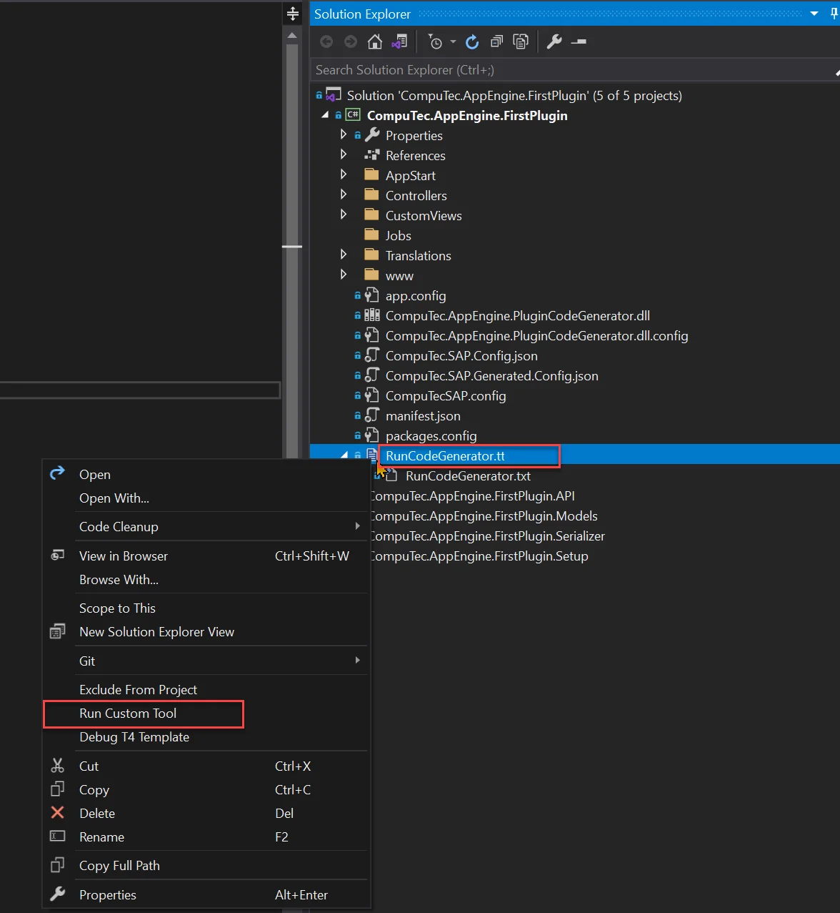
4. Depending on number of Interfaces this process can tak a while. After generation, choose Reload All.

    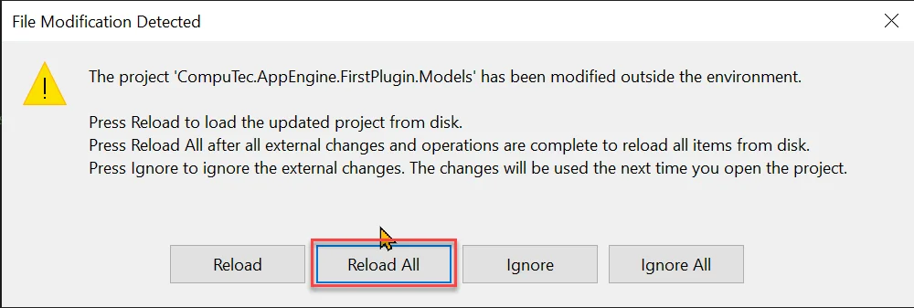
5. All newly created files should be now included in our project.

    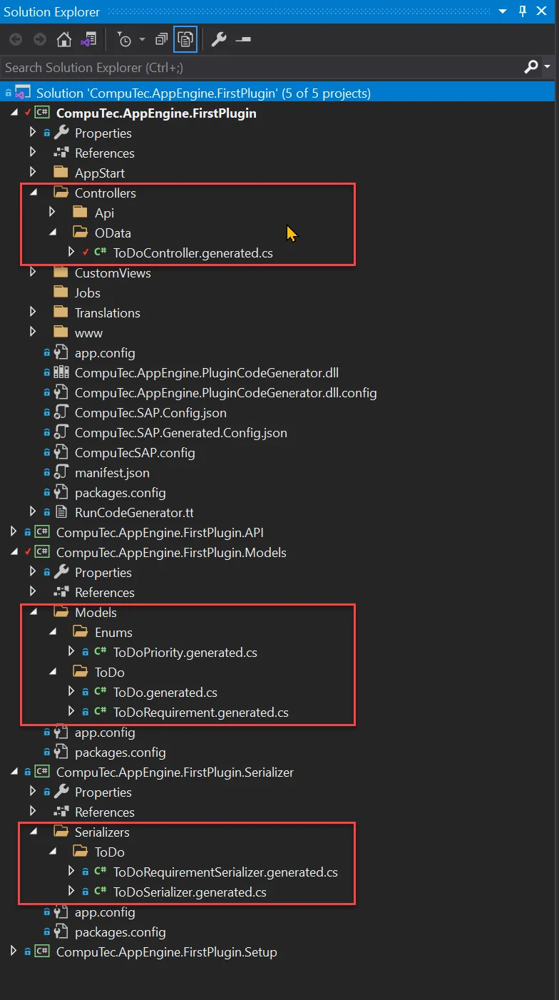
6. We need to add Microsoft.AspNet.OData lib to CompuTec.AppEngine.FirstPlugin.Models. We can do this using NuGet Manager as in previous examples.
7. CompuTec.AppEngine.FirstPlugin.Serializer uses Models and API so we need to add references to these projects.

    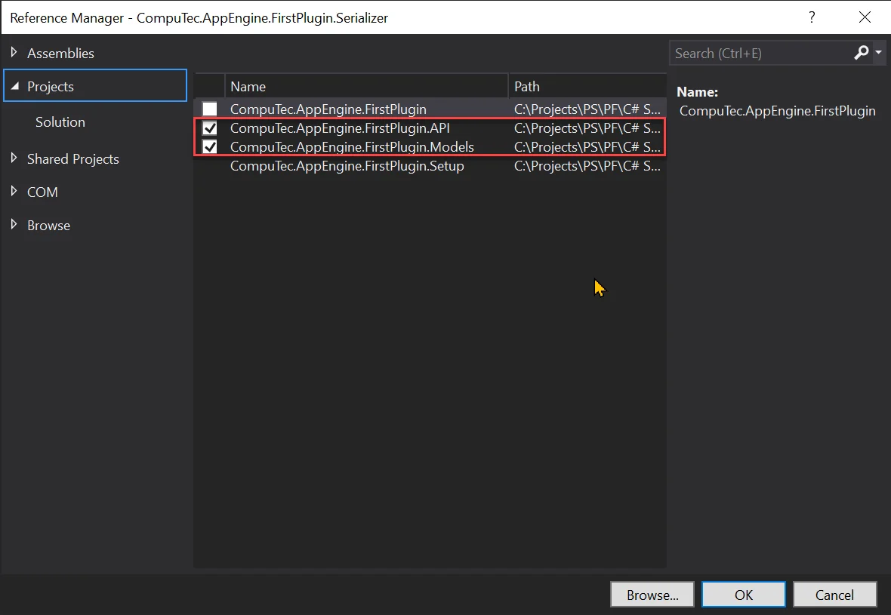
8. After that, we can rebuild our solution.

:::warning
It is important to add to set correct assemblies in manifest.json. Below you can see example manifest.json with added assemblies:

```json
"CompuTec.AppEngine.FirstPlugin",
"CompuTec.AppEngine.FirstPlugin.Models",
"CompuTec.AppEngine.FirstPlugin.Serializer",
"CompuTec.AppEngine.FirstPlugin.API",
"CompuTec.AppEngine.FirstPlugin.Setup"


{
"version": "1.0.0",
"id": "FirstPlugin",
"name": "FirstPlugin",
"icon": "sap-icon://activate",

"company": "",
"api": {
    "routePrefix": "FirstPlugin",
    "setupAssembly": "CompuTec.AppEngine.FirstPlugin",
    "assemblies": [
    "CompuTec.AppEngine.FirstPlugin",
    "CompuTec.AppEngine.FirstPlugin.Models",
    "CompuTec.AppEngine.FirstPlugin.Serializer",
    "CompuTec.AppEngine.FirstPlugin.API",
    "CompuTec.AppEngine.FirstPlugin.Setup"
    ],
    "dependencies": {
    }
},
"ui": {
    "apps": [
    {
        "icon": "sap-icon://example",
        "namespace": "computec.appengine.firstplugin",
        "tile": "FirstPlugin",
        "target": "home",
        "type": "User",
        "sapForms": [
        {
            "uniqueId": "firstplugin_salesorder",
            "formMode": false,
            "url": "salesorder",
            "fatherUID": "2048",
            "menuItem": true,
            "menuCaption": "FP Sales Orders"
        }
        ]
    }
    ]
}
}
```

:::

### Results

To check if our API is exposed, we can open WebAPI:

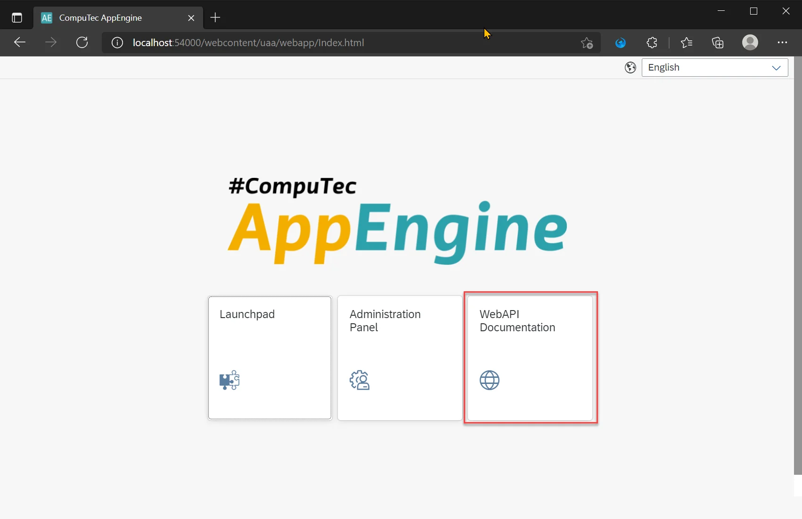

In the swagger we can see API and OData ToDo controllers exposed:

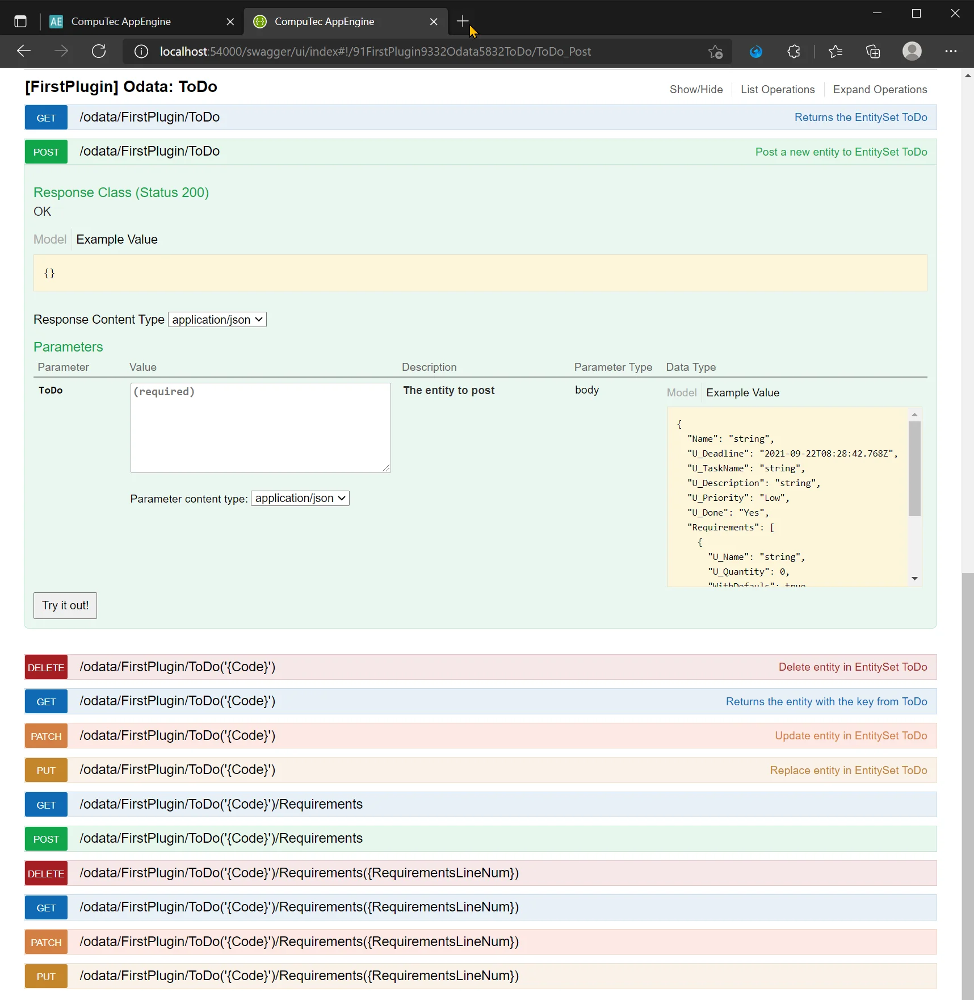


There are also oData metadata provided of our ToDo object.

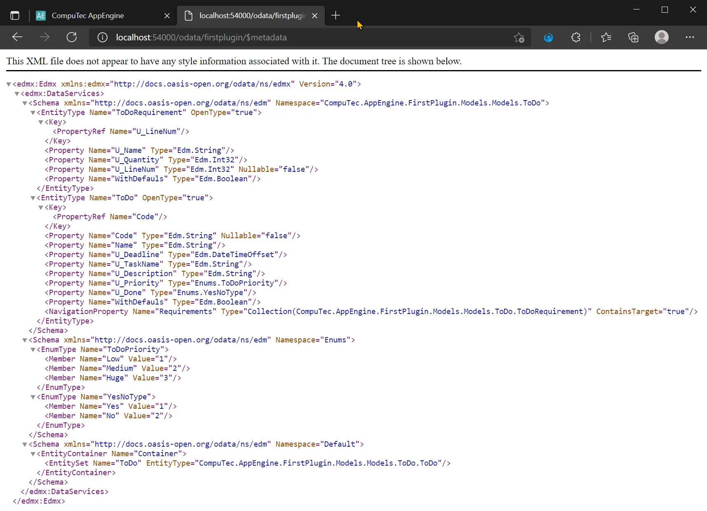
